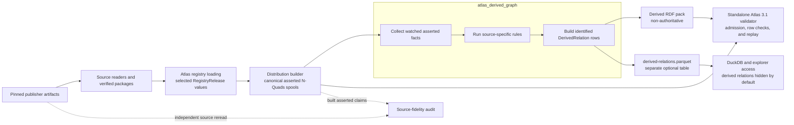
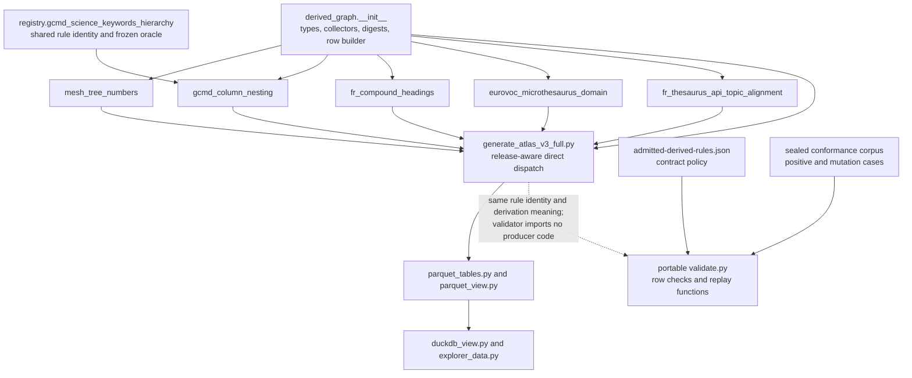
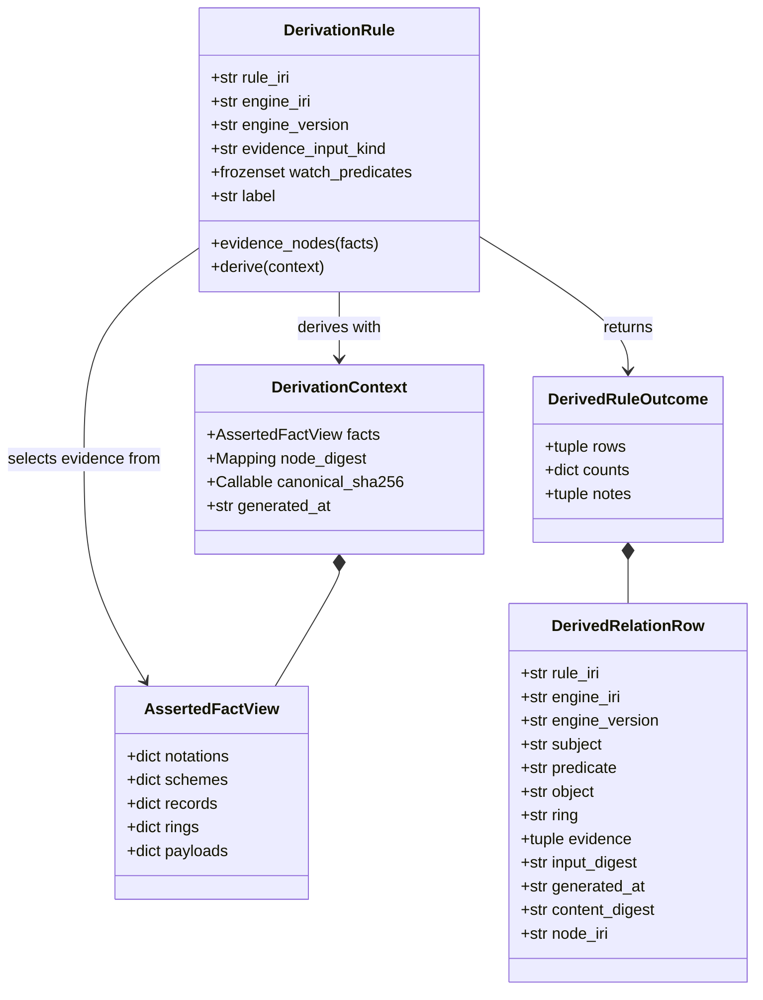
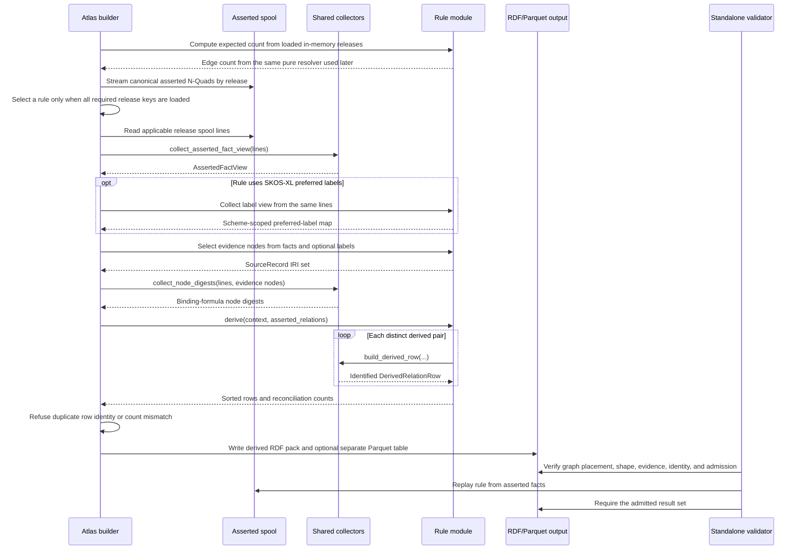
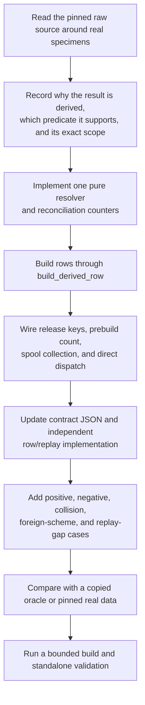

# Atlas derived graph

The `atlas_derived_graph` module turns selected facts from the Atlas asserted
graph into explicit, evidence-bearing `atlas:DerivedRelation` records. These
records preserve useful structural consequences without presenting them as
publisher statements or editorial judgments. Every row names the rule and
engine that produced it, cites the asserted records it used, and carries
content-derived identity.

This is a build-time subsystem, not a general-purpose reasoner. The Atlas
producer invokes a closed set of source-specific rules after it has written the
asserted release spools. The independent Atlas 3.1 validator then checks each
row and regenerates the rule's result from the asserted graph. Consumers see
derived relations only when they opt in.

## At a glance

| Question | Answer |
| --- | --- |
| What goes in? | Canonical asserted N-Quads lines from selected, already loaded Atlas releases; the build timestamp; the binding-compatible canonical JSON digest function; and the releases' direct asserted relations. |
| What happens? | Shared collectors retain only the facts needed by derivation rules, collect canonical digests for cited evidence nodes, and pass a `DerivationContext` to a source-specific resolver. The resolver proves endpoint scope, rejects conflicts, and calls `build_derived_row()` for each distinct result. |
| What comes out? | Sorted `DerivedRelationRow` values, rule reconciliation counts, an optional RDF `derived` graph pack, and an optional separate `derived-relations.parquet` table. No row enters the authoritative statement table. |
| How do we check it? | Unit and pinned-real-data tests prove each resolver, mutation tests prove refusals, the producer reconciles expected and emitted row counts, and the standalone Atlas 3.1 validator checks rule admission, evidence, identity, asserted-relation collisions, and whole-rule replay. |

## Purpose and boundaries

The module preserves a strict distinction among three kinds of graph content:

| Graph role | Meaning | Authority |
| --- | --- | --- |
| `asserted` | Publisher facts and evidence-bearing editorial assertions | Authoritative for the distribution |
| `projection` | Reproducible convenience forms of asserted relationships | Non-authoritative view of asserted content |
| `derived` | Consequences produced by named, replayable rules | Non-authoritative and opt-in |

A derived row never becomes a `RelationAssertion`, never supplies an asserted
projection, and never proves that a publisher stated the resulting
relationship. The [Atlas 3.1 binding](../bindings/atlas/3.1/README.md#what-is-authoritative)
defines these graph roles and the consumer requirements.

This module owns:

- the producer-side rule descriptor and process-local registry;
- the one-pass view of selected asserted facts;
- canonical evidence-node digest collection;
- derived-row input digest, content digest, and identifier construction;
- five source-specific producer rule implementations; and
- rule outcomes and reconciliation counters.

It does not own:

- publisher acquisition or source parsing; see the
  [publisher source portfolio](publisher_source_portfolio_and_adapters.md) and
  [registry vocabulary sources](registry_vocabulary_sources.md);
- registry release normalization and selection; see
  [Atlas registry loading](atlas_registry_loading.md);
- exact-byte package trust; see [registry foundation](registry_foundation.md)
  and [managed release validation](managed_release_validation.md);
- distribution construction, manifests, or sealing;
- independent binding admission and replay, which live in the portable
  [Atlas 3.1 binding](../bindings/atlas/3.1/README.md#projection-and-inference);
- source-to-Atlas comparison; see the
  [Atlas source fidelity audit](atlas_source_fidelity_audit.md); or
- a decision to expose derived relations in a product. Serving layers keep
  them hidden until a caller opts in.

## Place in RefSpec

Derived-graph construction runs after source releases have been selected,
normalized, and streamed into canonical asserted spools. It runs before the
producer writes final packs and before the standalone validator accepts the
candidate distribution.



The source-fidelity audit follows a separate route because a replayable
derivation can still rest on an incomplete or mistranscribed source capture.
Likewise, a successful rule run does not prove that the finished distribution
passed validation, was sealed, or was published.

## Architecture

### Files and responsibilities

| File | Main responsibility |
| --- | --- |
| [`src/refspec/atlas/derived_graph/__init__.py`](../src/refspec/atlas/derived_graph/__init__.py) | Shared types, registry, canonical N-Quads term parsing, asserted-fact collection, evidence-node digests, and derived-row identity. |
| [`mesh_tree_numbers.py`](../src/refspec/atlas/derived_graph/mesh_tree_numbers.py) | Derives MeSH `skos:broader` edges from publisher tree-number parent segments. |
| [`gcmd_column_nesting.py`](../src/refspec/atlas/derived_graph/gcmd_column_nesting.py) | Derives Global Change Master Directory (GCMD) Science Keywords hierarchy from source-record CSV path columns. |
| [`fr_compound_headings.py`](../src/refspec/atlas/derived_graph/fr_compound_headings.py) | Derives Federal Register thesaurus parents when a compound heading's first hyphen-delimited segment is another preferred term. |
| [`eurovoc_microthesaurus_domain.py`](../src/refspec/atlas/derived_graph/eurovoc_microthesaurus_domain.py) | Derives EuroVoc microthesaurus-to-domain hierarchy from publisher notation prefixes across two schemes. |
| [`fr_thesaurus_api_topic_alignment.py`](../src/refspec/atlas/derived_graph/fr_thesaurus_api_topic_alignment.py) | Derives Federal Register thesaurus-to-API-topic `skos:closeMatch` rows from case-folded preferred-label equality. |
| [`tools/generate_atlas_v3_full.py`](../tools/generate_atlas_v3_full.py) | Selects rule inputs by release key, computes prebuild counts, rereads spools, invokes rule functions, and writes derived outputs. |
| [`bindings/atlas/3.1/admitted-derived-rules.json`](../bindings/atlas/3.1/admitted-derived-rules.json) | Contract-covered semantic admission roster for rules, predicates, rings, endpoint schemes, evidence, direction, collisions, row shape, and replay. |
| [`bindings/atlas/3.1/tools/validate.py`](../bindings/atlas/3.1/tools/validate.py) | Standalone row validation and independent rule replay. It does not import the producer package. |

### Dependency relationships



The dependency is one-way. The producer loads binding helpers such as the
canonical JSON digest function, but the validator imports no producer package
code. A producer defect therefore cannot redefine what the validator accepts,
and a consumer can copy the binding directory without installing RefSpec.

### Core data types



| Component | Practical meaning |
| --- | --- |
| `DerivationRule` | Producer-side rule identity plus its watched predicates and callables. Registration validates the identity fields and evidence kind, rejects conflicting reuse of a rule IRI, and extends the process-wide watched-predicate set. |
| `AssertedFactView` | A compact index of notations, scheme membership, resource-to-source-record links, semantic rings, and source-record native payloads. It retains only watched facts that the shared collector explicitly understands. |
| `DerivationContext` | The fact view, canonical digests for evidence nodes, the binding-compatible canonical JSON hash function, and one timezone-qualified timestamp shared by the derivation run. |
| `DerivedRelationRow` | A complete record ready for RDF or Parquet rendering. It carries both the digest over cited inputs and the digest that identifies the row itself. |
| `DerivedRuleOutcome` | Sorted rows plus rule-specific counters and optional notes. The producer currently consumes the rows; focused and real-data tests pin the counters. |

## Registration, production, and admission are separate

Three mechanisms govern derived rules. They serve different purposes and do
not currently share one dispatcher.

| Mechanism | Current source | What it controls |
| --- | --- | --- |
| Package registration | `_RULES`, `_BUILTIN_RULES`, and `_WATCHED_PREDICATES` in `derived_graph/__init__.py` | Producer-side discovery helpers and which predicates the shared fact collector scans. `registered_derivation_rules()` returns rules in rule-IRI order. |
| Producer execution | `_expected_derived_relation_count()` and `_derive_registered_relations()` in `generate_atlas_v3_full.py` | Which rule functions run for which loaded release keys, including optional second releases and rule-specific label collectors. |
| Binding admission | `admitted-derived-rules.json` plus validator replay functions | Which rule, engine, version, ring, predicate, evidence kind, endpoint scope, direction, and collision policy a distribution may publish. |

### Current integration state

The current checkout deliberately requires readers to distinguish these
surfaces:

- The package registry restores three built-ins after
  `reset_derivation_rule_registry()`: MeSH tree numbers, GCMD column nesting,
  and EuroVoc microthesaurus domains.
- The producer directly invokes five source-specific modules: those three plus
  Federal Register compound headings and Federal Register thesaurus/API-topic
  alignment. Despite its name, `_derive_registered_relations()` enumerates
  module functions; it does not iterate `registered_derivation_rules()`.
- The binding admits six rules. Its additional rule is
  `urn:ref:rule:skos-exact-match-closure-path`, an assertion-evidence rule used
  by the binding and portable corpus rather than a source-specific producer
  module in this package.
- The two Federal Register `DerivationRule` objects need a separate preferred-
  label view argument. Their callables therefore do not fit the shared
  single-argument dispatch shape without an adapter, and the producer calls
  their module functions directly.

Registration alone does not make a rule run, and producer wiring alone does
not make a rule admissible. A producer can emit a row that the independent
validator refuses.

The binding also records an open cleanup: its canonical JSON registry is
intended to be the sole semantic roster, but `_DERIVED_RULE_ADMISSIONS` still
duplicates policy fields in Python and checks exact equality. The binding
README calls this nonconformant migration debt, and
[REF-049](../docs/decisions.md#ref-049-retain-and-publish-the-federal-register-alignment-as-the-sixth-derived-rule)
leaves binding conformance, rebuild, validation, sealing, and publication open.
A passing focused corpus proves the current implementation's recorded cases;
it does not close those delivery items.

## Data flow

### End-to-end interaction



The prebuild count and streamed derivation call the same pure resolver for
each producer rule. This prevents two independent implementations from
agreeing by accident on ordinary fixtures while diverging on a real release.

### Fact collection

`collect_asserted_fact_view()` expects the builder's canonical N-Quads form:
four terms, single-space separation, a terminating dot, no comments, and only
IRI or literal terms in the positions this module reads. `iter_nquads_terms()`
is intentionally a narrow parser for those trusted spool bytes, not a general
N-Quads reader.

| Asserted predicate | Fact-view field | Stored direction |
| --- | --- | --- |
| `atlas:notation` | `notations` | resource IRI to a set of lexical notation values |
| `atlas:inScheme` | `schemes` | resource IRI to its one scheme IRI |
| `atlas:representsResource` | `records` | represented resource IRI to the `SourceRecord` IRI that represents it |
| `atlas:semanticRing` | `rings` | resource IRI to its one ring IRI |
| `atlas:nativePayload` | `payloads` | `SourceRecord` IRI to decoded canonical JSON text |

The collector raises if one resource has two schemes or two semantic rings.
It ignores unrelated predicates and returns immediately when no rule watches
anything. A future shared fact requires both a new field and an explicit
collector branch; adding a watched predicate alone does not retain its value.

Federal Register label rules are the current exception. SKOS-XL preferred
labels use an extra hop from a resource's `skosxl:prefLabel` to a label node's
`skosxl:literalForm`. Each Federal Register rule reads those links in a
rule-specific pass over the same asserted lines, scopes them to its named
scheme or schemes, and rejects multiple, missing, empty, or padded preferred
labels. Alternate labels never admit an edge.

### Evidence digest and row identity

`build_derived_row()` applies one identity procedure to all producer rules:

1. Sort and deduplicate the cited evidence IRIs. Refuse an empty set.
2. Require `collect_node_digests()` to have retained a canonical content
   digest for every cited node.
3. Compute `input_digest` over canonical REF JSON without a terminal line
   feed:

   ```json
   {"assertions":[{"assertion":"<node IRI>","contentDigest":"sha256:<hex>"}]}
   ```

   The property remains named `assertions` even when the admitted evidence
   kind is `sourceRecord`; the wire formula is stable across evidence kinds.
4. Require `generated_at` to be an ISO 8601 date-time with an explicit offset.
5. Render the row's RDF facts as sorted `predicate object .` lines, include a
   terminal line feed, omit self-digest predicates, and hash the bytes into
   `content_digest`.
6. Mint `node_iri` as
   `urn:ref:atlas-derived:<content digest hex>`.

The content digest covers the rule and engine identity, endpoints, predicate,
ring, evidence IRIs, input digest, and generation time. Repeating a rule with
the same facts and timestamp produces the same row identity. Changing the
timestamp or any covered fact produces a different identity.

`collect_node_digests()` reproduces the binding's asserted-node formula. It
groups the wanted subject's outgoing canonical rows, removes
`atlas:contentDigest` and `rkaf:proofRecordDigest`, sorts the remaining rows,
adds the terminal line feed, and computes SHA-256. Its fast path compares the
exact subject term with a set, avoiding a scan across every wanted IRI for
every spool line.

## Producer rule catalog

All five producer rules emit subject-ring rows and cite the two endpoint
`SourceRecord` nodes. The frozen counts below are test expectations for the
named pinned inputs, not claims about an unpublished current distribution.

| Rule | Required loaded release keys | Premise and output | Frozen expectation |
| --- | --- | --- | --- |
| MeSH tree-number broader | `mesh-descriptors-2026` | Remove the final dot segment from a descriptor tree number and resolve that parent notation within the MeSH scheme. Emit distinct child-to-parent `skos:broader` rows. Missing or ambiguous parents are counted and omitted; a self-edge, wrong ring, missing evidence, or asserted broader/narrower collision raises. | 42,519 edges from 65,360 tree numbers; 115 roots. |
| GCMD column nesting | `gcmd-science-keywords-24-4` | Read the ordered CSV path fields from each keyword's `SourceRecord.nativePayload`. Resolve each non-root path to its materialized prefix row. Emit `skos:broader`. Repeated paths, missing ancestors, populated levels after a blank, and self-edges raise. | 3,772 edges from 3,774 keyword rows; 2 roots. |
| Federal Register compound headings | `federal-register-thesaurus-2025` | Split each preferred label at its first hyphen. If the head is another preferred term in the same scheme, emit compound-to-head `skos:broader`. Unresolved hyphenated words self-exclude; ambiguous preferred text raises. | 48 edges from 705 preferred terms; 56 hyphenated and 8 self-excluded. |
| EuroVoc microthesaurus domain | Both `eurovoc-microthesauri-4.24` and `eurovoc-domains-4.24` | Match each four-digit microthesaurus notation's first two digits to one two-digit domain notation. Emit cross-scheme `skos:broader`. Missing, ambiguous, or malformed matches are counted and omitted; endpoint scheme and ring checks remain strict. | 127 edges for 127 microthesauri and 21 domains. |
| Federal Register thesaurus/API topics | Both `federal-register-thesaurus-2025` and `federal-register-api-topics-2026-08-03` | Case-fold, and only case-fold, preferred labels within each scheme. Intersect two unique per-scheme indexes and emit thesaurus-to-topic `skos:closeMatch`. Any folded-label ambiguity, non-bijection, asserted `closeMatch`, or stronger asserted `exactMatch` raises. | 698 edges: 695 verbatim matches and 3 case-only matches. |

The binding's sixth admitted rule,
`urn:ref:rule:skos-exact-match-closure-path`, differs from these closed
source-release rules. It cites active relation assertions, proves one requested
simple `skos:exactMatch` path with at least two edges, and uses pinned OWL-RL
reasoning. The producer package does not expose a corresponding source rule.
The binding documents its row-local proof in
[Projection and inference](../bindings/atlas/3.1/README.md#projection-and-inference).

### Release-scoped activation

There is no separate `--enable-derived` switch. A source-specific rule runs
when all release keys named by its producer entry are loaded. Cross-release
rules require both releases; loading only EuroVoc microthesauri or only one
Federal Register vocabulary produces no rows for the paired rule.

This activation controls production, not consumption. The derived graph stays
non-authoritative even when its source release was explicitly selected, and a
serving client must still request derived relations.

## Failure behavior and invariants

The module returns no partial trusted result after a raised premise error.

| Check | Failure or handling |
| --- | --- |
| Empty rule, engine, or engine version | Registration raises `ValueError`. |
| Unknown evidence kind | Registration raises; only `assertion` and `sourceRecord` are accepted. |
| Existing rule IRI with different fields | Registration raises instead of replacing the rule. Re-registering the identical frozen value is a no-op. |
| Malformed watched spool line | Fact or rule-specific label collection raises. |
| Two schemes or semantic rings on one resource | Shared fact collection raises. |
| Missing cited node digest | `build_derived_row()` raises before identity is minted. |
| Empty evidence set or timezone-naive generation time | `build_derived_row()` raises. |
| Wrong endpoint scheme or ring | Rule or binding validation raises. |
| Direct asserted duplicate, inverse duplicate, or declared stronger collision | Rule derivation raises; the independent validator checks again against authoritative relations and projection. |
| Duplicate derived-row identity | The producer raises after graph assembly. |
| Unknown binding rule, engine, version, ring, predicate, evidence kind, or endpoint family | The standalone validator refuses the distribution. |
| Incomplete or extra rows for a closed source rule | Whole-rule replay refuses the distribution once that rule appears. |
| Derived Parquet row mixed into `statements.parquet` or count differs from the distribution | Parquet projection or sealed-view verification raises. |

Some source anomalies are reconciliation outcomes rather than immediate
exceptions. MeSH missing or ambiguous parents and EuroVoc missing, ambiguous,
or malformed notation links produce counters and no edge. Their pinned
real-data tests require zero such anomalies for the named releases. GCMD uses a
stronger closed-path premise and raises immediately for a missing ancestor or
repeated path.

## Output and consumer access

### RDF

The producer renders each row as one `atlas:DerivedRelation` subject with:

- `rdf:type atlas:DerivedRelation`;
- `atlas:relationSubject`, `atlas:relationPredicate`, and
  `atlas:relationObject`;
- one or more `atlas:derivedFromAssertion` links;
- `atlas:semanticRing`;
- `atlas:derivationRule`, `atlas:engine`, and `atlas:engineVersion`;
- `rkaf:inputDigest`;
- `atlas:generatedAt`; and
- `atlas:contentDigest`.

When at least one row exists, the builder writes a standalone pack with graph
role `derived`. Empty derived content produces no pack. The manifest and
construction counts still record `derivedRelations`.

### Parquet and serving

When the builder stages Parquet tables and derived rows exist,
[`write_derived_relation_table()`](../src/refspec/atlas/parquet_tables.py)
writes a separate `tables/derived-relations.parquet`. It never inserts derived
rows into `statements.parquet`, so an ordinary statement query remains
authoritative by default. The view manifest binds the table's logical content
digest, row count, rule counts, predicate counts, and shared generation time to
the source distribution's declared derived count.

[`AtlasDuckDBView`](../src/refspec/atlas/duckdb_view.py) reports whether the
table is available. Resource, release-graph, and overview queries hide it by
default and include it only when the caller selects `relations="all"`. The
explorer HTTP interface carries the same choice through its `?relations=`
parameter. A missing derived edge in a default query is therefore expected
behavior, not proof that the distribution has no derived graph.

## Performance and scaling

Let `L` be the number of canonical asserted spool lines read for a rule, `W`
the number of watched predicates, `F` the retained facts, `H` the outgoing
rows retained for evidence hashing, `N` the source resources or rule premises,
and `E` the number of derived rows. Let `k_i` be the outgoing row count for one
cited evidence node.

| Path | Time | Memory | Notes |
| --- | --- | --- | --- |
| Shared fact collection | `O(L * W)` substring filters plus parsing of matched lines | `O(F)` retained facts | `W` is a small process-wide union today. A growing rule set would increase every scan. |
| Evidence digest collection | `O(L + sum(k_i log k_i))` | `O(H)` retained outgoing rows | Exact subject-term set lookup keeps the spool pass linear in `L`; each wanted node's outgoing rows are sorted before hashing. |
| Pure rule resolution | Usually `O(N + E log E)` | `O(N + E)` | Rules build notation, path, or label indexes in linear time and sort the distinct result pairs. |
| Row construction | `O(E log E)` overall | `O(E)` rows | Each row has a constant-size fact set; the rule and producer sort final rows by content-derived IRI. |
| Binding whole-rule replay | `O(L + N + E log E)` for structural rules | Rule-specific asserted indexes and edge sets | Exact-match closure uses a different path-local reasoning profile. |

The producer currently materializes each applicable release's spool lines into
a list before building the fact and label views. Peak derivation memory is
therefore linear in the selected release bytes, not only in the retained fact
view. It also rereads a release for each rule that uses it; the Federal
Register thesaurus is read once for compound headings and again for the
cross-release alignment. Profile this phase before widening the rule roster or
adding broad watched predicates.

## Contribution guide

### Add or change a rule



1. Start with the source bytes, not a grep result. Read the surrounding row,
   fields, lines, or rendered page. Record why the premise supports a derived
   relationship and why it does not authorize an asserted relationship.
2. Put source interpretation in a pure resolver. Use the same resolver for the
   producer's in-memory prebuild count and its post-spool row derivation.
3. Scope both endpoints by named schemes and rings. Preserve ambiguity as a
   counter or refusal; never choose a first owner. State whether the result set
   is closed and must replay completely or is a row-local proof.
4. Define one `DerivationRule` with a stable rule IRI, engine IRI, engine
   version, evidence kind, and watched predicates. Extend
   `AssertedFactView` only when more than one rule benefits from the fact;
   otherwise use a rule-specific collector over the same canonical lines.
5. Build every row with `build_derived_row()`. Thread the loaded releases'
   asserted relation triples into the rule and refuse direct, inverse, and
   stronger-predicate collisions as applicable.
6. Wire the producer explicitly. In the current architecture this includes
   imports, release-key constants, `_expected_derived_relation_count()`, and
   the tuple in `_derive_registered_relations()`. Add the package registration
   only if the rule fits the generic fact-view callable shape. Do not assume
   registration causes execution.
7. Add the binding admission to `admitted-derived-rules.json`, implement the
   independent row and replay functions, and update the executable mapping
   required by the current migration state. The binding must remain portable
   and must not import producer code.
8. Keep the old or source-native implementation as a copied test oracle when
   replacing an existing check. Prove agreement on real data and on mutations;
   do not import the production function into its own oracle.
9. Add tests for rule identity, canonical content digest, determinism,
   evidence completeness, endpoint scheme and ring, malformed inputs,
   asserted collisions, replay gaps, and the pinned real edge set. Include a
   negative fixture for every new structural rule.
10. Run a bounded build containing exactly the required release or release
    pair, then run the standalone binding validator against those emitted
    bytes. Keep build, validation, sealing, and publication as separate claims.

Changing the rule IRI, engine version, evidence kind, predicate, direction,
endpoint schemes, row-shape profile, or replay profile changes the admitted
meaning. Update the decision ledger and contract-covered registry in the same
change. A behavior-preserving implementation refactor still requires the
mutation corpus and old-check oracle required by the repository doctrine.

### Focused verification

Run the synthetic rule, identity, Parquet, and consumer tests first:

```sh
uv run pytest -q -m 'not slow' \
  tests/test_mesh_tree_numbers.py \
  tests/test_gcmd_column_nesting.py \
  tests/test_fr_compound_headings.py \
  tests/test_eurovoc_microthesaurus_domain.py \
  tests/test_fr_thesaurus_api_topic_alignment.py \
  tests/test_atlas_parquet_view.py \
  tests/test_atlas_duckdb_view.py \
  tests/test_atlas_explorer_cli.py
```

Run the portable binding corpus after changing admission, row shape, replay,
or derived graph output:

```sh
make test-atlas-v3
```

MeSH and EuroVoc pinned-real-data tests are marked `slow`; the smaller pinned
checks for the other rules run in the focused command above:

```sh
uv run pytest -q -m slow \
  tests/test_mesh_tree_numbers.py \
  tests/test_gcmd_column_nesting.py \
  tests/test_fr_compound_headings.py \
  tests/test_eurovoc_microthesaurus_domain.py \
  tests/test_fr_thesaurus_api_topic_alignment.py
```

Use the producer for a bounded artifact only after the focused tests pass. A
cross-release rule needs both `--only-release` arguments. Validate the emitted
directory with the binding's isolated environment, following the release
commands in the repository [Makefile](../Makefile).

## Troubleshooting

| Symptom | Check |
| --- | --- |
| A rule produces no rows | Confirm every required release key was loaded. For paired rules, confirm both. Then check endpoint schemes, represented-resource links, and the premise index. |
| A registered rule never runs | Inspect the producer's direct dispatch tuple and prebuild-count branches. The package registry is not the producer dispatcher. |
| `cites evidence with no retained digest` | Ensure `evidence_nodes()` returns actual asserted node IRIs present in the same release-line set passed to `collect_node_digests()`. For paired rules, include both spools. |
| Expected and emitted counts differ | Verify both paths call the same pure resolver over equivalent in-memory and asserted-spool facts. Check labels and native payload serialization first. |
| The binding reports an unallowlisted rule or engine | Compare rule IRI, engine IRI, and engine version with `admitted-derived-rules.json`; then check the current Python admission mapping until REF-049's duplication is removed. |
| Whole-rule replay reports missing or extra edges | Compare the producer's complete pair set with the validator's independently rebuilt set. Look first for scheme scoping, label normalization, missing source records, and a collector that read different asserted lines. |
| Repeated runs mint different row IRIs | Compare `generated_at`, evidence-node digests, evidence order after deduplication, and the rule/engine version. Generation time is part of content identity. |
| DuckDB or the explorer shows only asserted relations | Confirm the sealed Parquet view has an emitted derived-relations block, then request `relations="all"` or `?relations=all`. Default access hides derived content. |

## Design history and normative references

- [REF-042](../docs/decisions.md#ref-042-the-derived-graph-gets-a-rule-registry-mesh-tree-number-broader-is-the-second-entry)
  introduced per-rule binding admission, source-record evidence, shared
  producer machinery, and the MeSH rule.
- [REF-043](../docs/decisions.md#ref-043-gcmd-column-nesting-becomes-the-derived-graphs-third-rule-the-real-data-audit-gap-it-opened-closes)
  admitted GCMD column nesting and required complete edge-set replay.
- [REF-044](../docs/decisions.md#ref-044-federal-register-compound-headings-become-the-derived-graphs-fourth-entry-backfilled)
  admitted the Federal Register compound-heading rule and its rule-specific
  label collector.
- [REF-046](../docs/decisions.md#ref-046-eurovocs-microthesauri-become-a-real-atlas-release-the-registrys-fifth-derived-rule-closes-the-domain-gap-ref-045-found)
  added the first cross-release, cross-scheme structural rule for EuroVoc.
- [REF-049](../docs/decisions.md#ref-049-retain-and-publish-the-federal-register-alignment-as-the-sixth-derived-rule)
  retained the Federal Register alignment, made the JSON registry part of
  contract identity, and recorded the remaining binding and delivery work.
- The normative record shape, graph authority, admission registry, and
  consumer rules are in the
  [Atlas 3.1 binding](../bindings/atlas/3.1/README.md#projection-and-inference).
