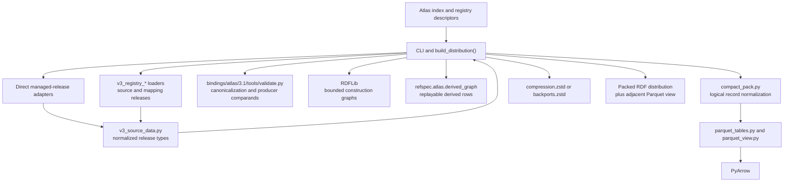
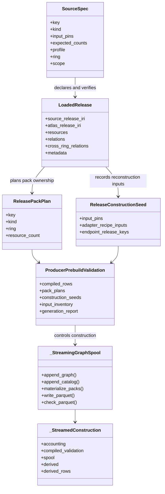
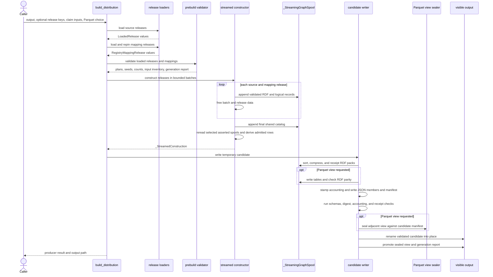
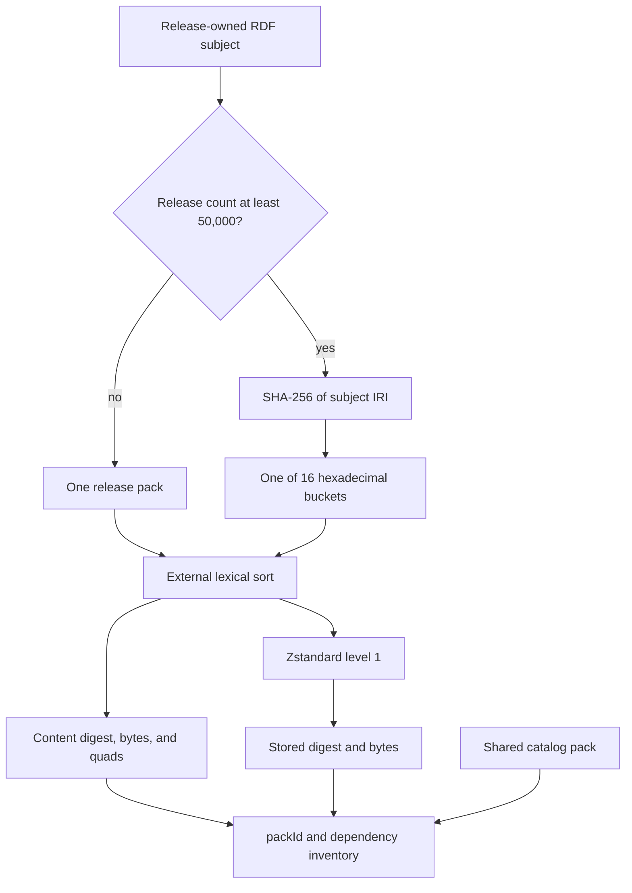

# Atlas distribution builder

<!-- markdownlint-disable MD013 -->

`atlas_distribution_builder` is the build-time module that turns selected,
digest-pinned source and mapping releases into an Atlas 3.1 candidate
distribution. Its implementation lives in
[`tools/generate_atlas_v3_full.py`](../tools/generate_atlas_v3_full.py). The
builder validates normalized input rows, constructs evidence-bearing Resource
Description Framework (RDF) records, streams canonical N-Quads through bounded
disk spools, writes content-addressed packs and supporting receipts, optionally
builds a typed Parquet view, and promotes the candidate only after its
producer-side checks pass.

The builder does not establish publisher-capture completeness, independently
prove capture-to-Atlas fidelity, sign a release, publish it, or replace the
portable Atlas 3.1 validator. Those responsibilities remain separate so that
one producer defect cannot define its own success.

## At a glance

| Question | Answer |
| --- | --- |
| What goes in? | Exact local publisher files and managed releases, registry descriptors, the planning index, normalized source releases, separately evidenced mapping releases, adapter source files, and the Atlas 3.1 binding. Every identity-bearing input is pinned by path, digest, length, or content-derived identifier as appropriate. |
| What happens? | The builder selects construction units, verifies and normalizes their inputs, validates row-level joins and counts, constructs asserted RDF in bounded batches, derives admitted non-authoritative relationships, externally sorts and compresses packs, writes Parquet tables when requested, and closes the result with manifests and receipts. |
| What comes out? | A closed Atlas distribution directory, an adjacent generation report, and, by default, a separately sealed Parquet view. The RDF distribution contains asserted packs, an optional derived view pack, four supporting JSON documents, and the root manifest. |
| How do we check it? | Producer checks cover inputs, row and constructor invariants, streamed-versus-whole-graph agreement, pack receipts, accounting, manifests, and Parquet parity. A separate binding-local validator must still validate the serialized distribution. Source fidelity, deterministic rebuild, sealing, and publication are additional gates. |

## Purpose and boundaries

The module owns the transition from reviewed release data to portable Atlas
artifacts. It assigns final RDF record types and identities, records evidence
and source accounting, decides pack ownership, writes deterministic bytes, and
binds those bytes to construction receipts.

It owns these responsibilities:

- select complete or explicitly bounded construction units;
- load source and mapping releases through their owning adapters;
- reconcile unique resource ownership and exact mapping endpoints;
- refuse source populations that belong to another product or are not
  reference data;
- validate normalized rows before constructing the large RDF corpus;
- construct source records, resources, labels, identifiers, releases,
  assertions, evidence bindings, and policies;
- preserve asserted, projection, and derived graph roles as distinct roles;
- stream asserted RDF and logical records to disk with bounded constructor
  batches;
- derive only release-selected, binding-admitted non-authoritative relations;
- write canonical, sorted, compressed RDF packs and their dependencies;
- write and verify the optional typed Parquet view from the same logical
  records;
- create source-accounting, construction, producer-validation, acceptance,
  manifest, and generation receipts; and
- replace the visible distribution directory only after the candidate passes
  the builder's checks.

The following work belongs elsewhere:

| Concern | Owner and documentation |
| --- | --- |
| Publisher acquisition, source parsing, and source-specific shape checks | [Publisher source portfolio and adapters](publisher_source_portfolio_and_adapters.md) |
| Exact-byte source packages and managed vocabulary release views | [Source release trust and fidelity assurance](source_release_trust_and_fidelity_assurance.md) and [Managed release validation](managed_release_validation.md) |
| Registry release normalization, release-key selection, and catalog placement | [Atlas registry loading](atlas_registry_loading.md) and [Atlas planning index](atlas_planning_index.md) |
| Derived-rule meaning, evidence, and replay requirements | [Atlas derived graph](atlas_derived_graph.md) |
| Normative wire format and independent conformance | [Atlas 3.1 binding](../bindings/atlas/3.1/README.md) |
| Independent publisher-byte-to-Atlas comparison | [Atlas source-fidelity audit](atlas_source_fidelity_audit.md) |
| Parquet view schema, verification, and query access | [Atlas 3.1 Parquet view](../docs/atlas-parquet-view.md) |
| Detached signing and consumer verification | [Seal design](../docs/seal-design.md) |

The current implementation authority is the Atlas 3.1 binding, the builder
code, and the [decision ledger](../docs/decisions.md). The
[U.S./EU comparison](../ATLAS_US_EU_COMPARISON.md) supplies strategic context;
it does not define producer behavior.

## Place in RefSpec

The builder is the junction between source-owned release adapters and the
portable Atlas artifact. It consumes immutable data structures and files; it
does not call publisher services during a normal build.

```mermaid
flowchart LR
    PUB["Pinned publisher artifacts"]
    SOURCE["Source readers and managed packages"]
    LOAD["Atlas registry loading<br/>RegistryRelease and mapping releases"]

    subgraph BUILDER["atlas_distribution_builder"]
        PRE["Prebuild verification<br/>selection, pins, rows, counts"]
        CONSTRUCT["Bounded RDF construction<br/>assertions and evidence"]
        SPOOL["Disk spools<br/>RDF and logical records"]
        DERIVE["Admitted derived rules"]
        WRITE["Packs, Parquet, manifests,<br/>and receipts"]
    end

    DIST["Candidate Atlas 3.1 distribution"]
    VIEW["Adjacent sealed Parquet view"]
    VALIDATE["Portable Atlas 3.1 validator"]
    SEAL["Detached release seal"]
    SERVE["Consumer-owned query and search views"]
    AUDIT["Independent source-fidelity audit"]

    PUB --> SOURCE --> LOAD --> PRE --> CONSTRUCT --> SPOOL --> WRITE --> DIST
    SPOOL --> DERIVE --> WRITE
    WRITE --> VIEW
    DIST --> VALIDATE --> SEAL --> SERVE
    VIEW --> SEAL
    PUB -. "independent reread" .-> AUDIT
    DIST -. "asserted packs and source accounting" .-> AUDIT
```



The separation follows the repository's build, prove, sign, and serve model.
`build_distribution()` completes the build stage and creates the evidence that
later stages inspect. Its result explicitly records that
`validate_distribution` was not run by the generator.

## Architecture

### Main dependency relationships



The producer dynamically loads the binding-local `validate.py` module. It
reuses canonical JSON and N-Quads rendering, binding digests, schema checks,
record-role comparands, and selected semantic helpers. The dependency remains
one-way: the portable validator does not import `refspec` or the builder. An
independent consumer can copy the binding directory and validate an Atlas
without installing this repository's producer package.

### Core types and relationships



`LoadedRelease` is the builder's common source boundary. Direct managed
releases and normalized `RegistryRelease` values both become this type before
row validation. Mapping releases remain separate because they own assertion
evidence rather than resource membership.

### Core components

#### `_StreamingGraphSpool`

`_StreamingGraphSpool` is the production path's central component. It keeps
large asserted graphs off the heap by accepting one validated constructor
batch at a time.

For each appended graph, it:

1. separates shared catalog subjects from release-owned subjects;
2. routes every subject to one source, mapping, or partition pack;
3. renders canonical asserted N-Quads into an unsorted disk spool;
4. discovers cross-pack dependencies from IRI-valued objects;
5. converts each release-owned subject to one closed logical record role;
6. normalizes that record through `compact_pack.py`;
7. appends the record to a role-specific JSON Lines spool; and
8. increments per-role, per-release, and aggregate counts.

When construction finishes, it externally sorts each RDF spool, compresses it,
and records exact pack facts. It also externally sorts the logical records,
writes typed Parquet tables, and checks the tables against the RDF-derived
comparands in the binding.

The spool recognizes eight logical record roles: `Resource`, `Label`,
`Statement`, `EvidenceBinding`, `SourceRecord`, `Release`, `Identifier`, and
`LifecycleEvent`. `DerivedRelation` is deliberately absent. Derived rows are
non-authoritative and use a separate RDF view pack and optional separate
Parquet table.

#### `_DigestingBinaryWriter`

`_DigestingBinaryWriter` wraps the stored binary pack stream. Its `write()`
method handles partial writes, hashes only bytes the underlying stream
accepted, and counts those accepted bytes. `_compress_nquads()` passes it to
the Zstandard writer, so the build captures the compressed transport digest
and length during the write rather than trusting a later producer-side
recount.

The same compression pass separately hashes and counts the uncompressed
canonical N-Quads. `PackWriteReceipt` therefore binds both forms:

- content byte length, SHA-256 digest, and quad count; and
- transport byte length and SHA-256 digest.

`PackContentReceipt` is the smaller immutable shape for content-only facts:
`byte_length`, `digest`, and `quad_count`. The active compression path returns
the broader `PackWriteReceipt`; contributors should not confuse content
identity with compression identity.

#### `_MutationTrackedGraph`

`_MutationTrackedGraph` extends RDFLib's `Graph` with a monotonically
increasing revision number. Adding an existing triple does not change the
revision; adding a new triple increments it once; removing matching triples
increments it by the number removed.

The whole-graph writer seals the asserted graph's revision after compiled
producer validation and checks it again while writing packs and comparing the
Parquet view. This catches a graph mutation between validation and
serialization. The streamed path uses the same lean `SimpleMemory` graph type
for bounded constructor batches, then discards each batch after validation and
spooling. The whole-graph implementation remains important as a test oracle
for the streamed implementation.

#### `_StatusReporter`

`_StatusReporter` writes human-facing progress to standard error without
changing artifact identities. Phase boundaries emit immediately. Progress
updates are rate-limited, except for a completed unit. Each phase also records
elapsed milliseconds and the process's peak resident memory.

`ru_maxrss` uses different units on macOS and Linux; `_peak_rss_bytes()`
normalizes both to bytes. The resulting memory profile belongs to the adjacent
generation report, not to the content-derived distribution identity.

#### Supporting receipts and plans

| Type | Role |
| --- | --- |
| `ReleasePackPlan` | Retains the small amount of release identity, kind, ring, and size information needed after normalized rows are freed. |
| `ReleaseConstructionSeed` | Records raw input pins, adapter source inputs, scheme placement, and endpoint release dependencies used to derive release-local build keys. |
| `CompiledProducerValidationReceipt` | Carries binding digests, language scan results, expected semantic counts, expected logical-record counts, and source-release count from prebuild validation. |
| `ProducerPrebuildValidation` | Bundles every pre-write result required by streamed construction and candidate writing. |
| `ColdPackMaterialization` | Records that every pack was rebuilt. The current builder has no reuse path. |
| `_StreamedConstruction` | Retains source accounting, compiled validation, disk spools, and the small derived result after release objects and constructor graphs are freed. |

## End-to-end build flow

### Component interaction



### Detailed stages

#### 1. Select and load construction units

`split_construction_unit_keys()` validates `--only-release` keys against the
code-declared topology and divides them into source-release and mapping-release
sets. An empty bounded selection and an unknown key fail immediately.

`load_releases()` combines direct managed-release adapters with vocabulary,
large-source, code, non-emitter, roster, and alignment-endpoint loaders. It
reconciles duplicate endpoint candidates, validates registry descriptors and
planning-index placement, optionally injects verified claim bundles, adapts
each `RegistryRelease` to `LoadedRelease`, and applies the REF-030, REF-031,
and REF-032 refusal gates.

`load_mapping_releases()` loads evidence-backed mappings separately. It
constructs the agency-identity mapping only when the required organization
rosters are present, applies source-specific reconciliation such as the
FAST--Library of Congress Subject Headings SKOS S27 check, repins every mapping
endpoint to its unique loaded Atlas release, and validates mapping-only
registry policy.

A bounded selection is a set of construction units, not an arbitrary filter.
Some mapping units require companion mappings or endpoint releases. The loader
fails instead of emitting a mapping against incomplete context.

#### 2. Validate before RDF construction

`validate_prebuild_loaded_releases()` runs the checks that can operate on the
smaller normalized values:

- exact input digest and byte-length verification;
- unique release, resource, source-release, and Atlas-release identities;
- profile, semantic-ring, scheme, label, identifier, and relationship rules;
- mapping endpoint, predicate, effective-period, evidence, and reviewer rules;
- language normalization and native-payload checks;
- SKOS integrity over the selected claims;
- expected source, assertion, evidence, and logical-record counts;
- pack-path safety and large-release partition decisions;
- construction input and adapter recipe digests; and
- generation-report canonical JSON compatibility.

The optional `deep=True` mode continues through streamed construction in a
temporary spool but writes no distribution. It is useful when a caller wants
constructor validation without candidate publication.

#### 3. Construct and spool asserted records

`_stream_construct_graphs()` processes source releases and mapping releases
sequentially. `_stream_source_release()` and `_stream_mapping_release()` split
their members into batches, construct temporary RDF graphs, run the existing
whole-graph evidence checks on each bounded batch, and append the result to the
spool. The default constructor batch contains 2,000 input rows.

Source construction creates:

- publisher `SourceRelease` and Atlas `AtlasRelease` records;
- `SourceRecord` records with canonical native JSON;
- governed resources, SKOS-XL labels, and authority-scoped identifiers;
- source assignments, native relations, and cross-ring assertions;
- one or more approved evidence bindings per assertion; and
- represented or excluded source-accounting dispositions.

Mapping construction preserves the attested direction and creates one mapping
assertion plus its evidence records and bindings. It does not invent inverse,
transitive, reciprocal, or similarity mappings.

#### 4. Derive registered relationships

After every asserted release has reached disk, `_derive_registered_relations()`
rereads the relevant release spools and invokes the selected rule functions.
Rules run only when all required source releases are present. Their rows cite
exact asserted evidence nodes and enter the non-authoritative `derived` graph.

The builder computes the expected row count before construction with the same
pure resolver functions used after streaming. The Atlas 3.1 validator still
owns admission and independent replay. See [Atlas derived graph](atlas_derived_graph.md)
for rule identities, scope, and consumer behavior.

#### 5. Sort, partition, compress, and receipt packs

RDF batches enter unsorted per-pack spools. `_write_sorted_lines()` creates
sorted chunks and merges them with a bounded fan-in. Current defaults are
50,000 lines per chunk and 64 open merge inputs. The result is canonical
lexicographically sorted N-Quads without holding the distribution in memory.

Every release smaller than 50,000 members or mappings gets one pack. A larger
release uses 16 stable buckets selected from the SHA-256 digest of each subject
IRI. All outgoing facts for one subject remain together. This rule applies to
large source and mapping releases.



Every non-catalog asserted pack depends on the shared catalog pack. The spool
also records dependencies on release packs that own referenced objects. These
dependencies describe exact content closure; they are not an execution order
and may contain cycles.

#### 6. Write and verify the Parquet view

Unless `--no-parquet-view` is set, the spool writes one typed table per logical
record role. The view is adjacent to the distribution because the distribution
has a closed file inventory. Agency projection tables and derived-relation
tables are added only when their required releases or rows exist.

Parity checks use binding-owned comparands:

- every RDF-derived logical record identifier must appear in exactly one
  corresponding table row, and every served identifier must exist in RDF;
- every source-record payload is hashed and compared with its table digest;
  and
- up to five stable positions per role are re-derived from RDF and compared
  column by column.

`seal_atlas_parquet_view()` then binds the view to the exact candidate manifest
and records whether the agency projection and derived table were emitted. The
view remains a derived query representation; canonical authority stays in the
asserted RDF.

#### 7. Close the candidate and promote it

The asserted graph inventory digest exists only after pack materialization.
The writer stamps that digest into source accounting, recomputes the
content-derived distribution identifier, and writes the supporting JSON
documents. It then writes the manifest and checks:

- closed JSON Schemas and canonical JSON;
- manifest and binding digests;
- pack identities, dependencies, counts, and graph inventories;
- source accounting and construction ownership;
- producer-validation and acceptance metadata;
- stored file lengths and SHA-256 digests; and
- exact candidate directory membership.

The writer builds in a temporary sibling directory. It renames the candidate
over the visible distribution only after these checks pass. The Parquet view
and generation report are promoted as adjacent artifacts in later steps, so
contributors must not describe the three paths as one filesystem transaction.

## Output structure

A normal build produces this shape:

```text
<release-root>/
├── distribution/
│   ├── atlas-manifest.json
│   ├── atlas-source-accounting.json
│   ├── atlas-acceptance.json
│   ├── atlas-producer-validation.json
│   ├── atlas-construction-summary.json
│   └── packs/
│       ├── catalog.nq.zst
│       ├── sources/<release-token>/{all|<bucket>}.nq.zst
│       ├── mappings/<release-token>.nq.zst
│       ├── mappings/<release-token>/<bucket>.nq.zst
│       └── views/derived.nq.zst          # only when rows exist
├── parquet-view/                         # omitted with --no-parquet-view
│   ├── view-manifest.json
│   └── tables/*.parquet
└── generation-report.json
```

The default streamed build emits asserted RDF and, when applicable, a derived
view pack. It does not emit a projection RDF pack. The Parquet view is a
separate logical-record projection, not the Atlas `projection` named graph.

### Identity and digest chain

| Identity or digest | Basis | Purpose |
| --- | --- | --- |
| Input pin | Exact file bytes and byte length | Refuses changed or substituted publisher and mapping inputs. |
| Adapter recipe digest | Project-owned adapter source paths and SHA-256 digests | Records which producer code defined one construction unit. Runtime versions remain pinned by the project environment and lock files. |
| Release base build key | Input inventory, adapter recipe, binding contract, language scope, and release placement | Identifies the release-local construction basis before endpoint dependencies. |
| Release build key | Base build key plus endpoint release build keys | Detects a mapping or relation unit built against different endpoint releases. |
| Source record IRI | Source release, source locator, source digest, and canonical native-payload digest | Names the exact normalized source evidence record. |
| Assertion IRI | Exact claim, type, ring context, endpoint releases, and policy identity | Keeps claim identity stable when additional evidence is attached. |
| Pack ID | Canonical uncompressed N-Quads content digest | Keeps pack identity independent of compression settings. |
| Graph inventory digest | Sorted pack IDs, content digests, and quad counts for one graph role | Pins the complete asserted, projection, or derived graph inventory. |
| Distribution ID | Closed source-accounting content, including the asserted inventory digest and complete-or-bounded scope | Gives identical inputs and constructed content the same identity while preventing a bounded build from claiming complete scope. |
| Manifest digest | Canonical manifest bytes | Supplies the external trust pin used by validators, views, seals, and consumers. |

Timestamps that affect artifact identity come from pinned release dates, not
the wall clock. A cold rebuild of the same inputs and code should therefore
produce byte-identical release artifacts.

## Graph authority and trust model

The builder preserves the Atlas 3.1 graph roles:

| Graph role | Producer behavior | Consumer meaning |
| --- | --- | --- |
| `asserted` | Writes publisher facts, normalized resources, source records, evidence bindings, and evidence-bearing assertions. | Authoritative content of the distribution. |
| `projection` | The default streamed build leaves this role empty. The binding can reproduce and validate a projection when one is present. | Non-authoritative convenience form of asserted content. |
| `derived` | Writes only rows produced by selected and admitted rules, in a separate view pack. | Non-authoritative, replayable, and opt-in consequences. |

Three related checks answer different questions:

| Check | Question answered | Run by this module? |
| --- | --- | --- |
| Producer validation and trusted-writer receipts | Did the configured producer validate its normalized inputs and constructors, then write bytes consistent with its own receipts? | Yes. |
| Portable Atlas 3.1 validation | Does the serialized distribution conform to the binding when read independently from disk? | No. Run `bindings/atlas/3.1/tools/validate.py`. |
| Source-fidelity audit | Does the asserted Atlas faithfully represent the pinned publisher bytes under the audit's declared coverage? | No. Run `tools/verify_atlas_source_fidelity.py` or the source-specific verification target. |

`atlas-producer-validation.json` is a receipt, not an independent proof. The
builder also creates the candidate acceptance document and checks its metadata;
the standalone validator recomputes the required gates from the serialized
artifact. A successful builder invocation therefore supports, but does not
replace, the independent release verdict.

## Public and integration entry points

| Entry point | Use |
| --- | --- |
| `verify_inputs(releases=None, mapping_releases=())` | Verify every declared input pin and return a JSON-compatible inventory without constructing RDF. |
| `load_releases(include_keys=None, registry_claim_inputs=None)` | Load direct and registry-backed source releases, reconcile ownership, validate descriptors, adapt them to `LoadedRelease`, and apply source-population refusals. |
| `load_mapping_releases(include_keys=None, source_releases=None)` | Load evidence-backed mapping releases, reconcile source-specific conflicts, pin endpoints to loaded releases, and validate mapping policy. |
| `validate_prebuild_loaded_releases(releases, mapping_releases=(), deep=False)` | Validate caller-supplied loaded values and prepare plans, seeds, counts, and reports. `deep=True` also exercises streamed construction in temporary storage. |
| `validate_prebuild(registry_claim_inputs=None, include_keys=None, deep=False)` | Load the requested topology and run prebuild validation without writing a distribution. |
| `build_distribution(output, registry_claim_inputs=None, include_keys=None, parquet_view=True)` | Run the complete producer path and promote the candidate distribution. |
| `main()` | Command-line interface. Returns `0` after input inspection or a completed build and propagates failures. |

Most underscore-prefixed helpers and classes are internal implementation
details. Tests may call them to preserve oracle comparisons and failure
batteries; product code should prefer the entry points above.

## Command-line use

Verify a bounded unit's pinned inputs without writing a distribution:

```sh
uv run python tools/generate_atlas_v3_full.py \
  --check-inputs \
  --only-release federal-register-thesaurus-2025
```

Build the same bounded unit with its adjacent Parquet view:

```sh
uv run python tools/generate_atlas_v3_full.py \
  --only-release federal-register-thesaurus-2025 \
  --output output/atlas-3.1-federal-register-thesaurus-2025-04-01/distribution
```

Then validate the serialized distribution with the portable binding:

```sh
uv run --no-project \
  --with-requirements bindings/atlas/3.1/requirements.txt \
  python bindings/atlas/3.1/tools/validate.py \
  --distribution output/atlas-3.1-federal-register-thesaurus-2025-04-01/distribution
```

The CLI supports:

| Option | Meaning |
| --- | --- |
| `--output PATH` | Distribution directory. The default points to a development output under `output/`. |
| `--check-inputs` | Load and verify the requested inputs, print their inventory, and skip distribution writing. |
| `--only-release RELEASE_KEY` | Bound the build to one construction unit. Repeat for additional units and required dependencies. |
| `--registry-claim-input RELEASE_KEY BUNDLE_PATH MANIFEST_SHA256` | Inject a verified claim bundle into an existing loaded registry release. Repeat for additional releases. Claim-injected builds require a new output path. |
| `--no-parquet-view` | Skip the adjacent typed Parquet view. |
| `--quiet` | Suppress progress and phase lines on standard error. |

Use the repository's release targets when they apply. For example,
`make release-atlas-federal-register-thesaurus` fixes the supported environment
and bounded release key. `make stage-atlas-mapping-topology` exercises a
multi-release mapping topology before a full build. These targets depend on
pinned local source files that hosted test runners may not possess.

## Failure behavior and operational properties

The builder fails closed with exceptions. It does not return a partially
trusted public object.

Common refusal categories include:

- missing, symlinked, changed, or wrong-length input files;
- unknown, incomplete, or incompatible bounded release selections;
- duplicate release keys, release identities, resources, source records, or
  mapping claims;
- catalog, planning-index, scheme, profile, or semantic-ring drift;
- labels, language metadata, identifiers, relationships, or evidence outside
  the binding's admitted shapes;
- registrant, document, or observed populations that belong outside Atlas;
- mapping endpoints outside loaded releases or pinned to the wrong edition;
- mapping review methods whose required evidence records the producer cannot
  emit;
- count drift between normalized rows, streamed records, source accounting,
  Parquet tables, packs, and manifests;
- unsafe pack paths, oversized canonical N-Quads lines, or unexpected files;
- a binding edit during a long-running build; and
- an asserted graph mutation after whole-graph compiled validation.

Every build is cold: it reparses pinned inputs, reconstructs all selected
records, and rewrites every pack. No previous distribution supplies content or
authority. Temporary directories hold sort chunks, construction spools, and
the candidate; normal cleanup removes them after success or failure. The
visible distribution remains unchanged until candidate promotion.

## Performance and scaling

The production path reduces peak RDF memory, but it is not constant-memory in
every dimension.

| Path | Scaling behavior |
| --- | --- |
| Source and mapping loading | Holds normalized `LoadedRelease` and mapping values before streaming. Memory grows with the selected releases' normalized rows. |
| Constructor graphs | Bounded to batches of 2,000 input rows, then validated, spooled, closed, and garbage-collected between releases. |
| RDF and logical-record sorting | External merge sort. Memory is bounded by the 50,000-line chunk; time is approximately `O(n log n)` and temporary disk use is `O(n)`. |
| Pack writing | Streams canonical bytes once through content hashing and Zstandard compression. |
| Parquet reachability | Streams table IDs and RDF type-derived IDs in batches of 2,000. Source-record payload hashes are checked exhaustively. |
| Parquet row parity | Re-derives at most five stable rows per logical role. Each sampled lookup scans sorted RDF pack files for the subject, so sample count is bounded but the scan cost grows with corpus bytes. |
| Derived rules | Reread only releases required by active rules, but the current dispatcher materializes each selected release's N-Quads lines in a list. Peak memory can therefore grow with the largest derivation input. |
| Pack partitioning | Releases at or above 50,000 resources or mappings split into 16 subject-hash buckets, bounding individual pack size and validator load units. |

When a full build slows unexpectedly, profile the phase named by
`_StatusReporter` before increasing a limit. The generation report records
phase boundaries and process peak resident memory for this purpose.

## Contribution guide

### Add or change a source release

Keep source parsing in the owning registry module. The builder should receive a
normalized release rather than grow another publisher-specific parser.

1. Add or update the source adapter and its exact input pins, identities,
   counts, scope, native payloads, and source paths.
2. Register the release key in the correct `v3_registry_*` loader group.
3. Reconcile its `resourceId`, source module, profile, ring, and scheme with the
   planning index and registry descriptors.
4. Ensure `_adapter_group_module()` can identify the release's declaration
   module and that `source_module` reaches the project-owned adapter closure.
5. Add focused source, normalization, identity, count, and refusal tests.
6. Run `--check-inputs` and a bounded prebuild before constructing RDF.
7. Build and independently validate a bounded distribution.
8. Run the applicable source-fidelity audit. A valid distribution can still
   mistranscribe an incomplete or incorrectly interpreted capture.

Do not weaken REF-030, REF-031, or REF-032 refusal prefixes to admit a renamed
population. Change the decision and its running negative tests when ownership
genuinely changes.

### Add or change a mapping release

Mapping releases must declare exact endpoint editions and at least one approved
evidence binding per claim.

1. Add the mapping to the owning alignment module and mapping-key set.
2. Preserve the publisher or reviewed direction; do not synthesize an inverse.
3. Declare every pinned evidence input and the explicit review warrant.
4. Include all endpoint construction units in bounded tests.
5. Update `_adapter_group_module()` only when the new key introduces a new
   owning alignment module.
6. Add negative tests for missing endpoints, wrong release pins, duplicate
   claims, unsupported predicates, and incomplete reconciliation context.

### Add or change a derived rule

Follow the [Atlas derived graph](atlas_derived_graph.md) workflow. Producer
wiring, the contract-covered admission registry, independent replay, positive
fixtures, and mutation fixtures are separate requirements. A registered Python
callable does not authorize a row, and a binding admission does not cause the
producer to run the rule.

### Change streaming, packing, or Parquet logic

Preserve the whole-graph behavior as a test-only oracle. The existing
`test_streamed_construction_matches_the_whole_graph_oracle` comparison proves
agreement over representative graphs; mutation and refusal batteries prove
that both paths reject malformed input. Extend those tests before removing or
replacing a check.

Writer changes must preserve:

- one owner and one logical role for every release-owned RDF subject;
- all outgoing facts for a subject in one pack;
- deterministic sort order, content digests, paths, and build timestamps;
- the distinction between content and transport digests;
- complete cross-pack dependencies and catalog dependency;
- source-accounting and construction-record ownership totals;
- full record-ID equality between asserted RDF and Parquet;
- the asserted/projection/derived authority boundary; and
- the portable validator's independence from producer code.

If a change alters the wire meaning, update the binding and its conformance
corpus. If it only changes implementation, keep existing identities stable and
prove byte or verdict parity as appropriate.

## Verification map

| Area | Primary checks |
| --- | --- |
| Status and memory reporting | `test_status_reporter_rate_limits_progress_and_keeps_phase_boundaries`, `test_status_reporter_records_portable_peak_rss_receipts` |
| Pack paths, partitions, dependencies, and receipts | `test_release_pack_paths_are_readable_safe_and_deterministic`, `test_same_release_cross_partition_reference_pins_target_pack`, `test_pack_write_receipt_matches_both_exact_byte_forms`, `test_a_large_mapping_release_buckets_its_pack` |
| Bounded selection and loading | `test_bounded_release_keys_reach_the_loader_that_declares_them`, `test_bounded_build_loads_only_the_named_release` |
| Streamed constructor parity | `test_streamed_construction_matches_the_whole_graph_oracle`, `test_streamed_whole_graph_refusal_battery_has_no_missing_probe` |
| Candidate immutability and binding pins | `test_candidate_binds_compiled_proof_before_releasing_graphs`, `test_candidate_rejects_asserted_mutation_after_compiled_validation`, `test_a_binding_edited_under_a_running_build_is_refused` |
| Source accounting and distribution identity | `test_distribution_identity_is_the_digest_of_the_content_it_labels`, `test_distribution_identity_names_its_scope_and_cannot_be_relabelled` |
| Parquet generation and parity | `test_builder_emits_parquet_from_the_graph_it_already_walks`, `test_parquet_parity_refuses_a_table_the_graph_does_not_say`, `test_parquet_parity_refuses_a_record_the_served_tables_cannot_reach` |
| Ownership refusals | `test_registrant_population_releases_are_refused`, `test_document_population_releases_are_refused`, `test_observed_inventory_releases_are_refused` |

Run the focused producer suite after code changes:

```sh
uv run pytest tests/test_generate_atlas_v3_full.py
```

Run the portable binding corpus after any change that touches RDF meaning,
canonicalization, schemas, graph roles, evidence, or receipts:

```sh
make test-atlas-v3
```

For release-relevant changes, also run a bounded real build, the standalone
validator, the applicable source-fidelity check, and the deterministic rebuild
gate. Passing focused tests does not establish that a full Atlas was rebuilt,
validated, sealed, or published.

## Decision lineage

The main architectural decisions behind this module are:

- [REF-023](../docs/decisions.md#ref-023-supersede-the-compatibility-view--rkaf-ships-on-the-atlas-wire): shared Rulespec (`rkaf`) terms appear directly on the wire; RefSpec does not mint parallel semantics.
- [REF-024](../docs/decisions.md#ref-024-record-the-cross-product-ownership-boundary-once): products exchange immutable releases and installed packages rather than source trees or live databases.
- [REF-026](../docs/decisions.md#ref-026-build-prove-once-sign-serve--the-validation-cost-reset): construction, independent proof, signing, and serving are separate stages.
- [REF-030](../docs/decisions.md#ref-030-registrant-populations-leave-the-atlas-for-the-entity-registry), [REF-031](../docs/decisions.md#ref-031-document-populations-leave-the-atlas-for-spicyregs), and [REF-032](../docs/decisions.md#ref-032-observed-inventories-leave-the-atlas): the loader contains running refusal gates for out-of-scope populations.
- [REF-037](../docs/decisions.md#ref-037-the-publisher-alignment-acquisition-wave-lands-seven-mapping-releases-and-the-first-current-cross-ring-carrier) and [REF-038](../docs/decisions.md#ref-038-the-regulationsgov-agency-roster-lands-and-reviewed-identity-claims-govern-the-agency-projection): evidence-backed mappings, cross-ring assertions, and the all-or-none agency projection enter the build.
- [REF-040](../docs/decisions.md#ref-040-one-consolidated-lcsh-release-replaces-three-the-held-to-held-mappings-connect-at-full-scope): mapping reconciliation must see the complete source hierarchy and endpoint topology it constrains.
- [REF-042](../docs/decisions.md#ref-042-the-derived-graph-gets-a-rule-registry-mesh-tree-number-broader-is-the-second-entry), [REF-043](../docs/decisions.md#ref-043-gcmd-column-nesting-becomes-the-derived-graphs-third-rule-the-real-data-audit-gap-it-opened-closes), and [REF-049](../docs/decisions.md#ref-049-retain-and-publish-the-federal-register-alignment-as-the-sixth-derived-rule): derived relations remain separately admitted, replayable, and non-authoritative.
