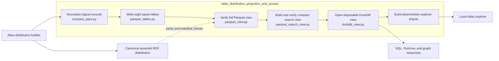
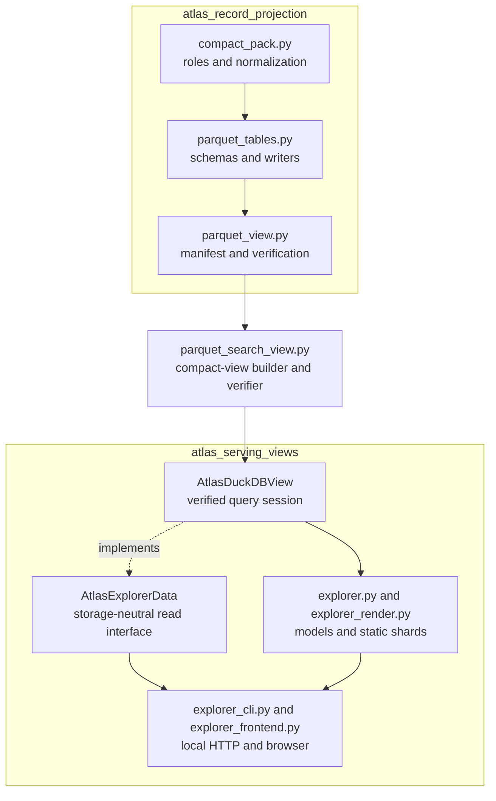

# Atlas distribution projection and access

## Purpose

`atlas_distribution_projection_and_access` converts Atlas records into verified, read-optimized data without changing their meaning.

- `atlas_record_projection` normalizes the eight closed Atlas record roles and writes typed Apache Parquet tables.
- View builders verify schemas, row counts, file digests, and closed directory membership.
- `atlas_serving_views` authenticates the compact Parquet view before exposing disposable DuckDB queries, graph APIs, and deterministic explorer files.

The asserted Resource Description Framework (RDF) distribution remains canonical. Agency projections stay separate, and derived relations remain optional and non-authoritative.

## Architecture

The normal access path verifies the compact view against a trusted manifest digest before creating any query state. DuckDB databases, full-text indexes, HTTP responses, and browser shards remain replaceable views of the authenticated Parquet files.

## Core component documentation

| Component | Responsibility | Documentation |
| --- | --- | --- |
| `atlas_record_projection` | Defines, normalizes, and writes the eight typed Atlas record tables. | [Atlas record projection](atlas_record_projection.md) |
| `atlas_serving_views` | Verifies compact views and provides DuckDB, graph, HTTP, and static-browser access. | [Atlas serving views](atlas_serving_views.md) |
| Parquet artifact format | Defines view manifests, schemas, integrity checks, and sealing behavior. | [Atlas 3.1 Parquet view](../docs/atlas-parquet-view.md) |
| Atlas distribution rules | Defines the normative graph roles and independent validation requirements. | [Atlas 3.1 binding](../bindings/atlas/3.1/README.md) |
| Architectural decisions | Records authority, ownership, and cross-product boundaries. | [Decision ledger](../docs/decisions.md) |