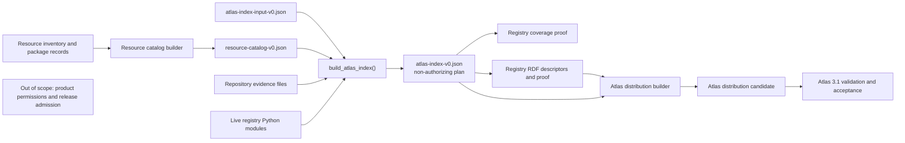
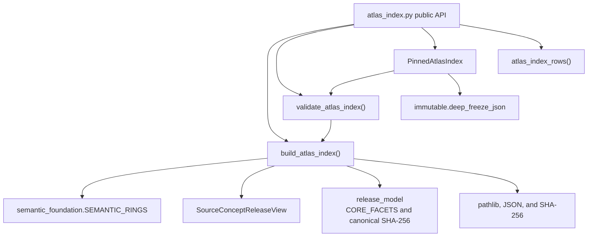
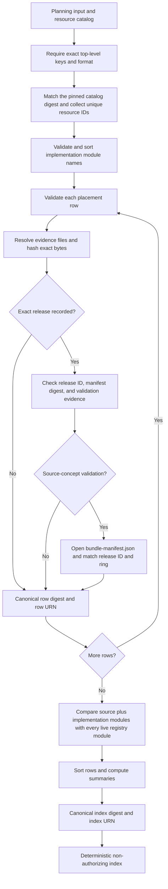
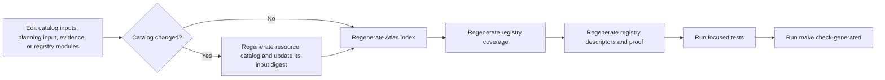

# Atlas planning index

The `atlas_planning_index` module builds RefSpec's content-addressed plan for
placing registry resources in the Atlas. It combines a hand-maintained planning
input, the supplied resource catalog, repository evidence, and the live registry
module inventory into `portfolio/atlas-index-v0.json`.

Content-addressed means that each row identifier and the complete index
identifier derive from a SHA-256 digest of normalized content.

The index answers what RefSpec has inventoried, where each source belongs, what
evidence exists, and which exact releases have been recorded. It does **not**
authorize a source for publication, grant a product permission, run a source
adapter, or build an Atlas distribution. Every generated index carries
`"nonAuthorizing": true`, and the builder rejects fields that resemble
permissions.

Current checkout note, verified on 2026-09-01: generation correctly refuses
the checked input because three live registry modules remain unclassified. See
[Current repository status](#current-repository-status). The architecture below
describes the successful, closed generation path.

## At a glance

| Question | Answer |
| --- | --- |
| What goes in? | `portfolio/atlas-index-input-v0.json`, `portfolio/resource-catalog-v0.json`, the files named as readiness or release evidence, and the Python module inventory under `src/refspec/registry/`. |
| What happens? | The builder accepts only listed keys and values, validates cross-file references, hashes evidence, checks exact-release evidence, proves that every registry module is classified, sorts all order-insensitive inputs, and assigns content-derived identities. |
| What comes out? | A deterministic `refspec-atlas-index/experimental-v0` JSON object with placement rows, evidence digests, summaries, `rowId` values, and an `indexId`. |
| How do we check it? | Regenerate it with `tools/generate_atlas_index.py --check`, run `tests/test_atlas_index.py`, and regenerate the downstream registry coverage and descriptor proofs. |

The long inventory of publisher readers belongs in [Publisher source portfolio
and adapters](publisher_source_portfolio_and_adapters.md). The four semantic
rings and source-release records belong in [Registry
foundation](registry_foundation.md). This page documents only the planning
index and its immediate integration points.

## Place in RefSpec

The planning index sits between source inventory and release construction. It
closes the registry's planning metadata and gives downstream builders a stable
input, but it never decides that a release may enter a publication.



The downstream stages are documented in [Atlas registry
loading](atlas_registry_loading.md), [Atlas distribution
builder](atlas_distribution_builder.md), and [Atlas distribution projection
and access](atlas_distribution_projection_and_access.md). The normative
distribution rules remain in the [Atlas 3.1
binding](../bindings/atlas/3.1/README.md); the planning index is not part of the
published Atlas wire format.

### Authority boundary

The distinction between a recorded plan and an authorized action is central to
this module:

| Index field or result | What it means | What it does not mean |
| --- | --- | --- |
| `planningStatus: "planned"` | Work is represented in the portfolio plan. | The source is ready, accepted, or selected for a build. |
| `readinessEvidence` | Named repository files existed and their exact bytes were hashed during generation. | Every claim in those files is independently true. |
| Non-null `release` | The row records one release identifier, manifest digest, and evidence file. | The release is admitted to the next Atlas distribution. |
| `intendedUses` | Maintainers recorded expected technical uses. | A consumer may perform those uses. |
| `atlasParticipation` | A subject-ring source has a planning class of `core`, `specialist`, or `bridge`. | The source may generate candidates or mappings. |
| `PinnedAtlasIndex.pin()` | A caller can identify exact index content and exact file bytes. | The caller has permission to use any row. |

This boundary implements the non-authorizing portfolio decision in
[REF-013](../docs/decisions.md#ref-013-govern-atlas-growth-through-a-non-authorizing-portfolio-index).
[REF-014](../docs/decisions.md#ref-014-separate-cataloged-sources-from-governed-atlas-schemes)
separates cataloged sources from the schemes and releases that Atlas actually
publishes. Cross-product ownership remains governed by the [decision
ledger](../docs/decisions.md), especially REF-024 and its later amendments.

## Module architecture

The implementation lives in
[`src/refspec/atlas_index.py`](../src/refspec/atlas_index.py). Its public surface
is small; private helpers enforce the closed JSON shape, path rules, evidence
checks, and deterministic identities.



See [Registry foundation](registry_foundation.md) for
`SourceConceptReleaseView` and the semantic-ring model. See [Managed release
validation](managed_release_validation.md) for the release validators whose
receipts may appear as readiness evidence.

### Public components

| Component | Responsibility |
| --- | --- |
| `ATLAS_INDEX_INPUT_FORMAT` | Format marker required on the planning input: `refspec-atlas-index-input/experimental-v0`. |
| `ATLAS_INDEX_FORMAT` | Format marker emitted on the generated index: `refspec-atlas-index/experimental-v0`. |
| `build_atlas_index(index_input, resource_catalog, *, repository_root, registry_root=None)` | Validate the planning inputs and repository closure, then return the deterministic index as a mutable `dict`. |
| `validate_atlas_index(index, index_input, resource_catalog, *, repository_root, registry_root=None)` | Rebuild the expected index and require exact mapping equality. It returns `None` on success. |
| `PinnedAtlasIndex.open(...)` | Authenticate exact file bytes, parse strict JSON, reproduce the index from its inputs, detect a concurrent file change, and retain immutable snapshots. |
| `PinnedAtlasIndex.verified_index()` | Reopen the file and repeat every check before returning the frozen index mapping. |
| `PinnedAtlasIndex.pin()` | Reverify, then return `role`, `id`, `indexDigest`, and `fileDigest`. The returned pin contains no local path. |
| `atlas_index_rows(index, *, semantic_ring=None)` | Return all mapping-shaped rows, optionally filtered to one supported ring. This helper checks only the format marker, the non-authorizing marker, the optional ring, and the top-level row container. |
| `AtlasIndexError` | Primary validation error for incomplete, unsafe, unsupported, drifting, or non-deterministic index state. |

`atlas_index_rows()` is an accessor, not a trust boundary. Call it only with an
index returned by `build_atlas_index()`, accepted by `validate_atlas_index()`,
or obtained from `PinnedAtlasIndex.verified_index()`. It silently skips
non-mapping items inside an otherwise valid top-level row list.

## Build data flow

`build_atlas_index()` performs validation and generation in one pass. It does
not mutate the input mappings or write a file.



### Input document

The builder accepts exactly five top-level fields. The experimental format has
no separate JSON Schema in the current repository; the Python builder is the
executable shape definition.

| Field | Required value and behavior |
| --- | --- |
| `format` | Exactly `refspec-atlas-index-input/experimental-v0`. |
| `implementationModules` | A unique list of dotted Python module names. These registry modules support infrastructure or implementation and therefore do not receive source rows. The builder sorts the list. |
| `recordedAt` | A non-empty, trimmed string copied into the output. The current code does not parse or normalize it as a date-time. |
| `resourceCatalogDigest` | A lowercase `sha256:` digest that must equal the supplied catalog's `catalogDigest`. |
| `rows` | A non-empty list of exact, closed placement-row objects. |

The `resource_catalog` argument must provide a non-empty `catalogId`, a valid
`catalogDigest`, and a `resources` list whose `resourceId` values are non-empty
and unique. A planning row may name only one of those resource IDs. The index
does not require every catalog resource to have a row; catalog-only resources
remain valid descriptors and appear in the downstream coverage report.

The builder matches the planning input against the catalog's embedded digest;
it does not regenerate the catalog. The normal workflow establishes that
upstream trust first with `tools/generate_resource_catalog.py --check`.

### Placement row

Each input row has exactly these fields:

| Field | Meaning and checks |
| --- | --- |
| `sourceModule` | Dotted Python module that implements or supplies this source placement. It must be classified as a source module, not an implementation module. |
| `resourceId` | Existing resource-catalog identifier. The same resource may have several rows when facets or rings differ. |
| `facet` | One value from `release_model.CORE_FACETS`. |
| `assignmentRole` | One supported Rulespec assignment-role IRI. |
| `intendedUses` | Non-empty, unique list from the module's closed intended-use vocabulary. The builder sorts it. |
| `semanticRing` | One of `subject`, `entity`, `value`, or `legalIdentity`. Each row selects exactly one ring. |
| `atlasParticipation` | `core`, `specialist`, `bridge`, or `null`. Only `subject` rows may use a non-null class. A `bridge` row may not claim `candidateGeneration`. |
| `planningStatus` | One of `deferred`, `notApplicable`, `planned`, `rejected`, `superseded`, or `unassessed`. |
| `readinessEvidence` | Non-empty list of unique `{kind, path}` pairs. Each path becomes `{kind, path, sha256}` in the output. |
| `release` | `null` or an exact `{evidencePath, manifestDigest, releaseId}` object. The output adds `evidenceSha256`. |

Unknown fields fail closed. The builder also rejects these permission-shaped
names explicitly: `acceptedOutputUseAuthorized`, `authorized`,
`candidateUseAuthorized`, `eligible`, `permission`, and `ready`.

### Closed values

The closed sets prevent spelling drift and prevent planning prose from growing
into an accidental policy language.

- Intended uses: `candidateGeneration`, `candidateRanking`,
  `deterministicMetadata`, `entityResolution`, `facetedRetrieval`,
  `legalIdentityResolution`, `mappingReference`, `navigation`,
  `rankingSignal`, `schemaInterpretation`, `searchExpansion`, and
  `sourceAssignedEvidence`.

- Readiness evidence kinds: `evaluation`, `managedReleaseValidation`,
  `parserTest`, `qualification`, `sourceConceptReleaseValidation`,
  `sourceImplementation`, and `sourceObservation`.

- Assignment roles:
  `https://rulespec.org/ns/v1#assignmentContextual`,
  `https://rulespec.org/ns/v1#assignmentMention`,
  `https://rulespec.org/ns/v1#assignmentPrimary`, and
  `https://rulespec.org/ns/v1#assignmentSubstantive`.

The facet set comes directly from `release_model.CORE_FACETS`; reuse that
constant in code rather than maintaining another list. The semantic-ring set
comes from `registry.infrastructure.semantic_foundation.SEMANTIC_RINGS`.

### Evidence paths and release evidence

Every readiness-evidence path must be a normalized POSIX path that is lexically
relative to the repository. Absolute paths, `..` segments, missing files,
directories, and an explicitly symlinked final file are rejected. The general
evidence helper does not resolve and reject a symlinked ancestor directory, so
the checked repository tree must preserve that boundary. The output records
the exact file's SHA-256 digest, which makes evidence-byte drift change the row
and index identities. The evidence `kind` remains a label: this builder does
not execute a named parser test, evaluation, or qualification.

A non-null `release` adds these checks:

1. `releaseId` is a trimmed string containing `:`.
2. `manifestDigest` is a lowercase SHA-256 digest.
3. `evidencePath` names UTF-8 JSON that contains both exact strings somewhere
   in its nested values.
4. The row has `managedReleaseValidation` or
   `sourceConceptReleaseValidation` readiness evidence.

`managedReleaseValidation` is a recorded evidence kind; this module does not
open a `ManagedReleaseView` for that marker. A
`sourceConceptReleaseValidation` marker triggers a stronger check. The evidence
must contain exactly one matching release row, its `semanticRing` must equal the
planning row, its package path must resolve inside the repository, and
`SourceConceptReleaseView.open()` must authenticate the package manifest and
match the release ID and ring.

These checks make an exact release reference reproducible. They still do not
admit that release to a build. The broader source-fidelity and release-admission
work is documented in [Source release trust and fidelity
assurance](source_release_trust_and_fidelity_assurance.md).

### Registry module closure

The builder recursively enumerates non-`__init__.py` Python files under
`src/refspec/registry/`, or under the injected `registry_root` used by tests.
It then requires this exact partition:

```text
source modules named by rows
    union implementationModules
    equals every discovered registry module

source modules
    intersection implementationModules
    is empty
```

This invariant catches a new adapter or infrastructure module that a
contributor forgot to classify. It also allows one source module to supply
several rows and one catalog resource to appear in several semantic rings.
Exact duplicate row payloads are rejected.

## Output and identities

Generation adds evidence digests, row identities, summary counts, and index
identity. Order-independent inputs are sorted before hashing, so reordering
input rows, intended uses, evidence entries, or implementation modules does not
change the result.

| Identity | Digest basis | Purpose |
| --- | --- | --- |
| `rowDigest` | Canonical JSON for the normalized row, excluding `rowDigest` and `rowId`. | Detect any change to one placement or its pinned evidence. |
| `rowId` | `urn:ref:atlas-index-row:` plus the hex part of `rowDigest`. | Give the exact placement a stable content-derived identifier. |
| `indexDigest` | Canonical JSON for the full generated payload, excluding `indexDigest` and `indexId`. | Bind the complete plan, summaries, catalog pin, and rows. |
| `indexId` | `urn:ref:atlas-index:` plus the hex part of `indexDigest`. | Identify the exact semantic index. |
| `fileDigest` | SHA-256 of the stored file bytes, supplied to `PinnedAtlasIndex.open()`. | Bind encoding, whitespace, terminal newline, and every other byte-level detail. |

The generator writes deterministic, key-sorted, two-space-indented JSON with a
terminal newline. The semantic `indexDigest` hashes a separate compact
canonical encoding and does not include that newline; the external `fileDigest`
does. `PinnedAtlasIndex` can authenticate any JSON encoding whose parsed value
reproduces exactly, but `tools/generate_atlas_index.py --check` also requires
the checked file's text to equal the deterministic checked-in rendering.

The output summary reports row, source-module, implementation-module, and exact
release counts, plus a complete count map for every allowed ring,
participation class, and planning status. These counts derive entirely from the
normalized rows.

## `PinnedAtlasIndex` interaction

`PinnedAtlasIndex` combines a byte pin with deterministic regeneration. A file
whose bytes match is still rejected when its semantic content differs from the
planning input, the catalog identity or resource IDs consumed by this module,
the evidence files, or the live module classification.

```mermaid
sequenceDiagram
    participant C as Caller
    participant P as PinnedAtlasIndex
    participant F as Index file
    participant V as validate_atlas_index
    participant B as build_atlas_index
    participant R as Repository inputs

    C->>P: open(path, expected_file_digest, inputs, roots)
    P->>F: reject symlink; resolve; read bytes
    P->>F: recompute exact file SHA-256
    P->>P: parse UTF-8 JSON; reject duplicate keys and non-finite constants
    P->>V: validate parsed index
    V->>B: deterministically rebuild expected index
    B->>R: hash evidence, open required source-concept release, enumerate modules
    R-->>B: exact repository state
    B-->>V: expected mapping
    V-->>P: exact equality
    P->>F: reread and detect concurrent change
    P-->>C: frozen PinnedAtlasIndex

    C->>P: verified_index() or pin()
    P->>P: repeat open and validation
    P-->>C: frozen mapping or structural pin
```

A caller opens the checked artifact with the planning inputs that should
reproduce it and a file digest obtained from a trusted source:

```python
from pathlib import Path

from refspec.atlas_index import PinnedAtlasIndex, atlas_index_rows
from refspec.resource_catalog import load_json


def verified_subject_rows(root: Path, trusted_file_digest: str):
    pinned = PinnedAtlasIndex.open(
        root / "portfolio/atlas-index-v0.json",
        expected_file_digest=trusted_file_digest,
        index_input=load_json(root / "portfolio/atlas-index-input-v0.json"),
        resource_catalog=load_json(root / "portfolio/resource-catalog-v0.json"),
        repository_root=root,
    )
    return atlas_index_rows(
        pinned.verified_index(),
        semantic_ring="subject",
    )
```

The expected file digest must come from a trusted caller or another authenticated
artifact. Computing it from the file immediately before `open()` proves only
self-consistency and defeats the external pin's purpose.

The instance recursively freezes the verified index, planning input, and
resource catalog. Mappings become read-only proxies and lists become tuples.
`verified_index()` creates and validates a new instance on every call, then
checks that its `indexId` and `indexDigest` still match the original instance.

### Current callers

The live repository uses the index in several ways:

| Caller | Use |
| --- | --- |
| [`tools/generate_atlas_index.py`](../tools/generate_atlas_index.py) | Calls `build_atlas_index()` and either writes canonical JSON or compares it with the checked artifact. |
| [`tools/generate_atlas_v3_registry_coverage.py`](../tools/generate_atlas_v3_registry_coverage.py) | Reconciles the catalog, profile map, index placements, exact-release rows, and live module inventory into a compact coverage proof. |
| [`tools/generate_atlas_v3_registry_descriptors.py`](../tools/generate_atlas_v3_registry_descriptors.py) | Uses placement rings with the catalog and profile map to build `atlas:RegistrySource` and `atlas:ResourceScheme` descriptors and their proof. |
| [`tools/generate_atlas_v3_full.py`](../tools/generate_atlas_v3_full.py) | Recomputes the index content digest, checks the descriptor proof's index pin, and matches loaded releases to indexed resource, source-module, and ring placements. Mapping-only releases must also have `mappingReference` among their intended uses. |
| [`tests/test_atlas_index.py`](../tests/test_atlas_index.py) | Exercises the public API, including `PinnedAtlasIndex`, drift detection, ordering, closed vocabularies, release evidence, path safety, and module closure. |

The production tools currently do not instantiate `PinnedAtlasIndex`; they use
their own checked-artifact and proof-chain checks. `PinnedAtlasIndex` remains a
tested public reader for callers that need one externally pinned file handle.

Although the full builder consults index placements, it does not treat
`planningStatus`, `atlasParticipation`, or the optional `release` field as an
admission grant. It loads releases through separate construction code and uses
the index to refuse resource, module, ring, descriptor, and mapping-purpose
disagreements.

Source-fidelity auditing remains independent as well. It compares publisher
bytes with built Atlas claims; the planning index's evidence hashes do not
replace that comparison. See [Source release trust and fidelity
assurance](source_release_trust_and_fidelity_assurance.md).

## Failure model

Intentional validation refusals normally use `AtlasIndexError` when an input is
incomplete, unsafe, unsupported, internally inconsistent, or different from
deterministic regeneration. Callers should also treat filesystem `OSError` and
malformed-value `TypeError` failures as refusal; the public API does not wrap
every lower-level exception.

| Boundary | Representative refusals |
| --- | --- |
| Document shape | Missing or extra keys, wrong format, empty rows, malformed dotted module names. |
| Closed values | Unknown ring, facet, assignment role, intended use, participation class, status, or evidence kind. |
| Planning safety | Permission-shaped fields, participation on a non-subject row, or candidate generation on a bridge row. |
| Catalog closure | Catalog digest mismatch, duplicate catalog resource ID, or a row naming an absent resource. |
| File safety | Absolute or parent-traversing paths, missing files, directories, or explicit file symlinks. |
| Release evidence | Malformed digest, missing release strings, absent release-validation marker, package outside the repository, package validation failure, or ring mismatch. |
| Module closure | Unclassified registry module, unknown classified module, or overlap between source and implementation classifications. |
| Determinism | Duplicate row payload, changed evidence bytes, changed generated output, changed index identity, or changed file bytes. |

## Developer workflow

### Add or change a placement

1. Confirm that the resource exists in the source catalog. If it does not,
   update and regenerate the catalog first.
2. Decide whether the registry module represents a source or shared
   implementation. A source needs one or more rows; shared implementation
   belongs in `implementationModules`. Never place the same module in both.
3. Add the exact row to `portfolio/atlas-index-input-v0.json`. Reuse existing
   facets, Rulespec assignment roles, and intended uses.
4. Name at least one checked repository evidence file, adding one when needed.
   For parsed source data, inspect the raw source around the matched value;
   inspect rendered pixels for PDFs or printed pages, as required by
   [`AGENTS.md`](../AGENTS.md).
5. Record a `release` only when its exact ID and manifest digest appear in the
   evidence and the row names the applicable release-validation evidence.
6. Regenerate the index, coverage proof, and registry descriptors in dependency
   order.
7. Run the focused tests, then the repository's generated-artifact check.

Do not edit `portfolio/atlas-index-v0.json` by hand. Its value is that every
byte can be reproduced from reviewed inputs.

### Regeneration and checks

Run these commands from the repository root:

```sh
# If catalog inputs changed, regenerate the catalog first and copy its new
# catalogDigest into atlas-index-input-v0.json.
uv run python tools/generate_resource_catalog.py --write

uv run python tools/generate_atlas_index.py --write
uv run python tools/generate_atlas_v3_registry_coverage.py --write
uv run python tools/generate_atlas_v3_registry_descriptors.py --write

uv run pytest -q \
  tests/test_atlas_index.py \
  tests/test_atlas_v3_registry_coverage.py \
  tests/test_atlas_v3_registry_descriptors.py
make check-generated
```

Skip the catalog write when its inputs did not change. The corresponding
`--check` commands are read-only and suit diagnosis or continuous integration.
An intended index change also moves downstream coverage and descriptor digests;
`make check-generated` exposes any proof or expected-digest pin that still
points to the previous artifacts.



### Common contribution mistakes

- Adding a `.py` file under `src/refspec/registry/` without adding a source row
  or an implementation-module classification.
- Updating the resource catalog without updating the planning input's
  `resourceCatalogDigest`.
- Treating `planned`, readiness evidence, or a non-null release as publication
  approval.
- Naming a mutable or external file instead of checked repository evidence.
- Adding an intended use or permission field rather than extending the actual
  policy owner.
- Updating one generated file without regenerating the downstream coverage and
  descriptor proofs.
- Calling `atlas_index_rows()` on unverified JSON.
- Pinning offline qualification, benchmark, or candidate-retrieval runners as
  build evidence. Their code must not move an Atlas identity.
- Feeding an Atlas output back into the upstream resource catalog, which would
  create a catalog-to-index-to-Atlas digest cycle.

## Current repository status

The intended invariant is exact registry-module classification. In the live
checkout verified on 2026-09-01, the focused index test and index generator
check currently fail because the checked planning input does not classify
these discovered modules:

- `refspec.registry.eo_roster`
- `refspec.registry.hand_validated_interpretations`
- `refspec.registry.infrastructure.invariants`

This is planning-index drift, not a supported partial state. Maintainers should
decide the correct source-row or implementation classification for each module,
regenerate the dependent artifacts, and remove this dated note when the checks
pass. Until then, do not describe the checked index as exhaustive or current.

The registry-descriptor check still passes because it regenerates descriptors
from the checked catalog, index, and profile map; it does not scan the live
module inventory. Only the index and coverage checks establish module closure.

## Related documentation

The sibling links below follow the filenames in the generated module tree.
They resolve when the companion module pages are present in this directory;
this checkout currently contains only this module page.

- [Repository overview and document index](../README.md)
- [Atlas in the United States and Europe](../ATLAS_US_EU_COMPARISON.md) for
  strategic context, not implementation authority
- [Atlas 3.1 binding](../bindings/atlas/3.1/README.md) for the published
  distribution and consumer rules
- [Publisher source portfolio and adapters](publisher_source_portfolio_and_adapters.md)
- [Registry foundation](registry_foundation.md)
- [Managed release validation](managed_release_validation.md)
- [Atlas release construction pipeline](atlas_release_construction_pipeline.md)
- [Atlas registry loading](atlas_registry_loading.md)
- [Atlas distribution builder](atlas_distribution_builder.md)
- [Atlas distribution projection and access](atlas_distribution_projection_and_access.md)
