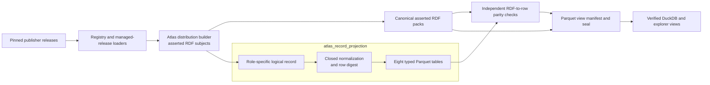
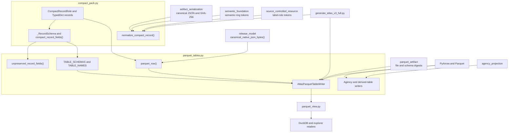
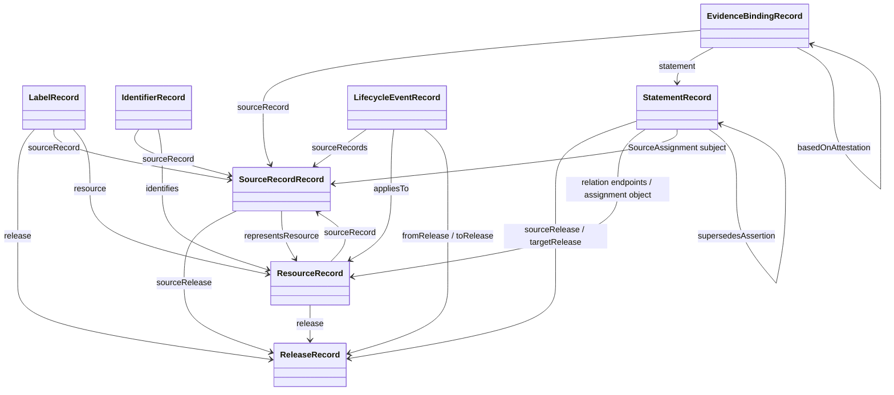
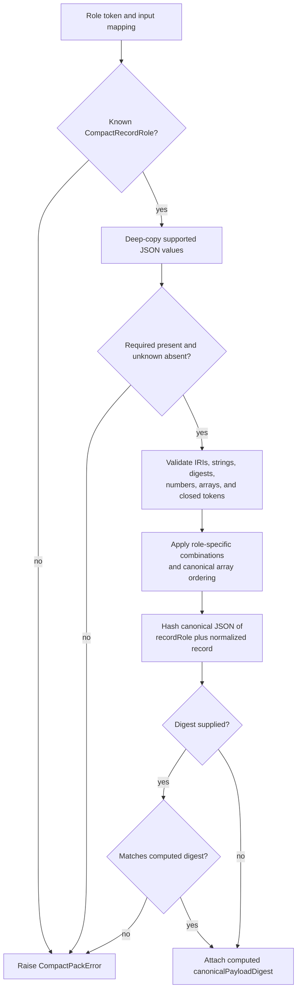
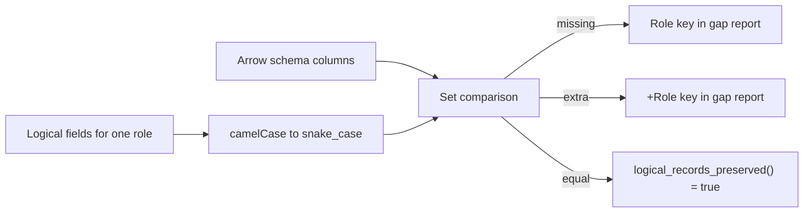
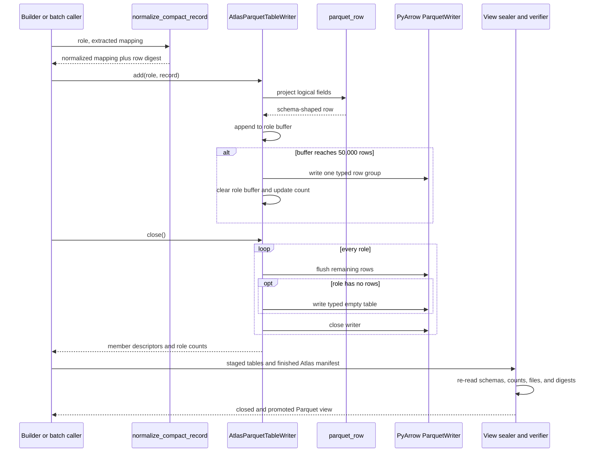
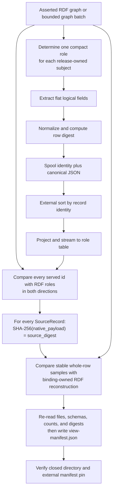

# Atlas record projection

<!-- markdownlint-disable MD013 -->

`atlas_record_projection` turns Atlas's eight closed logical record roles into
typed Apache Parquet tables without changing their meaning. It defines the
flat record shapes, normalizes each record, computes its canonical row digest,
maps every preserved field to a typed column, and writes bounded row groups for
the served Atlas view.

The asserted Resource Description Framework (RDF) distribution remains the
canonical Atlas. These tables are a queryable, sealed view of the same logical
records; they are not another source of truth and do not grant permission to
infer or expand relationships.

## At a glance

| Question | Answer |
| --- | --- |
| What goes in? | A record role plus a mapping extracted from one asserted RDF subject. The caller must normalize the mapping through `normalize_compact_record()` before giving it to `AtlasParquetTableWriter`. |
| What happens? | The normalizer checks the closed field set and role-specific rules, canonicalizes arrays, and computes `canonicalPayloadDigest`. The table projector renames fields, encodes digests as 32-byte values, preserves source-native JSON as exact bytes, and buffers rows by role. |
| What comes out? | Eight typed files under `tables/`, including a typed zero-row file for any empty role. `close()` also returns row counts and member descriptors with byte length, media type, schema digest, and file digest. |
| How do we check it? | Mechanical field-to-column coverage detects schema loss. PyArrow enforces the declared schemas. The builder compares every served identifier, every source payload digest, and stable whole-row samples with independently reconstructed RDF rows. The Parquet view verifier then checks the closed, digest-pinned artifact. |

## Purpose and boundaries

This module owns two related definitions:

- [`compact_pack.py`](../src/refspec/atlas/compact_pack.py) defines the eight
  logical record roles, their required and optional fields, and their common
  normalization rules.
- [`parquet_tables.py`](../src/refspec/atlas/parquet_tables.py) defines the
  Arrow schemas, field-to-column projection, table names, writer settings, and
  specialized optional view tables.

The module is responsible for:

- refusing unknown roles, unknown fields, missing fields, malformed digests,
  unsafe JSON values, and invalid role-specific combinations;
- computing one canonical digest for each normalized logical record;
- preserving every non-transport logical field in a Parquet column;
- converting names from `camelCase` to `snake_case` without changing values;
- writing all eight base tables with fixed schemas and writer settings;
- bounding base-table memory by one row group per role; and
- producing exact table counts and file descriptors for later sealing.

The module does not:

- acquire or parse publisher files;
- select source releases or construct Atlas RDF;
- establish cross-record reachability, RDF semantics, timestamp syntax, or
  evidence-policy validity;
- sort or deduplicate records before writing;
- authenticate the input Atlas, write `view-manifest.json`, promote a staged
  view, or sign a release; or
- implement queries, search ranking, or user-interface behavior.

Follow those concerns in the owning documentation:

| Concern | Owner and documentation |
| --- | --- |
| Publisher capture and native parsing | [Publisher source portfolio and adapters](publisher_source_portfolio_and_adapters.md) |
| Exact-byte acquisition and release evidence | [Source release trust and fidelity assurance](source_release_trust_and_fidelity_assurance.md) |
| Source normalization for Atlas construction | [Atlas registry loading](atlas_registry_loading.md) |
| RDF construction, external sorting, and producer parity checks | [Atlas distribution builder](atlas_distribution_builder.md) |
| Non-authoritative derived relationships | [Atlas derived graph](atlas_derived_graph.md) |
| View sealing, verification, and query examples | [Atlas 3.1 Parquet view](../docs/atlas-parquet-view.md) |
| Normative distribution rules and independent validation | [Atlas 3.1 binding](../bindings/atlas/3.1/README.md) |

The binding, current code, and [decision ledger](../docs/decisions.md) remain
the implementation authority. The
[U.S./EU comparison](../ATLAS_US_EU_COMPARISON.md) supplies strategic context,
not table behavior.

## Place in RefSpec

Record projection sits between Atlas construction and authenticated query
access. The builder emits asserted RDF and logical records during the same
graph walk. This module writes the logical records to staged tables. A separate
view module verifies the staged directory against the finished distribution,
writes the view manifest, verifies the closed result, and promotes it.



The view lives beside the RDF distribution rather than inside it because the
distribution checks its own directory as a closed file set. A release seal
binds the distribution manifest and view-manifest digest together.

## Architecture and dependencies

### Dependency map



`parquet_tables.py` deliberately avoids importing
`refspec.atlas.derived_graph` at runtime. Importing that package registers
producer derivation rules, and view-writing or verification must not depend on
that side effect. Derived rows therefore cross this boundary by attributes.

### Core component responsibilities

| Component | Responsibility |
| --- | --- |
| `CompactRecordRole` | Enumerates the only eight asserted logical roles admitted to the base tables. |
| `ResourceRecord` through `LifecycleEventRecord` | Describe the developer-facing field shapes as `TypedDict` types. Runtime validation comes from `_RECORD_SCHEMAS` and normalization, not from type hints alone. |
| `_RecordSchema` and `_RECORD_SCHEMAS` | Hold each role's closed required and optional field sets. Common digest fields are added mechanically. |
| `normalize_compact_record()` | Copies and validates input, applies role rules, computes or verifies `canonicalPayloadDigest`, and returns a detached normalized mapping. |
| `compact_record_fields()` | Returns the logical fields that Parquet must preserve, excluding only the recomputable transport digest. |
| `TABLE_SCHEMAS` and `TABLE_NAMES` | Define the exact Arrow types, nullability, and file name for every base role. |
| `parquet_row()` | Projects one normalized logical record to the exact Python values expected by its Arrow schema. |
| `AtlasParquetTableWriter` | Buffers interleaved rows by role, flushes full row groups, writes typed empty tables, closes files, and reports members and counts. |
| `unpreserved_record_fields()` | Compares the logical field register with Arrow columns in both directions. Missing columns and unexplained extra columns become visible failures. |

## Logical record model

The eight roles flatten one asserted Atlas RDF subject apiece. They preserve
the source record, release, evidence, and relationship identifiers needed to
reconnect those rows without reproducing the RDF serialization.



The arrows show reference fields, not database-enforced foreign keys. The
projection validates each row's local shape; the builder and binding validate
cross-record closure and RDF meaning.

### Role register

Every role accepts optional `contentDigest` and an optional supplied
`canonicalPayloadDigest`. Normalization always replaces or adds
`canonicalPayloadDigest` with the computed value. The table view carries
`contentDigest`; it omits `canonicalPayloadDigest` because that digest is
recomputed from the logical row rather than treated as independent content.

| Role and table | Required logical fields | Role-specific optional fields | Main purpose |
| --- | --- | --- | --- |
| `Resource` → `resources.parquet` | `id`, `release`, `scheme`, `semanticRing`, `resourceProfile`, `sourceRecord` | `definition`, `notes`, `notations`, `recordStatus` | One governed concept, code, identifier scheme, structure, or collection member. |
| `Label` → `labels.parquet` | `id`, `resource`, `labelRole`, `value`, `language`, `release`, `sourceRecord` | None | One source-traceable preferred, alternate, hidden, or otherwise admitted label. |
| `Statement` → `statements.parquet` | `id`, `statementType`, `subject`, `predicate`, `object`, `sourceRelease`, `targetRelease`, `policy`, `assertedAt`, `assertionIdentityDigest` | `semanticRing`, `sourceRing`, `targetRing`, `supersedesAssertion` | One asserted native relation, mapping, source assignment, or cross-ring relation. |
| `EvidenceBinding` → `evidence-bindings.parquet` | `id`, `statement`, `sourceRecord`, `evidenceSourceDigest`, `attestor`, `attestorKind`, `assertionOrigin`, `epistemicBasis`, `evidenceRole`, `evidentiaryFunction`, `decision`, `attestedAt` | `basedOnAttestation` | The evidence and review facts that support or qualify a statement. |
| `SourceRecord` → `source-records.parquet` | `id`, `sourceRelease`, `sourceDigest`, `sourceLocator`, `nativePayload` | `representsResource` | The exact publisher-shaped observation behind Atlas rows. |
| `Release` → `releases.parquet` | `id`, `releaseType`, `identifier`, `issued` | Conditional; see below | One source release or normalized Atlas release. |
| `Identifier` → `identifiers.parquet` | `id`, `identifierValue`, `identifierScheme`, `identifies`, `sourceRecord` | None | One identifier assignment with its issuing scheme and source record. |
| `LifecycleEvent` → `lifecycle-events.parquet` | `id`, `appliesTo`, `lifecycleEventKind`, `effectiveDate`, `sourceRecords` | `fromRelease`, `toRelease` | One dated change supported by one or more source records. |

`Release` has two exclusive forms:

- `SourceRelease` requires `sourceDigest` and `sourceLocator` and forbids
  `resourceProfile`, `semanticRing`, `scheme`, and `membershipMode`.
- `AtlasRelease` requires `resourceProfile`, `semanticRing`, `scheme`, and
  `membershipMode` and forbids `sourceDigest` and `sourceLocator`.

### Normalization process



Normalization applies these rules:

- Object keys must be non-empty strings. Values may contain strings,
  booleans, interoperable JSON integers, arrays, and mappings.
- Floating-point values are forbidden. Integers must stay within
  `±9,007,199,254,740,991` so JavaScript and other JSON consumers can preserve
  them exactly.
- `null` is forbidden outside `nativePayload`; callers omit absent optional
  fields. Publisher `null` values inside `nativePayload` remain part of the
  source observation.
- IRI fields must contain an absolute Internationalized Resource Identifier
  with a scheme and no whitespace. This is a lexical check, not full RDF IRI
  validation.
- Digests use the lowercase `sha256:` prefix followed by 64 lowercase
  hexadecimal characters.
- Resource `notes` and `notations` become sorted, duplicate-free arrays.
  Lifecycle `sourceRecords` become sorted, duplicate-free IRI arrays and must
  contain at least one value.
- Label roles and semantic rings come from the shared registry definitions.
  Label language tags use a lowercase BCP 47-shaped token, and label text must
  already be trimmed.
- Resource profiles are limited to `conceptScheme`, `codeScheme`,
  `identifierScheme`, `structureScheme`, and `resourceCollection`.
- Statement types are limited to `NativeRelationAssertion`,
  `MappingAssertion`, `SourceAssignment`, and
  `CrossRingRelationAssertion`.
- A cross-ring statement requires different `sourceRing` and `targetRing`
  values and forbids `semanticRing`. Every other statement requires
  `semanticRing` and forbids the two cross-ring fields.

Several fields receive only a non-empty-string check here, including date-time
text and the evidence-warrant axes. The binding validator applies the deeper
semantic and policy rules. Keeping those axes in the flat record still matters:
a verifier cannot detect an invalid evidence branch if the served view drops
the fields that distinguish the branches.

### Canonical record digest

`normalize_compact_record()` computes the row digest from this logical shape:

```json
{
  "recordRole": "Resource",
  "record": {
    "id": "urn:example:resource:1",
    "release": "urn:example:release:1",
    "resourceProfile": "conceptScheme",
    "scheme": "urn:example:scheme:1",
    "semanticRing": "subject",
    "sourceRecord": "urn:example:source-record:1"
  }
}
```

The actual record includes all required and supplied optional fields except
`canonicalPayloadDigest` itself. `canonical_json_bytes()` supplies deterministic
key ordering and encoding; `sha256_digest()` adds the standard algorithm
prefix. Supplying an old digest after changing any normalized field therefore
fails instead of silently retargeting the record.

## Parquet table definition

### Field projection

Most fields map mechanically from `camelCase` to `snake_case`; for example,
`sourceRecord` becomes `source_record`. Four value conversions carry semantic
weight:

| Logical value | Parquet representation | Reason |
| --- | --- | --- |
| `contentDigest`, `assertionIdentityDigest`, `evidenceSourceDigest`, `sourceDigest` | Fixed 32-byte binary | Enforces SHA-256 width and avoids storing repeated textual prefixes. |
| `nativePayload` | `large_binary` containing `canonical_native_json_bytes()` | Preserves the exact lexical bytes also stored in `atlas:nativePayload`; parity is a byte comparison. |
| Omitted optional scalar | Nullable column with `null` | Keeps the logical distinction between absence and an invalid explicit logical-record `null`. |
| `notes`, `notations`, `sourceRecords` | Arrow list of strings | Preserves the normalized array in one typed row. |

`parquet_row()` expects a normalized record. It does not call
`normalize_compact_record()`, sort arrays, check unknown keys, or validate
cross-record references. The production builder performs normalization before
calling the writer.

### Losslessness check

`compact_record_fields(role)` derives the field register from
`_RECORD_SCHEMAS`. `unpreserved_record_fields()` converts those field names to
column names and compares them with `TABLE_SCHEMAS`:



This check makes field additions fail visibly when a contributor forgets the
corresponding column. It also detects unexplained columns. The view manifest
computes `logicalRecordsPreserved` from this result and lists any gaps; it does
not hard-code the status.

### Writer lifecycle and interaction



`AtlasParquetTableWriter` opens one `ParquetWriter` per role. Records may arrive
in any role order, but their order within each table is the order passed to the
writer. The full builder externally sorts logical records by identity before
this step; the writer itself provides no sorting or duplicate check.

Always call `close()` to finalize a successful write. The context manager's
`__exit__()` closes file handles after an error or an abandoned operation, but
it does not flush buffered rows or create empty tables. `add()` after close and
a second `close()` both raise `AtlasParquetTableError`.

The base writer uses these fixed settings:

| Setting | Value |
| --- | --- |
| Table directory | `tables/` |
| Row-group size | 50,000 rows |
| Compression | Zstandard (`zstd`) |
| Compression level | 9 |
| Parquet version | 2.6 |
| Data-page version | 2.0 |
| Dictionary encoding | Enabled |
| Column statistics | Enabled |
| Media type | `application/vnd.apache.parquet` |

Dictionary encoding keeps repeated low-cardinality values, such as semantic
rings and evidence-warrant tokens, compact without removing their columns.

### Outputs from `close()`

`close()` returns `(members, counts)`:

- `counts` maps each role name to its written row count.
- Each member contains `path`, `role`, `rowCount`, `byteLength`, `mediaType`,
  `schemaDigest`, and `sha256`.
- `schemaDigest` hashes Arrow's serialized logical schema as read back from
  the Parquet file.
- `sha256` hashes the complete file bytes.

The current production builder writes staged tables directly and the view
sealer re-reads them before constructing the manifest. The batch helper
`write_parquet_tables()` remains useful for bounded callers and tests, but it
is not a second authenticated release path.

## End-to-end data flow and checks



The parity check intentionally uses
`bindings/atlas/3.1/tools/validate.py:parquet_row_from_rdf` as its expected
side. Reusing `parquet_row()` on both sides would let one projection defect
agree with itself. The production checks divide work by cost:

1. Compare every base-table identifier with the RDF-derived role inventory in
   both directions.
2. Hash every `SourceRecord.native_payload` byte value and compare it with the
   row's `source_digest`.
3. Reconstruct up to five stable whole-row samples per role from RDF and
   compare every column.
4. Re-read each staged Parquet file to check schema, row count, byte length,
   schema digest, file digest, and closed directory membership.

The authenticated Parquet preflight adds fast columnar checks for logical
identity, release and source-record closure, labels, identifiers, statement
endpoints, ring context, and evidence coverage. It remains a development gate;
the independent Atlas binding validator supplies the release verdict.

## Optional tables in the same implementation

`parquet_tables.py` also writes two specialized view categories. They remain
outside `CompactRecordRole`, so they cannot silently enter the asserted
`statements.parquet` table or affect the base record-field coverage result.

### Agency projection

`write_agency_projection_tables()` writes:

- `agency-projection.parquet` for reviewed, resolved organization rows; and
- `agency-projection-unresolved.parquet` for explicit abstentions and their
  closest non-adopted candidates.

The resolved table keeps nested evidence records, both source observations,
the review warrant, decision, relation, and reasoning. The unresolved table
keeps the source organization, reason, candidate resources, and optional
closest candidate. The writer materializes both row lists, writes both files,
and compares each read-back row list with its input. View sealing requires the
two tables together. [REF-038](../docs/decisions.md#ref-038-the-regulationsgov-agency-roster-lands-and-reviewed-identity-claims-govern-the-agency-projection)
defines their meaning and ownership.

### Derived relations

`write_derived_relation_table()` writes optional
`derived-relations.parquet`. It checks that:

- the row identifier equals the derived-relation prefix plus its content
  digest;
- the semantic-ring IRI names a known Atlas ring;
- the cited asserted evidence is non-empty, sorted, and duplicate-free; and
- required rule, engine, endpoint, and generation values are non-empty.

Coverage metadata counts rows by rule and predicate and requires one
`generatedAt` value across the table. A logical-content digest covers the
sorted rows and coverage block. Consumers must opt into this table; the base
statements table continues to expose asserted content only. See
[Atlas derived graph](atlas_derived_graph.md) for rule admission, evidence,
replay, and authority boundaries.
Both specialized writers hold their complete row lists in memory and perform a
full read-back comparison. They suit smaller side tables; they do not share the
base writer's row-group-bounded memory behavior.

## Error handling

The module fails early with two main exception types:

| Exception | Examples |
| --- | --- |
| `CompactPackError` | Unknown role or field, missing required field, invalid IRI or digest, forbidden `null` or float, duplicate array item, invalid ring combination, or mismatched canonical row digest. |
| `AtlasParquetTableError` | Invalid binary digest input, unsupported role, closed writer use, malformed derived row, inconsistent derived coverage, or failed Parquet read-back. |

The optional table writers also raise `FileExistsError` rather than replace an
existing target. The base writer is designed for a fresh staging directory;
the higher-level view sealer refuses unsafe or existing final outputs and
promotes only a verified staged directory.

## Performance and scaling

For `N` base records, table projection and writing are linear in the number of
records and bytes written. Normalization is linear in each record's JSON size,
except for sorting `notes`, `notations`, and `sourceRecords`, which costs
`O(k log k)` for an array of `k` strings.

The writer may hold up to one 50,000-row buffer for each of eight roles. Its
memory bound is therefore the combined byte size of those eight partial row
groups, not the total release size. A large `nativePayload` can still make the
`SourceRecord` buffer expensive, so changes should measure bytes as well as row
counts.

External sorting belongs to the distribution builder and costs approximately
`O(N log N)` comparisons with bounded disk runs. Do not add a second in-memory
sort to this module. The optional agency and derived writers are `O(N)` in
memory because they first build complete Python row lists.

## Contribution guide

### Change an existing logical field

Treat a field change as an end-to-end format change:

1. Confirm the field belongs to RefSpec rather than an existing RuleSpec
   (`rkaf`) term, and record any identity- or version-bearing decision.
2. Update the role's `TypedDict` and `_RECORD_SCHEMAS` entry.
3. Add the normalization rule and both positive and negative fixtures.
4. Add or change the matching Arrow field in `TABLE_SCHEMAS`.
5. Update `parquet_row()` so the logical value reaches that column without
   loss.
6. Update the binding-local independent schema and RDF-to-row reconstruction.
   Do not import the producer implementation into the verifier.
7. Run the field-coverage check and row parity tests. A missing projection must
   appear in `unpreserved_record_fields()` until the column exists.
8. Update the binding or view version only when the public behavior genuinely
   changed, and regenerate sealed fixtures that carry the old shape.

When replacing a working check, retain the old implementation as a test-only
oracle and prove verdict agreement over real data and a mutation battery before
removing the production path.

### Add a base record role

A ninth base role affects more than the enumeration. Update:

- `CompactRecordRole`, its `TypedDict`, `_RECORD_SCHEMAS`, and role
  normalization;
- `TABLE_SCHEMAS`, `TABLE_NAMES`, and `parquet_row()`;
- RDF role detection and logical-record extraction in the builder;
- the independent binding inventory, schema, and RDF comparand;
- Parquet view manifests, search-view retention rules, DuckDB table names, and
  explorer access; and
- positive, negative, empty-table, reachability, mutation, and sealed-corpus
  fixtures.

Because writers iterate `CompactRecordRole`, an incomplete role addition may
create a table before consumers know how to verify or query it. Keep the whole
change atomic.

### Add an optional table

Use an optional table for derived or consumer-specific data that is not one of
the eight asserted logical roles. Give it a separate role name, schema,
manifest metadata block, writer, verifier, and consumer opt-in. Preserve the
authority boundary: derived rows stay outside `statements.parquet`, and
unresolved identity rows stay visible rather than becoming guessed mappings.

### Focused verification

Run the smallest relevant tests first:

```sh
uv run pytest tests/test_atlas_logical_records.py -q
uv run pytest tests/test_atlas_parquet_view.py -q
uv run pytest tests/test_generate_atlas_v3_full.py -k parquet -q
```

Include the specialized suite when those tables change:

```sh
uv run pytest tests/test_agency_projection.py -q
uv run pytest tests/test_atlas_v3_binding.py \
  tests/test_atlas_v3_validator_regressions.py -q
```

Before merging a public-format change, run `make test-atlas-v3` and the full
`make test` suite. A successful local table write proves neither conformance
nor publication; a release still needs independent validation, sealing, and
the separately authorized publication workflow.

## Implementation references

- [`src/refspec/atlas/compact_pack.py`](../src/refspec/atlas/compact_pack.py) —
  closed logical roles and normalization
- [`src/refspec/atlas/parquet_tables.py`](../src/refspec/atlas/parquet_tables.py)
  — Arrow schemas, projections, base writer, and optional table writers
- [`src/refspec/atlas/parquet_view.py`](../src/refspec/atlas/parquet_view.py) —
  view manifest, closed-directory verification, and promotion
- [`src/refspec/atlas/parquet_artifact.py`](../src/refspec/atlas/parquet_artifact.py)
  — schema and file digest helpers
- [`src/refspec/release_model.py`](../src/refspec/release_model.py) — canonical
  source-native JSON bytes
- [`tools/generate_atlas_v3_full.py`](../tools/generate_atlas_v3_full.py) — RDF
  extraction, external sorting, table staging, and producer parity checks
- [`bindings/atlas/3.1/tools/validate.py`](../bindings/atlas/3.1/tools/validate.py)
  — independent logical-record normalization and RDF-to-Parquet comparand
- [`tests/test_atlas_logical_records.py`](../tests/test_atlas_logical_records.py)
  and [`tests/test_atlas_parquet_view.py`](../tests/test_atlas_parquet_view.py)
  — focused normalization, schema, projection, writer, and artifact tests
