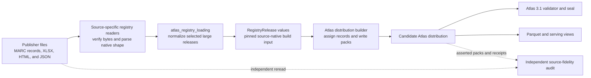
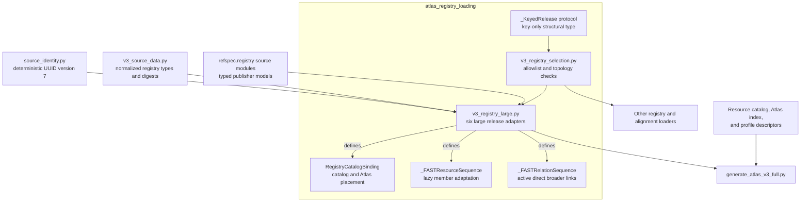
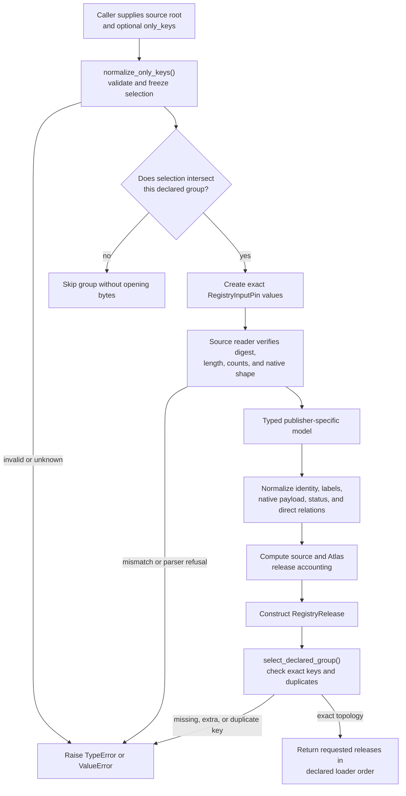
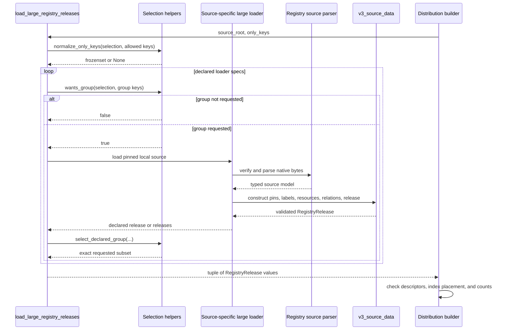
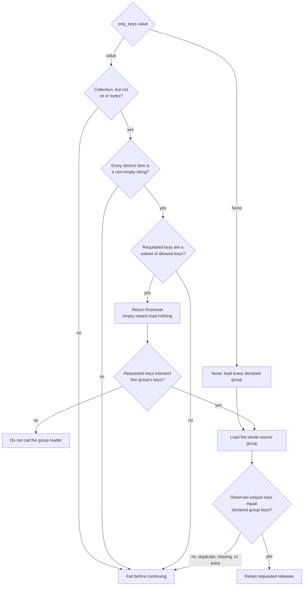
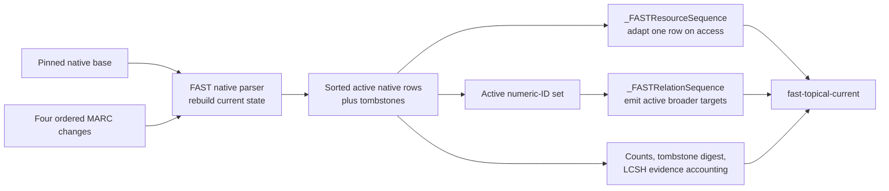

# Atlas registry loading

The `atlas_registry_loading` logical module turns six large, verified publisher
captures into the shared `RegistryRelease` input used by Atlas 3 construction.
It also supplies fail-closed release-key selection helpers used by the wider
registry loader family. The module preserves source identity, labels, direct
relationships, lifecycle evidence, exact input pins, and declared scope; it
does not parse arbitrary publisher formats, create cross-source mappings, write
distribution files, or validate a finished Atlas.

The implementation spans two files:

- [`v3_registry_large.py`](../src/refspec/atlas/v3_registry_large.py) contains
  catalog placement, source-specific normalization, deterministic local
  identities, release accounting, and the aggregate loader for the large
  captures.
- [`v3_registry_selection.py`](../src/refspec/atlas/v3_registry_selection.py)
  validates an optional release allowlist, skips unrelated source groups, and
  checks each loaded group's declared release topology.

## At a glance

| Question | Answer |
| --- | --- |
| What goes in? | Local publisher files whose URLs, SHA-256 digests, byte lengths, editions, and expected counts are fixed by reviewed source declarations. The Faceted Application of Subject Terminology (FAST) release uses one base file plus four ordered change files. |
| What happens? | A source-owned parser verifies and reads its native format. `v3_registry_large.py` then converts the typed source rows into `RegistryInputPin`, `RegistryResource`, `RegistryLabel`, `RegistryRelation`, and `RegistryRelease` values. |
| What comes out? | A deterministic tuple of selected `RegistryRelease` objects. Each release names its Atlas placement, exact source inputs, members, direct source relationships, source and Atlas release identities, and accounting metadata. |
| How do we check it? | Unit tests cover source-faithful normalization, identity rules, active relationships, exclusions, catalog/index/profile agreement, tampered bytes, selective loading, and unknown keys. The distribution builder later checks registry descriptors and counts; Atlas 3.1 validation and the source-fidelity audit remain separate. |

## Purpose and boundaries

This module is the normalization boundary between source-specific readers and
the Atlas distribution builder. Publisher readers keep their native models and
source-shape checks. The large registry adapter translates those already
checked models into one stable build input without assigning final RDF record
classes or assertion identities.

The module has four responsibilities:

1. Bind each supported source to its catalog `resourceId`, source module,
   Atlas profile, and semantic ring.
2. Pin and load the exact local bytes for the selected release keys.
3. Preserve source facts in normalized resources and direct relationships.
4. Refuse unknown selections, changed source bytes, count drift, invalid
   identities, broken links, and release-topology drift.

The following work belongs elsewhere:

| Concern | Owner |
| --- | --- |
| Publisher acquisition, native parsing, and source-shape validation | Source modules documented in [Registry vocabulary sources](registry_vocabulary_sources.md), [Registry code and classification sources](registry_code_and_classification_sources.md), and [Registry organization sources](registry_organization_sources.md) |
| Exact-byte acquisition and reusable source packages | [Registry foundation](registry_foundation.md) |
| Managed vocabulary membership and release validation | [Managed release validation](managed_release_validation.md) |
| Registry placement planning | [Atlas planning index](atlas_planning_index.md) |
| Mapping claims between releases | Atlas registry alignment modules and the [Atlas derived graph](atlas_derived_graph.md), depending on whether the relationship is asserted or derived |
| Resource Description Framework (RDF) construction, build receipts, packs, and manifests | [Atlas distribution builder](atlas_distribution_builder.md) |
| Parquet and serving formats | [Atlas record projection](atlas_record_projection.md) and [Atlas serving views](atlas_serving_views.md) |
| Independent source-to-Atlas comparison | [Atlas source fidelity audit](atlas_source_fidelity_audit.md) |
| Normative distribution validation and sealing | [Atlas 3.1 binding](../bindings/atlas/3.1/README.md) |

A successful loader call establishes that the adapter accepted its exact local
inputs and produced a structurally valid normalized release. It does not prove
that a publisher capture is complete, that every source claim reached the
Atlas, that a candidate distribution passed the binding, or that any release
was published.

## Place in RefSpec

Registry loading is part of RefSpec's build path. It follows source parsing and
precedes final Atlas construction.



The builder calls `load_large_registry_releases()` alongside the vocabulary,
code, non-emitter, roster, and alignment-endpoint loaders. It validates every
loaded release against the generated registry descriptors and Atlas planning
index, converts each `RegistryRelease` to its generic internal `LoadedRelease`,
and checks observed resource and relationship counts. Final record emission is
therefore downstream of this module.

The source-fidelity audit follows a separate path on purpose. It rereads
publisher bytes independently and compares their claims with a built
distribution. Reusing this adapter as the auditor would let one parser defect
appear on both sides of the comparison.

## Architecture and dependencies

### Component map



`v3_registry_selection.py` has no RefSpec-specific data dependency. Its private
`_KeyedRelease` protocol requires only a string-like `key` property, so the
same helpers can check source releases, endpoint releases, and mapping releases
without a common base class. The helpers are used by the large, vocabulary,
code, non-emitter, roster, and several alignment loaders.

`v3_registry_large.py` depends on four types of component:

| Dependency | Why it is needed |
| --- | --- |
| Source modules under `refspec.registry` | Verify native bytes and expose publisher-specific parsed rows. This adapter does not duplicate those parsers. |
| [`v3_source_data.py`](../src/refspec/atlas/v3_source_data.py) | Defines the normalized `RegistryInputPin`, `RegistryLabel`, `RegistryResource`, `RegistryRelation`, and `RegistryRelease` boundary plus canonical JSON digests. |
| [`source_identity.py`](../src/refspec/registry/infrastructure/source_identity.py) | Derives deterministic UUID version 7 identifiers for sources that lack a suitable member IRI. |
| Generated catalog and planning artifacts | The downstream builder checks the adapter's `resourceId`, source module, profile, ring, and scheme namespace against current policy. |

### Runtime files and inputs

The source formats include Machine-Readable Cataloging (MARC), Microsoft Excel
Open XML workbooks (XLSX), Hypertext Markup Language (HTML), and JavaScript
Object Notation (JSON). The source families include North American Industry
Classification System (NAICS), Product and Service Code (PSC), and Office of
Personnel Management (OPM) Enterprise Human Resources Integration (EHRI)
data.

The default source directory is
`output/registry-real-data-sources/` under the repository root. The loaders are
local and deterministic; they do not fetch changed publisher bytes during an
Atlas build.

```text
output/registry-real-data-sources/
├── <FAST native base filename>
├── <four FAST change filenames>
├── 2-6-digit_2022_Codes.xlsx
├── PSC-April-2025-wayback.xlsx
├── courtlistener-jurisdictions-zyte.html
├── federal-register-topics-zyte.json
└── EHRI-Data-Standards-20260804.xlsx
```

FAST accepts the directory because its parser must open five declared files.
The other public loaders accept one file path. Callers may override these paths
for tests or for another local store, but the supplied bytes must match the
corresponding pins and expected source shape.

## Normalized release model

The module emits source-native build data, not final Atlas records. The builder
later decides how each value appears on the Atlas wire.

| Type | Meaning in this module |
| --- | --- |
| `RegistryInputPin` | One consumed file with its physical path, stable logical path, SHA-256 digest, exact byte length, publisher Internationalized Resource Identifier (IRI), and source role. |
| `RegistryLabel` | A trimmed preferred or alternate label with a language and exact source path. |
| `RegistryResource` | One release member with an absolute IRI, labels, retained native payload, source locator, source digest, and optional definition, notation, and status. |
| `RegistryRelation` | One direct same-release publisher relationship. Its `source_payload` retains the native record and property that justified the edge. |
| `RegistryRelease` | The selected publisher release or bounded capture, including placement, scope, dates, source and Atlas release identities, input pins, resources, relationships, and accounting metadata. |

`RegistryRelease.__post_init__()` checks the basic shared invariants: supported
profile, semantic ring, release scope, canonical issue date, at least one input,
at least one member, and nonnegative dropped-label accounting. Individual
resource and label constructors enforce their own identity, label, source, and
deduplication rules. Source-specific loaders add the checks that only their
publisher formats can establish.

### Identity and digest roles

The code uses several distinct identities. They are not interchangeable.

| Value | Basis | Purpose |
| --- | --- | --- |
| Input `sha256` | Exact bytes of one publisher file | Detects any local source change before or during parsing. |
| `source_release_digest` | One exact input digest, or a canonical digest over all ordered source pins for FAST | Identifies the publisher-side release basis independently of Atlas normalization. |
| Resource `source_digest` | Exact source-file digest, source-record digest, or FAST composite source digest, as declared by the source family | Connects a normalized member to the source evidence named by its locator and metadata. |
| `atlas_release_iri` | Canonical digest of the parser version name, exact input declarations, and release accounting | Names the adapter-declared release for that exact basis. The builder adds code and recipe provenance separately. |
| `scheme_iri` | `urn:ref:atlas-resource-scheme:<resourceId>` | Places members in the registry resource's Atlas scheme namespace. |
| Local resource IRI | Source IRI, source key, recorded time, namespace token, and deterministic UUIDv7 derivation | Gives a stable local identity when the publisher supplies a code or row identity but no reusable member IRI. |

`_local_resource_iri()` uses the publisher source IRI and source key as the
seed, and it uses the recorded time for the UUIDv7 timestamp. The same declared
capture therefore produces the same readable namespace and UUID. A code alone
does not become a global identity: NAICS and PSC use separate namespace tokens,
and OPM uses the pair `(field name, code)`.

`_pin()` prefers a repository-relative logical path beginning with `refspec/`.
If the physical file sits outside the repository, it records the supplied path
instead. The logical path is provenance; the SHA-256 digest and byte length
still establish byte identity.

## Loading and normalization flow

### End-to-end data flow



Verification happens before normalization wherever the adapter controls the
file boundary. NAICS, PSC, CourtListener, Federal Register topics, and OPM call
`RegistryInputPin.verify()` before or as part of their source reader. The FAST
native parser rechecks every declared base and change file against its own
source pins before rebuilding current state.

### Component interaction



The aggregate loader preserves the order in `_large_registry_loader_specs()`;
it does not sort the caller's set. A bounded build therefore gets stable output
ordering even when `only_keys` is an unordered collection.

## Fail-closed release selection

`v3_registry_selection.py` separates three questions that loaders often mix:

1. Is the caller's selection well formed and known?
2. Should this source group be parsed at all?
3. Did the source group produce exactly the releases its code declares?



### Selection semantics

| `only_keys` value | Result |
| --- | --- |
| `None` | Load every declared release group. |
| Empty collection | Return no releases and open no group source files. |
| Known subset | Parse only intersecting groups, verify each group's complete declared topology, and return only requested releases. |
| A plain `str` or `bytes` value | Raise `TypeError`; a release key must not be mistaken for a collection of characters or bytes. |
| A collection containing an empty or non-string value | Raise `TypeError`. |
| Any unknown key | Raise `ValueError` before source parsing. |

`select_declared_group()` loads and checks the complete output of an
intersecting group before filtering it. This matters when one source parse
produces several related releases: asking for one child release must not hide a
missing sibling, duplicate key, or unexpected new release. Each current large
loader group has one key, but the shared helper also protects multi-release
vocabulary and code groups.

## Catalog placement

`RegistryCatalogBinding` joins a source reader to the catalog and Atlas index.
Its `scheme_iri` property derives the root scheme namespace from `resource_id`.
The downstream descriptor check refuses unknown resources, wrong profiles,
wrong rings, scheme IRIs outside that namespace, or a source module/ring pair
absent from the Atlas index.

| Resource ID | Source module | Catalog resource kind | Atlas profile | Ring |
| --- | --- | --- | --- | --- |
| `courtlistener-jurisdictions` | `refspec.registry.courtlistener_codes` | `identifierAuthority` | `identifierScheme` | `entity` |
| `fast-topical` | `refspec.registry.fast_topical` | `mappingReference` | `conceptScheme` | `subject` |
| `federal-register-api-topics` | `refspec.registry.federal_register_topics_api` | `sourceAssignedVocabulary` | `conceptScheme` | `subject` |
| `naics` | `refspec.registry.naics_psc_codes` | `classification` | `codeScheme` | `value` |
| `opm-ehri-workforce-codes` | `refspec.registry.opm_workforce_codes` | `codeList` | `codeScheme` | `value` |
| `psc` | `refspec.registry.naics_psc_codes` | `classification` | `codeScheme` | `value` |

Catalog `resource_kind` and Atlas `profile` answer different questions. FAST,
for example, remains cataloged for `mappingReference` use even though its
normalized member shape is a subject-ring `conceptScheme`. The profile does
not broaden the catalog's declared use or authorize accepted output.

## Supported releases

`LARGE_REGISTRY_RELEASE_KEYS` declares six construction units. The release
keys, input pins, and normalization rules are part of the build topology and
must change together.

| Release key | Source basis | Scope and issue date | Normalized result |
| --- | --- | --- | --- |
| `fast-topical-current` | Exact OCLC native base plus four chronological MARC change files through February 13, 2026 | `publisherRelease`; `2026-02-13` | Active FAST Topical members with publisher IRIs, preferred and distinct alternate labels, numeric and legacy notations, retained Library of Congress Subject Headings (LCSH) link evidence, and active-to-active direct Simple Knowledge Organization System (SKOS) `skos:broader` relations. |
| `naics-2022` | Official 2022 NAICS structure workbook | `publisherRelease`; `2022-01-01` | Source-local code members in the value ring. Facets and publisher labels remain in native payloads; no parent relationship is invented from a facet alone. |
| `psc-april-2025` | April 2025 Product and Service Code workbook | `publisherRelease`; `2025-04-01` | Active source-local PSC code members in the value ring, with the same no-invented-hierarchy rule as NAICS. |
| `courtlistener-jurisdictions-2026-08-03` | Exact captured CourtListener jurisdictions page | `completeCapture`; `2026-08-03` | Entity-ring platform court identifiers, names, citation abbreviations, dates, jurisdiction types, and active/inactive status. The release does not claim official court identity. |
| `federal-register-api-topics-2026-08-03` | Exact Federal Register topics API capture | `completeCapture`; `2026-08-03` | Only the publisher's `thesaurus` collection. It keeps direct `see` and `see_also` links, records the excluded `ad_hoc` count, and does not merge the separately managed 2025 thesaurus. |
| `opm-ehri-data-standards-2026-08-04` | Exact OPM EHRI data standards workbook | `completeCapture`; `2026-08-04` | Current `(field name, code)` values, definitions, and attached matching past lifecycle rows. Past-only values and bulk Plum Book rows are not members; `AGENCY/SUBELEMENT` is split to a separate entity-ring release. |

### FAST: large lazy sequences

FAST is the only supported release whose normalized resources and relations
remain lazy. The source parser already holds the current native rows; copying
all 441,127 rows into a second materialized tuple would add substantial memory
without adding information.



`_FASTResourceSequence` adapts a native row only when a caller iterates or
indexes it. It preserves the publisher IRI, heading, unique nonblank alternate
labels, numeric ID, legacy `fst` ID, source filename, broader IDs, and exact
LCSH link statements. LCSH links stay in `native_payload`; this module does not
turn them into cross-source mapping assertions.

`_FASTRelationSequence` builds a set of active numeric IDs, counts valid and
dropped broader targets, and emits only direct `skos:broader` relationships
whose subjects and objects remain active members. Tombstones remain release
metadata rather than Atlas members. No transitive hierarchy is created.

Both classes implement the small `Sequence` surface required downstream.
Random indexing into resources adapts one underlying row. Random indexing or
nontrivial slicing into relations walks the relation generator and should not
be used as a repeated query interface.

### NAICS and PSC: scoped code identities

The NAICS and PSC loaders share `_load_naics_psc_release()` and
`_naics_psc_release_from_parsed()`. The public wrapper first refuses the wrong
parser-pin family, so a PSC declaration cannot be passed to the NAICS loader or
the reverse. After exact input verification, the source parser must return its
declared number of codes.

Each member receives a deterministic local IRI scoped to the classification,
the publisher code as its notation, the publisher label as its preferred
label, and the parsed identifiers, facet, resource name, and use in the native
payload. The source exposes facets but no verified parent relation, so release
metadata explicitly records zero hierarchy relationships.

### CourtListener: platform identity, not official identity

The CourtListener loader verifies the captured HTML page, parses every row,
and requires exactly one `courtlistenerCourtId` per row. It derives each local
IRI from that platform identifier, adds a citation abbreviation as a second
notation when present, and maps `in_use` to active or inactive status.

The release records both active and inactive counts, parser gaps, and
`officialCourtIdentityClaimed: false`. A valid CourtListener identifier proves
identity within that platform; it does not establish that CourtListener is the
official identity authority for every court.

### Federal Register topics: publisher collection boundary

The Federal Register topics loader verifies the API capture and the expected
pair of collection counts. It emits the publisher's `thesaurus` collection and
excludes `ad_hoc`, whose rows are document fragments harvested from rule text.
This implements [REF-032](../docs/decisions.md#ref-032-observed-inventories-leave-the-atlas).

Member IRIs use collection, source ordinal, and source-record digest rather
than the publisher slug because slugs are not unique identities. Source paths
are percent-encoded when they first become IRIs, preserving an invertible link
to JSON-pointer-like locations containing brackets.

For each `see` or `see_also` link, the target must match exactly one row with
the same collection, name, and slug. An unresolved or cross-collection target
raises an error. The adapter maps `see` to `atlas:thesaurusUse` and `see_also`
to `skos:related`; it does not create inferred inverses or merge the API
capture with the managed Federal Register thesaurus.

### OPM EHRI: field-scoped codes and lifecycle evidence

The OPM loader verifies the complete workbook and its three expected counts:
field definitions, current values, and past values. It then splits the
`AGENCY/SUBELEMENT` element before value-ring emission. The corresponding
organization roster is loaded elsewhere; keeping the split explicit prevents
organization identities from appearing as workforce code values.

Current `(field name, code)` pairs must be unique, and every current value must
name a known field. The same code may occur in different fields because the
field is part of identity. Matching past rows are attached as native lifecycle
evidence. Past-only identities are counted but are not emitted as members.

## Performance characteristics

The aggregate loader does no speculative work for an unrequested group. This
is important because several inputs are large and expensive to parse.

| Path | Time | Additional memory | Notes |
| --- | --- | --- | --- |
| Selection validation | `O(K + A)` | `O(K + A)` | `K` requested keys and `A` allowed keys are converted to sets. Both sets are small. |
| Group gating | `O(G)` | `O(1)` per group | `G` is the number of declared loader specs. Nonintersecting groups open no source bytes. |
| FAST current-state parsing | Source-parser dependent; at least linear in base and change records | Source parser holds current rows | Exact behavior belongs to `fast_topical.py`. |
| `_FASTResourceSequence` iteration | `O(R + L)` | `O(1)` per yielded resource | `R` active rows and `L` labels or retained links adapted across them. The sequence avoids a second full resource collection. |
| `_FASTRelationSequence` construction | `O(R + E)` | `O(R)` | Builds the active-ID set and counts `E` declared broader links. |
| `_FASTRelationSequence` iteration | `O(R + E)` | `O(1)` per yielded relation | Emits only active-target direct relations. Repeated indexed access rescans. |
| Other release normalization | `O(R + E)` | `O(R + E)` | Resources and relationships are materialized in lists and frozen into tuples. |
| Release digest accounting | Linear in input-pin and metadata size | Linear in canonical JSON size | The digest helper canonicalizes mappings and sequences before hashing. |

The code favors deterministic full scans over hidden indexes. If a new source
is large enough that materialization becomes a problem, add a measured lazy
view with a narrow `Sequence` interface and tests for iteration, indexing,
length, and repeatability. Do not add a cache without profiling the real build
path first.

## Error handling and refusal conditions

The loaders raise errors instead of silently weakening a pin or dropping an
unexplained source fact.

| Failure | Where it is detected | Result |
| --- | --- | --- |
| `only_keys` is a string, bytes, contains invalid entries, or names an unknown key | `normalize_only_keys()` | `TypeError` or `ValueError` before source parsing. |
| A group emits duplicate, missing, or unexpected release keys | `select_declared_group()` | `ValueError` before the releases join the aggregate output. |
| File digest or length differs | `RegistryInputPin.verify()` or the source parser | Source loading stops before trusted normalization. |
| Parsed row count differs from the declared count | Source-specific public loader | `ValueError`; a changed or partial capture cannot masquerade as the pinned release. |
| NAICS loader receives a PSC pin, or PSC receives a NAICS pin | Public classification wrapper | `ValueError`. |
| CourtListener row lacks exactly one platform court ID | CourtListener normalizer | `ValueError`. |
| Federal Register topic pair is duplicated or a link lacks an exact same-collection target | Federal Register normalizer | `ValueError`. |
| OPM field names or current `(field, code)` pairs repeat, or a value names an unknown field | OPM normalizer | `ValueError`. |
| Release profile, ring, scope, date, inputs, members, label rules, or identity shape is invalid | `v3_source_data` constructors | `TypeError` or `ValueError`. |
| Binding, catalog, profile, source module, scheme namespace, or Atlas index placement disagrees | Distribution builder descriptor validation | Candidate construction stops before pack writing. |

Exceptions deliberately retain the loader name, release key, source family,
or expected and observed values needed to diagnose drift. Do not catch these
errors and continue with a partial release.

## Public API and internal components

### `v3_registry_large.py`

| API | Use |
| --- | --- |
| `RegistryCatalogBinding` | Immutable binding between a registry resource and its source module, catalog kind, Atlas profile, and semantic ring. |
| `LARGE_REGISTRY_BINDINGS` | Binding table for the six supported large releases. |
| `LARGE_REGISTRY_RELEASE_KEYS` | Exact release-key allowlist used by selective construction and topology checks. |
| `load_fast_topical_release()` | Load the five-file current FAST Topical release. |
| `load_naics_release()` | Load the pinned NAICS release from one workbook or a test parser pin. |
| `load_psc_release()` | Load the pinned PSC release from one workbook or a test parser pin. |
| `load_courtlistener_jurisdictions_release()` | Load one exact CourtListener jurisdictions-page capture. |
| `load_federal_register_topics_release()` | Load the exact API capture and emit only the `thesaurus` collection. |
| `load_opm_ehri_release()` | Load current EHRI field/code values after the explicit organization split. |
| `load_large_registry_releases()` | Load all or a fail-closed selected subset in declared order. This is the normal builder entry point. |

The public pin and size constants support exact release configuration and
tests. Treat functions and classes beginning with `_` as implementation
details. In particular, callers should not construct `_FASTResourceSequence`,
`_FASTRelationSequence`, or `_KeyedRelease` directly.

### `v3_registry_selection.py`

| API | Use |
| --- | --- |
| `normalize_only_keys()` | Validate an optional allowlist and return `None` or a frozen set of known release keys. |
| `wants_group()` | Decide whether a declared source group intersects the selection before opening bytes. |
| `select_declared_group()` | Require exact, unique group output keys, then filter the checked group to the requested subset. |

These helpers form a shared internal loading convention even though they are
exported. A change to their meaning affects multiple registry and alignment
modules, so run the complete selective-loading test file after every change.

## Contribution guide

### Add or change a large registry release

1. Start in the publisher source module. Add or update the exact source
   declaration, parser, typed output, source-shape checks, and negative
   fixtures there. Keep network acquisition out of Atlas generation.
2. Confirm that the resource catalog, Atlas planning index, and profile map
   already describe the intended `resourceId`, source module, semantic ring,
   and profile. Change these identity-bearing declarations only when behavior
   genuinely changed.
3. Add or update one `RegistryCatalogBinding`. Do not copy catalog policy into
   ad hoc conditionals.
4. Build exact `RegistryInputPin` values. Preserve every input when a source
   release is composite, and assign roles such as `publisherBase` and
   `publisherChange` when order or purpose matters.
5. Normalize only source-supported identity, labels, definitions, notations,
   status, and direct relationships. Retain native fields and source locations
   needed to replay the decision. Record exclusions and gaps in metadata.
6. Reuse a publisher IRI when it is a stable member identity. Otherwise derive
   a deterministic local IRI from the publisher source and a properly scoped
   source key. Never use a label, row number, or unqualified code as global
   identity.
7. Add the release key to `LARGE_REGISTRY_RELEASE_KEYS` and add exactly one
   matching loader specification. If one parse produces several releases,
   declare the complete group and let `select_declared_group()` verify it
   before filtering.
8. Add source-specific normalization tests, catalog/index/profile agreement,
   tampered-byte and count-drift refusals, and selective-loading coverage.
9. Run generated-artifact checks if catalog, index, coverage, or descriptor
   inputs changed. Then run the binding corpus for a change that reaches the
   distribution wire.

Place small or ordinary source families in the existing vocabulary, code,
roster, or alignment loader that owns their behavior. `v3_registry_large.py`
exists for exact captures whose size, composite inputs, or memory behavior
needs dedicated handling; it is not the default registry adapter file.

### Change selection behavior

Preserve these invariants:

- Unknown keys fail before any source loader runs.
- `None` means every declared release; an empty collection means none.
- A plain string never counts as a key collection.
- Nonintersecting source groups are not parsed.
- An intersecting group proves its entire declared topology before filtering.
- Duplicate, missing, and unexpected release keys all fail.
- Aggregate output follows declared loader order.

If a check is replaced, keep the former implementation as a test-only oracle,
compare both verdicts over real data and deliberate mutations, and freeze any
intentional difference. This repository requires a replacement check to prove
what it rejects, not only what it accepts.

### Review checklist

- Does the source module, not the Atlas adapter, own native parsing and
  source-shape interpretation?
- Does every source value retain enough raw context and location to replay the
  normalization decision?
- Are exact pins checked before parsed values are trusted?
- Does identity include its real publisher scope?
- Are relationships direct publisher claims rather than inferred hierarchy or
  cross-source mappings?
- Are exclusions, dropped targets, past-only rows, tombstones, and other
  nonmembers counted explicitly?
- Do source, Atlas release, scheme, and member digests have distinct and
  documented meanings?
- Can a bounded build skip unrelated large files before parsing?
- Do catalog, profile, ring, source module, and Atlas index rows agree?
- Is the path linear in source rows and relationships, or is any repeated scan
  justified and measured?

## Testing and verification

Run the focused tests from the repository root:

```sh
uv run pytest -q \
  tests/test_atlas_v3_registry_large.py \
  tests/test_atlas_v3_registry_selective_loading.py \
  tests/test_atlas_v3_source_data.py
```

These tests establish the adapter and selection behavior with controlled
fixtures. They do not load every real publisher capture or validate a complete
distribution.

For changes to catalog placement or generated registry policy, also run:

```sh
make check-generated
```

For a change that affects emitted Atlas records, rebuild the relevant bounded
distribution and run the independent Atlas 3.1 validation path described by
the [Atlas distribution builder](atlas_distribution_builder.md) and
[Atlas 3.1 binding](../bindings/atlas/3.1/README.md). Run the
[source-fidelity audit](atlas_source_fidelity_audit.md) separately when the
source-to-Atlas translation changed. A successful unit test, build, binding
validation, fidelity audit, and publication are separate results; report each
one accurately.

## Related documentation

- [Publisher source portfolio and adapters](publisher_source_portfolio_and_adapters.md)
- [Registry vocabulary sources](registry_vocabulary_sources.md)
- [Registry code and classification sources](registry_code_and_classification_sources.md)
- [Registry organization sources](registry_organization_sources.md)
- [Registry foundation](registry_foundation.md)
- [Managed release validation](managed_release_validation.md)
- [Atlas planning index](atlas_planning_index.md)
- [Atlas source fidelity audit](atlas_source_fidelity_audit.md)
- [Atlas distribution builder](atlas_distribution_builder.md)
- [Atlas record projection](atlas_record_projection.md)
- [Atlas serving views](atlas_serving_views.md)
- [RefSpec overview](../README.md)
- [Atlas 3.1 binding](../bindings/atlas/3.1/README.md)
- [Decision ledger](../docs/decisions.md)

[Atlas in the United States and Europe](../ATLAS_US_EU_COMPARISON.md) supplies
strategic context. The current binding, source code, generated policy, and
decision ledger establish implementation authority.
