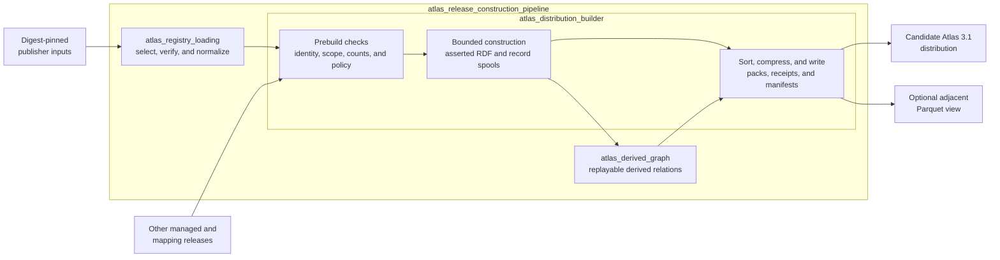
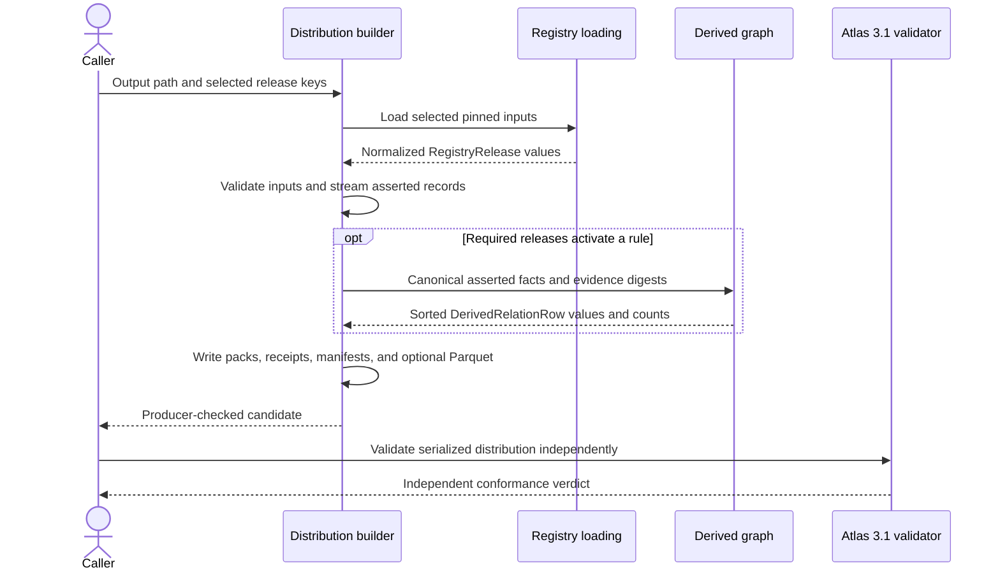

# Atlas release construction pipeline

## Purpose

`atlas_release_construction_pipeline` converts selected, digest-pinned source releases into a deterministic Atlas 3.1 candidate distribution.

Its three core components divide the work:

1. `atlas_registry_loading` verifies selected publisher inputs and converts them into normalized `RegistryRelease` values.
2. `atlas_derived_graph` computes optional, evidence-bearing relationships from asserted source facts. These relationships remain non-authoritative and opt-in.
3. `atlas_distribution_builder` validates normalized inputs, constructs asserted Resource Description Framework (RDF) records, writes canonical packs and receipts, and optionally creates an adjacent Parquet query view.

The pipeline produces a producer-checked candidate. Independent Atlas 3.1 validation, source-fidelity auditing, signing, and publication remain separate operations.

## Architecture

The builder coordinates the runtime sequence:

Asserted RDF is the distribution’s authoritative content. Derived relations occupy a separate graph and table, cite their input evidence, and require consumer opt-in. The portable validator does not import producer code, preventing the builder from defining its own acceptance result.

## Core component documentation

- [Atlas registry loading](atlas_registry_loading.md) — release selection, exact-input verification, source normalization, and `RegistryRelease` construction.
- [Atlas derived graph](atlas_derived_graph.md) — derivation rules, evidence, identities, graph authority, replay, and consumer access.
- [Atlas distribution builder](atlas_distribution_builder.md) — prebuild checks, streamed RDF construction, pack writing, receipts, manifests, and Parquet generation.
- [Atlas 3.1 binding](../bindings/atlas/3.1/README.md) — normative distribution format and independent validation rules.