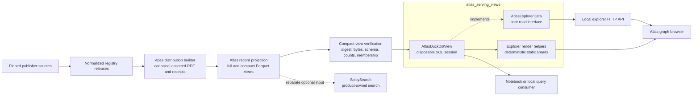
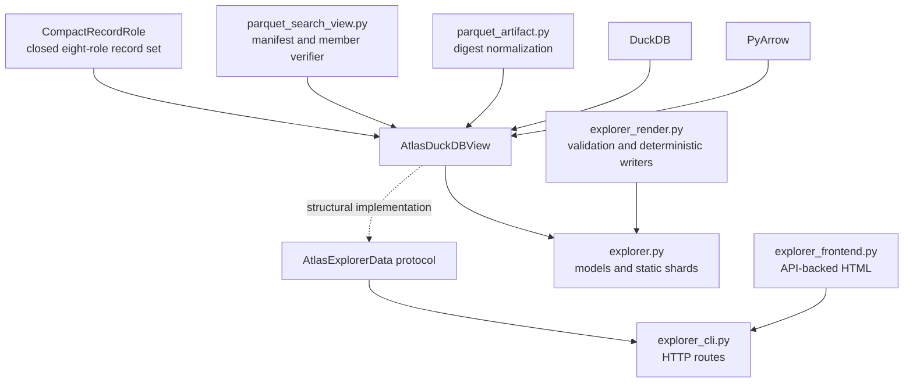
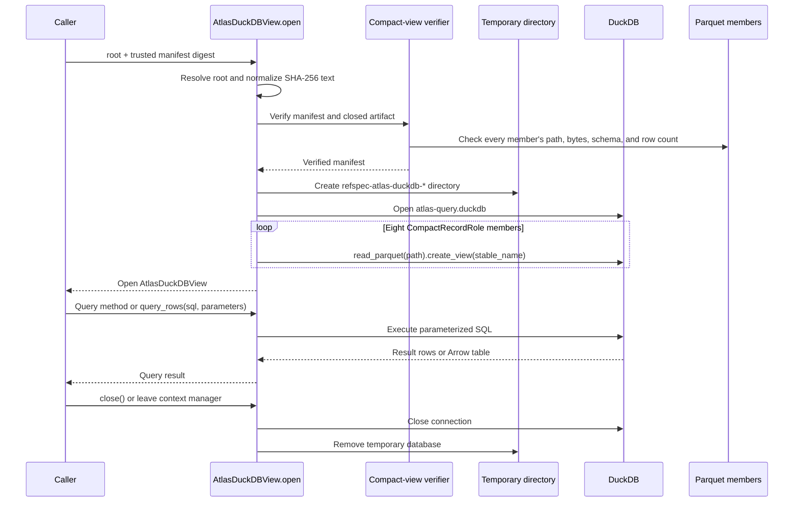
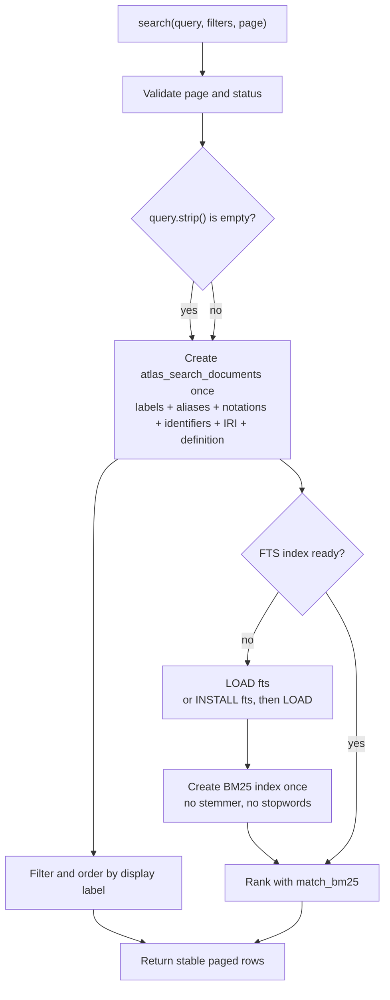
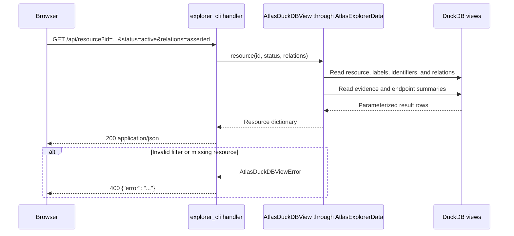
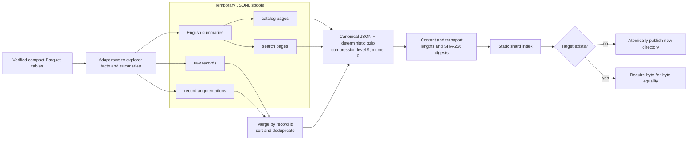

# Atlas serving views

<!-- markdownlint-disable MD013 -->

`atlas_serving_views` turns a verified Atlas compact Parquet search view into
two consumer forms: a disposable DuckDB query session and deterministic files
for the Atlas graph explorer. It does not create a new Atlas authority source.
The authenticated Parquet directory remains the input, and every local
database, search index, HTTP response, and browser shard remains a disposable
view of that input.

The module centers on
[`AtlasDuckDBView`](../src/refspec/atlas/duckdb_view.py), the storage-neutral
[`AtlasExplorerData`](../src/refspec/atlas/explorer_data.py) protocol, and the
rendering and sharding helpers in
[`explorer_render.py`](../src/refspec/atlas/explorer_render.py). The
[`explorer.py`](../src/refspec/atlas/explorer.py) and
[`explorer_cli.py`](../src/refspec/atlas/explorer_cli.py) modules consume these
components to build static assets and serve the local browser.

## At a glance

| Question | Answer |
| --- | --- |
| What goes in? | A closed compact Parquet search-view directory plus a trusted SHA-256 digest for `search-view-manifest.json`. The directory contains eight required compact record tables and may contain sealed agency-projection and derived-relation tables. |
| What happens? | RefSpec verifies the manifest, member bytes, schemas, counts, and closed file membership; opens stable DuckDB views over the Parquet files; and builds extra local tables only when a query needs them. A separate path partitions rows into deterministic, digest-pinned JSON shards for browser use. |
| What comes out? | Parameterized SQL results, PyArrow tables, graph-oriented JSON responses, optional local HTTP responses, or immutable gzip-compressed explorer shards. The temporary DuckDB database and full-text index are removed when the session closes. |
| How do we check it? | Focused tests cover artifact tampering, table mappings, filters, full-text paging, graph responses, optional tables, authority defaults, deterministic shard output, HTTP routing, and cleanup. The compact-view verifier runs before the normal query path opens. |

## Purpose and boundaries

This module gives local tools and developers a fast read path over a verified
Atlas. It owns:

- stable SQL names for the eight compact record roles;
- one thread-safe DuckDB session over one verified search view;
- row, Arrow, search, graph, resource, and agency-projection query methods;
- the explorer's minimum storage-neutral read interface;
- deterministic JSON model validation, rendering, partitioning, compression,
  and shard receipts; and
- local HTTP access through a thin consumer adapter.

It does not own:

| Concern | Owner and documentation |
| --- | --- |
| Publisher acquisition, source interpretation, and release adapters | [Publisher source portfolio and adapters](publisher_source_portfolio_and_adapters.md) |
| Source-release trust and managed-release validation | [Source release trust and fidelity assurance](source_release_trust_and_fidelity_assurance.md) |
| Atlas release selection and loading | [Atlas registry loading](atlas_registry_loading.md) |
| Canonical Atlas construction and receipts | [Atlas distribution builder](atlas_distribution_builder.md) |
| Logical record schemas and Parquet table production | [Atlas record projection](atlas_record_projection.md) and the [Atlas 3.1 Parquet view](../docs/atlas-parquet-view.md) |
| Meaning and replay of inferred relations | [Atlas derived graph](atlas_derived_graph.md) |
| Normative graph roles and conformance | [Atlas 3.1 binding](../bindings/atlas/3.1/README.md) |
| Product document search, ranking, and topic tagging | SpicySearch under [REF-024 and REF-048](../docs/decisions.md#ref-024-record-the-cross-product-ownership-boundary-once) |

The serving code verifies that its compact input is internally closed and
matches the supplied manifest digest. It does not prove that the canonical RDF
distribution passed the independent Atlas validator, that a release seal is
valid, that publisher capture is complete, or that any artifact was published.

## Place in RefSpec

The serving layer begins after Atlas construction and Parquet projection. It
reads released data; it never calls publisher services and never writes into
the verified directory.



The dotted SpicySearch edge is a product boundary, not a runtime dependency.
RefSpec publishes Atlas search views; SpicySearch decides how to combine them
with document data.

## Architecture and dependencies

### Components

| Component | Responsibility |
| --- | --- |
| [`duckdb_view.py`](../src/refspec/atlas/duckdb_view.py) | Verifies a compact view, opens a temporary DuckDB database, exposes stable table names, answers explorer queries, and loads optional data only when requested. |
| [`explorer_data.py`](../src/refspec/atlas/explorer_data.py) | Defines the runtime-checkable core read protocol used to keep the browser-facing HTTP code independent of a storage engine. |
| [`explorer_render.py`](../src/refspec/atlas/explorer_render.py) | Validates Atlas 3 explorer models, renders the self-contained model-based explorer, and supplies deterministic spool, shard, compression, receipt, and safety helpers. |
| [`explorer.py`](../src/refspec/atlas/explorer.py) | Adapts compact Parquet rows into explorer models and static shards. It aliases `AtlasDuckDBView` as `AtlasParquetExplorer` for existing callers. |
| [`explorer_frontend.py`](../src/refspec/atlas/explorer_frontend.py) | Supplies the current API-backed browser pages served by the CLI. It is a consumer of the JSON response shapes, not part of storage access. |
| [`explorer_cli.py`](../src/refspec/atlas/explorer_cli.py) | Maps HTTP GET routes to the data-access methods, serves the browser pages, and closes the view when the server stops. |
| [`parquet_search_view.py`](../src/refspec/atlas/parquet_search_view.py) | Provides the verifier called by `AtlasDuckDBView.open()`. It defines the trusted compact-view manifest and optional-member rules. |



`AtlasExplorerData` declares the five core browser reads: `facets()`,
`overview()`, `release_graph()`, `search()`, and `resource()`. The current HTTP
adapter uses a richer `AtlasDuckDBView` surface: it passes `status` and
`relations` options and also calls `agency_projection()`. A replacement backend
must implement that extended server surface even though Python's runtime
protocol check only confirms that named attributes exist; it does not check
method signatures.

## Authenticated input and session lifecycle

`AtlasDuckDBView.open()` is the only normal constructor. Direct construction is
available for focused tests, but it bypasses the artifact-verification path and
must not become a production shortcut.



The verifier rejects an unsafe directory, a symlinked or missing manifest, a
manifest whose bytes differ from the external digest, non-canonical JSON,
unknown fields or versions, unsafe paths, member byte or schema drift, count
drift, missing roles, partial agency-projection pairs, and undeclared files.
Optional tables therefore remain part of the same closed, digest-pinned input.

The CLI accepts `--manifest-digest`. If the caller omits it, the CLI hashes the
local manifest bytes and uses that result as the expected digest. That default
checks all members against the manifest selected from disk, but it does not
establish who produced that manifest. Supply an independently obtained digest
when origin matters.

The view owns one DuckDB connection and protects it with a reentrant lock.
`ThreadingHTTPServer` may run request handlers concurrently, but queries against
the shared connection run one at a time. `close()` is idempotent, and every
public query rejects use after close.

## SQL surface

The eight record roles always use these view names:

| Compact record role | DuckDB view |
| --- | --- |
| `Resource` | `atlas_resources` |
| `Label` | `atlas_labels` |
| `Statement` | `atlas_statements` |
| `EvidenceBinding` | `atlas_evidence_bindings` |
| `SourceRecord` | `atlas_source_records` |
| `Release` | `atlas_releases` |
| `Identifier` | `atlas_identifiers` |
| `LifecycleEvent` | `atlas_lifecycle_events` |

`sql_tables` returns the read-only role-to-name mapping, and `table_name()`
normalizes either a `CompactRecordRole` or its string value. Unknown roles fail
with `AtlasDuckDBViewError`.

`query_rows()` returns each result as a dictionary keyed by the DuckDB column
names. `query_arrow()` returns a `pyarrow.Table`. Both methods accept a SQL
string plus a positional parameter sequence. They are low-level local APIs:
callers should keep values in parameters and limit raw SQL construction to
trusted application code.

```python
from refspec.atlas import open_atlas_duckdb_view

with open_atlas_duckdb_view(
    "output/atlas-search-view",
    trusted_manifest_digest="sha256:<64-lowercase-hex>",
) as atlas:
    rows = atlas.query_rows(
        """
        SELECT id, definition
        FROM atlas_resources
        WHERE semantic_ring = ?
        ORDER BY id
        LIMIT ?
        """,
        ("subject", 20),
    )
```

## Explorer query behavior

### Public query operations

| Method | Result and important behavior |
| --- | --- |
| `facets()` | Returns verified resource and statement counts, release and ring counts, optional derived-table availability, graph-authority metadata, and one high-degree starting resource. |
| `overview(status, relations)` | Returns every Atlas release as a node, internal relation totals, and cross-release relation volumes grouped by statement type. It marks alignment-endpoint releases as satellites and selects their strongest relation partner. |
| `release_graph(release_id, status, relations)` | Returns every selected resource in one release and its internal relations. Nodes, predicates, and statement types use separate arrays; each edge stores integer positions to keep large payloads compact. |
| `search(query, release, releases, ring, status, limit, offset)` | Searches or lists resources with stable filters and paging. The limit must be an integer from 1 through 500, and the offset must be a non-negative integer. |
| `resource(resource_id, status, relations)` | Returns one resource, English labels, identifiers, immediate relations, resolved endpoint summaries, and evidence for asserted relations. The requested resource remains visible even when deprecated. |
| `agency_projection(query)` | Returns resolved and unresolved REF-038 agency rows, optionally filtered by a case-insensitive substring. It returns `available: false` when the paired tables are absent. |
| `query_rows()` / `query_arrow()` | Exposes the verified SQL views to notebooks and other local consumers without making the explorer their owner. |

### Status and authority defaults

The default filters are deliberate safety choices:

| Option | Default | Allowed values | Meaning |
| --- | --- | --- | --- |
| `status` | `active` | `active`, `all` | `active` hides any resource whose `record_status` contains `deprecated`, case-insensitively. `all` includes it. |
| `relations` | `asserted` | `asserted`, `all` | `asserted` returns verified statement records only. `all` also returns non-authoritative `DerivedRelation` rows when the optional table exists. |

Derived rows never enter `atlas_statements`, never receive asserted evidence,
and never appear as publisher statements. `resource()` gives them an empty
evidence list and a `policy` of `derived`; `release_graph()` gives them a
separate statement type; and `overview()` aggregates them separately before
folding them into internal or cross-release volume. See the
[Atlas derived graph](atlas_derived_graph.md) for rule meaning and replay.

Agency projection has a different role. The paired projection tables reproduce
reviewed asserted identity decisions in a lookup-friendly form. They are not
compact record roles and never enter `self.tables`. The reader loads them as
`atlas_agency_projection` and `atlas_agency_projection_unresolved` only when a
caller requests the agency view. REF-038 in the
[decision ledger](../docs/decisions.md#ref-038-the-regulationsgov-agency-roster-lands-and-reviewed-identity-claims-govern-the-agency-projection)
defines their authority and abstention behavior.

### Full-text search lifecycle

Blank and nonblank searches follow different paths:



The materialized `atlas_search_documents` table and DuckDB full-text index live
only in the temporary database. DuckDB may download its official `fts`
extension on first use. If installation and loading fail, the view raises a
clear error; it does not silently change the ranking rule. An empty query does
not require the extension.

### Optional derived table

`derived-relations.parquet` is a sealed optional member. The normal verified
path enforces its manifest-declared schema before DuckDB opens. When the query
view prepares it, the reader still discovers supported column names from the
actual DuckDB schema. Subject, predicate, and object are required; cosmetic
fields such as the rule, ring, content digest, and cited assertions may be
absent from a directly constructed compatible test session.

The reader normalizes each derived row to the asserted relation response shape,
converts binary content digests to `sha256:<hex>`, and constructs a stable
display identifier when the row has none. Release membership comes from the
two endpoint resources because the optional table does not carry authoritative
source- and target-release fields.

## HTTP component interaction

The CLI is a thin local adapter. It parses query parameters, calls the view,
serializes compact JSON, and maps `AtlasDuckDBViewError` or `ValueError` to HTTP
400. Unknown paths return HTTP 404.



| Route | View call |
| --- | --- |
| `/api/facets` | `facets()` |
| `/api/overview` | `overview(status=..., relations=...)` |
| `/api/release-graph?id=...` | `release_graph(id, status=..., relations=...)` |
| `/api/search?q=...` | `search(q, release=..., ring=..., status=..., limit=..., offset=...)` |
| `/api/resource?id=...` | `resource(id, status=..., relations=...)` |
| `/api/agency-projection?q=...` | `agency_projection(q)` |

The server defaults to `127.0.0.1`, has no authentication, and sends
`Cache-Control: no-store`. Treat `--host` as an exposure decision; this command
is a local explorer, not a hardened public service.

```sh
uv run refspec-atlas-explorer \
  output/atlas-search-view \
  --manifest-digest <trusted-search-view-manifest-sha256> \
  --no-browser
```

## Static explorer rendering and shards

`explorer_render.py` has two related jobs:

1. It validates and renders an Atlas 3 explorer model into a self-contained
   HTML document through `render_atlas_v3_explorer()`.
2. It supplies the deterministic writers used by
   `build_atlas_explorer_static_shards()` in `explorer.py`.

The current local server uses the separate API-backed templates from
`explorer_frontend.py`. The model renderer remains a live compatibility and
artifact-generation path; it accepts Atlas 3 models only and validates graph
authority, counts, paths, digests, coverage reconciliation, relation rings,
and provenance closure before interpolation.

The current Parquet static-shard adapter writes asserted resource, label,
statement, evidence, source-record, release, and identifier facts. It does not
fold the optional agency-projection or derived-relation tables into the static
bundle. Those tables remain available through their live DuckDB endpoints
unless a future shard recipe adds them and changes the affected model, schema,
and recipe identities.

### `_JsonlSpool`

`_JsonlSpool` partitions canonical JSON rows without keeping an unbounded set
of files open. It:

- accepts only keys matching `[0-9a-z_]+`;
- writes `<key>.jsonl` under a caller-owned temporary root;
- keeps recently used binary handles in insertion order;
- closes the least-recently-used handle after the count exceeds 64;
- closes all handles before listing partition keys; and
- returns keys in filename order for deterministic finalization.

Record shards use the first three hexadecimal characters of each record
identifier's SHA-256 digest, which provides at most 4,096 record partitions. Catalog and
search shards use normalized label and word prefixes. Finalizers sort and
deduplicate rows within each partition before writing output.



Each shard receipt pins both forms of the payload:

- `content` records the canonical uncompressed JSON length, digest, and media
  type;
- `transport` records the gzip length, digest, and compression; and
- `url` is a normalized safe relative path.

The browser verifies both receipts before parsing a shard. A rebuild may reuse
an existing target only when every generated byte matches; a differing
existing directory fails instead of being overwritten.

## Scale and performance

The main paths have distinct cost profiles:

| Path | Scaling behavior |
| --- | --- |
| `open()` | Verifies every artifact byte, so verification is linear in the compact-view byte size. Creating DuckDB views does not load every row. |
| First search preparation | Groups all English labels and identifiers once and materializes one row per resource. Cost is linear in resources, labels, identifiers, and indexed text bytes. |
| First nonblank search | Builds the local full-text index once. Time and temporary disk grow with indexed text. Later searches reuse it. |
| `resource()` | Reads the selected resource, its labels and identifiers, incident statements, evidence for those statements, and endpoint summaries. Cost grows with that resource's degree and evidence volume. |
| `release_graph()` | Returns every active resource and internal edge for one release. Payload and client work are linear in that release's resources and retained internal relations. Integer edge tables reduce repeated strings, not row count. |
| `overview()` | Aggregates statement volume by release pair. Derived aggregation uses two resource-id equality joins; avoid a resources-by-release self-join, which has failed to finish on the measured 1.5-million-resource view. |
| Static shard build | Scans each required Parquet role and writes bounded-handle partitions. Finalization holds one partition's rows in memory, so partition choice controls peak memory. |

When a real query or shard build slows unexpectedly, profile the SQL with
DuckDB `EXPLAIN ANALYZE` or time the loop that scans Parquet batches. Do not add
per-resource SQL calls to a corpus-wide path.

## Contribution guidelines

Preserve these rules when changing the serving layer:

1. **Keep the artifact authoritative.** Write caches, indexes, and temporary
   databases outside the verified directory. Close and remove them on every
   normal and exceptional exit.
2. **Change schemas at their owner.** Add or change Parquet fields in the
   [record projection](atlas_record_projection.md), its manifest verifier, and
   negative fixtures before consuming them here. Do not infer a new compact
   record role in DuckDB.
3. **Keep authority visible.** Asserted, projection, and derived data require
   distinct tables, response markers, and defaults. Derived relations stay
   hidden until `relations=all`.
4. **Preserve stable names and shapes deliberately.** A SQL view name, JSON
   field, route, filter value, shard recipe, or schema version is a consumer
   surface. Change its identity when behavior genuinely changes.
5. **Keep the protocol and server aligned.** When a route adds a data method or
   option, update `AtlasExplorerData`, concrete implementations, test doubles,
   and handler tests together. Runtime protocol checks do not verify
   signatures.
6. **Parameterize values.** Keep user values out of SQL text. Validate bounded
   enums and paging values before query execution.
7. **Keep output deterministic.** Preserve canonical JSON, sorted rows, stable
   partition keys, gzip `mtime=0`, content-addressed names, and immutable-target
   comparison.
8. **Retain old checks as test oracles.** When replacing a query or validator,
   compare verdicts on real data and on mutations before removing the old
   production path.
9. **Test absence as well as presence.** Optional agency and derived tables
   need tests for complete, absent, partial, undeclared, tampered, and malformed
   states.
10. **Profile before adding structure.** Prefer one grouped query or batched
    Parquet scan to repeated work per resource, statement, or shard.

## Verification

Run the focused serving tests during development:

```sh
uv run pytest -q \
  tests/test_atlas_duckdb_view.py \
  tests/test_atlas_explorer_cli.py \
  tests/test_atlas_v3_explorer.py
```

Run the authenticated Parquet integration cases when changing open-time
verification, optional members, graph response construction, or browser
artifacts:

```sh
uv run pytest -q tests/test_atlas_parquet_view.py \
  -k "compact_search_view or derived_relation or agency_projection or explorer or overview or release_graph"
```

The focused suites establish different evidence:

| Test area | What it proves |
| --- | --- |
| `test_atlas_duckdb_view.py` | Status and relation defaults, resource neighborhoods, satellite selection, agency projection, derived schema handling, same- and cross-release derived edges, validation errors, and closed-session behavior. |
| `test_atlas_explorer_cli.py` | CLI input handling, paging parameters, authority and status pass-through, agency routes, JSON error responses, and real HTTP interaction with a query-ready view. |
| `test_atlas_v3_explorer.py` | Model validation and end-to-end model rendering. |
| `test_atlas_parquet_view.py` | Authenticated full-to-compact projection, member tampering and closed membership, optional-table carry-through, explorer reads without RDF parsing, whole-release graphs, and frontend behavior. |

These tests prove the local serving implementation. They do not replace the
independent Atlas 3.1 validator, release seal verification, real-data source
fidelity audit, or product-level SpicySearch acceptance.
