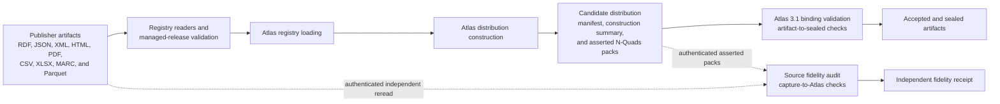
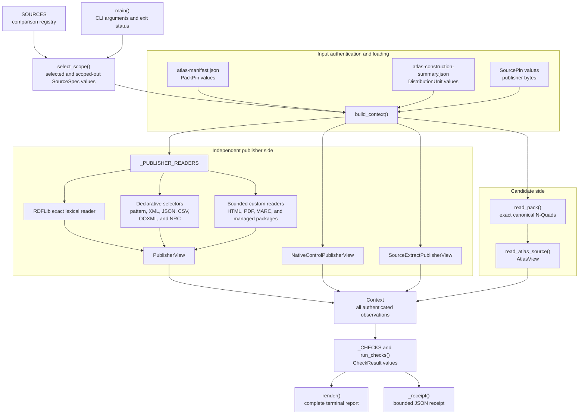
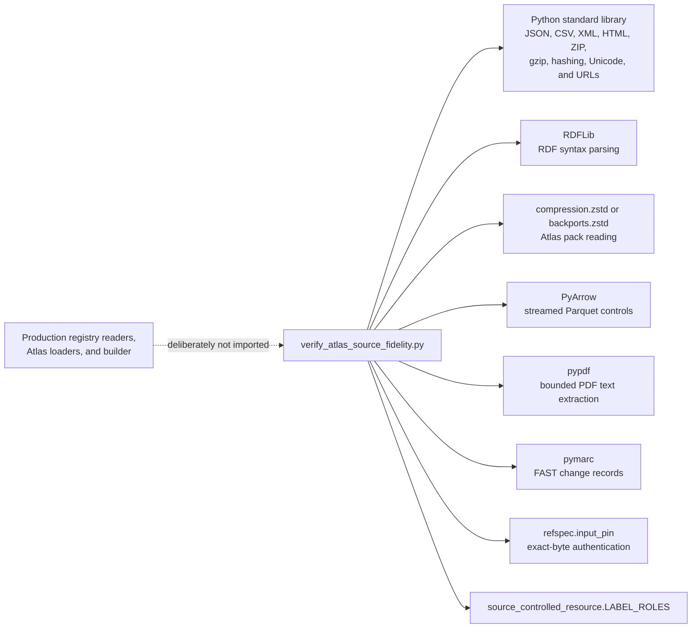
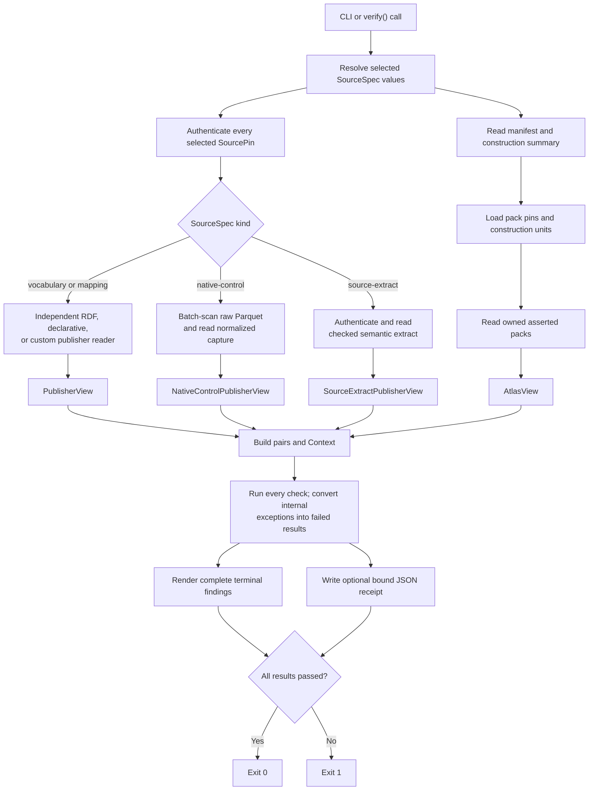
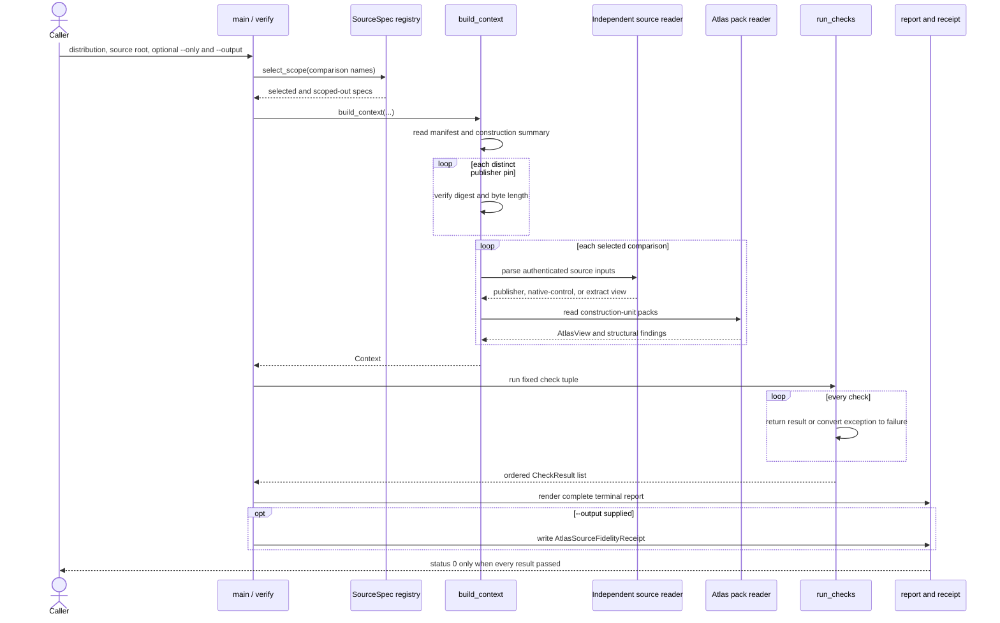

# Atlas source fidelity audit

<!-- markdownlint-disable MD013 -->

The `atlas_source_fidelity_audit` module checks whether a packed RefSpec Atlas
3.1 distribution faithfully represents the exact publisher inputs used to
build it. It reads authenticated publisher bytes through independent format
readers, reconstructs publisher-shaped claims from the Atlas asserted packs,
and compares both sets in both directions.

The implementation lives primarily in
[`tools/verify_atlas_source_fidelity.py`](../tools/verify_atlas_source_fidelity.py).
It complements the [Atlas 3.1 binding](../bindings/atlas/3.1/README.md): the
binding checks the completed distribution's form, internal consistency, and
seal, while this module checks the earlier **capture-to-Atlas** step. It does
not prove that the capture contains everything the publisher offered.

## At a glance

| Question | Answer |
| --- | --- |
| What goes in? | A named Atlas distribution, its manifest and construction summary, source-owned RDF packs, exact publisher input pins, source-specific comparison declarations, and the optional comparison scope selected with `--only`. |
| What happens? | The audit authenticates both sides, parses them through independent readers, reconstructs source claims and evidence, compares each declared claim family in both directions, and runs a fixed set of fail-closed checks. |
| What comes out? | A complete terminal report, process exit status `0` or `1`, and an optional `AtlasSourceFidelityReceipt` JSON file bound to the candidate, source inputs, pack transports, verifier version, comparison scope, and check results. |
| How do we check it? | Fault-injection tests pair a faithful synthetic case with a deliberately broken case, assert the exact failure text, exercise specialized real-byte readers, and prove that malformed inputs do not stop independent checks. |

## Place in RefSpec

The audit sits beside [registry foundation](registry_foundation.md) and
[managed release validation](managed_release_validation.md) in the logical
`source_release_trust_and_fidelity_assurance` group. It consumes evidence from
the source side and a candidate from the build side, but it does not own either
side's production code.

Upstream source readers and packages are documented in the [publisher source
portfolio and adapters](publisher_source_portfolio_and_adapters.md), [managed
vocabulary source adapters](managed_vocabulary_source_adapters.md), and
[managed release validation](managed_release_validation.md). This audit does
not call those production readers. It implements a second reading path so a
shared parsing or normalization bug cannot make the producer and verifier
agree on the same wrong result.



This separation implements the repository's trust model:

1. **Publisher to capture:** a digest identifies the captured bytes; it does
   not prove that the capture is complete.
2. **Capture to Atlas:** this module checks that selected construction units
   faithfully preserve the capture.
3. **Atlas to sealed artifact:** the Atlas binding and seal check the completed
   distribution.

See the [repository overview](../README.md#what-the-seal-does-and-does-not-prove)
and the [binding's source-side limits](../bindings/atlas/3.1/README.md) for the
full three-step model. The binding remains authoritative for its current gate
set; the audit must not duplicate or report a binding-validation result.

## Scope and non-goals

The audit proves only the source comparisons that its receipt names. A passing
full run means every construction unit in that candidate has one loaded,
independent comparison and every applicable check passed. A scoped run proves
only its selected comparisons; omitted units appear as `not evaluated (scoped
out)`, never as covered.

The module does not:

- prove that a publisher capture is complete;
- run the Atlas 3.1 binding validator or reproduce its acceptance gates;
- authorize source admission, publication, search expansion, entity linking,
  or product use;
- treat a matching digest or matching count as a substitute for field-level
  equality;
- repair a publisher defect; or
- treat Atlas-owned releases, semantic rings, resource profiles, governed
  schemes, classes, named-graph placement, or `rkaf:EvidenceBinding` records as
  publisher claims.

The current code reuses `read_verified_file_pin()` for transformation-free
byte authentication and the shared `LABEL_ROLES` vocabulary. Its comparison
readers do not import the production registry readers, Atlas loaders, builder,
or normalization functions.

## Architecture

### Component map

The file is large because it holds the independent source declarations,
readers, Atlas reader, checks, and receipt writer together. The main boundaries
remain explicit.



### Runtime dependencies



RDFLib literal normalization is disabled while the audit parses publisher RDF.
This preserves lexical forms such as `"01"^^xsd:integer`; otherwise a rewritten
Atlas value could appear equal after the parser normalized it. The setting is
process-global, so `_RDFLIB_LITERAL_MODE_LOCK` serializes the short critical
section and restores the prior setting afterward.

## Inputs and trust anchors

### Candidate distribution

`build_context()` reads three candidate-owned inputs:

| Input | Use |
| --- | --- |
| `atlas-manifest.json` | Declares every pack's logical path, SHA-256 transport digest, and byte length. `read_pack()` recomputes the actual values. |
| `atlas-construction-summary.json` | Declares construction-unit keys, kinds, source inputs, source-owned RDF packs, record counts, and the distribution language-scope statement. |
| `packs/**/*.nq.zst` | Holds the asserted Atlas graph. The audit reads only the packs assigned to each comparison's construction unit. |

The caller must name the distribution. There is no default because a retained,
retired build could otherwise receive a misleading current verdict.

### Publisher inputs

Every `SourcePin` declares:

- the local audit path;
- an optional distinct `construction_path` used to match the builder's input
  record;
- the exact SHA-256 and byte length;
- the source format and optional ZIP member;
- the construction role; and
- the publisher or artifact IRI.

`check_publisher_input_pins()` requires exact agreement between these
independent declarations and the construction summary: path, digest, length,
role, and source IRI must match one row. Extra construction inputs and repeated
or absent matches fail.

`--source-root` defaults to `output/registry-real-data-sources`. A pin resolves
first from that root and then from the repository root. `_resolve_source_pin()`
accepts only a regular, non-symbolic-link file at either resolved path.

### Identity and digest rules

The main join depends on the comparison type:

| Comparison | Join rule |
| --- | --- |
| Vocabulary with publisher IRIs | The Atlas resource IRI must equal the publisher resource IRI. A digest never replaces this identity join. |
| Source-local or source-key-derived vocabulary | The independent reader reconstructs the declared resource identity and requires exact set equality. |
| Mapping | The source, predicate, object, and when applicable evidence rows must match exactly. Mapping strength cannot be increased. |
| Native control | Controlled values and occurrence counts come directly from the pinned Parquet field selected by `NativeControlSelector`. |
| Source extract | Atlas records are re-keyed by the source-local identity in `atlas:nativePayload`, because the publisher artifact supplies no IRIs. |

`atlas:sourceDigest` has source-specific meaning. A source may use an input-file
digest, archive-member digest, or digest of a reconstructed native relation or
payload. `RdfSourcePolicy` and the specialized readers declare the applicable
rule. The audit still compares the underlying fields.

## Core data model

### Run and result types

| Component | Responsibility |
| --- | --- |
| `SourcePin` | Authenticates one publisher input and records how it must appear in construction evidence. |
| `PackPin` | Records one Atlas pack's expected transport digest and byte length from the manifest. |
| `DistributionUnit` | Represents one construction-summary work item, its kind, input rows, packs, and record counts. |
| `SourceSpec` | Owns one named comparison: its kind, single construction-unit key, inputs, reader, identity rule, source policy, bounded subset, and optional exclusions or selector. |
| `Expectations` | Holds fail-closed run requirements and the minimum label tripwire. Production defaults require complete coverage, input pins, and pack pins. |
| `Context` | Gathers all authenticated inputs and derived views once for pure checks. It also retains load failures and selected versus scoped-out declarations. |
| `CheckResult` | Reports one stable check name, derived pass status, summary, pipeline failures, and source or model findings. `_result()` derives `passed` from an empty failure list. |
| `Finding` | Assigns an observation to `source` or `model` ownership without turning a publisher defect into a pipeline failure. |

### Comparison views

| Component | What it retains |
| --- | --- |
| `PublisherView` | Exact concepts, schemes, labels with language and datatype, notations, annotations, relations, memberships, reified statements, input digests, expected locators and native payloads, defects, exclusions, and unevaluated claims. |
| `AtlasView` | Resources, release and scheme facts, labels, notations, definitions, notes, relations, source records, locators, digests, native payloads, reification, raw source-shaped claims, structural failures, checked pack names, and observed transports. |
| `SourcePair` | One `SourceSpec`, its independent `PublisherView`, and the `AtlasView` that claims to represent it. |
| `NativeControlPair` | A direct Parquet-derived control view and its Atlas view. |
| `SourceExtractPair` | An authenticated checked extract and its Atlas view. |

`LiteralValue` retains the lexical value, language tag, and datatype. Plain RDF
literals receive the explicit RDF 1.1 datatype `xsd:string`. Comparisons can
therefore detect a changed character, language tag, or datatype instead of
comparing display text alone.

## Publisher comparison paths

### Direct RDF comparison

For RDF inputs, `_read_publisher_pin_set()` authenticates every declared file
or ZIP member, parses it with RDFLib, and combines the graphs. `_publisher_view()`
then extracts exact Simple Knowledge Organization System (SKOS) and SKOS-XL
claims, RDF reification, native schemes, and source metadata without importing
the production reader.

The generic reader also reports publisher defects such as ill-typed literals,
class IRIs used as predicates, whitespace in namespace IRIs, dangling top
concepts, and concepts with no preferred label. It preserves those claims
unchanged.

### Declarative record selectors

Declarative selectors keep common parsing mechanics shared and make each
source's assumptions visible as data.

| Selector family | Main declarations | Behavior |
| --- | --- | --- |
| Pattern rows | `PatternRowSelector`, `PatternRowPattern`, normalizers, filters, and derived fields | Selects bounded text regions and rows, requires exact input, region, and row counts, renders identities and claims, and names every authenticated field left unevaluated. |
| XML records | `XmlRecordSelector`, `XmlRecordField` | Uses `ElementTree`, exact namespaces and paths, optional bounded expansion, expected tag sets and counts, and closed native-payload fields. |
| JSON records | `JsonRecordSelector`, `JsonRecordField` | Rejects duplicate object keys, follows declared object paths, checks root and parent fields, row width, headers and counts, then reconstructs rows from positional cells. |
| CSV records | `CsvRecordSelector`, `CsvProjection`, `CsvLabelRule`, `CsvFieldValidator` | Enforces the declared encoding and dialect, header shape, row bounds, projections, label construction, validation rules, unique row keys, and exact result count. |
| OOXML workbooks | `OoxmlRelationalSelector` and table, join, filter, aggregate, and derived-field declarations | Reads Office Open XML through stock ZIP and XML support, rejects unsafe members, checks sheets and typed table rows, then executes bounded joins and aggregates. |
| NRC ADAMS multi-artifact | `NrcAdamsMultiArtifactSelector`, `NrcAdamsInput`, `NrcAdamsPattern`, `NrcAggregateTemplate`, `NrcDerivedField` | Reconstructs an ordered union across exactly six authenticated U.S. Nuclear Regulatory Commission ADAMS text captures, with exact pattern counts, coverage rules, row keys, aggregates, and derived fields. |

The user-facing core components have these specific roles:

- `CsvLabelRule` selects an ordered set of non-empty columns for one
  discriminator value and joins them into the row's preferred label.
- `CsvFieldValidator` applies one declared `allowed-values`, `npi-luhn`, or
  `regex:` rule to a selected text field.
- `NrcAdamsInput` binds one named capture to its path, official URL, and
  observation time.
- `NrcAdamsPattern` selects a region and rows from one named input, declares
  expected matches and coverage, and maps each result to identity, locator,
  claims, and native evidence.
- `NrcAggregateTemplate` builds a structured value from one row or collects a
  value across all pattern matches.
- `NrcDerivedField` derives either templated text or a SHA-256 value from named
  inputs.
- `NrcAdamsMultiArtifactSelector` closes the six-input set, ordered pattern
  union, final count, and explicit unevaluated-field list.

### Bounded custom readers

Custom readers remain independent of production code and use general format
libraries. Four HTML parsers in the core component list illustrate the rule:

| Parser | Independent behavior |
| --- | --- |
| `_CfrSubjectIndexParser` | Streams each Code of Federal Regulations subject-index definition list, preserves element boundaries, counts every known markup irregularity, and leaves heading interpretation to the caller. The reader then reconstructs part identities, headings, term assignments, duplicate parts, and links to independently rebuilt Federal Register topic identities. |
| `_FccRosterHtmlParser` | Collects Federal Communications Commission card-section titles, entry headings, links, and descriptions, then requires the exact Offices and Bureaus section shape. |
| `_GaoTopicsHtmlParser` | Selects Government Accountability Office taxonomy-term blocks, targets the publisher's actual misspelled description class, and reconstructs term IDs, slugs, names, descriptions, and order. |
| `_IcpsrIndexPageParser` | Selects only Inter-university Consortium for Political and Social Research thesaurus term anchors, preserving source-local record numbers and the preferred/non-preferred marker for later reconciliation with XML evidence. |

Other source-specific readers use `pypdf`, `pymarc`, RDFLib's N-Triples
parser, standard JSON and XML, or verified managed-package bytes. New custom
readers enter the `_PUBLISHER_READERS` dispatch table under a versioned reader
name.

### Native controls

`NativeControlSelector` identifies one control ID, Parquet table and field,
extraction rule, source IRI, expected row count and columns, and construction
unit. `_read_native_control_publishers()` groups selectors that share the same
Parquet and capture files, opens each Parquet file once, and reads only required
columns in batches of 50,000 rows.

The resulting values, occurrence counts, missing-field counts, unresolved
counts, schema, and source pin are compared with both the normalized control
capture and the Atlas pack. This catches a normalized capture and Atlas output
that agree with each other but disagree with the raw Parquet rows.

### Checked source extracts

`SourceExtractSelector` handles a publisher artifact that has no usable native
identifiers or machine-readable distribution. It declares the checked extract
reader and pin, source-release IRI, label language, and relation predicate.

The current Federal Register thesaurus path authenticates the styled PDF and a
repository-checked JSON extract. The builder reparses the PDF; it does not read
that extract. The audit compares Atlas concepts, labels, source-local entry
IDs, page locators, and resolved relations with the checked extract and proves
that Atlas does not turn unresolved or ambiguous rows into claims.

This path is intentionally weaker than a direct publisher reparse. It proves
agreement with an independently stored semantic restatement of the exact PDF,
not a fresh interpretation of the PDF bytes. The receipt records
`independentReparseOfPublisherBytes: false` and identifies the comparison basis.

## Claim scope and executable exclusions

The audit requires every publisher claim family to enter an exact comparison
or an explicit, executable exclusion. A policy name never waives a difference.

### `DeclaredClaimExclusion`

This declaration selects an exact publisher entity layer by asserted
`rdf:type`, IRI prefix, or both. The audit:

1. enumerates the selected subjects and their claims from publisher bytes;
2. accounts for reachable blank-node claims owned by that layer;
3. requires no overlap with subjects the comparison evaluates; and
4. proves that Atlas asserts nothing about the excluded subjects.

An exclusion therefore fails if it hides a compared subject or if Atlas starts
representing the excluded layer.

### `DeclaredLanguageExclusion`

This declaration binds a canonical JSON payload by SHA-256. It selects only
explicitly tagged semantic literals whose valid BCP 47 primary language subtag
is outside the English family. The audit checks counts by source, language,
and predicate family, hashes the exact excluded claim set, and scans every
authenticated Atlas pack for out-of-scope or noncanonical semantic literals.
Untagged literals and IRI claims never enter this exclusion.

### `RdfSourcePolicy`

`RdfSourcePolicy` declares how the audit reverses each source record. It names:

- native-payload fields reconstructed from publisher bytes;
- Atlas-authored payload fields that have no publisher inverse;
- additional annotation and relation predicates;
- source-to-Atlas label-language rules;
- relation and member-type inverse rules;
- source-record locator and digest rules;
- any publisher types traced as Atlas resources; and
- reification IDs, predicates, and weights that the reader can reconstruct.

Configuration fails if a field is both source-evaluated and Atlas-only, if an
organization field lacks an independent inverse, or if a declared rule names
an unsupported operation.

## Atlas pack reading

`read_pack()` reads each compressed pack's actual bytes, records its SHA-256
and byte length, decompresses it with zstd, and sends every line to
`parse_nquads_line()`. The parser accepts the repository's canonical N-Quads
profile, decodes escapes exactly, retains literal language and datatype, and
requires an explicit graph IRI.

`read_atlas_source()` builds an `AtlasView` for one comparison. It indexes
source records, represented resources, labels, notations, annotations,
relations, native payloads, reification, and source-shaped raw claims. It also
collects structural failures instead of stopping at the first bad line or pack.

High-cardinality stock readers can request compact retention. In this mode the
Atlas reader keeps parsed indexes and only the raw claims that no index already
represents. It can also validate a source digest against canonical native
payload JSON without retaining every full payload. These paths reduce memory;
they do not narrow the comparison.

## End-to-end data flow



## Check set

`_CHECKS` is a flat, ordered tuple of callables. `CHECK_NAMES` derives each
stable report name from the function name. `run_checks()` catches an exception
from one check, records that exception as a failed result, and continues with
the remaining checks.

| Area | Checks | What they establish |
| --- | --- | --- |
| Load and declared scope | `load-errors`, `configuration`, `language-scope`, `claim-scope`, `distribution-coverage` | Inputs that could not load stay visible; settings cannot weaken the verdict; language and claim scope are executable; comparison names and construction-unit ownership are unique; every in-scope unit has one independent comparison. |
| Authentication and structure | `publisher-input-pins`, `graph-structure` | Publisher pins match construction evidence exactly; pack bytes match manifest pins; source records, native payloads, reification, term kinds, and pack lines have valid structure. |
| Source-record evidence | `rdf-provenance-fidelity`, `native-control-fidelity`, `source-extract-fidelity` | Locators, digests, native evidence, direct Parquet controls, and checked-extract records agree with their independently reconstructed sources. |
| Identity and literals | `concept-traceability`, `identifier-retention`, `label-fidelity`, `notation-fidelity`, `annotation-fidelity` | Concept sets, identity forms, labels, notations, definitions, and notes match in both directions, including language and datatype. |
| Native source metadata | `member-iri-fidelity`, `member-literal-fidelity`, `top-concept-fidelity`, `scheme-organisation`, `source-release-metadata` | Publisher member metadata, native scheme structure, top-concept directions, and adopted release descriptions round-trip through source evidence without silent loss. |
| Relations and evidence | `relation-fidelity`, `no-manufactured-relations`, `reification-fidelity` | Relation sets match both ways; Atlas adds no relation or stronger mapping; declared reification identities and detached weights reconstruct exactly. |
| Closure and reporting | `count-reconciliation`, `source-claim-coverage`, `source-defects` | Counts summarize already-equal sets; no publisher or Atlas source-shaped claim escapes a comparison; publisher defects are reported without failing faithful preservation. |

`count-reconciliation` is diagnostic support, not a waiver. Exact set checks
decide fidelity. Likewise, the minimum label sample prevents a vacuous pass;
it does not permit sampling instead of full comparison.

## Component interaction



## Findings and failure behavior

The report separates ownership:

| Category | Meaning | Affects exit status? |
| --- | --- | --- |
| Pipeline finding | Publisher bytes and Atlas claims differ, a prerequisite fails, a claim escapes comparison, or an audit check breaks. | Yes. It appears in `CheckResult.failures`. |
| Source finding | The publisher's own bytes contain a defect, and Atlas preserved it faithfully. | No. Repairing it silently would be an Atlas error. |
| Model finding | The Atlas 3.1 binding cannot express a source shape without loss. | Reported separately; any corresponding lossy claim-family status fails through `claim-scope`. |

Missing or malformed inputs become results rather than uncaught exceptions.
Publisher sources and Atlas packs load independently, and later checks continue
with the usable observations. A missing comparison still causes every affected
check to report `not evaluated`, so partial work cannot look complete.

Receipt-write failure adds a final failed `receipt-write` result and returns
status `1`; the terminal report remains available. Invalid command syntax,
missing `--distribution`, and unknown `--only` names use `argparse`'s error path.

## Receipt

When `--output` is present, `_receipt()` writes an
`AtlasSourceFidelityReceipt` with:

- the verifier version;
- pass status;
- manifest and construction-summary digests;
- expected and observed language scope;
- fail-closed expectations;
- evaluated and scoped-out comparisons and units;
- per-unit coverage and fidelity status;
- each comparison's reader, identity policy, inputs, policies, claim scope,
  checked packs, and observed versus manifest transport pins;
- executable policy descriptions; and
- every check result.

Each comparison receives one of four practical statuses:

| Status | Meaning |
| --- | --- |
| `exact` | The claim scope is exact, required pins and graph structure passed, ownership is unique, and no comparison-specific failure remains. |
| `differences-found` | Source and Atlas claim scope differ. |
| `prerequisite-failed` | The comparison could not earn `exact` because authentication, ownership, structure, or another required check failed. |
| `not-evaluated` | The comparison did not load or the run scoped it out. |

Stored `failures` and `sourceFindings` lists retain at most 100 entries per
check. Each capped list also carries the complete count, a truncation flag, and
a SHA-256 digest over the complete ordered list. The terminal report is not
capped.

## Command-line use

Run from the repository root through the Makefile when possible:

```sh
make audit-atlas-v3-source-fidelity \
  ATLAS_V3_AUDIT_ROOT=output/atlas-3.1-federal-register-thesaurus-2025-04-01
```

The target accepts either a directory that contains `atlas-manifest.json` or
its parent with a `distribution/` child. It writes the configured receipt and
uses the Atlas binding requirements.

Direct use exposes every option:

```sh
uv run python tools/verify_atlas_source_fidelity.py \
  --distribution output/example/distribution \
  --source-root output/registry-real-data-sources \
  --minimum-label-sample 200 \
  --only elsst-r6 \
  --only gemet-4.2.3 \
  --output output/example-source-fidelity-receipt.json
```

| Option | Behavior |
| --- | --- |
| `--distribution PATH` | Required directory containing the candidate manifest, construction summary, and `packs/`. |
| `--source-root PATH` | Primary root for declared source pins. Defaults to `output/registry-real-data-sources`. |
| `--output PATH` | Optional JSON receipt path. Parent directories are created. |
| `--minimum-label-sample N` | Sets the non-vacuity tripwire. The check still compares every exposed label; a value below one fails configuration and uses an effective floor of one. |
| `--only COMPARISON` | Repeatable comparison-name selector. Unknown names fail. Omitted names become visibly scoped out. With no `--only`, the full registry runs. |

The importable API is small:

| Function | Use |
| --- | --- |
| `select_scope(only, specs=SOURCES)` | Validate requested comparison names and return selected plus scoped-out declarations. |
| `build_context(distribution, source_root, expectations, specs, scoped_out_specs)` | Authenticate and parse all declared inputs while collecting recoverable failures. |
| `run_checks(context, checks=_CHECKS)` | Run the ordered checks and convert internal check exceptions into failed results. |
| `verify(...)` | Build the context and return ordered results without rendering or writing a receipt. |
| `render(results)` | Produce the complete fixed-width terminal report. |
| `main(argv=None)` | Own CLI parsing, optional receipt writing, output, and exit status. |

## Performance and scaling

Most work grows linearly with the bytes and claims in the selected inputs.
Hash-set comparisons make two-way claim checks expected `O(n)` after parsing;
sorted reports and deterministic receipt rows add `O(n log n)` work for the
affected sets.

The main cost controls are deliberate:

- `--only` limits publisher parsing and pack reading to named comparisons;
- shared publisher inputs use a cache keyed by reader, pins, predicate rules,
  and exclusions;
- EuroVoc partitions reuse a common parsed source when their cache keys match;
- native controls open a shared Parquet file once and scan required columns in
  batches;
- N-Quads packs stream through the line parser after their compressed bytes
  are authenticated; and
- compact Atlas views avoid retaining source-shaped claims already represented
  by parsed indexes.

RDFLib graphs, JSON arrays, CSV rows, PDF text, and some source-specific maps
still materialize in memory. A full-registry run also reads every selected pack
for each owning comparison. When a run takes longer than expected, profile the
source reader, pack loop, and sort producing the largest result before adding a
cache or weakening a check.

## Contribution guide

### Add a comparison

1. Identify the exact construction-unit key and verify the raw publisher bytes
   around representative records. For rendered sources, inspect the rendered
   page, not only its text layer.
2. Choose one `SourceSpec.kind`: `vocabulary`, `mapping`, `native-control`, or
   `source-extract`. A vocabulary, native control, or source extract must own a
   `sourceRelease` unit; a mapping must own a `mapping` unit.
3. Declare every `SourcePin` with exact path, construction path when different,
   SHA-256, byte length, format, role, and source IRI.
4. Prefer a shared declarative selector when it fully describes the source.
   Add a custom stock-library reader only when source structure requires it.
   Never call the producer's parser or normalization function.
5. Declare the source identity rule and, for RDF-shaped comparisons, the exact
   `RdfSourcePolicy` fields and inverse rules. Every native-payload field must
   be source-evaluated, explicitly Atlas-authored, or rejected.
6. Use `DeclaredClaimExclusion` or `DeclaredLanguageExclusion` only for an
   exact, enumerable scope whose Atlas-side absence the audit can prove.
7. Register a custom reader under a versioned name in `_PUBLISHER_READERS`, add
   the `SourceSpec` to `SOURCES`, and keep one comparison owner per
   construction-unit key.
8. Add one faithful test and one mutation that proves the comparison fires for
   each new claim family. Assert the failure text, not only the Boolean result.

### Change an existing reader or check

- Preserve exact lexical values, term kinds, source order when meaningful,
  raw locators, ambiguity, unresolved rows, and declared gaps.
- Pin every expected count that protects source structure, including known
  irregularity counts. An unlisted irregularity must fail.
- Exercise loss and invention separately. A clean real-data pass proves only
  that valid data is accepted.
- When replacing a running check, copy the old implementation into the test as
  an independent oracle and prove verdict agreement over real data and a
  mutation battery before removing the production path.
- Keep `SourceSpec` declarations closed and unique. Do not add a policy name to
  silence an unrelated failure.
- Explain any deliberate source-extract limitation in the receipt; do not
  present a frozen semantic extract as a fresh publisher-byte parse.
- Measure how a change scales with source bytes, resources, statements,
  labels, and failure rows.

### Common mistakes

| Mistake | Result |
| --- | --- |
| Reusing a production parser | The audit can repeat the producer's defect and report false agreement. |
| Joining a publisher resource by digest | The comparison loses the publisher identity rule; vocabulary joins use the publisher IRI unless the source supplies no IRI. |
| Comparing only counts | Equal totals can hide both dropped and invented claims. |
| Treating `--only` as full coverage | The receipt correctly marks omitted units not evaluated. |
| Declaring a broad predicate waiver | `claim-scope` and `source-claim-coverage` still fail because exclusions must select exact subjects or exact language-tagged claim cells. |
| Normalizing publisher literals before comparison | Whitespace, Unicode, language, datatype, and lexical rewrites become invisible. |
| Fixing a publisher defect in Atlas | The pipeline becomes unfaithful; report the source finding and preserve the published value. |
| Adding a source record field without an inverse | Configuration or provenance checks reject the unexamined field. |

## Verification

Run the focused audit tests from the repository root:

```sh
uv run pytest -q \
  tests/test_verify_atlas_source_fidelity.py \
  tests/test_verify_cfr_subject_index_reader.py
```

The main suite uses synthetic publisher and Atlas pairs so each check can run
quickly and deterministically. It includes faithful cases, injected label,
identity, relation, evidence, pin, structure, coverage, language, and receipt
faults, plus continuation tests that prove one malformed source or pack does
not hide independent results.

The CFR suite authenticates the retained publisher pages, verifies the source
census and frozen irregularity list, mutates page structure and values, and
checks the exact deliberate divergence from the shipped release. Add a focused
real-byte suite when a custom reader has a similarly important raw-source
grammar.

For a changed `SourceSpec` or reader, also run its source-family parser tests,
the Atlas loader or builder tests that produce its construction unit, and an
audit against a named current candidate. Report that last run separately: unit
tests do not prove a full distribution passed, and a local receipt does not
mean the artifact was sealed or published.

## Related documentation

- [RefSpec overview](../README.md) explains the build, prove, sign, and serve
  lifecycle and the fidelity audit's place outside read-time seal verification.
- [Atlas 3.1 binding](../bindings/atlas/3.1/README.md) defines the completed
  distribution, acceptance rules, consumer checks, and source-side limits.
- [Decision ledger](../docs/decisions.md) records why source fidelity remains
  registry-owned, why immutable files cross product boundaries, and why
  artifact acceptance stays separate from source comparison.
- [Publisher source portfolio and adapters](publisher_source_portfolio_and_adapters.md)
  routes maintainers to the production source families that supply audit
  inputs.
- [Registry foundation](registry_foundation.md) documents exact-byte pins,
  source identities, claim packages, evidence, mappings, and semantic rings.
- [Managed vocabulary source adapters](managed_vocabulary_source_adapters.md)
  covers independent ELSST coverage, ICPSR acquisition, and other source-side
  adapters that remain separate from this audit.
- [Managed release validation](managed_release_validation.md) documents the
  checked package views that Atlas loaders consume before distribution
  construction.
- [Atlas planning index](atlas_planning_index.md) documents the non-authorizing
  source placement plan; its rows do not grant audit coverage or release
  admission.
- [Atlas in the United States and Europe](../ATLAS_US_EU_COMPARISON.md) supplies
  strategic context. Current code, the Atlas binding, and the decision ledger
  remain implementation authority.
