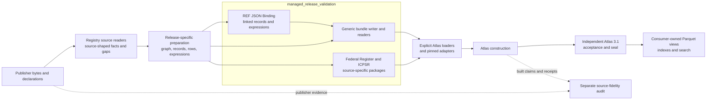
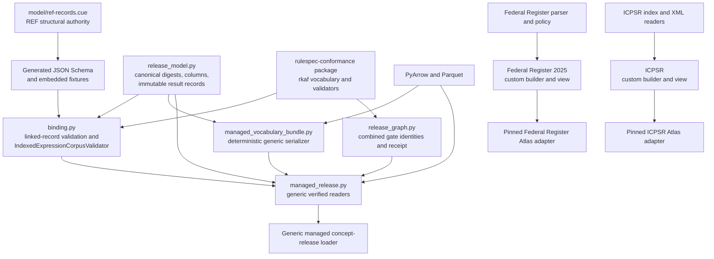
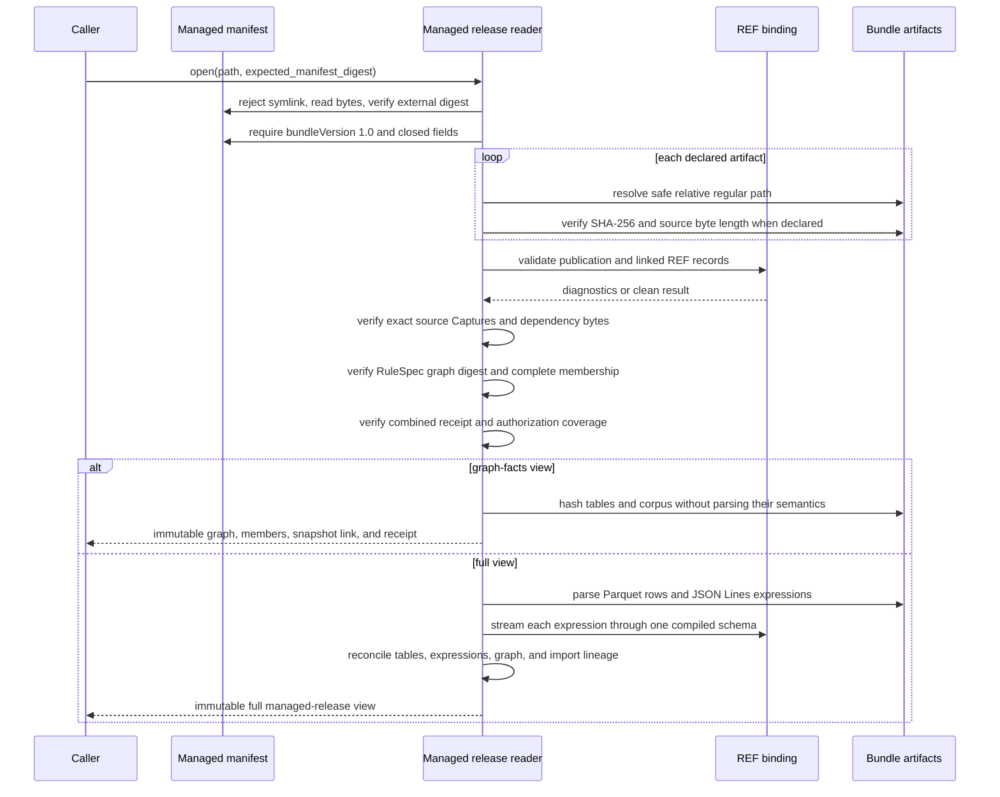

# Managed release validation

<!-- markdownlint-disable MD013 -->

`managed_release_validation` is the logical RefSpec module that turns prepared
vocabulary release facts into checked, immutable package views. It validates
REF operational records, writes or opens digest-pinned release files, checks
cross-file lineage, and exposes only the facts supported by the selected reader.

This module sits between source-specific registry work and Atlas construction.
It does not acquire arbitrary publisher content, prove that a capture is
complete, perform the independent source-fidelity audit, admit a release to an
Atlas distribution, sign an Atlas release, or serve search results.

The module tree groups two related but incompatible package families:

- the generic `managed-release-bundle.json` format, built by
  `ManagedVocabularyBundle` and opened by `ManagedReleaseView` or
  `ManagedReleaseGraphFactsView`; and
- the source-specific Federal Register and ICPSR `managed-release.json`
  formats, opened by their own readers and then checked more deeply by pinned
  Atlas adapters.

Do not route a source-specific manifest through `ManagedReleaseView`, and do
not treat a source-specific package seal as the generic bundle's REF and
RuleSpec validation receipt.

## At a glance

| Question | Answer |
| --- | --- |
| What goes in? | Prepared source-derived records, exact source bytes, release identities, REF records, RuleSpec graph facts, normalized rows, indexed expressions, and validation evidence. The exact inputs depend on the package family. |
| What happens? | Producers serialize deterministic files and content digests. Readers start from a trusted package selection, verify declared bytes and identities, apply schema and semantic checks, reconcile cross-file facts, and freeze the verified result. |
| What comes out? | A generic graph-facts or full managed-release view, a source-shaped Federal Register view, or a development-only ICPSR view. Downstream adapters translate those checked facts into Atlas construction inputs. |
| How do we check it? | Generated REF schemas, valid and deliberately invalid fixtures, focused serializer and reader tests, corruption batteries, source-specific real-data checks, and Atlas adapter tests. Final Atlas acceptance and source fidelity remain separate checks. |

## Place in RefSpec

The upstream [publisher source portfolio](publisher_source_portfolio_and_adapters.md)
and [registry vocabulary readers](registry_vocabulary_sources.md) preserve
publisher-specific facts and gaps. The [registry foundation](registry_foundation.md)
provides shared exact-byte, source-concept, claim, evidence, and mapping
building blocks. Managed release validation packages or reopens a selected
release without changing those source claims.

Downstream, explicit Atlas loaders consume verified members and release facts.
The Atlas builder creates the distribution, and the independent [Atlas 3.1
binding](../bindings/atlas/3.1/README.md) validates that completed distribution.
The repository [overview](../README.md) describes the wider build, prove, sign,
and serve lifecycle.



The [decision ledger](../docs/decisions.md) establishes the ownership behind
this flow. REF-023 assigns shared `rkaf` semantics to RuleSpec and keeps source
fidelity in the registry. REF-024 makes immutable releases and installed
packages the cross-product boundary. REF-026 separates build-time proof from
consumer verification and keeps source fidelity outside the release seal.

## Architecture

### Package families

| Package family | Producer and reader | Trust root | Scope and main consumer |
| --- | --- | --- | --- |
| Generic managed bundle | `ManagedVocabularyBundle`; `ManagedReleaseView`; `ManagedReleaseGraphFactsView` | `ManagedReleaseView.open()` requires an externally supplied SHA-256 digest for `managed-release-bundle.json`. | Full REF, RuleSpec graph, combined-receipt, normalized-table, expression-corpus, and source-capture closure. Generic Atlas concept-release readers and other exact-bundle consumers use it. |
| Federal Register 2025 package | `build_federal_register_thesaurus_2025_managed_release()`; `FederalRegisterThesaurus2025ManagedReleaseView` | The direct view verifies its sealed manifest and artifacts. `PinnedFederalRegisterThesaurus2025AtlasRelease` supplies the external manifest digest before and after the open. | Source-complete April 1, 2025 thesaurus facts for candidate use, with fixed source identity and count checks in the Atlas adapter. |
| ICPSR development package | `build_icpsr_managed_release()`; `IcpsrManagedReleaseView` | The direct view verifies its sealed manifest and artifacts. `PinnedIcpsrSubjectAtlasRelease` supplies the external manifest digest and recomputes the source-derived release identity. | Complete membership for the URI-verified subset, explicitly incomplete as a publisher vocabulary and limited to development-only candidate use. |

The generic path carries the complete release validation chain. The two
source-specific formats predate or preserve source-shaped requirements that
the generic manifest does not model. Their Atlas adapters add checks that the
direct package readers cannot make from internal bytes alone.

### Component relationships



`binding.py` republishes historical canonical-digest names from
`release_model.py`; it does not keep a second implementation. The RuleSpec
dependency remains one-way: RefSpec consumes the installed package and embeds
the exact dependency bytes used by the generic release gate.

## Sub-module documentation

| Sub-module | Main components | Detailed documentation |
| --- | --- | --- |
| REF binding and expression-corpus validation | `IndexedExpressionCorpusValidator`, `validate()`, strict JSON loading, schema dispatch, semantic diagnostics, fixtures, and requirement coverage | [REF JSON Binding and expression-corpus validation](managed_release_validation_binding.md) |
| Generic bundle construction and verified reading | `ManagedVocabularyBundle`, `reseal_linked_ref_records()`, `ManagedReleaseView`, and `ManagedReleaseGraphFactsView` | [Generic managed-release bundle and verified reader](managed_release_validation_bundle.md) |
| Source-specific managed-release views | `FederalRegisterThesaurus2025ManagedReleaseView`, `IcpsrManagedReleaseView`, their builders, source verification, and pinned Atlas adapters | [Source-specific package views](managed_release_validation_source_views.md) |

## Core file map

| File | Core component | Responsibility |
| --- | --- | --- |
| [`src/refspec/binding.py`](../src/refspec/binding.py) | `IndexedExpressionCorpusValidator` | Compiles the `IndexedVocabularyExpression` schema once, validates records incrementally, verifies record and text digests, and keeps only duplicate-ID state. The same file owns full linked REF record validation and binding fixtures. |
| [`src/refspec/managed_release.py`](../src/refspec/managed_release.py) | `ManagedReleaseView` | Opens the externally selected generic bundle, verifies every layer, cross-checks graph, records, tables, expressions, source bytes, and receipt, then exposes an immutable full view. `ManagedReleaseGraphFactsView` performs the shared graph-and-members checks without parsing corpus semantics or tables. |
| [`src/refspec/registry/infrastructure/managed_vocabulary_bundle.py`](../src/refspec/registry/infrastructure/managed_vocabulary_bundle.py) | `ManagedVocabularyBundle` | Serializes an already prepared generic release into deterministic canonical JSON, JSON Lines, Parquet, source artifacts, and a closed manifest. It does not replace producer-side semantic validation. |
| [`src/refspec/registry/managed_releases/federal_register_thesaurus_2025_managed_release.py`](../src/refspec/registry/managed_releases/federal_register_thesaurus_2025_managed_release.py) | `FederalRegisterThesaurus2025ManagedReleaseView` | Verifies and freezes the source-specific, source-complete April 1, 2025 thesaurus package. |
| [`src/refspec/registry/managed_releases/icpsr_managed_release.py`](../src/refspec/registry/managed_releases/icpsr_managed_release.py) | `IcpsrManagedReleaseView` | Verifies and freezes the development-only URI-verified subset and provides deterministic package-inspection lookup. |

## Generic validation flow

The generic reader applies layered checks. Each layer answers a separate
question, and a later check does not replace an earlier one.



The graph-facts reader still hashes every declared byte. It skips table and
expression semantics because its public result cannot expose those facts. A
consumer that needs labels, relations, lifecycle rows, expression evidence, or
source bytes must use the full view.

## Trust model and non-claims

| Check or artifact | What it establishes | What it does not establish |
| --- | --- | --- |
| Trusted manifest digest | The reader opened the manifest selected by the caller. | That the caller selected the right release for a product or policy. |
| Artifact digest and safe path checks | Declared files are exact regular files inside the package root and have not changed. | Correct source interpretation or complete publisher capture. |
| REF JSON Binding | REF records have valid closed shapes, canonical digests, reference closure, and applicable cross-record semantics. | RuleSpec graph conformance, Atlas acceptance, or source fidelity. |
| Exact embedded RuleSpec dependency and combined receipt | The generic package binds the installed validator, behavior runtime, graph gate, graph, REF records, and recorded pass verdicts. | A fresh re-execution of RuleSpec conformance at read time. |
| Normalized-table and expression round trips | Full-view tables and expression records agree with exact graph membership, source imports, and declared logical corpus identity. | Accepted-output authority or a serving index. |
| Source-specific reader and pinned adapter | A custom Federal Register or ICPSR package satisfies its documented source scope and the caller's external manifest pin. | The generic combined validation chain. |
| Atlas 3.1 acceptance and detached seal | The completed Atlas distribution passed its independent artifact checks and the signed bytes match that accepted result. | Publisher completeness or source fidelity; the scheduled audit owns that comparison. |

All managed views are read-only evidence. `ManagedReleaseView.usage_ceiling` is
`candidateUseOnly`; `ManagedReleaseGraphFactsView.eligibility_scope` is
`graphFactsOnly`; the two custom packages also refuse accepted-output use. A
caller must apply its own current product policy after selecting the correct
verified release.

## Public entry points

Use the generic readers when the package has the generic bundle layout:

```python
from pathlib import Path

from refspec.managed_release import (
    ManagedReleaseGraphFactsView,
    ManagedReleaseView,
)

facts = ManagedReleaseGraphFactsView.open(
    Path("release/managed-release-bundle.json"),
    expected_manifest_digest="sha256:<trusted-64-hex-digest>",
)

full = ManagedReleaseView.open(
    Path("release/managed-release-bundle.json"),
    expected_manifest_digest="sha256:<trusted-64-hex-digest>",
)
```

Use `facts` for exact graph identity and complete membership. Use `full` when
the caller needs expressions, normalized relations, lifecycle participants,
mappings, identity links, or packaged source bytes. Compute neither trusted
digest from the untrusted directory immediately before opening; obtain it from
the release selection or authenticated publication boundary.

For source-specific formats, Atlas code should use
`PinnedFederalRegisterThesaurus2025AtlasRelease` or
`PinnedIcpsrSubjectAtlasRelease` instead of calling the custom view directly.
Those wrappers add external selection and the projection-specific semantic
checks.

## Failure behavior

The module fails closed and returns no partially trusted public view.

| Surface | Failure result |
| --- | --- |
| `binding.validate()` and the expression validator | Return frozen `Diagnostic` values with exact requirement identifiers and concrete record or path messages. Any diagnostic means the input failed that validation call. |
| `ManagedVocabularyBundle` | Raises `ManagedVocabularyBundleError` for unsafe or inconsistent construction inputs and `FileExistsError` before replacing different existing content. |
| `ManagedReleaseView` and `ManagedReleaseGraphFactsView` | Raise `ManagedReleaseError` for manifest, path, byte, schema, digest, graph, receipt, lineage, table, or corpus failures. |
| Federal Register source-specific path | Raises `FederalRegisterThesaurus2025ManagedReleaseError`; its pinned Atlas adapter translates package failures into `VocabularyAtlasError`. |
| ICPSR source-specific path | Raises `IcpsrManagedReleaseError`; its pinned Atlas adapter translates package failures into `VocabularyAtlasError`. |

Preserve the original failure and its requirement or artifact context. Do not
collapse every refusal into a generic invalid-release message.

## Scaling and selection

| Path | Time and retained state | Use it for |
| --- | --- | --- |
| `binding.validate()` | Materializes the linked record set, builds an ID map and local reference graph, and applies schema, digest, and semantic checks. Cost grows with records, references, and type-specific accounting rows. | Closed operational REF record sets. |
| `IndexedExpressionCorpusValidator` | Visits each record once and retains one string ID per distinct expression: `O(U)` memory for `U` unique IDs. | A caller-owned expression JSON Lines loop. |
| `ManagedVocabularyBundle.write_to()` | Writes every artifact and streams the corpus without constructing one corpus-sized bytes object. Prepared expression records and other artifact payloads still exist in caller or writer memory. | Deterministic generic publication. |
| `ManagedReleaseGraphFactsView.open()` | Hashes all artifact bytes, parses the graph and REF closure, and retains the returned graph, member map, corpus link, and receipt. It does not retain source bytes or parsed table and corpus rows. | Atlas loading that needs exact graph facts and complete membership only. |
| `ManagedReleaseView.open()` | Parses and retains source bytes, graph, tables, expressions, records, relations, lifecycle participants, and mappings. | Consumers that need the full evidence surface. |
| Source-specific views | Read and materialize their source-shaped JSON and JSON Lines artifacts. ICPSR `concept()` scans concepts; `lookup()` scans expressions and sorts matches. | Bounded package inspection and their pinned Atlas adapters, not repeated serving queries. |

Measure any unexpectedly slow build or open before changing the checks. The
full binding has some repeated permission and sealed-gold scans; the generic
reader already indexes relevant graph properties once to avoid rescanning the
graph for every normalized row. Consumer-owned indexes remain outside managed
release packages.

## Contribution guide

### Change the owning layer

| Change | Owning location and required follow-through |
| --- | --- |
| Add or change a REF record field or type | Edit [`model/ref-records.cue`](../model/ref-records.cue), regenerate schemas and packaged assets, update binding dispatch when adding a type, add positive and negative fixtures, and update the requirement-to-test manifest. |
| Change canonical JSON or record digest behavior | Change `release_model.py`, then verify binding aliases, serializer and reader parity, fixtures, and every identity-bearing consumer. |
| Change the generic bundle manifest or artifact meaning | Change `ManagedVocabularyBundle` and both generic readers together. Keep the manifest closed; decide whether the change requires a new `bundleVersion`. Add negative reader tests for the old and new boundary. |
| Change a normalized table | Update the shared column tuple in `release_model.py`, producer serialization, reader parsing and round-trip checks, and Parquet fixtures together. |
| Change indexed-expression identity or corpus meaning | Update `vocabulary.py`, the REF schema and stream validator, generic reader checks, corpus identity tests, and any producer that emits expressions. Keep logical corpus identity distinct from file order and consumer indexes. |
| Change a source-specific fact or package | Start in the Federal Register or ICPSR source parser and retain raw context, gaps, and locators. Update the custom builder, direct reader, pinned Atlas adapter, and source-specific mutation tests. |
| Change shared `rkaf` semantics | Change RuleSpec, publish the updated `rulespec-conformance` package, update the dependency pin, and consume it here. Do not mint a parallel RefSpec term. |
| Change final Atlas admission, distribution shape, or seal behavior | Change the Atlas builder, Atlas 3.1 binding, or seal boundary. Do not add that policy to a managed-release reader. |

### Checklist

1. Preserve the external selection pin. Internal digest agreement alone does
   not identify the release the caller intended to open.
2. Keep raw source facts, ambiguity, exclusions, and refusals visible. A
   normalized row must not erase the evidence needed to reproduce it.
3. Add a negative fixture or mutation for every new enforced rule.
4. When replacing a running check, keep the old implementation as a test-only
   oracle and prove verdict agreement over real data and deliberate mutations.
5. Keep output deterministic: sort set-derived values, use shared canonical
   serialization, and test byte-identical repeated builds.
6. Trace cost in terms of artifact bytes, records, labels, relations, and
   expressions. Profile an unexpected slowdown before adding a cache or new
   layer.
7. Verify the reader that consumes the changed fact, not only the producer that
   writes it.

## Verification

Run the binding gate and focused module tests from the RefSpec repository root:

```sh
make test-json-binding
uv run pytest -q \
  tests/test_binding_package.py \
  tests/test_managed_vocabulary_bundle.py \
  tests/test_managed_release_view.py \
  tests/test_managed_release_identity_links.py \
  tests/test_federal_register_thesaurus_2025.py \
  tests/test_icpsr_managed_release.py \
  tests/test_atlas_source_release_readers.py \
  tests/test_invariants.py
```

Run `make generate` and `make check-generated` after a CUE, schema, generated
asset, or generated-type change. Run `make test` for the complete repository
gate. The exact Federal Register PDF and real ICPSR capture checks depend on
ignored local evidence and may skip when those files are unavailable; report a
skip as unexecuted evidence.

## Related documentation

- [REF JSON Binding and expression-corpus validation](managed_release_validation_binding.md)
  covers record schemas, semantic dispatch, diagnostics, fixtures, and streamed
  expression validation.
- [Generic managed-release bundle and verified reader](managed_release_validation_bundle.md)
  covers deterministic layout, trust anchors, validation order, full and
  graph-facts views, query APIs, scaling, and failures.
- [Source-specific package views](managed_release_validation_source_views.md)
  compares the Federal Register and ICPSR builders, readers, adapters, and
  scope rules.
- [Registry foundation](registry_foundation.md) documents shared source and
  evidence artifacts before managed-release validation.
- [Registry vocabulary sources](registry_vocabulary_sources.md) documents the
  source readers that supply Federal Register and ICPSR facts.
- [Publisher source portfolio and adapters](publisher_source_portfolio_and_adapters.md)
  places these readers in the wider registry inventory.
- [REF JSON Binding 1.0](../bindings/json/1.0/README.md) is the normative JSON
  record binding.
- [Atlas 3.1 binding](../bindings/atlas/3.1/README.md) is the downstream
  distribution and consumer contract.
- [Decision ledger](../docs/decisions.md) records the implementation authority
  and reasons for the ownership and validation boundaries.
