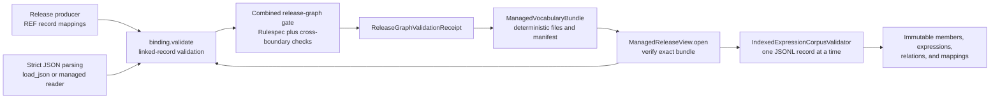
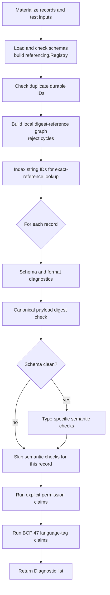
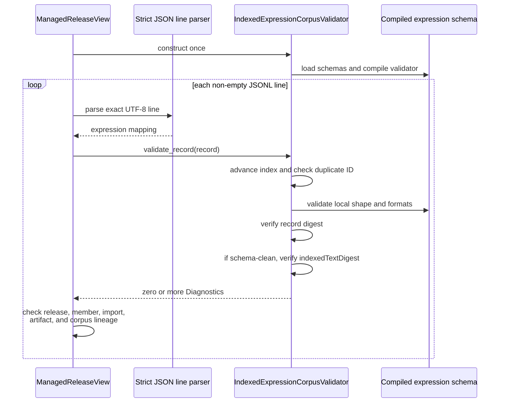

# REF JSON Binding and expression-corpus validation

<!-- markdownlint-disable MD013 -->

The `managed_release_validation` module uses
[`src/refspec/binding.py`](../src/refspec/binding.py) to validate REF-owned
operational records before a managed release can expose them as trusted facts.
The module has two related paths:

- `validate()` checks a closed set of linked REF records, including schema,
  digest, reference, accounting, permission, evaluation, and deployment rules.
- `IndexedExpressionCorpusValidator` checks one
  `IndexedVocabularyExpression` at a time while retaining only the identifiers
  needed to detect duplicates.

This page explains those paths for maintainers. See [managed release
validation](managed_release_validation.md) for the module overview and the
[generic managed-release bundle
boundary](managed_release_validation_bundle.md) for bundle construction and
`ManagedReleaseView`. Source-specific Federal Register and ICPSR packages use
separate readers documented under [managed-release source
views](managed_release_validation_source_views.md).

## At a glance

| Question | Answer |
| --- | --- |
| What goes in? | Python mappings for linked REF records, optional permission checks and language-tag tests, or a serial stream of indexed-expression mappings. Byte-oriented callers should parse JSON with the binding's strict loader before validation. |
| What happens? | The validator loads JSON Schema Draft 2020-12 definitions, checks graph-wide identity rules, applies one closed schema per record type, verifies canonical digests, and then runs type-specific semantic checks. The corpus validator compiles the expression schema once and reuses it for every record. |
| What comes out? | A list of `Diagnostic` values. An empty list means that the supplied input passed this binding path. It does not prove Rulespec graph conformance, source fidelity, Atlas admission, or publication. |
| How do we check it? | Generated schemas, valid fixtures, deliberately invalid mutations, raw malformed-JSON fixtures, a requirement-to-test manifest, package-fallback tests, caller tests, and the `make test-json-binding` gate. |

## Scope and trust boundary

REF JSON Binding 1.0 defines the JSON form of RefSpec's operational records.
It does not copy or validate the shape of Rulespec releases, concepts,
mappings, assertions, evidence, or attestations. The combined release-graph
gate calls this validator for the REF records and calls the pinned Rulespec
validators for the JSON-LD graph. The [binding README](../bindings/json/1.0/README.md)
defines that division in normative terms.

The validator also does not establish that a publisher capture is complete or
that parsed claims faithfully reproduce the publisher's bytes. The [registry
foundation](registry_foundation.md) preserves source facts, and the separate
source-fidelity audit compares published claims with pinned sources. The
Atlas binding decides final distribution conformance.

A successful `validate()` call therefore means one precise thing: the supplied
records satisfy the REF JSON schemas and the executable linked-record rules in
the installed or checked-out binding implementation.

## Place in the managed-release path



`ManagedReleaseView.open()` uses both paths. It first calls `binding.validate()`
for the publication manifest and linked operational records. It then creates
one `IndexedExpressionCorpusValidator` and feeds it the JSON Lines corpus in
file order. The managed reader adds checks that belong to the bundle boundary:
artifact digests, release membership, exact import and distribution lineage,
corpus identity, normalized-table round trips, and receipt coverage. This page
does not duplicate those checks; see the [bundle
documentation](managed_release_validation_bundle.md).

## Implementation map

| Component | Responsibility |
| --- | --- |
| [`model/ref-records.cue`](../model/ref-records.cue) | Authoritative source for REF record structure. Generated schemas and Python types must follow it. |
| [`bindings/json/1.0/schemas/`](../bindings/json/1.0/schemas/) | Closed JSON Schema Draft 2020-12 files. `ref-record.schema.json` dispatches across the supported record schemas. |
| [`src/refspec/binding.py`](../src/refspec/binding.py) | Strict loading, schema registry construction, canonical digest checks, linked-record semantics, streamed expression validation, fixture execution, and the package command-line interface. |
| [`src/refspec/release_model.py`](../src/refspec/release_model.py) | Shared canonical-JSON primitives, digest-field selection, safe-integer rules, and core facets. `binding.py` republishes historical aliases instead of copying their definitions. |
| [`src/refspec/generated_schemas.py`](../src/refspec/generated_schemas.py) | Embedded schema fallback used when an installed package has no checkout-relative schema directory. |
| [`src/refspec/generated_conformance_assets.py`](../src/refspec/generated_conformance_assets.py) | Embedded fixtures and the requirement manifest used by an installed package. |
| [`bindings/json/1.0/fixtures/`](../bindings/json/1.0/fixtures/) | Positive closures, single-purpose invalid mutations, permission claims, language-tag cases, and raw parser failures. |
| [`bindings/json/1.0/tests/requirement-to-test-manifest.json`](../bindings/json/1.0/tests/requirement-to-test-manifest.json) | Maps requirement identifiers to local fixtures, named validator checks, and external gates. |
| [`bindings/json/1.0/tools/validate.py`](../bindings/json/1.0/tools/validate.py) | Compatibility entry point that loads and delegates to `refspec.binding.main`. |

`TYPE_SCHEMAS` and `TYPE_REQUIREMENTS` in `binding.py` form the runtime dispatch
table. They currently cover 19 record types, including `rkaf:AccessScope`,
`ReleaseGraphValidationReceipt`, and `SourceIdentifierSet`. Use these mappings,
not the filename list, when tracing a runtime type to its schema and default
requirement identifier.

## Linked-record validation

### Public entry point

```python
diagnostics = binding.validate(
    records,
    permission_checks=permission_checks,
    language_tag_tests=language_tag_tests,
)
```

`validate()` accepts iterables, materializes each iterable as a list, loads the
schemas, and delegates to `validate_records()`. The function returns every
diagnostic it collected; it does not stop at the first invalid record.

Python mappings have already lost byte-level information. A caller that starts
with JSON bytes should use `load_json()` or an equally strict parser. The
binding loader rejects invalid UTF-8, duplicate object keys, and non-finite
constants before a mapping reaches `validate()`. No mapping-only API can detect
a duplicate key that an earlier permissive parser silently discarded.

### Validation order

The order matters because it limits misleading follow-on errors.



The concrete steps in `validate_records()` are:

1. `duplicate_id_diagnostics()` reports repeated durable identifiers.
2. `digest_cycle_diagnostics()` walks nested local `{id, digest}` references,
   builds a directed graph, and reports any cycle.
3. The validator builds `records_by_id` for exact-reference resolution.
4. For each record, `schema_diagnostics()` selects one schema by exact `type`,
   runs `Draft202012Validator` with `FormatChecker`, and sorts errors by JSON
   path.
5. `record_digest_diagnostics()` recomputes the canonical payload digest even
   when the schema fails. `validate_records()` converts canonicalization
   `TypeError` and `ValueError` exceptions into `REF-BIND-004` diagnostics.
6. If the record has no schema errors, `semantic_diagnostics()` dispatches to
   its type-specific checks. Skipping this step for malformed records avoids
   semantic code interpreting an invalid shape and producing noisy cascades.
7. The validator evaluates optional permission claims against exact
   `OutputProfile` rows.
8. It evaluates optional BCP 47 language-tag claims against the generated
   common schema definition.

Schema validation and semantic validation answer different questions. JSON
Schema checks local names, types, formats, conditional branches, cardinality,
and closed objects. Python checks relationships and accounting rules that need
multiple fields or multiple records.

### Semantic dispatch

| Record family | Additional checks after schema success |
| --- | --- |
| `EnrichmentProfile` | Unique facet IRIs and the exact twelve-facet core profile. |
| `OutputProfile` | Exact enrichment-profile resolution; compatible facet and assignment roles; candidate-before-accepted use; passing coverage prerequisites; and unique permission selectors. |
| `Capture` | Every `accessScopeRefs` value resolves to a co-resident `rkaf:AccessScope` record. |
| `RegistryImportCoverageReport` | Exact output-profile linkage, all eleven feature rows, count reconciliation, explained differences, required-feature flags, and failure rules. |
| `IndexedVocabularyExpression` | `indexedTextDigest` equals the SHA-256 digest of the UTF-8 `indexedText`. |
| `RegistryReconciliationReport` | Unique inputs and differences, exact input references, consistent unresolved items, outcome constraints, and authority, attestation, and adoption references for resolved outcomes. |
| `RegistryDeploymentDecision` | Exact import, coverage, output-profile, rights, policy, and optional reconciliation pins; selection and production prerequisites. |
| `SealedGoldManifest` | Blind drafting, exact vocabulary universe, item and expectation identity, split completeness, seven leakage dimensions, partition evidence, alias closure, independent review, grading, and open-set routing. |
| `EnrichmentConfiguration` | Distinct corpus and physical-index identities, exact profile pins, complete vocabulary pins, and exact selected registry deployments. |
| `EnrichmentEvaluationResult` | Configuration and gold agreement, vocabulary and normalization agreement, measure populations, one-to-one measures and thresholds, finite uncertainty bounds, gates, and strata. |
| `EnrichmentDeploymentDecision` | Exact configuration, evaluation, and output-profile pins plus passing production-selection prerequisites. |

The remaining supported types rely on schema, canonical digest, duplicate-ID,
and cycle checks in this module. Some also receive stronger checks in their
own producer or in the combined release-graph gate. Do not infer that a type
without a `semantic_diagnostics()` branch lacks all validation.

### Reference matching

`references_record()` requires the same `id`, the target record's correct
digest field and digest, and the same `version` when the reference supplies
one. This is an exact local pin check, not semantic equivalence.

Several handlers compare nested references by `structural_key()`, a stable
JSON string with sorted keys and no whitespace. This helper preserves array
order and refuses non-finite numbers. Canonical payload hashing follows the
stronger rules in `release_model.py`, including the selected top-level digest
field and safe JSON value constraints.

## Streamed indexed-expression validation

### Why it exists

A managed release may contain many indexed expressions in one JSON Lines
artifact. Calling `validate()` on the whole corpus would build a list of every
record and run linked-record work that the expression-only pass does not need.
`IndexedExpressionCorpusValidator` instead compiles the one expression schema
once and retains duplicate-ID state across calls.



The class owns two mutable fields:

- `_seen`, the set of valid string identifiers already presented; and
- `_index`, the zero-based record count used to label a record that lacks a
  string identifier.

`validate_record()` adds a unique string identifier to `_seen` even if later
schema or digest checks fail. A second occurrence therefore receives
`REF-CORE-005`. A missing or non-string identifier receives a display label
such as `<expression-7>`; the schema supplies the actual missing-ID error.

The record check follows this order:

1. Assign the current display identifier and advance `_index`.
2. Report a repeated string identifier.
3. Run the compiled `IndexedVocabularyExpression` schema and sort errors by
   path.
4. Verify the canonical record digest, converting canonicalization exceptions
   into `REF-BIND-004`.
5. Verify `indexedTextDigest` only when the schema succeeded.

`validate_indexed_expression_records()` is a convenience wrapper. It creates
one validator, iterates its input once, and combines the returned diagnostics.
Use the class directly when the caller already owns the file loop and needs to
perform bundle-specific checks between records.

### What the stream validator does not check

Expression records contain exact references to a release, import snapshot,
distribution artifact, normalization policy, and logical corpus snapshot. The
stream validator checks the local shape and digests but does not resolve those
references. `ManagedReleaseView.open()` resolves the packaged release member,
release version and digest, scheme, import snapshot, distribution lineage, and
corpus snapshot. It also recomputes the order-independent expression identity
set digest after reading the corpus.

This split keeps the binding utility small without weakening the managed
reader. A new cross-record expression rule must either remain in the managed
reader or change the stream validator's inputs and documented memory model.

## State, memory, and scaling

The two paths have different costs.

| Path | Retained state | Scaling characteristics |
| --- | --- | --- |
| `validate()` | Every input record, an ID-to-record map, and a local reference graph. | Materialization, duplicate detection, graph construction, and graph traversal scale with the supplied record data and local references. Schema and digest work runs once per record. |
| `IndexedExpressionCorpusValidator` | One compiled schema, one integer counter, and one string ID per distinct expression. | It visits each record once. Duplicate detection is an average constant-time set lookup. Memory grows as `O(U)` for `U` distinct identifiers; it does not retain record bodies. |
| `ManagedReleaseView.open()` expression loop | The stream-validator state plus managed expression objects and an ID-to-record map used for corpus and table checks. | The binding validator streams, but the full reader retains the verified corpus for its read-only API. Do not describe the complete open operation as constant-memory. |

Most linked-record checks are linear in their direct inputs, but two handlers
contain repeated scans worth watching on large closures:

- `permission_prerequisite_diagnostics()` may scan the coverage reports for
  each candidate-enabled permission row, giving `O(P * C)` behavior for `P`
  permission rows and `C` coverage reports.
- `sealed_gold_diagnostics()` scans linked indexed-expression records while
  deriving registered aliases for each gold item, which can approach
  `O(I * R)` for `I` gold items and `R` linked records.

If a linked-record validation run grows unexpectedly slow, measure these
loops before adding caches or changing rules. Preserve verdicts with existing
fixtures and mutation cases when optimizing a check.

One validator instance represents one ordered expression corpus. Create a new
instance for each independent corpus. The class exposes no reset operation and
uses mutable duplicate state without synchronization.

## Diagnostics and failure behavior

`Diagnostic` is a frozen value with two fields:

| Field | Meaning |
| --- | --- |
| `requirement` | The governing requirement identifier, such as `REF-BIND-004`, `REF-VOC-022`, or `REF-CORE-005`. |
| `message` | A concrete explanation that normally includes the record ID, JSON path, selector, feature, or failed relationship. |

`Diagnostic.render()` returns `"<requirement>: <message>"`. The API does not
assign warning levels: any returned diagnostic means the input failed that
validation call.

Schema diagnostics use the record type's default requirement unless a narrow
branch assigns a more specific requirement. For example, sealed-gold drafting
shape failures map to `REF-EVAL-013`, and selected production deployment
attestation fields map to `REF-TEST-160`. Unsupported or missing record types
map to `REF-BIND-001`.

The command-line interface prints diagnostics to standard output and returns
nonzero when standalone records fail. With no arguments, it runs the fixture
suite and prints failures plus a final accepted, rejected, and failure count.
Library callers receive diagnostics and decide how to report them. Some setup
and I/O failures remain exceptions: missing unreadable assets, invalid schema
definitions, and direct `load_json()` parser failures do not become ordinary
record diagnostics.

## Commands and public surfaces

| Surface | Intended use |
| --- | --- |
| `validate(records, *, permission_checks=(), language_tag_tests=())` | Main library API for one linked REF record set. |
| `IndexedExpressionCorpusValidator.validate_record(record)` | Incremental validation inside a caller-owned expression-corpus loop. |
| `validate_indexed_expression_records(records)` | Expression-only convenience API for an iterable. |
| `Diagnostic.render()` | Stable human-readable requirement and message format. |
| `load_json(path)` | Strict JSON loading for checkout or embedded binding assets. |
| `canonical_payload_digest(record)` and related aliases | Historical binding imports backed by the shared implementation in `release_model.py`. |
| `refspec-validate --record FILE [...]` | Validate linked standalone records. Repeat `--record` to supply a closure. |
| `refspec-validate --print-digest FILE` | Print the canonical payload digest for one record. |
| `refspec-validate --refresh-fixture FILE` | Mechanically refresh a self-contained base fixture's record and reference digests. |
| `refspec-validate` | Run valid and invalid fixtures plus requirement-manifest checks. |

`--refresh-fixture` rejects derived fixtures with a `base`. Use it only after a
deliberate change to the self-contained positive fixture. Never refresh an
invalid fixture merely to make it pass.

## Fixture and test design

The conformance suite uses four complementary forms of evidence:

1. Files under `fixtures/valid/` must produce no diagnostics.
2. Files under `fixtures/invalid/` usually inherit a valid fixture, apply a
   small JSON Pointer mutation, and name the requirement diagnostics they must
   produce. An invalid fixture may produce additional diagnostics, but it must
   produce every declared requirement.
3. Raw payload fixtures preserve malformed bytes, such as duplicate keys and
   non-finite constants, so parser behavior remains testable before a Python
   mapping erases the fault.
4. `requirement-to-test-manifest.json` connects requirements to fixtures,
   named checks, and external Rulespec or release-graph gates.

`requirement_manifest_diagnostics()` rejects repeated requirements, missing
required coverage rows, missing fixture files, local-only rows with no named
validator check, and top-level invalid fixtures omitted from the manifest.

[`tests/test_binding_package.py`](../tests/test_binding_package.py) adds package
and API checks. It proves that:

- the public linked-record API accepts the full valid closure;
- the expression-corpus API reuses its schema path without losing duplicate-ID
  detection;
- an installed package can load embedded schemas and conformance assets when
  checkout directories are absent;
- the compatibility command delegates to the package command;
- every dispatched record type has linked positive and type-specific negative
  fixture coverage; and
- canonical digest behavior survives a JSON round trip.

[`tests/test_managed_release_view.py`](../tests/test_managed_release_view.py)
tests the consumer boundary. In particular, graph-facts-only opens hash the
corpus artifact without constructing `IndexedExpressionCorpusValidator`, while
full opens parse and validate the corpus.

Run focused checks from the repository root:

```sh
make generate
make check-generated
make test-json-binding
uv run pytest -q tests/test_binding_package.py tests/test_managed_release_view.py
```

`make test` remains the complete repository gate.

## Contribution guide

### Add or change a record field

1. Edit [`model/ref-records.cue`](../model/ref-records.cue), the structural
   source of truth. Do not hand-edit a generated schema as the final change.
2. Run `make generate` to refresh schemas, Python types, embedded schemas, and
   embedded conformance assets.
3. Add or update positive and negative fixtures. Keep each negative fixture
   focused on one intended fault when possible.
4. Update the requirement-to-test manifest with the governing requirement and
   named check.
5. Run generated-file, binding, package, and affected consumer tests.

Changing a closed top-level record shape may require a binding-version
decision. Check the [decision ledger](../docs/decisions.md) before treating a
schema edit as local implementation detail.

### Add a record type

Add the generated schema and dispatch entry, then update both `TYPE_SCHEMAS`
and `TYPE_REQUIREMENTS`. If the type needs relationships that JSON Schema
cannot express, add one focused handler and one branch in
`semantic_diagnostics()`. Add a valid fixture, a type-specific invalid
fixture, and requirement-manifest coverage; `test_binding_package.py` enforces
that matrix.

### Add a semantic rule

Place local shape rules in CUE and generated JSON Schema. Place cross-field or
cross-record rules in the smallest existing semantic handler. Return a
`Diagnostic` with the exact governing requirement. Keep semantic checks behind
schema success unless the rule explicitly handles malformed shapes.

For replacements or performance rewrites, preserve the old check as a
test-only oracle and compare verdicts over real records and deliberate
mutations before deleting the production path. This repository rule prevents
a faster check from silently accepting a case the old implementation rejected.

### Change indexed-expression validation

Keep the class's narrow state explicit. A change that retains record bodies,
resolves external records, normalizes corpus order, or needs a second pass
changes its scaling and its caller boundary. Update the class documentation,
the convenience wrapper, `ManagedReleaseView`, and the package tests together.

Always test at least these failures when changing the streamed path:

- missing or non-string ID;
- duplicate ID after an earlier invalid record;
- local schema or format error;
- stale canonical payload digest;
- stale `indexedTextDigest`;
- wrong expression-corpus snapshot or release lineage in the managed reader;
  and
- malformed or empty JSON Lines input in the managed reader.

## Related documentation

- [Managed release validation](managed_release_validation.md) — module purpose,
  component relationships, and system placement.
- [Generic managed-release bundle
  boundary](managed_release_validation_bundle.md) — deterministic writer,
  externally pinned reader, bundle contents, and reader-level lineage checks.
- [Managed-release source
  views](managed_release_validation_source_views.md) — source-specific Federal
  Register and ICPSR package readers.
- [Registry foundation](registry_foundation.md) — source controls, immutable
  releases, evidence, and mapping records that precede managed-release
  validation.
- [REF JSON Binding 1.0](../bindings/json/1.0/README.md) — normative JSON form,
  canonicalization rules, executable-rule summary, and command examples.
- [RefSpec overview](../README.md) — repository-wide build, proof, seal, and
  serve model.
