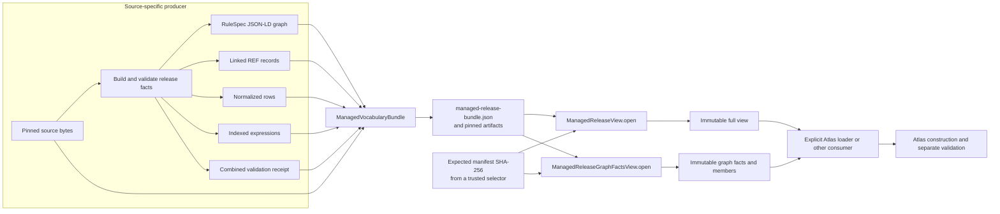
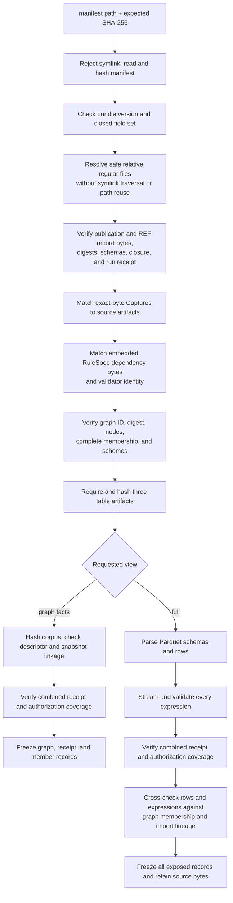
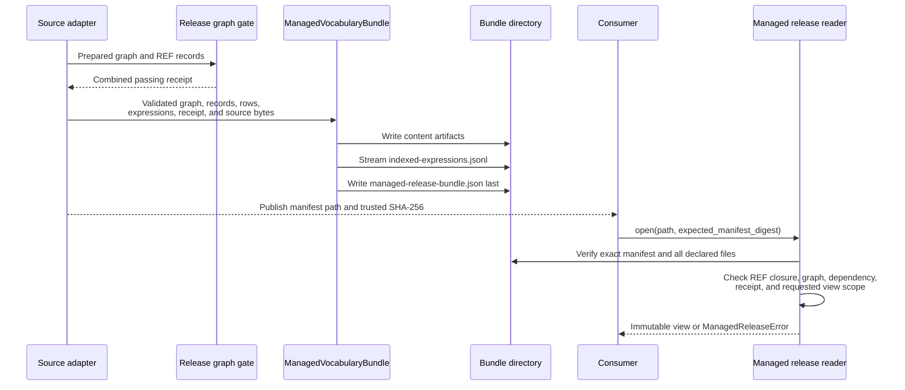

# Generic managed-release bundle and verified reader

<!-- markdownlint-disable MD013 -->

The generic managed-release boundary turns one already prepared vocabulary
release into a deterministic directory of digest-pinned files, then reopens
those files as immutable Python values. Construction centers on
`ManagedVocabularyBundle`; read-time verification centers on
`ManagedReleaseView` and its narrower `ManagedReleaseGraphFactsView` variant.

This boundary packages and checks a release. It does not acquire a publisher
source, decide which source facts belong in a release, run the original
RuleSpec conformance process, admit the release to Atlas, or authorize accepted
product output. Source adapters must build and validate the graph, RefSpec
(REF) records, normalized rows, expressions, and validation receipt before
they construct a bundle.

This page is the implementation detail for the generic bundle portion of
[managed release validation](managed_release_validation.md). The
[REF JSON Binding and expression-corpus validation](managed_release_validation_binding.md)
page covers record schemas and `IndexedExpressionCorpusValidator`. Shared
source acquisition and release foundations are documented in [Registry
foundation](registry_foundation.md); source-specific adapters are documented in
[Publisher source portfolio and adapters](publisher_source_portfolio_and_adapters.md)
and [Managed vocabulary source adapters](managed_vocabulary_source_adapters.md).

## At a glance

| Question | Answer |
| --- | --- |
| What goes in? | An exact default-graph JSON-LD RuleSpec release, linked and sealed REF records, three normalized row sets, indexed expressions, the publication manifest, the combined validation receipt, the embedded RuleSpec dependency bytes, the logical expression-corpus snapshot, and exact source bytes. |
| What happens? | `ManagedVocabularyBundle` assigns stable paths, writes canonical JSON and JSON Lines, writes zstd-compressed all-string Parquet tables, and creates a closed manifest. A reader starts from an external manifest digest, verifies every declared file, checks closure across records, graph, receipt, source bytes, tables, and expressions, and freezes the result. |
| What comes out? | A deterministic bundle directory, a graph-and-members-only `ManagedReleaseGraphFactsView`, or a full `ManagedReleaseView` with members, expressions, identity links, relations, lifecycle participants, mappings, receipts, and source bytes. |
| How do we check it? | Focused tests prove stable order-independent record paths, idempotent writes, streamed corpus output, external manifest pinning, path safety, byte integrity, REF binding validity, exact receipt coverage, graph/table/corpus agreement, immutable results, and deliberate corruption refusals. |

## Place in RefSpec

The generic bundle is the handoff between source-owned release construction
and downstream Atlas loading. It is a static file boundary, not a service or
mutable registry.



The dependency direction matters. `release_model.py` owns canonical JSON
primitives, table column orders, graph digests, errors, and frozen result
types. `binding.py` owns REF JSON Binding validation. `release_graph.py` owns
the gate and RuleSpec component identities recorded by the receipt.
`managed_vocabulary_bundle.py` serializes prepared values, and
`managed_release.py` verifies and exposes them.

The [decision ledger](../docs/decisions.md) supplies the wider ownership
rules. REF-001 keeps RefSpec focused on managed vocabularies; REF-002 assigns
the shared release shape to RuleSpec and the conforming release instance to
RefSpec; REF-023 prohibits duplicate RefSpec terms for RuleSpec concepts; and
REF-024 makes immutable release files and installed packages the product
boundary. This page does not restate those ownership tables.

## Component responsibilities

| Component | Responsibility | Deliberate limit |
| --- | --- | --- |
| [`ManagedVocabularyBundle`](../src/refspec/registry/infrastructure/managed_vocabulary_bundle.py) | Check serializable input identities, assign deterministic paths, create artifacts and the bundle manifest, and write idempotently. | Does not run REF schema validation, RuleSpec conformance, graph/table agreement checks, or source parsing. |
| `reseal_linked_ref_records()` | Refresh local `{id, digest}` references and record digests in dependency order after an authorized semantic edit. | Changes no semantics and does not replace final binding validation. |
| [`ManagedReleaseGraphFactsView`](../src/refspec/managed_release.py) | Verify the external manifest pin, all artifact bytes, linked REF records, RuleSpec graph, complete membership, embedded dependency, and combined receipt; expose graph facts and members. | Does not parse normalized tables or expression records and does not retain source bytes. |
| [`ManagedReleaseView`](../src/refspec/managed_release.py) | Perform all graph-facts checks, parse and cross-check tables and expressions, retain exact source bytes, and expose the full read API. | Does not re-run RuleSpec conformance or grant accepted-output permission. Its declared `usage_ceiling` is `candidateUseOnly`. |
| [`release_model.py`](../src/refspec/release_model.py) | Define canonical digests, normalized-table columns, errors, and immutable managed-release result records. | Reads no schemas, runs no gates, and resolves no permission. |

In the current checked-in call graph, focused tests instantiate
`ManagedVocabularyBundle`; no source adapter constructs it directly. The ELSST
reseal tool uses `reseal_linked_ref_records()` and
`managed_ref_record_artifact_path()` to migrate an existing generic bundle,
then reopens the result with `ManagedReleaseView`. Treat the class as the
generic format owner and public serializer, not as proof that every source
producer has migrated to this path. The Federal Register and ICPSR formats
remain separate, as documented in the [source-specific package
views](managed_release_validation_source_views.md).

## Construction boundary

### Required inputs

`ManagedVocabularyBundle` is a frozen dataclass. Its constructor requires:

| Input | Required shape or meaning |
| --- | --- |
| `rulespec_graph_id` | An absolute Internationalized Resource Identifier (IRI) for the otherwise unnamed default graph document. |
| `rulespec_graph` | A JSON-LD object with a non-empty `@graph` and no top-level `@id`. |
| `ref_records` | One or more operational REF records with unique absolute IRIs and current canonical payload digests. |
| `normalized_labels` | Rows matching `CONCEPT_LABEL_COLUMNS`. |
| `normalized_relations` | Rows matching `CONCEPT_RELATION_COLUMNS`. |
| `normalized_participants` | Rows matching `CONCEPT_EVENT_PARTICIPANT_COLUMNS`. |
| `indexed_expressions` | One or more prepared expression records. |
| `publication_release_manifest` | A sealed `PublicationReleaseManifest`. |
| `combined_validation_receipt` | A sealed `ReleaseGraphValidationReceipt`. |
| `rulespec_dependency_manifest_bytes` | The non-empty dependency file used by the release gate. |
| `expression_corpus_snapshot` | Exactly `{id, digest}`; the ID is absolute and the digest is lowercase SHA-256. |
| `source_artifacts` | One or more absolute artifact IRIs mapped to non-empty exact bytes. |

Constructor checks are intentionally structural. The constructor checks graph
shape, identifier and digest syntax, stale record digests, duplicate records
and paths, required record types, non-empty source bytes, and snapshot shape.
It does not prove that the records satisfy REF JSON schemas or that rows agree
with the graph. A source adapter must complete those semantic checks before it
hands values to the serializer, and a consumer must use a verified reader.

### Linked-record resealing

An edit to one content-digested REF record can change every local record that
references it. `reseal_linked_ref_records()` handles this mechanical cascade:

1. It converts each record to plain JSON and requires unique IDs and non-empty
   types.
2. It discovers nested local `{id, digest}` references.
3. It rejects dependency cycles through the shared `assert_acyclic()` check.
4. It processes records whose dependencies are already sealed, in sorted
   order.
5. It refreshes local reference digests and each record's canonical digest.
6. It returns records in the caller's original order.

The helper preserves the semantic edit supplied by the caller. Run the REF
binding validator after resealing; a fresh digest can still seal an invalid
record.

### Deterministic artifact layout

The serializer emits this logical layout. Source-artifact and operational
record filenames contain content-derived fingerprints, so their exact basenames
depend on the inputs.

```text
managed-release-bundle.json
corpus/
  indexed-expressions.jsonl
records/
  publication-release-manifest.json
  <record-type>-<identity-fingerprint>.json
rulespec/
  release.jsonld
  rulespec-dependency.json
sources/
  <content-derived-source-path>
tables/
  concept_labels.parquet
  concept_relations.parquet
  concept_event_participants.parquet
validation/
  combined-receipt.json
```

The serializer uses canonical UTF-8 JSON with sorted keys. REF record paths
derive from the record type, ID, and digest. Reordering repeated record types
therefore does not move files or change the final artifact map. The three
Parquet files use the exact column order from `release_model.py`, an all-string
physical schema, and zstd compression. Nested row values become canonical JSON
strings.

`artifact_bytes()` returns every artifact in memory and suits tests or small
bundles. `write_to()` writes other artifacts first, streams the expression
corpus record by record through a temporary file, flushes it to disk, and
writes `managed-release-bundle.json` last. A second identical write succeeds;
an existing file with different bytes causes refusal. Manifest-last ordering
prevents a newly written manifest from advertising content that the same call
has not yet written, but the output directory is not one atomic transaction.

### Closed bundle manifest

The builder emits `bundleVersion: "1.0"` and these fields:

| Field | What it binds |
| --- | --- |
| `publicationReleaseManifest` | Relative path and physical SHA-256 digest of the publication record. |
| `refRecords` | One descriptor for every operational REF record. |
| `rulespecGraph` | Exact JSON-LD graph bytes. |
| `rulespecGraphId` | External absolute IRI for the default graph. |
| `rulespecDependencyManifest` | Exact RuleSpec dependency bytes used by the gate. |
| `combinedValidationReceipt` | The combined REF, RuleSpec conformance, RuleSpec behavior, and cross-boundary result. |
| `normalizedTables` | Exactly one named descriptor for each of the three normalized tables. |
| `indexedExpressionCorpus` | Physical artifact descriptor, logical snapshot, positive record count, schema version, and order-independent identity digest. |
| `sourceArtifacts` | Map from source artifact IRI to path, SHA-256 digest, and byte length. |

Ordinary artifact descriptors contain exactly `path` and `sha256`. Source
descriptors add `byteLength`. The generic reader accepts an absent
`sourceArtifacts` field only when the linked records contain no successful
exact-byte capture that requires one; the current generic builder requires and
emits at least one source artifact.

A physical `lookupIndexManifest` does not belong in this bundle. Search indexes
are consumer state. The reader diagnoses identity conflation when such a field
reuses the logical expression-corpus ID, and rejects any other embedded lookup
index as misplaced consumer configuration.

## Trust anchors and digest roles

The reader does not trust a self-consistent directory by itself. The caller
must supply `expected_manifest_digest`, obtained through a trusted selection
or a separately authenticated release. That digest is the root of this
verification boundary.

| Anchor or digest | Question it answers |
| --- | --- |
| Externally supplied manifest SHA-256 | Did the caller open the selected bundle manifest bytes? |
| Per-artifact SHA-256 | Did a declared file change? |
| Source byte length and SHA-256 | Do packaged source bytes match both their descriptor and successful exact-byte `Capture` record? |
| REF canonical payload digest | Did a record's canonical content change? |
| RuleSpec graph digest | Does the JSON-LD graph match the publication manifest's graph reference? |
| Expression-corpus physical SHA-256 | Did file bytes or file order change? |
| Expression-corpus snapshot digest | Does the order-independent set of expression identities match the declared logical corpus? |
| Combined receipt pins | Did the recorded gate cover this graph, dependency, validator, behavior runtime, gate implementation, and exact REF record set? |

These checks establish byte integrity and internal agreement. They do not prove
publisher completeness or source fidelity, and this generic bundle has no
detached-signature verification step. The Atlas publication seal and the
source-fidelity audit are separate boundaries described in the [RefSpec
overview](../README.md) and [Atlas 3.1 binding](../bindings/atlas/3.1/README.md).

## Read and validation sequence

Both public readers use `ManagedReleaseView.open()` internally. The
graph-facts entry point passes a private scope flag and returns a different
public type.



### Checks shared by both readers

Before the modes separate, the reader:

- requires the manifest itself and every artifact to be a regular file;
- allows only non-traversing relative POSIX paths and refuses symlink traversal,
  missing files, duplicate paths, URLs, drive-qualified paths, and absolute
  paths;
- verifies each artifact before parsing it;
- requires a complete, consumer-eligible `PublicationReleaseManifest`;
- validates the publication and linked operational records with REF JSON
  Binding 1.0;
- requires unique record IDs, current record digests, exact nested local
  references, exact publication coverage of operational records, and a linked
  `RunReceipt`;
- requires every named `registryImportSnapshot` to resolve to the exact
  packaged `RegistryImportSnapshot`;
- matches the packaged source-artifact IRI set exactly to successful
  exact-byte `Capture.storageReference` values, then checks capture digest and
  length;
- requires the packaged RuleSpec dependency file to equal the bytes embedded
  in the installed RefSpec package;
- requires the publication record's dependency fields and validator pin to
  match those embedded bytes;
- requires an unnamed default-graph JSON-LD document whose external ID and
  digest match the publication record;
- rejects duplicate graph node IDs and requires at least one exact
  complete-membership release member with one scheme; and
- requires exactly the three known normalized-table descriptors.

The combined receipt must itself pass REF JSON Binding 1.0 and carry
`operationalState: passed`. It must name the exact graph, dependency, validator,
behavior runtime, installed gate implementation, publication record, and every
operational record. Its four verdicts must be `pass`, and its covered RuleSpec
identifier set must equal the graph's identifier set. Selected deployments and
resolved reconciliations also require exact passing authorization-evaluation
coverage, including graph, runtime, scope, evaluation time, subject, effective
eligibility, output digest, and gate-owned behavior-test identity.

The reader checks that a gate produced and bound those results. It does not run
the RuleSpec validator again.

### Full-view checks

`ManagedReleaseView` adds semantic checks over the three tables and the JSON
Lines corpus:

- Parquet columns must exactly match the shared column tuples, and every
  physical column must be a string.
- Required row fields must contain non-empty text. Boolean and ordinal fields
  must parse from their prescribed string forms.
- Managed-release tables reject every `migration_only` row.
- Label IDs, relation IDs, and `(event, participant role, ordinal)` keys must
  be unique.
- Each expression must pass its one compiled JSON schema, content digest, text
  digest, duplicate-ID check, snapshot check, member/release/scheme check, and
  import/distribution lineage check.
- The parsed record count and the order-independent expression-identity digest
  must match the corpus descriptor. Reordering file lines changes the physical
  file digest but not the logical corpus identity.
- Expression IDs must derive from their exact identity, including semantic
  property and source location.
- Every normalized label must match one graph label and one unreused expression.
- Every normalized relation must use exact release members and round-trip to
  the corresponding graph edge.
- Every lifecycle participant must match the event operation, concept type,
  role, release, order, and complete-membership graph facts.
- Every graph `ConceptMapping` must have one subject, predicate, object, source
  release, and target release, with both endpoints in the named complete
  releases.

The graph property index reads each relevant property once. Table checks then
use sets and maps instead of rescanning the graph for each row.

## Graph facts compared with the full view

Choose the smallest view whose verified facts meet the caller's need.

| Capability | `ManagedReleaseGraphFactsView` | `ManagedReleaseView` |
| --- | --- | --- |
| External manifest and artifact digest verification | Yes | Yes |
| Publication, linked REF records, source-capture facts, graph, dependency, and receipt checks | Yes | Yes |
| Complete release membership and scheme access | Yes | Yes |
| Normalized table byte verification | Hashes files only | Parses and cross-checks rows |
| Expression-corpus verification | Hashes bytes and checks descriptor linkage only | Parses and validates every record and logical identity |
| Source-artifact handling | Streams hashes and lengths; retains no bytes | Reads, verifies, and retains exact bytes |
| Public data access | Release ID, graph ID, graph, corpus snapshot reference, receipt, members | All graph-facts access plus source bytes, identity links, expressions, relations, lifecycle participants, and mappings |
| Declared scope | `eligibility_scope = "graphFactsOnly"` | `usage_ceiling = "candidateUseOnly"` |

The graph-facts view deliberately accepts a corpus whose semantics changed if
the physical corpus descriptor and externally selected manifest were also
repinned consistently. It never inspected those semantics. That behavior is a
scope boundary, not proof that the expressions are valid. A caller that needs
labels, expression evidence, normalized relations, lifecycle rows, or source
bytes must open the full view.

Current Atlas concept-release loading uses the graph-facts reader when it needs
the exact graph and complete membership but not the normalized corpus. Older
or specialized callers may still use the full view. Both callers reopen the
bundle from the external digest when they need a fresh check against later
filesystem changes.

## Public query API

Both views expose immutable properties and iterators. They perform exact IRI
matching; they do not normalize query text or infer equivalence.

| API | Result |
| --- | --- |
| `release_id` | Verified `PublicationReleaseManifest` ID. |
| `rulespec_graph_id` | External IRI for the verified default graph. |
| `rulespec_graph` | Deep-frozen exact JSON-LD graph. |
| `expression_corpus_snapshot` | Deep-frozen logical corpus `{id, digest}` reference. In graph-facts mode this is linkage, not semantic eligibility. |
| `release_graph_validation_receipt` | Deep-frozen exact combined receipt. |
| `lookup_member(member_iri)` | One exact complete-release member or `None`; average constant-time map lookup. |
| `iter_members(release_iri=...)` | All members, optionally filtered to one release. |

The full view adds:

| API | Result |
| --- | --- |
| `source_artifact_bytes(iri)` | Exact retained bytes for one packaged source artifact; raises `ManagedReleaseError` when absent. |
| `iter_identity_links(member_iri=..., predicate_iri=...)` | Native version, replacement, and stable-identity links from member records. An object release appears only when the object is another member in this view. |
| `iter_expressions(member_iri=...)` | Raw evidence expressions in physical corpus order. The reader draws no current-assignment conclusion from them. |
| `iter_relations(subject_member_iri=...)` | Normalized graph-backed relations. |
| `iter_lifecycle_participants(event_iri=...)` | Graph-backed predecessor or successor event participants. |
| `iter_concept_mappings(source_member_iri=...)` | Validated mappings. The API does not treat a mapping as exact identity. |

Returned dataclasses use `frozen=True` and `slots=True`. Nested mappings become
`MappingProxyType` instances and lists become tuples. A successful open reads
the selected facts into memory; later file mutation cannot change the existing
view. A later `open()` call rechecks the current files and fails if they no
longer match the same external manifest digest.

### Minimal opening example

```python
from pathlib import Path

from refspec.managed_release import ManagedReleaseView

view = ManagedReleaseView.open(
    Path("release/managed-release-bundle.json"),
    expected_manifest_digest="sha256:<trusted-64-hex-digest>",
)

member = view.lookup_member("https://example.gov/vocabulary/concept/123")
if member is not None:
    expressions = tuple(view.iter_expressions(member_iri=member.member_iri))
```

The caller must obtain the expected digest outside the bundle. Computing it
from the same untrusted directory immediately before `open()` proves internal
agreement, not trusted selection.

## Scaling and performance

Let `B` be total artifact bytes, `G` graph nodes and indexed graph properties,
`R` linked REF records, `T` normalized rows, `E` expression records, and `M`
complete-release members.

| Path | Time | Retained memory | Important detail |
| --- | --- | --- | --- |
| `ManagedVocabularyBundle.__post_init__()` | Linear in supplied records and source bytes needed for path/digest derivation | Cached record and source descriptors plus caller-owned inputs | Linked-record resealing is separate. |
| `artifact_bytes()` | `O(B)` | `O(B)` additional artifact bytes | Materializes the JSON Lines corpus and all files. |
| `write_to()` | `O(B)` | Does not create one corpus-sized bytes object | Streams the expression corpus, but still constructs tables and the other artifact payloads in memory. |
| Graph-facts open | `O(B + G + R)` | Peak validation state includes parsed REF records; the returned view retains the graph, members, corpus snapshot, and receipt, but not tables, corpus records, or source bytes | Still reads every byte to hash it. It reduces parsing and retained data, not integrity work. |
| Full open | `O(B + G + R + T + E)` | Graph, source bytes, all table rows, all expressions, records, and result tuples | Corpus input is streamed, but validated expressions are retained. Parquet tables are converted fully to Python rows. |
| `lookup_member()` | Average `O(1)` | No new collection | Uses the member map. |
| Public iterators | `O(collection size)` | Iterator state only | Filters scan the retained tuple or member map; they are not search indexes. |

The graph-property index is `O(G)` and prevents an `O(G * T)` round-trip
check. Unique-ID and lineage checks use sets and maps. If open time grows more
than expected, profile hashing, Parquet conversion, expression validation, and
graph indexing separately before changing the trust boundary. Physical lookup
indexes remain consumer-owned even when a bundle is large.

## Failure model

Construction raises `ManagedVocabularyBundleError` for unsafe or inconsistent
inputs and `FileExistsError` when a write would overwrite different bytes.
Read-time failures use `ManagedReleaseError` and fail closed. A failed open
returns no partial public view.

Common failure groups are:

- untrusted or stale manifest digest;
- unsafe, missing, symlinked, duplicated, or modified artifact paths;
- malformed JSON, Parquet, digest, record, or manifest shapes;
- incomplete or mismatched REF record closure;
- source bytes that disagree with capture records;
- substituted RuleSpec dependency, validator, runtime, or gate identity;
- graph identity, membership, or receipt coverage drift;
- table schema, uniqueness, lineage, or graph round-trip drift; and
- expression schema, identity, count, snapshot, or corpus-digest drift.

Error messages name the failing artifact, row, record, or requirement where
the boundary has that information. Callers should preserve the original
exception as evidence instead of converting every refusal to a generic
"invalid release" result.

## Contribution guidance

Keep changes at the owning boundary:

1. Build source-specific facts in a source adapter. Do not teach the generic
   serializer how to parse one publisher.
2. Keep the bundle manifest closed. A new top-level field or changed artifact
   meaning requires an intentional bundle-version decision, reader support,
   and negative tests.
3. Keep canonical digest and table-column definitions in `release_model.py`.
   Update serializer, reader, fixtures, and parity tests together when one of
   those definitions changes.
4. Preserve `rulespecGraphId` as the external name of a default graph; do not
   add a top-level `@id` to the JSON-LD document.
5. Use `reseal_linked_ref_records()` only for mechanical digest propagation.
   Validate the final closed record set with REF JSON Binding 1.0.
6. Keep source artifacts exact. The builder's map and successful exact-byte
   capture records must stay one-to-one.
7. Keep expression-corpus identity separate from physical file identity and
   from consumer lookup-index identity.
8. Keep the graph-facts reader narrow. If a caller needs a fact that depends on
   parsed tables or expressions, use the full view rather than weakening the
   meaning of `graphFactsOnly`.
9. Add a negative test with each new invariant. If replacing an existing
   check, retain the old implementation as a test-only oracle and prove
   verdict agreement on real data and mutations before deleting production
   code.
10. Preserve idempotent publication and manifest-last behavior. Do not
    overwrite different existing artifacts in place.

Focused verification for this boundary is:

```sh
pytest -q \
  tests/test_managed_vocabulary_bundle.py \
  tests/test_managed_release_view.py \
  tests/test_managed_release_identity_links.py \
  tests/test_invariants.py
```

`test_managed_vocabulary_bundle.py` covers layout, deterministic names,
streaming, stale digests, and linked-record resealing.
`test_managed_release_view.py` covers the full trust chain and corruption
battery. `test_managed_release_identity_links.py` covers exact native identity
link exposure. `test_invariants.py` preserves the acyclicity oracle used by
linked-record resealing.



## Related documentation

- [Managed release validation](managed_release_validation.md) — module overview
  and links to source-specific managed-release readers.
- [REF JSON Binding and expression-corpus validation](managed_release_validation_binding.md)
  — record-level schemas, linked semantic checks, diagnostics, fixtures, and
  the streamed expression validator used by the full view.
- [Registry foundation](registry_foundation.md) — source-controlled resources,
  source-concept releases, registry claims, and shared evidence records before
  this boundary.
- [Managed vocabulary source adapters](managed_vocabulary_source_adapters.md)
  — acquisition, transport, bridge, and import-coverage seams that feed or
  inspect release construction.
- [Atlas 3.1 binding](../bindings/atlas/3.1/README.md) — the separate normative
  distribution and consumer contract after Atlas construction.
- [Decision ledger](../docs/decisions.md) — implementation authority and the
  reasons behind semantic ownership, file boundaries, validation cost, and
  publication decisions.
