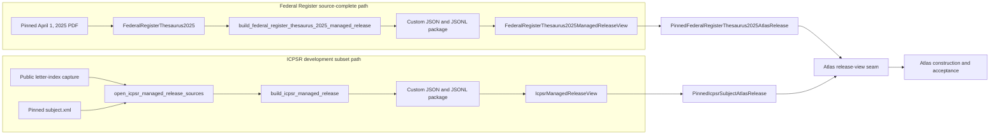
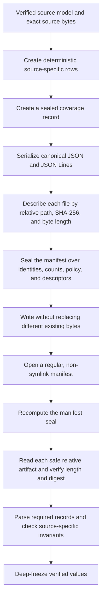
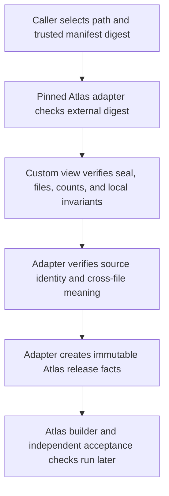

# Managed release validation: source-specific package views

<!-- markdownlint-disable MD013 -->

The Federal Register and ICPSR modules preserve two specialized managed-release
formats that Atlas still consumes. Both modules build deterministic packages,
pin every packaged file by SHA-256 digest and byte length, and return immutable
views after verification. They differ in what they can claim: the Federal
Register package represents the source-complete April 1, 2025 thesaurus, while
the Inter-university Consortium for Political and Social Research (ICPSR)
package represents only a development-use subset whose identities occur in one
public index and whose descriptive content occurs in a separate XML snapshot.

This page documents those source-specific formats. See [Managed release
validation](managed_release_validation.md) for REF JSON Binding validation,
`ManagedVocabularyBundle`, and the generic `ManagedReleaseView`. See [Registry
vocabulary sources](registry_vocabulary_sources.md) for the upstream Federal
Register and ICPSR parsers. The [publisher-source
portfolio](publisher_source_portfolio_and_adapters.md) explains how these
sources fit into the wider registry.

## At a glance

| Question | Federal Register | ICPSR |
| --- | --- | --- |
| What goes in? | One parsed `FederalRegisterThesaurus2025` backed by the exact pinned April 1, 2025 PDF. | A verified public letter-index capture and the separately pinned `subject.xml` snapshot. |
| What happens? | The builder emits every official term, variant occurrence, related reference, suggested open-term pattern, coverage fact, and source artifact. | The builder joins exact labels found in both sources, retains the public term URI and code, and records every unmatched term, role conflict, and unresolved relation. |
| What comes out? | A source-complete, candidate-only package and a read-only `FederalRegisterThesaurus2025ManagedReleaseView`. | A development-only, candidate-only package and an `IcpsrManagedReleaseView` with exact lookup helpers. |
| How do we check it? | The reader verifies seals, all artifact descriptors, the exact PDF digest, required files, record counts, and the absence of `skos:broader`. The Atlas adapter adds the external manifest pin, exact expected counts, source identity, and relation-accounting checks. | The source opener verifies every captured page and the XML pin. The package reader verifies seals, artifacts, coverage linkage, counts, membership, relation targets, and expression text digests. The Atlas adapter adds the external manifest pin, content-derived release identity, complete gap accounting, and concept-expression agreement. |

Both packages allow candidate lookup and refuse accepted-output authority. That
common ceiling does not erase the ICPSR package's `developmentOnly` marker or
turn the Federal Register thesaurus into a global root ontology. These choices
follow [REF-004](../docs/decisions.md#ref-004-use-the-current-federal-register-source-without-a-root-ontology)
and the ICPSR development-marker lineage recorded in
[REF-009](../docs/decisions.md#ref-009-carry-a-development-only-marker-into-the-atlas-rather-than-refuse-it).

## Architecture and component relationships

The two source-specific paths converge only after an Atlas adapter has
rechecked the facts that its projection needs.



The source modules have narrow responsibilities:

- [`federal_register_thesaurus_2025_managed_release.py`](../src/refspec/registry/managed_releases/federal_register_thesaurus_2025_managed_release.py)
  owns the Federal Register package builder, serializer, and reader.
- [`icpsr_managed_release.py`](../src/refspec/registry/managed_releases/icpsr_managed_release.py)
  owns ICPSR capture verification, subset construction, serialization, reading,
  and local lookup.
- [`atlas/federal_register.py`](../src/refspec/atlas/federal_register.py) and
  [`atlas/icpsr.py`](../src/refspec/atlas/icpsr.py) bind an externally selected
  manifest digest, enforce the projection's stronger source rules, and expose
  members and expressions through the Atlas release-view methods.
- [`generate_atlas_v3_full.py`](../tools/generate_atlas_v3_full.py) consumes the
  verified source views during full Atlas construction. These source readers
  do not publish, seal, or serve an Atlas distribution themselves.

## Shared deterministic package pattern

Both modules follow the same physical pattern even though their file sets and
records differ.



The shared rules are concrete:

1. Canonical JSON supplies stable record and manifest bytes. JSON Lines files
   contain one canonical record per line.
2. Each manifest descriptor binds a safe relative path, a lowercase SHA-256
   digest, and the exact byte length.
3. Writers accept an existing byte-identical file and refuse to overwrite a
   different one.
4. Readers reject symlink manifests, final artifact symlinks, absolute or
   parent-traversing paths, malformed JSON, stale seals, missing required
   artifacts, and descriptor drift.
5. Readers copy verified JSON into recursively immutable mappings and tuples.
   A caller cannot change the checked state through the returned view.

The writers differ under interruption. The ICPSR writer publishes each new
file through a temporary file and writes the manifest last. The Federal
Register writer refuses conflicting files but writes the sorted artifact set,
including its manifest, without a manifest-last transaction. Build Federal
Register packages in a new or staging directory, then expose the completed
directory as one unit.

## Federal Register source-complete package

### Build flow

`build_federal_register_thesaurus_2025_managed_release` accepts a parsed
`FederalRegisterThesaurus2025`. It first requires the exact configured PDF
digest and retained PDF bytes, then requires `recorded_by` to be an absolute
Internationalized Resource Identifier (IRI). The builder derives:

- one concept row per official term, with its concept IRI, preferred label,
  recognized alternate labels, active status, and printed source location;
- one row per variant occurrence, including exact redirect evidence and
  `recognizedVariant`, `ambiguous`, or `unresolved` status;
- one row per printed related reference, preserving unresolved target text and
  source location instead of inventing an edge;
- suggested open-term patterns marked `conceptMinted: false`;
- a Lists of Subjects policy that requires explicit source context for local
  open terms and prohibits silent concept minting; and
- a sealed coverage record plus the exact PDF and deterministic source extract.

The manifest names the fixed 2025 edition, parser version, record counts,
coverage record, candidate policy, and every artifact. Its policy makes the
release the strong source-native default for the Federal Register document
profile, not a root ontology. It sets `acceptedOutputAllowed` to `false`.

### Open and read flow

`FederalRegisterThesaurus2025ManagedReleaseView.open` verifies the custom
manifest and all declared artifacts, requires the complete source and record
file set, and independently checks that the packaged PDF matches the pinned
2025 digest. It parses coverage, concepts, variants, relations, suggested
patterns, and the Lists of Subjects policy. It then checks manifest counts
against parsed row counts and rejects any `skos:broader` row because this
edition does not state that hierarchy.

The view exposes immutable fields only:

| Field | Contents |
| --- | --- |
| `manifest` | Source edition, counts, policy, coverage link, and artifact descriptors. |
| `coverage` | Parsed source counts, unresolved evidence, anomalies, and use limits. |
| `concepts` | Official terms with recognized alternate labels and source locations. |
| `variants` | Every variant occurrence, target resolution, and redirect evidence. |
| `relations` | Every printed related reference, including unresolved rows. |
| `suggested_open_term_patterns` | Printed patterns retained without minting concepts. |
| `lists_of_subjects_policy` | The explicit classification and open-term rules. |

The source-specific view has no search method. Direct callers inspect the
immutable rows. Atlas callers should use
`PinnedFederalRegisterThesaurus2025AtlasRelease`: it checks an external
manifest digest before and after opening, enforces the exact 2025 identity and
expected source counts, and converts the package to the narrow member and
expression API used by Atlas.

## ICPSR URI-verified development subset

### Verify source inputs

`open_icpsr_managed_release_sources` begins at a local capture directory. It
verifies the index manifest, parser version, scheme IRI, robots file, each
letter-page descriptor, page order for a complete capture, and the parsed term
identities recorded in the capture manifest. It recomputes the capture digest
and verifies the separately published `subject.xml` by exact byte length and
SHA-256 digest. The result retains the parsed index, parsed XML, capture and
manifest digests, and all source bytes needed to reproduce the package.

This first step matters because the sources supply different facts. The public
index supplies stable term URIs, numeric codes, labels, and label roles. The
XML supplies notes and thesaurus relations. Neither publication proves that it
is the same complete publisher release as the other.

### Build the bounded subset

`build_icpsr_managed_release` compares the two verified sources and includes
only labels present in both. For each included label, it retains the public
concept IRI and code, XML notes, timestamps, and relations. A relation becomes
`uriVerified` only when its target also belongs to the joined subset;
otherwise, the builder preserves its label as `unresolvedSourceSkew` and adds
it to the coverage gaps.

The builder also records XML-only labels, index-only terms, preferred-label
role conflicts, unresolved relations, and complete counts. The resulting
coverage states both sides of its scope precisely:

- `membershipCompleteForVerifiedSubset: true` means every member of the joined
  subset is present;
- `sourceVocabularyComplete: false` means the subset is not the whole ICPSR
  vocabulary;
- `operationalState: developmentOnly`, `candidateLookupAllowed: true`, and
  `acceptedOutputAllowed: false` limit its use.

The release and coverage IRIs contain a scope hash derived from the index
capture digest, XML digest, and managed-release policy version. Indexed
expression identifiers similarly derive from the release, member, semantic
property, original literal, language, and source path. `expected_gap_counts`
lets a real-data build fail when the known split between the two sources
changes.

### Open and query

`IcpsrManagedReleaseView.open` verifies the manifest seal, requires the
development-only and accepted-output markers, verifies every descriptor, and
requires coverage, concepts, and indexed expressions. It checks the exact
coverage reference, record counts, unique absolute concept IRIs, relation
status and target membership, unique expression identifiers, expression
membership, and each normalized text digest. It deep-freezes the result.

The view exposes the four immutable record collections and two query methods:

- `concept(concept_iri)` returns the exact concept row or `None`. It performs a
  linear scan.
- `lookup(text, limit=20)` normalizes the query, scores exact matches above
  prefix matches and prefix matches above contained matches, then prefers
  preferred labels over alternate labels and scope notes. Stable lexical
  tie-breakers make results deterministic.

`PinnedIcpsrSubjectAtlasRelease` adds checks that the direct reader cannot make
alone. It binds the caller's expected manifest digest, recomputes the
source-derived release scope, reconciles coverage counts with concept
relations, verifies that concept records and indexed expressions state the
same text, and carries the `developmentOnly` marker into the projected
Rulespec graph.

## Boundary with the generic managed-release bundle

These packages are not instances of `ManagedVocabularyBundle`, and their
views are not subclasses of `ManagedReleaseView`.

| Generic path | Federal Register and ICPSR source-specific paths |
| --- | --- |
| `ManagedVocabularyBundle` writes the closed `bundleVersion: "1.0"` layout. | Each module writes its own manifest type and source-shaped JSON or JSON Lines files. |
| The bundle contains a `PublicationReleaseManifest`, linked REF records, an exact Rulespec JSON-LD graph, the embedded Rulespec dependency manifest, a combined validation receipt, normalized Parquet tables, and an indexed-expression corpus. | Neither custom format packages that full validation chain or the generic normalized tables. |
| `ManagedReleaseView.open` requires the trusted manifest digest and verifies REF JSON Binding, graph membership, receipt coverage, normalized-table round trips, expression identity, and source-capture linkage. | The direct custom `open` methods verify package internals but take no trusted manifest digest. Their pinned Atlas adapters supply external selection and projection-specific checks. |
| The generic view exposes members, expressions, relations, lifecycle participants, mappings, source bytes, and the verified receipt. | The custom views expose source-shaped records. Atlas adapters translate only the facts that the shared producer needs. |

Do not pass either custom manifest to `ManagedReleaseView.open`. Do not treat a
custom package seal as a REF JSON Binding verdict or a combined Rulespec
validation receipt. When a new source can use the generic bundle, prefer
`ManagedVocabularyBundle` and a thin source adapter. Extend one of these
custom formats only when its existing consumer and source evidence require the
source-specific shape.

## Trust boundaries and failure modes



Each layer proves a different point:

| Failure or risk | Check that owns it |
| --- | --- |
| Wrong package selected at a valid path | The caller's source pin and `PinnedFederalRegisterThesaurus2025AtlasRelease` or `PinnedIcpsrSubjectAtlasRelease`, not the direct custom view. |
| Manifest or artifact bytes changed | Manifest seal, descriptor digest, and byte-length checks in the custom view. |
| Absolute or parent-traversing path, final symlink, or non-file artifact | `_read_regular` in the source-specific module. |
| Required source evidence or record file missing | The custom view's required-file set. |
| Federal Register package uses another PDF, loses expected rows, changes relation accounting, or invents hierarchy | The direct reader checks the PDF and forbids `skos:broader`; the pinned Atlas adapter enforces the exact release identity, expected counts, and resolution-status totals. |
| ICPSR index capture or XML revision changed | `open_icpsr_managed_release_sources`; an expected gap-count change fails the build when the caller supplies that pin. |
| ICPSR development marker removed or accepted-output authority enabled | `IcpsrManagedReleaseView.open` and the pinned Atlas adapter. |
| ICPSR relation points outside the subset or an expression points outside membership | `IcpsrManagedReleaseView.open`. |
| ICPSR coverage disagrees with concept relations, source-derived identity, or expression text | The pinned ICPSR Atlas adapter. |
| Source package passes but Atlas graph or distribution fails | Downstream Atlas construction and acceptance. A source-package reader does not establish Atlas acceptance or publication. |

The readers load each declared artifact before returning and expose in-memory
immutable values. They do not provide lazy access, and they do not retain the
source PDF, XML, or page bytes in the public view. Callers that need raw source
evidence should use the verified source acquisition result or reopen and
reverify the packaged file before use.

## Scaling

Let `A` be the total artifact bytes, `C` concepts, `V` Federal Register
variants, `R` relations, `E` ICPSR expressions, and `H` lookup hits.

- Opening either package takes `O(A + C + V + R + E)` time for hashing,
  parsing, and checks, with peak memory proportional to the package bytes and
  parsed rows. Neither source-specific reader streams its final view.
- The Federal Register build walks source terms and relationships once, with
  additional sorting for recognized variants and deterministic artifact
  order. Its memory use grows with all emitted rows and serialized bytes.
- ICPSR source verification reads every captured page and the XML. Subset
  construction uses label maps for linear joins, then sorts shared labels and
  expressions for deterministic output.
- `IcpsrManagedReleaseView.concept` costs `O(C)` per call.
  `IcpsrManagedReleaseView.lookup` builds a concept map, scans all `E`
  expressions, and sorts the `H` matches: `O(C + E + H log H)`. Use an Atlas
  serving index for repeated or large-scale search; the local helper is a
  deterministic package inspection API.

## Contribution guidance

1. Start with the publisher parser and raw source context. Keep publisher
   identifiers, unresolved rows, locators, and exact bytes. Never repair a
   source gap by guessing a concept or relationship.
2. Preserve each package's declared scope. Federal Register changes must keep
   the April 1, 2025 source pin, no-root rule, and complete relation
   accounting unless a new reviewed edition and identity replace them. ICPSR
   changes must retain every source-version gap and the `developmentOnly`
   marker.
3. Keep output deterministic. Sort any new set-derived collection, use
   canonical JSON, derive identifiers only from explicit stable inputs, and
   add a repeat-build equality test.
4. Add every new artifact to the manifest and the reader's required-file
   checks. Add negative tests for stale seals, changed bytes, missing files,
   unsafe paths, count drift, and any new semantic rule.
5. Update the source-specific Atlas adapter when a package field affects
   projected identity, membership, labels, relations, or declared use. A
   direct-reader test cannot replace an adapter test because the adapter owns
   the external pin and cross-file meaning.
6. Keep the direct view immutable. Add public query methods only for bounded
   package inspection; serving and reusable indexes belong downstream.
7. If shared behavior changes, compare it with
   [`managed_vocabulary_bundle.py`](../src/refspec/registry/infrastructure/managed_vocabulary_bundle.py)
   and [`managed_release.py`](../src/refspec/managed_release.py) before adding a
   third implementation.

Run the focused package and adapter tests after a change:

```sh
pytest -q \
  tests/test_federal_register_thesaurus_2025.py \
  tests/test_icpsr_managed_release.py \
  tests/test_atlas_source_release_readers.py
```

The Federal Register exact-PDF tests require
`REFSPEC_FR_THESAURUS_2025_PATH`. The real ICPSR evidence tests skip when the
ignored local capture is absent. Treat a skipped real-data gate as unexecuted
evidence, not a pass.
