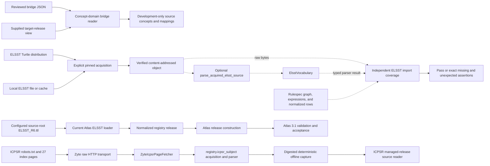
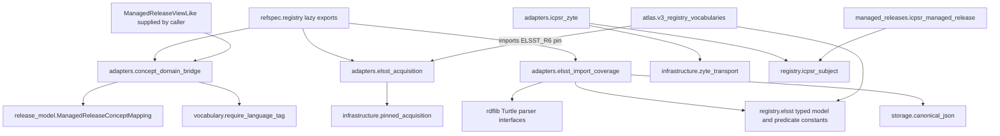
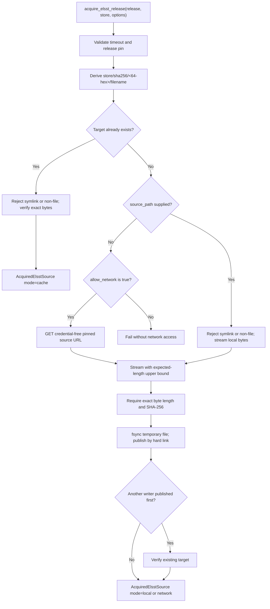
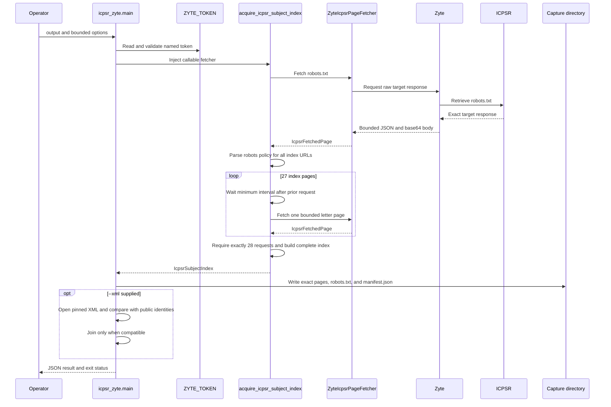

# Managed vocabulary source adapters

The `managed_vocabulary_source_adapters` module contains four small adapters at
RefSpec's source and review boundaries. They authenticate exact bytes, adapt one
network transport to a source reader, and check that an ELSST import preserves
publisher assertions from raw Turtle through logical indexed outputs.

These adapters do not define publisher vocabulary semantics, admit a release to
the Atlas, or authorize product use. Source-specific readers own parsing;
managed-release code owns release membership and validation; the Atlas builder
owns release selection and construction. The [decision
ledger](../docs/decisions.md#ref-024-record-the-cross-product-ownership-boundary-once)
governs the wider product boundary.

This page uses *module* for the four-file group represented in the generated
module tree. There is no single `managed_vocabulary_source_adapters.py` file.

## At a glance

| Question | Answer |
| --- | --- |
| What goes in? | A pinned bridge JSON file and a view that answers target-release membership; ELSST release metadata plus cached, local, or explicitly downloaded Turtle bytes; raw, parsed, and indexed ELSST representations; or bounded ICPSR page requests sent through Zyte. |
| What happens? | The adapters verify byte pins and closed shapes, preserve source and target identities, convert Zyte responses into the ICPSR page interface, and compare independently collected ELSST assertion sets. |
| What comes out? | An immutable development bridge, a verified content-addressed ELSST object, ELSST coverage censuses and differences, or exact `IcpsrFetchedPage` values and a deterministic offline capture. |
| How do we check it? | Run the four focused adapter suites and the registry public-API test. Opt-in environment variables enable checks against retained publisher bytes. |

The publisher parsers and vocabulary data models are documented in [Registry
vocabulary sources](registry_vocabulary_sources.md). Shared pinning and release
readers belong in [Registry foundation](registry_foundation.md) and [Managed
release validation](managed_release_validation.md). This page documents only
the adapter behavior and its immediate integration points.

## Place in RefSpec

The adapters sit before parsing or beside release construction. Each adapter
has a narrow job, and each returns data to a caller that owns the next decision.



Solid arrows show implemented data paths; not every path is wired into the
current Atlas command. Dotted arrows show supported, caller-invoked seams that
are not part of that command's current ELSST path. In the current checkout,
`census_*_elsst()` is a tested public interface but is not invoked by
`generate_atlas_v3_full.py`. The Atlas source-fidelity auditor also performs
its own publisher-to-Atlas comparison rather than delegating to this coverage
module. See [Atlas source fidelity audit](atlas_source_fidelity_audit.md).

The planning input classifies all four files as implementation modules, not as
publisher source rows. See [Atlas planning index](atlas_planning_index.md) for
the meaning of that classification. The source-manifest builder further labels
the ELSST and ICPSR acquisition files `networkHarness`, the ELSST coverage file
`downstreamProjection`, and the bridge reader `support`.

### Scope and authority

| Adapter result | What it establishes | What it does not establish |
| --- | --- | --- |
| Loaded `ConceptDomainBridge` | The bridge bytes match their pin, the JSON has the supported development shape, and the supplied view reports every target endpoint as a member of the named target release. | The target view was independently authenticated, or the mappings are publication-ready, semantically correct for every use, or authorized for accepted output. |
| `AcquiredElsstSource` | The local object has the release's exact byte length and SHA-256 digest. | The Turtle parses, every publisher assertion reaches the Atlas, or the license grants a particular runtime use. |
| `ElsstImportCoverageValidation` with `passed is True` | The covered assertion features have equal canonical sets across raw, parsed, and indexed stages, and all three census records name the same source digest and release IRI. | The indexed package or caller-supplied identity strings were independently authenticated, the source was complete at publication, or an Atlas distribution passed its binding. This module records no exclusions. |
| `IcpsrFetchedPage` | Zyte returned one bounded raw target response with its requested URL, resolved URL, status, content type, and exact body. | The response belongs to a complete or robots-compliant index capture. |
| Capture written by `icpsr_zyte.main()` | The command's ICPSR acquisition accepted robots.txt and all 27 index pages, and the writer persisted the exact bytes and manifest. | A generic caller of the writer supplied a complete index; inspect its `complete` value. The optional XML snapshot also remains unverified until the compatibility check passes. |

## Code structure and dependencies

The group separates artifact validation, acquisition, coverage, and transport.
Private classes implement one file's internal mechanism; callers should use the
public functions and dataclasses.



| File | Main responsibility | Primary output |
| --- | --- | --- |
| [`concept_domain_bridge.py`](../src/refspec/registry/adapters/concept_domain_bridge.py) | Authenticate and load one closed, development-only cross-domain bridge while checking exact target-release membership. | `ConceptDomainBridge` containing immutable source concepts and `ManagedReleaseConceptMapping` values. |
| [`elsst_acquisition.py`](../src/refspec/registry/adapters/elsst_acquisition.py) | Declare an exact ELSST release and resolve it from cache, a local file, or an explicitly enabled network request. | `AcquiredElsstSource` in a content-addressed store. |
| [`elsst_import_coverage.py`](../src/refspec/registry/adapters/elsst_import_coverage.py) | Collect independent raw, parsed, and indexed assertion sets and compare adjacent stages. | `ElsstImportCoverageValidation` or `ElsstImportCoverageError`. |
| [`icpsr_zyte.py`](../src/refspec/registry/adapters/icpsr_zyte.py) | Adapt the reusable Zyte raw-HTTP client to `IcpsrPageFetcher` and provide the capture command. | `IcpsrFetchedPage` values and an ICPSR capture directory. |

### Public import surface

`refspec.registry` lazily re-exports the bridge types and functions, the ELSST
release and acquisition types, and every name in
`elsst_import_coverage.__all__`. Lazy loading prevents a user of one source
reader from initializing every publisher adapter.

`ZyteIcpsrPageFetcher`, `IcpsrZyteError`, and its command remain direct exports
of `refspec.registry.adapters.icpsr_zyte`. The leading-underscore types
`_ManagedReleaseMemberLike`, `_AssertionCollector`, and
`_CoverageLexicalRDFSink` are implementation details, even though they are
important to understanding the design.

## Concept-domain bridge

The bridge reader loads reviewed mapping candidates without merging two
concept domains. The bridge names one source release. Each source concept keeps
its own IRI, labels, optional definitions, evidence IRI, and frozen source
record. A mapping names a separate target member and one of the five Simple
Knowledge Organization System (SKOS) mapping predicates.

### Minimal target-release interface

`ManagedReleaseViewLike` is a structural Python `Protocol`. It requires only:

```python
def lookup_member(member_iri: str) -> _ManagedReleaseMemberLike | None: ...
```

The private member protocol requires one field, `release_iri`. A full
`ManagedReleaseView` satisfies this interface, as can a focused test double.
The bridge checks whether the supplied view reports the endpoint as a member of
the named target release without depending on the rest of the managed-release
reader. The caller still owns independent package authentication. See [Managed
release validation](managed_release_validation.md) for that check and the full
release view.

### Input shape

The loader accepts a closed JSON object. Missing fields, extra fields, repeated
JSON keys, empty required arrays, and duplicate identifiers fail.

| Area | Required content and checks |
| --- | --- |
| Root | `developmentOnly` must be the Boolean `true`; `sourceSnapshot`, `sourceScheme`, `sourceRelease`, `targetRelease`, `sourceConcepts`, and `mappings` must appear, with no additional fields. |
| `sourceSnapshot` | Exact `url`, `revision`, and lowercase `sha256:<64 hex>` fields. This is retained review evidence, not a source fetched by this loader. |
| Source concept | Exact `id`, `prefLabel`, and `evidenceUrl`; optional `altLabel` and `definition`. IDs and evidence URLs must be absolute IRIs. |
| Language maps | Preferred labels contain one non-empty string per valid language tag. Alternate labels and definitions contain one or more unique strings per language. |
| Mapping | A closed Rulespec `ConceptMapping` assertion with source and target endpoints, releases, registry manager, polarity, origin, basis, eligibility, and one SKOS mapping predicate. |

The supported predicates are `skos:exactMatch`, `skos:closeMatch`,
`skos:broadMatch`, `skos:narrowMatch`, and `skos:relatedMatch`, in compact or
full IRI form. A mapping must also have this fixed development posture:

- `rkaf:assertionOrigin = rkaf:humanAsserted`
- `rkaf:epistemicBasis = rkaf:editorialAssertion`
- `rkaf:assertionPolarity = rkaf:affirmed`
- `rkaf:usageEligibility = rkaf:localOperationalUse`

The reader requires every mapping subject to occur among the declared source
concepts in the exact source release. It calls `target_view.lookup_member()`
for every object and requires both the returned member and the mapping record
to name the exact target release. It does not impose one-to-one cardinality;
many-to-one mappings remain valid.

### Load interaction

```mermaid
sequenceDiagram
    participant Caller
    participant Loader as load_concept_domain_bridge
    participant File as Bridge JSON
    participant Target as ManagedReleaseViewLike

    Caller->>Loader: path, expected_sha256, target_view
    Loader->>File: Reject symlink or non-file; read exact bytes
    Loader->>Loader: Compare whole-file SHA-256 with expected pin
    Loader->>Loader: Parse JSON and reject repeated keys
    Loader->>Loader: Validate closed root, snapshot, and source concepts
    loop Every mapping
        Loader->>Loader: Check Rulespec type, posture, releases, and predicate
        Loader->>Loader: Resolve source endpoint in declared source concepts
        Loader->>Target: lookup_member(target IRI)
        Target-->>Loader: Member by exact IRI or None
        Loader->>Loader: Check member.release_iri and mapping target release
    end
    Loader->>Loader: Reject duplicate or source/mapping-colliding IDs
    Loader-->>Caller: Recursively frozen ConceptDomainBridge
```

The returned dataclasses are frozen. Nested mappings become
`MappingProxyType` instances, and lists become tuples. `lookup_source_concept()`
matches an exact IRI; it never searches labels. A
`ManagedReleaseConceptMapping` also remains a mapping assertion, never a
declaration that the two endpoints share identity.

### Two different pins

The bridge carries two independent digests:

1. `expected_sha256` authenticates the bridge JSON file and is checked before
   parsing.
2. `sourceSnapshot.sha256` records the upstream source bytes used during
   review. The reader validates the digest's syntax but does not reacquire or
   hash that source.

A promotion or import workflow must reacquire and verify the upstream snapshot
independently. Treating the retained source digest as a current source check
would skip that required step.

### Tracked development examples

The repository contains two pinned ICPSR-to-Federal Register examples under
[`examples/development/`](../examples/development/README.md). V1 has seven
`skos:closeMatch` mappings to an unpublished 1995 preview target and remains a
format example under
[REF-012](../docs/decisions.md#ref-012-do-not-pursue-the-1995-federal-register-thesaurus-edition).
V2 has 122 `skos:closeMatch` mappings to the 2025 target release.

Both regression tests supply a stub target view. They prove the files' pins and
reader behavior; they do not independently open a packaged target release. A
real integration must construct the target view from the exact, independently
verified target package. No production caller currently loads either bridge.

## ELSST release acquisition

The ELSST adapter declares publisher metadata plus the expected digest and byte
length of each supported distribution. Importing the module performs no I/O
and opens no network connection.

### Release declaration

`ElsstReleaseSource` is a frozen value object. Construction validates:

- a non-empty version;
- absolute release, concept-scheme, and license IRIs;
- a credential-free HTTP or HTTPS source URL;
- a lowercase SHA-256 pin;
- a positive byte length;
- a filename containing one plain path component; and
- non-empty publisher, attribution, and license labels.

The current `ELSST_RELEASES` table contains release 6:

| Field | Value |
| --- | --- |
| Version | `6` |
| Release IRI | `https://elsst.cessda.eu/id/6` |
| Concept-scheme IRI | `https://elsst.cessda.eu/id/6/` |
| Filename | `ELSST_R6.ttl` |
| Expected byte length | `19,915,491` |
| Expected digest | `sha256:c362aec545db916ecb67af0eb9b8b4cecac1cb2118a717b69d8e6dad5591aa95` |
| License metadata | Creative Commons Attribution-ShareAlike 4.0 International, with CESSDA attribution and publisher metadata |

License and attribution describe the publication. The release object has no
`use_authorized` flag, and the adapter does not turn rights metadata into a
runtime permission decision.

### Acquisition data flow

`acquire_elsst_release()` delegates storage and network mechanics to the shared
pinned-acquisition implementation, then converts its result into an
ELSST-specific immutable result.



Resolution order is cache, supplied local file, then explicitly enabled
network. A bad cache entry fails; acquisition does not silently replace it from
another source. Streaming stops when the expected byte length is exceeded.
The temporary file is removed after success or failure, and no unverified file
becomes visible at the final path.

`AcquiredElsstSource` records the release declaration, final path, source and
resolved URLs, verified digest and length, cache status, acquisition mode, and
resolved local source path when applicable.

### Library and command use

For a local retained distribution:

```sh
uv run python -m refspec.registry.adapters.elsst_acquisition \
  6 /absolute/path/to/store \
  --source-path /absolute/path/to/ELSST_R6.ttl
```

On a cache miss, omit `--source-path` only when network access is intended and
add `--allow-network`. The command prints the verified object path. A cache
lookup remains local even when the flag is present.

The Atlas vocabulary loader imports `ELSST_R6` for its source URL, digest,
length, filename, and release IRI. It does not call
`acquire_elsst_release()` and expects `ELSST_R6.ttl` under its configured source
root. The acquisition command's nested content-addressed path therefore does
not become an Atlas loader input automatically.

The separate `parse_acquired_elsst_source()` seam rechecks the acquired object
and verifies that the declared concept-scheme IRI occurs in the parsed source.
The current Atlas path calls `parse_elsst_file()` directly and does not compare
the parsed schemes with `ELSST_R6.concept_scheme_iri`.

## ELSST assertion-level import coverage

The coverage adapter answers a narrow question: did a covered ELSST assertion
disappear or appear while moving from publisher Turtle to the typed parser and
then to the logical indexed outputs that consumers receive?

It collects each stage independently. The raw census never calls
`ElsstVocabulary`; the parsed census reads only `ElsstVocabulary`; the indexed
census reconstructs assertions from emitted graph nodes, expressions, and
normalized rows. Shared counters cannot make all three stages agree by
construction.

### Three-stage data flow

```mermaid
flowchart LR
    bytes["Exact ELSST Turtle bytes"] --> rawSink["_CoverageLexicalRDFSink"]
    rawSink --> raw["raw ElsstImportCensus"]

    bytes --> parser["registry.elsst parser"]
    parser --> vocabulary["ElsstVocabulary"]
    vocabulary --> parsedCollector["Typed-field collectors"]
    parsedCollector --> parsed["parsed ElsstImportCensus"]

    vocabulary --> releaseWork["Managed-release emission and normalization"]
    releaseWork --> expressions["Expression records"]
    releaseWork --> graph["Rulespec JSON-LD graph"]
    releaseWork --> labels["Normalized label rows"]
    releaseWork --> relations["Normalized relation rows"]
    expressions --> indexedCollector["Logical-output collectors"]
    graph --> indexedCollector
    labels --> indexedCollector
    relations --> indexedCollector
    indexedCollector --> indexed["indexed ElsstImportCensus"]

    raw --> compareOne["Exact set comparison"]
    parsed --> compareOne
    parsed --> compareTwo["Exact set comparison"]
    indexed --> compareTwo
    compareOne --> validation["ElsstImportCoverageValidation"]
    compareTwo --> validation
```

### Covered assertion families

Every census contains exactly these eleven features:

| Feature | Assertions represented |
| --- | --- |
| `labels` | SKOS preferred, alternate, and hidden labels. |
| `languages` | A separate identity for the language tag on covered labels, notes, and identifiers. |
| `notation` | SKOS notation literals. |
| `notes` | Supported SKOS notes and the ELSST additional-content note. |
| `hierarchy` | SKOS broader and narrower relations. |
| `associativeRelations` | SKOS related relations. |
| `mappings` | Supported SKOS mapping relations. |
| `status` | ELSST deprecation assertions. |
| `replacements` | `isReplacedBy` and `replaces` relations. |
| `identifiers` | Literal identifiers plus version and prior-version relations. |
| `membership` | Concept and concept-scheme types, scheme membership, and top-concept relations. |

The feature set is closed. Adding a predicate to the parser without updating
the applicable raw, parsed, and indexed collectors either produces a coverage
difference or leaves the new assertion family outside this check. Contributors
must make that choice explicit and add a negative fixture.

### Raw lexical sink

`_CoverageLexicalRDFSink` subclasses rdflib's `RDFSink` but does not retain an
RDF graph of source assertions. It receives statements from the Turtle
`SinkParser`, classifies covered predicates, and sends canonical identities
directly to feature collectors.

The sink creates literals with `normalize=False`, which preserves the source
lexical form. It accepts only the Turtle default graph and rejects a named or
quoted graph. Covered assertion subjects and predicates must be IRIs; their
objects must be IRIs or literals. Unsupported predicates are ignored before
that endpoint validation. `census_raw_elsst_turtle()` also requires a `bytes`
object, verifies the source digest and byte length before parsing, and wraps
known Turtle syntax errors as `ElsstImportCoverageError`.

### Compact assertion sets

`_AssertionCollector` stores a set of 32-byte SHA-256 values, one for each
canonical assertion identity. It keeps at most three canonical strings for
human-readable diagnostics. The smallest retained hashes make those examples
deterministic rather than dependent on parse order.

`freeze(feature)` sorts the assertion hashes and computes a feature digest
under the versioned domain prefix
`RefSpec ELSST import coverage assertion-set digest v1`. The resulting
`ElsstFeatureCensus` exposes the set, count, digest, and bounded examples.
Identical duplicate triples collapse to one set member; this is assertion-set
coverage, not source-statement multiplicity accounting.

Canonical literal identities retain subject, predicate, lexical form,
language, and datatype. IRI identities retain subject, predicate, and object.
The separate language identity includes the complete assertion, so the same
language on two different assertions remains two covered language assertions.

### Indexed reconstruction

`census_indexed_elsst()` first reads the exact `prov:hadMember` set from the
emitted release node. It then restricts collection to those members and the
declared concept scheme.

- Labels must occur in both expression records and non-migration normalized
  label rows. Scheme labels come from the emitted graph.
- Hierarchy and associative relations come from non-migration normalized
  relation rows whose endpoints both belong to the release.
- Mappings, status, replacements, and membership come from the emitted graph.
- Notations and notes combine the applicable expression and scheme-graph
  assertions.
- Identifiers combine expression records with eligible graph identifier
  assertions. Graph literal `dcterms:identifier` values are scheme-scoped;
  member version links can also qualify.
- Language identities combine the expression and scheme-graph language
  assertions.

This reconstruction checks what logical consumers can receive. A label present
only in the graph but absent from the expression and normalized-label paths does
not count as indexed coverage.

### Comparison and reporting

`validate_elsst_import_coverage()` requires the ordered stages `raw`, `parsed`,
and `indexed`. All three must bind the same source digest and release IRI. It
then performs exact set comparisons for every feature across `rawToParsed` and
`parsedToIndexed`.

Each `ElsstCoverageDifference` records the transition, counts, set digests,
missing and unexpected counts, and up to three examples in each direction.
`validation.passed` is true only when the difference tuple is empty.
`require_complete_elsst_import_coverage()` returns the same validation on
success and raises a concise feature-and-transition summary on failure.

The raw stage computes its digest from exact bytes. The parsed stage copies the
digest stored on `ElsstVocabulary`, while the indexed stage accepts
`source_sha256` from its caller. All three accept their release IRI from the
caller, and the census does not retain or compare a concept-scheme IRI. The
validator compares those stored identity strings; it does not authenticate the
indexed package. Call it only with outputs from a separately authenticated
managed-release build.

`feature_rows()` converts the result into reporting rows with source, parsed,
and indexed counts and digests. It marks caller-selected required features and
totals failed assertions. Exclusions and detailed failure lists are empty in
those rows; read `differences` for diagnostics.

`required_features` changes only the reporting flag. Validation always compares
all eleven covered features, and `require_complete_elsst_import_coverage()`
fails on a difference in any one of them.

A typical caller coordinates the three public census functions explicitly:

```python
raw = census_raw_elsst_turtle(
    source_bytes,
    source_url=release.source_url,
    release_iri=release.release_iri,
    expected_sha256=release.expected_sha256,
    expected_byte_length=release.expected_byte_length,
)
parsed = census_parsed_elsst(vocabulary, release_iri=release.release_iri)
indexed = census_indexed_elsst(
    source_sha256=release.expected_sha256,
    release_iri=release.release_iri,
    concept_scheme_iri=release.concept_scheme_iri,
    expressions=expressions,
    rulespec_graph=rulespec_graph,
    normalized_labels=normalized_labels,
    normalized_relations=normalized_relations,
)
require_complete_elsst_import_coverage(raw, parsed, indexed)
```

## ICPSR acquisition through Zyte

`ZyteIcpsrPageFetcher` adapts the shared `ZyteHttpFetcher` to the callable
`IcpsrPageFetcher` interface. It owns no HTML or XML parsing. The ICPSR source
module owns robots checks, index parsing, identity construction, source-version
comparison, and capture writing.

### Fetcher behavior

Construction validates the token and a credential-free HTTPS Zyte API URL.
`from_environment()` reads only `ZYTE_TOKEN` and rejects an empty, whitespace-
padded, quoted, or unsupported credential. Calling the fetcher:

1. validates a positive timeout and byte limit in the shared transport;
2. validates the target as a credential-free HTTP or HTTPS URL;
3. asks Zyte for raw response bytes and headers;
4. bounds the provider JSON response;
5. validates required response fields and types, allows additional fields, and
   base64-decodes the target body;
6. enforces the caller's target-body byte limit; and
7. returns `IcpsrFetchedPage` with requested and resolved URLs, status, content
   type, and exact bytes.

The requested target must be credential-free. The shared transport requires
the provider's resolved URL only to be a string, and `IcpsrFetchedPage` then
requires an absolute HTTP or HTTPS URL. The current code does not reject
userinfo or a cross-origin resolved URL. Preserve that value as observation
data; do not treat it as same-origin or credential-free proof.

Provider failures give `IcpsrZyteError` a sanitized outer status or generic
message. Tests check that `str(error)` omits the response body and token.
Transport and adapter errors retain chained causes, however, so a full
traceback can contain provider exception text. Treat the cause chain and an
unredacted traceback as sensitive.

The frozen fetcher dataclasses currently include their `token` fields in the
generated Python `repr`. Do not log or interpolate a fetcher instance. The
tests prove that their fixture page and outer exception messages omit the input
token; they do not make an arbitrary provider-returned URL, the fetcher
object's representation, or the cause chain secret-safe.

### Capture process



The source acquisition always fetches `robots.txt` first. It checks that the
configured user agent may fetch all 27 public index URLs, then fetches those
pages at the configured minimum interval. It refuses a 29th request, a changed
requested URL, a non-200 target response, an oversized body, an incomplete
letter set, duplicate official codes or labels, and malformed source pages.

Capture writing uses temporary files and hard links. An existing exact file is
accepted; a symlink, non-file, or different existing payload is refused. The
manifest binds parser version, scheme, observation time, robots bytes, every
page, parsed official identities, completeness, and a capture digest.

When `--observed-at` is omitted, the command records the current UTC second.
Supply it explicitly when replaying a capture whose manifest identity must be
reproducible.

### Optional XML comparison

`--xml` opens the one pinned ICPSR `subject.xml` revision and compares its
labels and preferred/non-preferred roles with the complete public index. The
join uses labels only to bind the XML semantics to official public identities;
it never mints an identity from a label.

If an XML term lacks a public identity or its role changed, the command prints
the compatibility report, sets `xmlJoinStatus` to
`blockedBySourceVersionDrift`, and exits with status 2. Otherwise, it reports
the joined and index-only counts. The capture itself has already been written
in either case.

Run the command with the credential already present in the environment:

```sh
export ZYTE_TOKEN
uv run python -m refspec.registry.adapters.icpsr_zyte \
  /absolute/path/to/capture/index \
  --observed-at 2026-09-01T12:00:00Z \
  --xml /absolute/path/to/subject.xml
```

An ICPSR managed-release source directory places this index capture under
`index/` and the pinned XML at `subject.xml`. The managed-release source reader
reopens every declared file, rebuilds the index, verifies the manifest's file
descriptors and self-declared capture digest, and checks the XML against its
external pin. Its builder then compares the two sources, constructs the shared
URI-verified subset, and records source-version and unresolved-relation gaps.
Unlike the command's optional join, the managed-release build does not require
the gap set to be empty. See [Managed release
validation](managed_release_validation.md) for that later stage.

The full Atlas generator applies a separately reviewed ICPSR union policy over
the managed package and retained source evidence. Do not equate a successful
capture, the command's XML join, or the managed-release subset with complete
ICPSR Atlas inclusion. The current construction path belongs in [Atlas
registry loading](atlas_registry_loading.md) and [Atlas distribution
builder](atlas_distribution_builder.md).

## Current integration points

The current checkout uses the four adapters unevenly. The distinction between
a reusable API and a build gate matters.

| Adapter | Current live use |
| --- | --- |
| Concept-domain bridge | Lazy public exports and focused regressions over the two tracked development files. No production source or Atlas builder calls `load_concept_domain_bridge()`. |
| ELSST acquisition | The command and library can populate a content-addressed store. The Atlas vocabulary loader imports `ELSST_R6` as the authoritative pin declaration, then opens a separately configured cached file. |
| ELSST coverage | Lazy public exports, public-API identity checks, synthetic three-stage regressions, and opt-in raw-R6 census. No current Atlas generation or source-fidelity command calls the three-stage validator. |
| ICPSR Zyte | Direct callable transport and command for producing the offline capture consumed by the ICPSR source and managed-release readers. Tests replace the provider connection with exact local responses. |

The Atlas loader keeps English label and note candidates, all notations,
untagged or English metadata literals, deprecation state, and direct semantic
relations whose endpoints are release members. It does not import
`mapping_relations`. This English-selected `RegistryRelease` is not a substitute
for the full logical managed-release outputs expected by
`census_indexed_elsst()`. The construction is documented in [Atlas registry
loading](atlas_registry_loading.md), and the downstream distribution is
documented in [Atlas distribution builder](atlas_distribution_builder.md).

## Failure model

Expected data and acquisition refusals use boundary-specific `ValueError`
subclasses. Programming errors and exceptions from injected collaborators may
propagate.

| Boundary | Error | Representative refusals |
| --- | --- | --- |
| Bridge JSON | `ConceptDomainBridgeError` | Bad file pin, symlink or non-file, malformed or duplicate-key JSON, missing or unexpected fields, invalid language tag, unsupported mapping relation, wrong development posture, unknown source endpoint, absent target member, release mismatch, or duplicate IDs. |
| ELSST declaration and acquisition | `ElsstAcquisitionError` | Invalid release metadata, bad digest syntax, unsafe filename, bad cache object, missing explicit local/network choice, timeout, network error, byte-length mismatch, digest mismatch, or publication race whose winner has different bytes. |
| ELSST coverage | `ElsstImportCoverageError` or `TypeError` | Wrong object type or source pin, malformed Turtle, covered blank-node endpoint, non-default graph, incomplete feature set, malformed emitted graph or release membership, stage-order mismatch, source/release mismatch, or, when `require_complete_elsst_import_coverage()` is used, any covered missing or unexpected assertion. |
| ICPSR Zyte and source acquisition | `IcpsrZyteError` or `IcpsrSubjectError` | Invalid credential or URL, provider response error, malformed provider JSON/base64/headers, oversized payload, robots refusal, request-count drift, incomplete index, source parse error, capture collision, or XML/index version drift. |

Command-line argument and acquisition errors use `argparse`'s error path and
exit with status 2. The XML compatibility block also returns 2, but prints a
machine-readable JSON result first.

## Developer workflow

### Change a bridge artifact or reader

1. Preserve separate source and target identities. Do not turn label equality
   into shared identity or use the bridge as a synthesized vocabulary.
2. Read the retained source around every reviewed mapping and verify rendered
   source pixels when the evidence is a PDF or printed page, as required by
   [`AGENTS.md`](../AGENTS.md).
3. Treat any byte change as a new artifact pin. Update the matching digest
   constant and the tracked regression together.
4. Use a target view built independently from the exact target package for an
   integration test. A stub is sufficient only for reader-unit behavior.
5. Add a negative fixture for each new field or rule. Keep the JSON shape
   closed and recursively immutable.
6. Do not assume mapping cardinality is one-to-one or that
   `skos:exactMatch` authorizes identity lookup.

### Add or update an ELSST release

1. Record publisher, attribution, license, release and scheme IRIs, source URL,
   plain filename, exact byte length, and exact SHA-256 in a new
   `ElsstReleaseSource` value.
2. Retain the publisher bytes and verify them through
   `acquire_elsst_release()` or the shared pinned-acquisition path.
3. Update parser counts and source-specific tests in `tests/test_elsst.py`.
4. Update the Atlas vocabulary loader and its expected resource, label, and
   relation counts only after reading the source records behind any changed
   behavior.
5. Add raw, parsed, and indexed coverage for any newly supported assertion
   family. Mutate each transition so a dropped and an invented assertion both
   fail.
6. Update the source-fidelity specification independently; coverage equality
   inside this module does not replace publisher-to-Atlas auditing.

### Change ELSST coverage

Keep the three observations independent. The raw stage must continue to parse
exact Turtle bytes without calling the typed ELSST parser. The parsed stage
must read typed fields, and the indexed stage must reconstruct only from the
logical outputs a consumer receives.

When replacing any running check, keep the old implementation as a copied
test-only oracle and prove agreement over real data and a mutation battery,
following the repository rule in [`AGENTS.md`](../AGENTS.md). A clean-source
pass alone does not show that the replacement rejects loss and invention.

### Change the ICPSR transport

1. Keep HTML and XML interpretation in `registry.icpsr_subject`; the adapter
   should return exact response bytes and metadata.
2. Preserve the injected `IcpsrPageFetcher` interface so acquisition tests can
   run offline.
3. Bound both provider and target responses. Require a credential-free target
   URL, preserve the observed resolved URL, and add explicit same-origin or
   userinfo checks before relying on either property. Keep outer errors
   sanitized, and redact chained causes and tracebacks before logging them.
4. Keep `ZYTE_TOKEN` as the only credential source for the command. Do not add
   fallback environment names or dotenv parsing.
5. Exercise robots, request-count, rate-limit, malformed-response, secret-
   safety, capture, and XML-drift paths with negative tests.
6. Add direct tests when changing `main()`. The current adapter suite exercises
   the fetcher but does not call the capture-before-compatibility or exit-2 JSON
   branches through the command entry point.

### Focused checks

Run from the repository root:

```sh
uv run pytest -q \
  tests/test_concept_domain_bridge.py \
  tests/test_elsst_acquisition.py \
  tests/test_elsst_import_coverage.py \
  tests/test_icpsr_zyte.py \
  tests/test_registry_public_api.py
```

Enable retained-source checks explicitly:

```sh
REFSPEC_ELSST_R6_PATH=/absolute/path/to/ELSST_R6.ttl \
  uv run pytest -q \
  tests/test_elsst_acquisition.py \
  tests/test_elsst_import_coverage.py \
  tests/test_elsst.py

REFSPEC_ICPSR_INDEX_PAGE_A_PATH=/absolute/path/to/a.html \
  uv run pytest -q tests/test_icpsr_zyte.py
```

For an ELSST change that reaches Atlas construction or fidelity checks, also
run the source-dependent vocabulary normalization, the source-fidelity suite,
the generated-artifact check, and then the full repository gate as appropriate:

```sh
uv run pytest -q -m slow \
  tests/test_atlas_v3_registry_vocabularies.py -k elsst
uv run pytest -q tests/test_verify_atlas_source_fidelity.py
make check-generated
make test
```

### Current checkout verification

Verified on 2026-09-01, the five focused suites above report `52 passed` when
pointed at the retained ELSST R6 distribution and ICPSR page-A capture. The
ELSST parser suite separately reports `11 passed`, and the slow exact ELSST
Atlas-normalization case reports `1 passed` with 16 unrelated cases
deselected. The source-fidelity suite reports `275 passed`. The retained R6
file matched its declared 19,915,491-byte length and SHA-256 pin.

Without those two environment variables, the five focused suites report `49
passed, 3 skipped`; the skipped cases are only the opt-in publisher-byte
checks. All synthetic, pin, mutation, error, fetcher, and lazy-export tests
passed. The current tests do not invoke `icpsr_zyte.main()` directly.

This result verifies the adapter suites, the retained ELSST parser input, and
the exact ELSST normalization case in the current checkout. It does not claim
that a complete ICPSR capture was reacquired, the ELSST three-stage coverage
was run against full managed outputs, or an Atlas distribution was built.

## Related documentation

The sibling module links below follow the filenames in the generated module
tree. They resolve as the companion pages are generated; this checkout
currently contains this page and the Atlas planning-index page.

- [Repository overview and document index](../README.md)
- [Atlas in the United States and Europe](../ATLAS_US_EU_COMPARISON.md) for
  strategic context, not implementation authority
- [Atlas 3.1 binding](../bindings/atlas/3.1/README.md) for published
  distribution and consumer rules
- [Publisher source portfolio and adapters](publisher_source_portfolio_and_adapters.md)
- [Atlas planning index](atlas_planning_index.md)
- [Registry vocabulary sources](registry_vocabulary_sources.md)
- [Registry foundation](registry_foundation.md)
- [Managed release validation](managed_release_validation.md)
- [Atlas source fidelity audit](atlas_source_fidelity_audit.md)
- [Atlas registry loading](atlas_registry_loading.md)
- [Atlas distribution builder](atlas_distribution_builder.md)
- [Source release trust and fidelity assurance](source_release_trust_and_fidelity_assurance.md)
