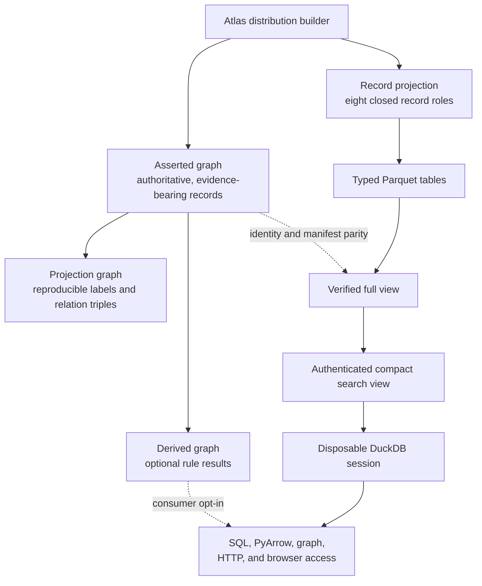

# RefSpec repository overview

## Purpose

RefSpec converts public-sector vocabularies, code lists, classifications, identifier authorities, and crosswalks into the **Atlas**: a verified, immutable reference-data product.

Source readers process digest-pinned publisher files while preserving provenance, ambiguity, gaps, and refusals. The build produces canonical Resource Description Framework (RDF) data and authenticated Parquet views. Consumers such as SpicySearch can verify and read these artifacts without importing RefSpec or trusting a live service.

The repository is an unpublished editor’s draft. No license or W3C endorsement is claimed.

## End-to-end architecture

### Build, validate, seal, and serve

```mermaid
flowchart LR
    PUB["Publisher artifacts<br/>RDF, JSON/XML, HTML,<br/>PDF, CSV/XLSX, and APIs"]
    READ["Source adapters and registry readers<br/>src/refspec/registry"]
    RESULTS["Typed results<br/>evidence, releases, gaps,<br/>and explicit refusals"]
    LOAD["Atlas registry loading<br/>normalized RegistryRelease values"]

    PLAN["Atlas planning index<br/>classification and drift checks<br/>(does not authorize admission)"]

    ASSERT["Build asserted RDF records"]
    DERIVE["Optional derived graph<br/>evidence-bearing and non-authoritative"]
    WRITE["Write canonical packs,<br/>manifests, and receipts"]

    RDF["Candidate Atlas 3.1<br/>RDF distribution"]
    PARQUET["Typed Parquet view"]
    VALIDATE["Independent Atlas 3.1 validator<br/>13 conformance gates"]
    SEAL["Detached release seal"]
    VERIFY["Verify seal and<br/>Parquet manifest"]
    ACCESS["DuckDB, explorer,<br/>and SpicySearch"]

    AUDIT["Independent source-fidelity audit"]
    AUDITOUT["Fidelity report and receipt"]

    PUB --> READ --> RESULTS
    RESULTS -->|"explicitly selected"| LOAD --> ASSERT
    ASSERT --> WRITE
    ASSERT --> DERIVE --> WRITE
    PLAN -. "placement and drift evidence" .-> WRITE

    WRITE --> RDF
    WRITE --> PARQUET
    RDF --> VALIDATE --> SEAL
    PARQUET --> SEAL
    SEAL --> VERIFY
    PARQUET --> VERIFY --> ACCESS

    PUB -. "independent reread" .-> AUDIT
    RDF -. "built claims" .-> AUDIT
    AUDIT --> AUDITOUT
```

The seal proves that specific Atlas and Parquet bytes passed the independent checks. It does not prove that a publisher capture was complete or that every captured claim was transcribed faithfully. The separate source-fidelity audit checks the latter relationship.

### Data authority and read-optimized views

The asserted RDF graph remains the canonical source of Atlas meaning. Projection data are reproducible compatibility views. Derived relationships are non-authoritative and require explicit consumer opt-in. DuckDB databases, indexes, HTTP responses, and browser files are replaceable views of authenticated Parquet data.

## Core module documentation

- **Publisher source portfolio and adapters:** [area overview](/Users/mikewolfd/Work/RefSpec/wiki/publisher_source_portfolio_and_adapters.md), [planning index](/Users/mikewolfd/Work/RefSpec/wiki/atlas_planning_index.md), [managed adapters](/Users/mikewolfd/Work/RefSpec/wiki/managed_vocabulary_source_adapters.md), [vocabulary sources](/Users/mikewolfd/Work/RefSpec/wiki/registry_vocabulary_sources.md), [code and classification sources](/Users/mikewolfd/Work/RefSpec/wiki/registry_code_and_classification_sources.md), [organization sources](/Users/mikewolfd/Work/RefSpec/wiki/registry_organization_sources.md), [legal and identifier sources](/Users/mikewolfd/Work/RefSpec/wiki/registry_legal_and_identifier_sources.md), and [crosswalk and package sources](/Users/mikewolfd/Work/RefSpec/wiki/registry_crosswalk_and_package_sources.md).

- **Source trust and fidelity:** [area overview](/Users/mikewolfd/Work/RefSpec/wiki/source_release_trust_and_fidelity_assurance.md), [registry foundation](/Users/mikewolfd/Work/RefSpec/wiki/registry_foundation.md), [managed release validation](/Users/mikewolfd/Work/RefSpec/wiki/managed_release_validation.md), and [source-fidelity audit](/Users/mikewolfd/Work/RefSpec/wiki/atlas_source_fidelity_audit.md).

- **Atlas construction:** [pipeline overview](/Users/mikewolfd/Work/RefSpec/wiki/atlas_release_construction_pipeline.md), [registry loading](/Users/mikewolfd/Work/RefSpec/wiki/atlas_registry_loading.md), [derived graph](/Users/mikewolfd/Work/RefSpec/wiki/atlas_derived_graph.md), and [distribution builder](/Users/mikewolfd/Work/RefSpec/wiki/atlas_distribution_builder.md).

- **Projection and access:** [area overview](/Users/mikewolfd/Work/RefSpec/wiki/atlas_distribution_projection_and_access.md), [record projection](/Users/mikewolfd/Work/RefSpec/wiki/atlas_record_projection.md), and [serving views](/Users/mikewolfd/Work/RefSpec/wiki/atlas_serving_views.md).

Repository-wide references: [README](/Users/mikewolfd/Work/RefSpec/README.md), [normative Atlas 3.1 binding](/Users/mikewolfd/Work/RefSpec/bindings/atlas/3.1/README.md), [Parquet artifact format](/Users/mikewolfd/Work/RefSpec/docs/atlas-parquet-view.md), [decision ledger](/Users/mikewolfd/Work/RefSpec/docs/decisions.md), and [U.S./EU strategic comparison](/Users/mikewolfd/Work/RefSpec/ATLAS_US_EU_COMPARISON.md).