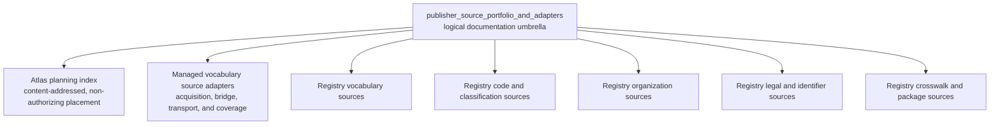
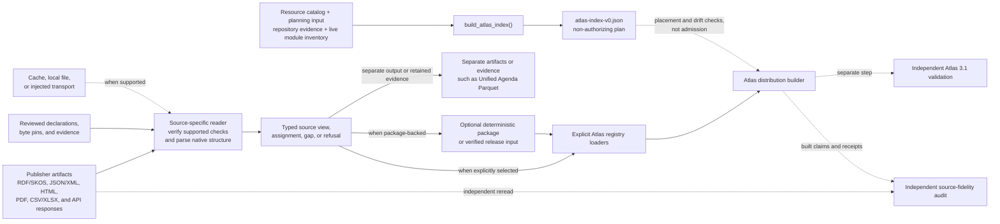

# Publisher source portfolio and adapters

## Purpose

`publisher_source_portfolio_and_adapters` is a logical documentation umbrella over `src/refspec/atlas_index.py` and source-specific code under `src/refspec/registry/`. It is not a single Python package or aggregate API.

The source readers turn reviewed publisher artifacts into typed, traceable results for later RefSpec stages. Each reader applies the checks its source supports, such as origin, byte length, SHA-256 digest, media type, structure, identifiers, and counts. It preserves publisher meaning, provenance, scope limits, ambiguity, gaps, and explicit refusals. Supporting components provide narrowly scoped acquisition, transport, bridge, coverage, crosswalk, identity-review, and packaging workflows.

The planning index runs separately. It records non-authorizing resource placement across the `subject`, `entity`, `value`, and `legalIdentity` rings, hashes repository evidence, assigns content-derived identities, and requires every live registry module to be classified before generation succeeds.

A successful parse, package reopen, or planning row does not authorize Atlas admission, publication, or product use. Explicit loaders select source results; the source-fidelity audit independently compares publisher bytes with built claims; Atlas 3.1 validation checks the completed distribution in a separate step.

## Architecture

### Component map

### Processing and trust boundaries

No source must follow every branch. A reader may stop with evidence or a refusal, feed a separate artifact, build a checked package, or reach Atlas through an explicit loader. The planning index does not run source readers or grant admission; downstream construction reconciles its placements with separately loaded releases.

## Core component documentation

| Component | Responsibility | Documentation |
| --- | --- | --- |
| Atlas planning index | Builds the content-addressed, non-authorizing placement plan and enforces registry-module classification. | [Atlas planning index](atlas_planning_index.md) |
| Managed vocabulary source adapters | Covers the concept-domain bridge, ELSST acquisition and three-stage coverage, and ICPSR transport. | [Managed vocabulary source adapters](managed_vocabulary_source_adapters.md) |
| Registry vocabulary sources | Reads native vocabularies, taxonomies, publisher lists, and source-scoped topic evidence without inventing source claims. | [Registry vocabulary sources](registry_vocabulary_sources.md) |
| Registry code and classification sources | Reads publisher codes, classifications, field dictionaries, identifier structures, and record-scoped evidence. | [Registry code and classification sources](registry_code_and_classification_sources.md) |
| Registry organization sources | Reads publisher-maintained organization rosters while preserving source-specific identity and hierarchy. | [Registry organization sources](registry_organization_sources.md) |
| Registry legal and identifier sources | Provides legal-source oracles, identifier checks, publisher controls, and the Unified Agenda artifact pipeline. | [Registry legal and identifier sources](registry_legal_and_identifier_sources.md) |
| Registry crosswalk and package sources | Preserves agency crosswalk evidence and manages CRS and LDA source-package and identity-review workflows. | [Registry crosswalk and package sources](registry_crosswalk_and_package_sources.md) |

For repository-wide context, see the [RefSpec overview](../README.md), the normative [Atlas 3.1 binding](../bindings/atlas/3.1/README.md), and the [decision ledger](../docs/decisions.md). [Atlas in the United States and Europe](../ATLAS_US_EU_COMPARISON.md) supplies strategic context, not implementation authority.