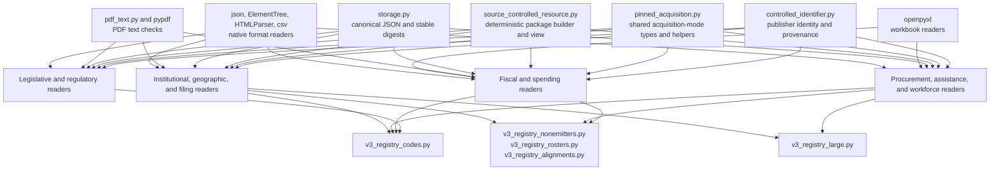
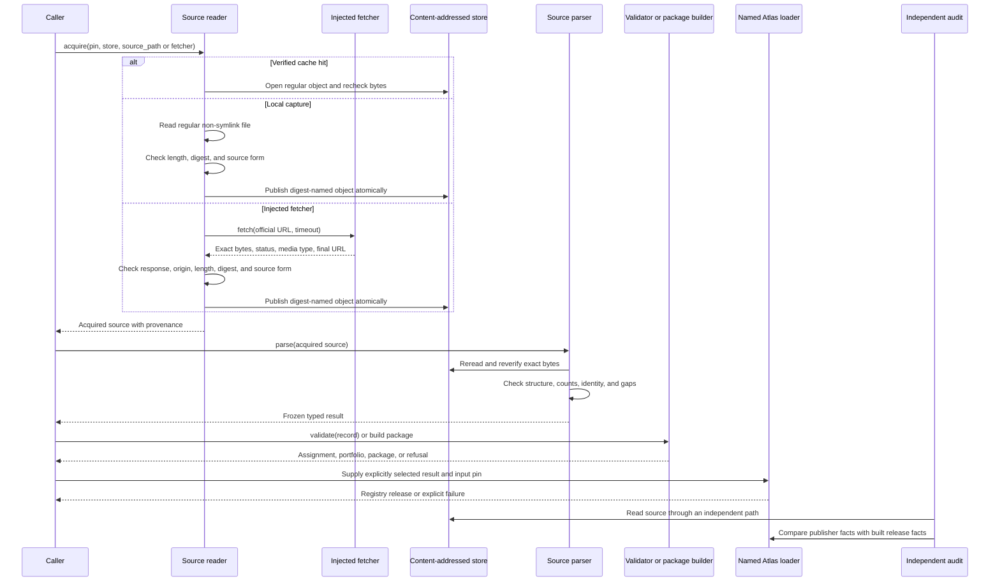

# Registry code and classification sources

The `registry_code_and_classification_sources` module-tree group contains 24
independent readers for publisher-issued codes, classifications, field
dictionaries, identifier structures, and source-assigned record evidence.
These readers turn reviewed source bytes into typed, traceable records that
callers can validate, package, or pass to an explicit Atlas loader.

This name describes a documentation group, not a Python package or aggregate
import API. The implementation remains in source-specific files under
[`src/refspec/registry/`](../src/refspec/registry/). Import the reader that owns
the publisher source; do not add a second abstraction merely to mirror this
wiki grouping.

The central boundary is meaning. A successful parse proves that exact bytes
match a reviewed source shape. It does not make an operational code a general
subject concept, prove that a mutable source is current, or admit a resource to
an Atlas distribution. Each reader records the narrower role its publisher
supports and preserves gaps that later consumers must not erase.

## At a glance

| Question | Answer |
| --- | --- |
| What goes in? | Exact publisher artifacts such as HTML, JSON, XML, XML Schema, YAML, PDF, CSV, and XLSX files; reviewed source declarations and snapshot pins; and either a regular local capture or an injected fetcher where live acquisition is supported. |
| What happens? | A source reader checks origin, media type, exact byte length, SHA-256 digest, and publisher-specific structure. It then parses codes or fields, checks counts and identity, records gaps, and optionally validates application records or builds a deterministic source package. |
| What comes out? | Frozen source-specific records, portfolios and lookups, field assignments, `ControlledIdentifier` values, `SourceControlledResourceBundle` values, or direct input to a named Atlas registry loader. |
| How do we check it? | Focused source tests exercise exact pins, cache rechecks, parser invariants, unknown-value rules, negative mutations, deterministic packages, loader counts, and independent source-fidelity checks. |

## Architecture and place in RefSpec

The readers form the source interpretation layer between publisher material
and Atlas release construction. They do not share one runtime pipeline, but
most follow the same checked sequence.

```mermaid
flowchart LR
    subgraph PUB["Publisher material"]
        DOC["HTML, PDF, XSD, and YAML"]
        DATA["JSON, XML, CSV, and XLSX"]
    end

    subgraph READ["Source-specific registry reader"]
        DECLARE["Source declaration and dated pin"]
        ACQUIRE["Cache, local capture, or injected fetcher"]
        VERIFY["Origin, media type, length, and SHA-256"]
        PARSE["Strict source parser and invariants"]
        TYPED["Typed records, identifiers, and gaps"]
    end

    RECORD["Record-field validation"]
    PACKAGE["Deterministic source package"]
    DIRECT["Direct loader input"]
    LOAD["Named Atlas registry loaders"]
    BUILD["Atlas distribution construction"]
    ACCEPT["Binding validation and seal"]
    AUDIT["Independent source-fidelity audit"]
    ACCESS["Record access and serving views"]

    DOC --> DECLARE
    DATA --> DECLARE
    DECLARE --> ACQUIRE --> VERIFY --> PARSE --> TYPED
    TYPED --> RECORD
    TYPED --> PACKAGE
    TYPED --> DIRECT
    PACKAGE --> LOAD
    DIRECT --> LOAD
    LOAD --> BUILD --> ACCEPT --> ACCESS
    PUB -. "separately read source evidence" .-> AUDIT
    BUILD -. "built releases and receipts" .-> AUDIT
    AUDIT --> ACCEPT
```



[`registry_foundation.md`](registry_foundation.md) owns shared identifier,
acquisition, package, and source-identity behavior. [Atlas registry
loading](atlas_registry_loading.md) owns conversion into `RegistryRelease`
values. [Atlas distribution builder](atlas_distribution_builder.md) owns
candidate assembly, and [managed release
validation](managed_release_validation.md) plus the [Atlas source fidelity
audit](atlas_source_fidelity_audit.md) check different properties of the
result. The [Atlas 3.1 binding](../bindings/atlas/3.1/README.md), current code,
and [decision ledger](../docs/decisions.md) establish implementation
authority.

Semantic and product ownership follow
[REF-023](../docs/decisions.md#ref-023-supersede-the-compatibility-view--rkaf-ships-on-the-atlas-wire)
and
[REF-024](../docs/decisions.md#ref-024-record-the-cross-product-ownership-boundary-once).
This group consumes Rulespec terms directly and exchanges explicit files with
other products; it does not copy those decisions into a parallel type system.
[Atlas in the United States and
Europe](../ATLAS_US_EU_COMPARISON.md) supplies strategic context, not runtime
authority.

## Documentation map

The detailed pages split the 24 readers by the records they describe. The
split keeps each page small enough to trace source-specific behavior while
retaining one flat, globally unique wiki filename.

| Detailed page | Readers | Use it for |
| --- | ---: | --- |
| [Legislative and regulatory sources](registry_code_and_classification_sources_legislative_and_regulatory.md) | 7 | BILLSTATUS, GovInfo and eCFR, lobbying disclosures, OIRA reviews, Paperwork Reduction Act controls, Regulations.gov API types, and Unified Agenda fields. |
| [Fiscal and spending sources](registry_code_and_classification_sources_fiscal_and_spending.md) | 6 | CBO cost estimates, Census government-finance mappings, the FAC field dictionary, OMB Circular A-11, Treasury Account Symbols and FAST Book data, and USAspending/GSDM. |
| [Procurement, assistance, and workforce sources](registry_code_and_classification_sources_procurement_assistance_and_workforce.md) | 5 | Grants.gov, NAICS and PSC classifications, OPM workforce data, SAM.gov Assistance Listings, and SAM.gov Opportunities. |
| [Institutional, geographic, and filing sources](registry_code_and_classification_sources_institutional_geographic_and_filing.md) | 6 | Census GEOID and GNIS structures, CourtListener, FCC ECFS, FEC committees, FERC eLibrary, and Oversight.gov report types. |

## Reader catalog

The following index states each reader's purpose and its most important
boundary. Follow the detailed-page link for public components, counts,
acquisition rules, error types, tests, and downstream paths.

### Legislative and regulatory records

| Source reader | High-level function | Key boundary | Details |
| --- | --- | --- | --- |
| [`billstatus_codes.py`](../src/refspec/registry/billstatus_codes.py) | Parses BILLSTATUS bill types, action codes, and Library of Congress summary-version codes, then validates those fields in bill records. | Bill types and summary versions are closed; the publisher calls action codes an incomplete courtesy list, so an unknown action survives as raw unmatched evidence. | [Legislative and regulatory sources](registry_code_and_classification_sources_legislative_and_regulatory.md) |
| [`govinfo_collections.py`](../src/refspec/registry/govinfo_collections.py) | Reads GovInfo collection codes, eCFR title structure, a reviewed CFR package summary, and PREMIS fixity evidence. | Roster membership and package-level evidence remain separate; one reviewed package shape does not establish every GovInfo product shape. | [Legislative and regulatory sources](registry_code_and_classification_sources_legislative_and_regulatory.md) |
| [`lda_controlled_codes.py`](../src/refspec/registry/lda_controlled_codes.py) | Reads Lobbying Disclosure Act General Issue Codes, filing types, and filing periods and validates filing fields. | General Issue Codes are filer-selected source evidence, while filing types and periods are deterministic metadata; none becomes a general subject concept here. | [Legislative and regulatory sources](registry_code_and_classification_sources_legislative_and_regulatory.md) |
| [`oira_review_codes.py`](../src/refspec/registry/oira_review_codes.py) | Captures four OIRA review and meeting form controls from exact HTML spans and validates their values. | The spans are closed captured controls from volatile pages, not an OIRA topic vocabulary. | [Legislative and regulatory sources](registry_code_and_classification_sources_legislative_and_regulatory.md) |
| [`pra_icr_codes.py`](../src/refspec/registry/pra_icr_codes.py) | Parses Paperwork Reduction Act information-collection request types, statuses, burden widgets, and the OMB Control Number field shape. | Only genuine code rows enter the package; numeric range widgets and form mechanics stay structural evidence. | [Legislative and regulatory sources](registry_code_and_classification_sources_legislative_and_regulatory.md) |
| [`regulations_gov_codes.py`](../src/refspec/registry/regulations_gov_codes.py) | Parses the `DocumentType`, `DocketType`, and `SubmitterType` enums from the Regulations.gov API OpenAPI document. | The three schema enums are closed, but agency-configured free-text fields remain outside these lists. | [Legislative and regulatory sources](registry_code_and_classification_sources_legislative_and_regulatory.md) |
| [`unified_agenda_codes.py`](../src/refspec/registry/unified_agenda_codes.py) | Reads all 20 option lists documented in the RegInfo.gov XSD and verifies three legal-authority prefix definitions in the RISC Preamble. | Documented options are closed even though the XSD type is `xs:string`; `LEGAL_AUTHORITY` itself remains free text and may match no known prefix. | [Legislative and regulatory sources](registry_code_and_classification_sources_legislative_and_regulatory.md) |

### Fiscal and spending records

| Source reader | High-level function | Key boundary | Details |
| --- | --- | --- | --- |
| [`cbo_topic_codes.py`](../src/refspec/registry/cbo_topic_codes.py) | Supports CBO's cost-estimate fiscal-facet feed shape and the separate per-Congress discovery-feed shape; it can package record-local Topic assignments as source evidence. | The reachable per-Congress feed lacks Topic, budget-function, mandate, and PAYGO fields. Topic labels have no publisher identity, and the blocked fiscal-facet interface has no pinned live capture. | [Fiscal and spending sources](registry_code_and_classification_sources_fiscal_and_spending.md) |
| [`census_gov_finance_codes.py`](../src/refspec/registry/census_gov_finance_codes.py) | Parses ASPEP government-finance functional item codes and data flags and validates optional cross-state mappings. | These statistical mappings supplement a government's native accounts; they do not replace enacted funds, programs, agencies, or amounts. | [Fiscal and spending sources](registry_code_and_classification_sources_fiscal_and_spending.md) |
| [`fac_dictionary.py`](../src/refspec/registry/fac_dictionary.py) | Captures the Federal Audit Clearinghouse API field dictionary and audit-year-bound requirement-code references. | A field dictionary describes endpoint fields and requirements; it does not enumerate every value those fields may contain. | [Fiscal and spending sources](registry_code_and_classification_sources_fiscal_and_spending.md) |
| [`omb_a11_budget_codes.py`](../src/refspec/registry/omb_a11_budget_codes.py) | Parses pinned Circular A-11 extracts for budget functions and subfunctions, object classes, and apportionment categories, then validates fiscal fields. | The resources share one reviewed edition and retain `captureSubset` scope for the extracted pages. | [Fiscal and spending sources](registry_code_and_classification_sources_fiscal_and_spending.md) |
| [`treasury_tas_fast_book.py`](../src/refspec/registry/treasury_tas_fast_book.py) | Checks Treasury Account Symbol component structure and parses the complete pinned FAST Book workbook for accounts and fund-group ranges. | Treasury's published TAS value remains authoritative when convenience workbook columns disagree; capture-local component encodings are labeled as such. | [Fiscal and spending sources](registry_code_and_classification_sources_fiscal_and_spending.md) |
| [`usaspending_gsdm_codes.py`](../src/refspec/registry/usaspending_gsdm_codes.py) | Reads USAspending award and assistance type codes plus the 457-row Governmentwide Spending Data Model dictionary, its domain values, and selected crosswalk elements. | The dictionary mixes inline enumerations, references to external sources, and empty domain cells; the parser accounts for each without treating references as imported codes. | [Fiscal and spending sources](registry_code_and_classification_sources_fiscal_and_spending.md) |

### Procurement, assistance, and workforce records

| Source reader | High-level function | Key boundary | Details |
| --- | --- | --- | --- |
| [`grants_gov_codes.py`](../src/refspec/registry/grants_gov_codes.py) | Parses Grants.gov eligibility and funding-category tables and validates submitted codes. | The captured page does not publish funding-instrument, opportunity-status, or statutory-initiative lists; those absences remain explicit. | [Procurement, assistance, and workforce sources](registry_code_and_classification_sources_procurement_assistance_and_workforce.md) |
| [`naics_psc_codes.py`](../src/refspec/registry/naics_psc_codes.py) | Parses the full 2022 NAICS workbook and the active codes in the April 2025 Product and Service Code workbook. | Vintage and lifecycle are part of identity; the reader does not silently accept future NAICS editions or retired PSC rows. | [Procurement, assistance, and workforce sources](registry_code_and_classification_sources_procurement_assistance_and_workforce.md) |
| [`opm_workforce_codes.py`](../src/refspec/registry/opm_workforce_codes.py) | Parses the full EHRI workforce data-standards workbook, optional PLUM data, and narrow legacy samples, then validates workforce fields. | Full EHRI data, PLUM rows, and explicitly non-exhaustive legacy samples have different completeness rules; agency/subelement rows follow the organization-roster path. | [Procurement, assistance, and workforce sources](registry_code_and_classification_sources_procurement_assistance_and_workforce.md) |
| [`sam_assistance_listing_codes.py`](../src/refspec/registry/sam_assistance_listing_codes.py) | Reads assistance types and eligible applicant and beneficiary types and checks the Assistance Listing Number field shape. | The three tables are closed; an `NN.NNN` listing number is shape-checked rather than looked up in a bounded roster. | [Procurement, assistance, and workforce sources](registry_code_and_classification_sources_procurement_assistance_and_workforce.md) |
| [`sam_opportunities_codes.py`](../src/refspec/registry/sam_opportunities_codes.py) | Reads SAM.gov notice types, status values, set-aside codes, and lifecycle evidence and validates query values. | Retired notice types remain historical evidence but fail validation for a current query. | [Procurement, assistance, and workforce sources](registry_code_and_classification_sources_procurement_assistance_and_workforce.md) |

### Institutional, geographic, and filing records

| Source reader | High-level function | Key boundary | Details |
| --- | --- | --- | --- |
| [`census_geo_codes.py`](../src/refspec/registry/census_geo_codes.py) | Packages Census TIGER GEOID composition rules and the GNIS National File field layout. | It describes identifier grammar and file structure, not geographic entities, sample values, or boundary methods. | [Institutional, geographic, and filing sources](registry_code_and_classification_sources_institutional_geographic_and_filing.md) |
| [`courtlistener_codes.py`](../src/refspec/registry/courtlistener_codes.py) | Parses CourtListener's jurisdiction table into platform court identifiers and jurisdiction classifications. | A CourtListener abbreviation is platform identity, not an official court identifier; mutable page facts make the capture a dated observation. | [Institutional, geographic, and filing sources](registry_code_and_classification_sources_institutional_geographic_and_filing.md) |
| [`fcc_ecfs_codes.py`](../src/refspec/registry/fcc_ecfs_codes.py) | Derives observed filing types, access statuses, bureaus, and proceedings from one exact ECFS search response. | These are observed values, not an exhaustive publisher list; proceedings are document records rather than reference-data members. | [Institutional, geographic, and filing sources](registry_code_and_classification_sources_institutional_geographic_and_filing.md) |
| [`fec_committee_codes.py`](../src/refspec/registry/fec_committee_codes.py) | Reads FEC committee designation, type, party, filing-frequency, and organization-type metadata and validates committee records. | The reader excludes contact and address data and does not invent report-type codes absent from the reviewed pages. | [Institutional, geographic, and filing sources](registry_code_and_classification_sources_institutional_geographic_and_filing.md) |
| [`ferc_elibrary_codes.py`](../src/refspec/registry/ferc_elibrary_codes.py) | Reads current FERC eLibrary class/type codes, docket prefixes, sectors, and security levels while retaining an explicit constructed compatibility path. | Current official captures and constructed compatibility fixtures are never presented as the same evidence; FERC filing controls apply only to FERC records. | [Institutional, geographic, and filing sources](registry_code_and_classification_sources_institutional_geographic_and_filing.md) |
| [`oversight_report_types.py`](../src/refspec/registry/oversight_report_types.py) | Captures the ten report-type values in Oversight.gov's report filter and packages them as a closed code list. | Report type is a document-genre facet, not a policy topic; changing result rows make the full-page capture date-specific. | [Institutional, geographic, and filing sources](registry_code_and_classification_sources_institutional_geographic_and_filing.md) |

## Common components and responsibilities

Names differ by publisher, but most readers expose the following component
roles. The detailed pages identify their exact classes and functions.

| Component role | Responsibility | Required behavior |
| --- | --- | --- |
| Source declaration | Names the official artifact, allowed host, source kind, and safe local filename or span anchors. | Accept only the intended HTTPS authority; reject credentials, unsafe filenames, ambiguous markers, and unrelated endpoints. |
| Snapshot pin | Records retrieval time, exact SHA-256, byte length, and source-specific revision or count facts. | Treat a changed byte or structural fact as source drift until a maintainer reviews the new material. |
| Fetcher protocol and fetched response | Keeps HTTP or proxy implementation outside the parser while preserving response bytes, status, media type, and final URL. | Importing a reader must not open a network connection. A cache miss receives exactly one explicit local source or fetcher. |
| Acquired source | Represents a verified regular object in the content-addressed store with provenance and cache status. | Reverify cache hits; reject symlinks; publish without overwriting an existing digest-named object. |
| Parser and typed rows | Reads the publisher's native format and retains codes, labels, order, fields, edition, and contextual evidence. | Check all reviewed headings, columns, counts, duplicates, compound keys, and exclusions. Refuse ambiguous changes instead of guessing. |
| Portfolio or lookup | Combines related resources from the same authority and exposes unambiguous indexes. | Preserve source-specific completeness and reject duplicate identities. Do not imply cross-publisher equivalence. |
| Record validator and assignment | Applies a parsed source rule to one application record while retaining the source field and raw value. | Reject unknown closed values; preserve unmatched values only when the publisher supports an open or incomplete list. |
| Package builder or view | Builds deterministic observations and retained source artifacts for a supported source-controlled resource. | Keep declared use, identity status, gaps, exclusions, and logical digest stable. Parsing alone does not authorize publication. |
| Atlas loader | Selects an approved parsed result or package and creates normalized releases with measured counts and input pins. | Make admission explicit and preserve the reader's completeness and use limits. |

### Shared dependencies



Not every arrow applies to every file. A small JSON reader may need only
`ControlledIdentifier` and the standard library; a PDF or workbook reader
adds the maintained format library appropriate to that artifact. Keep these
dependencies narrow and source-specific.

## Data flow and component interaction



Callers can stop after acquisition, parsing, validation, or packaging when
that result meets their need. Atlas loading is a separate, explicit choice.
The independent audit must not call the production parser it is checking;
that would make the comparison circular.

## Source roles and unknown-value rules

Each reader derives unknown-value behavior from the publisher's evidence.
The group intentionally has no universal `allow_unknown` switch.

| Source role | Typical evidence | Unknown or missing value | What consumers may claim |
| --- | --- | --- | --- |
| Closed documented enumeration | A complete table, schema enum, or documented option list with a checked census. | Reject an unknown present value; apply source-specific rules to optional fields. | Complete only for the named captured table and edition. |
| Open courtesy or partial list | The publisher states that the list is incomplete, or the capture covers a named subset. | Preserve a well-formed raw value as unmatched evidence when the reader defines that path. | A checked sample or subset, never publisher-wide completeness. |
| Observed distinct values | Values collected from ordinary search or record results rather than a publisher-written reference list. | Preserve the observation and its capture context; do not use absence as invalidity. | What appeared in that exact capture, not a closed vocabulary. |
| Field dictionary or file layout | Publisher documentation names fields, types, lengths, or crosswalk columns. | Treat an unexpected structural field as drift where the reviewed shape is closed; do not infer the field's value domain. | Document structure and field meaning only. |
| Identifier grammar | A publisher documents composition, widths, or field order without enumerating all entities. | Validate shape; do not require membership in an invented entity roster. | Identifier form, not entity existence. |
| Source-assigned record evidence | A publisher record attaches a label or code to one item without defining a reusable concept identity. | Retain the assignment and source path; do not mint a publisher identifier from its label or row number. | That the source assigned the value to that record. |

[REF-032](../docs/decisions.md#ref-032-observed-inventories-leave-the-atlas)
governs the distinction between publisher-written reference data and values
harvested from ordinary records. The detailed pages state the rule for every
reader and field.

## Current downstream integration

The current loaders make source selection visible. Their names describe build
organization, not authority; the source reader and the Atlas binding still
define what each record means.

| Integration point | Readers currently routed through it | Practical result |
| --- | --- | --- |
| [`v3_registry_codes.py`](../src/refspec/atlas/v3_registry_codes.py) | BILLSTATUS, Census GEOID/GNIS, Census government finance, FEC, FERC, Grants.gov, GovInfo/eCFR, LDA, OIRA, OMB A-11, Oversight.gov, PRA, Regulations.gov, both SAM.gov readers, Unified Agenda, and USAspending award types. | Small and medium code, structure, identifier, and evidence resources become measured `RegistryRelease` values. |
| [`v3_registry_large.py`](../src/refspec/atlas/v3_registry_large.py) | CourtListener, full NAICS/PSC workbooks, and full OPM EHRI data. | Large pinned sources follow dedicated readers while retaining the same release-level checks. |
| [`v3_registry_nonemitters.py`](../src/refspec/atlas/v3_registry_nonemitters.py) | FAC field structure, selected OPM organization data, Treasury FAST Book resources, and USAspending/GSDM structure and domain values. | Resources whose source shape does not fit the small-code path receive explicit source-specific conversion. The filename does not mean that every returned release is absent from the distribution. |
| [`v3_registry_rosters.py`](../src/refspec/atlas/v3_registry_rosters.py) | Roster paths that use related registry evidence, including the qualified Treasury FAST Book join described in the fiscal page. | Organization membership stays separate from native account and code identity. |
| [`v3_registry_alignments.py`](../src/refspec/atlas/v3_registry_alignments.py) | A separately evidenced alignment involving Unified Agenda priority values. | Cross-source mapping remains outside the native Unified Agenda reader. |
| No current Atlas loader | CBO cost-estimate evidence and FCC ECFS observed controls. | Their parsers and packages remain available to direct callers; code presence does not imply Atlas admission. |

The detailed pages distinguish source-supported behavior from current loader
behavior. Loader presence is verified from the current checkout and may change;
the source pin and typed reader remain the authority for the captured artifact.

## Failure model

Each file defines a source-specific `ValueError` family. Most distinguish
acquisition failures, source drift, record-assignment failures, and package or
record-shape failures so callers can report the stage that stopped.

| Stage | Representative refusal | Maintainer response |
| --- | --- | --- |
| Declaration | Wrong scheme or host, credentials in a URL, unsafe filename, malformed digest, invalid count, empty retrieval time, or ambiguous span marker. | Correct the reviewed declaration. Do not relax authority checks to accept an unrelated mirror. |
| Acquisition | Cache miss without an explicit input, both local and fetcher inputs, symlink, non-file path, non-positive timeout, non-200 response, disallowed redirect, challenge page, or wrong media type. | Supply a reviewed input or fix the transport while preserving the same byte and origin checks. |
| Exact-byte verification | Length, SHA-256, basic file signature, page count, workbook metadata, or pinned capture identity changes. | Retain both versions, inspect the changed source in context, and update the pin only after review. |
| Source parsing | Missing heading or field, changed namespace, column, order, count, code shape, duplicate identity, unmatched PDF attestation, or unaccounted exclusion. | Fail closed. Read the surrounding raw source and extend the parser only when the publisher meaning is clear. |
| Assignment | Missing required field, wrong container type, unknown closed code, mismatched label, invalid compound key, retired current value, or wrong vintage. | Reject the field. Preserve an unknown only when the source-specific open-list rule permits it. |
| Package or loader | Source bytes differ from parsed provenance, deterministic rebuild changes, gaps disappear, row counts differ, profile or ring is wrong, or an input pin is missing. | Reject the result and rebuild from reviewed inputs. Do not patch generated records. |

## Developer guide

### Change an existing reader

1. Read the source declaration, acquisition path, parser, typed results,
   validators, package builder, focused tests, and current loader before
   changing a rule.
2. Open the exact source bytes around the affected value. A search result only
   locates evidence. Read neighboring rows, fields, lines, or pages; render a
   PDF and inspect pixels when the printed page is the source.
3. State whether the change affects source identity, parsing, completeness,
   assignment, package membership, or Atlas loading. Preserve raw publisher
   values and their context through the change.
4. Add a structure only with the validator or consumer that depends on it and
   a negative fixture that proves the boundary. Delete unused structure.
5. If replacing a running check, copy the old implementation into the test as
   an independent oracle. Prove verdict agreement over real data and a
   mutation battery, and freeze deliberate differences before removing the
   production path.
6. Update pins, expected counts, gaps, package accounting, loader counts, and
   source-fidelity expectations together. A count change without source review
   remains drift.

### Add another reader

1. Confirm that the source belongs in this group rather than [managed
   vocabulary adapters](managed_vocabulary_source_adapters.md), [registry
   vocabulary sources](registry_vocabulary_sources.md), [organization
   sources](registry_organization_sources.md), [legal and identifier
   sources](registry_legal_and_identifier_sources.md), or [crosswalk and
   package sources](registry_crosswalk_and_package_sources.md).
2. Identify the official source, exact captured scope, revision signal,
   rights evidence, completeness statement, identity rule, and unknown-value
   behavior before writing the parser.
3. Prefer a maintained format library when it covers most of the artifact.
   Keep project code focused on publisher-specific origin, structure,
   semantics, and typed output.
4. Keep module import offline. Accept exact local bytes or the smallest
   injected transport interface needed to preserve response bytes and final
   origin.
5. Preserve publisher-issued identifiers with `ControlledIdentifier`. Retain
   raw observations and refusals when identity is ambiguous; never create
   identity from a convenient label or ordinal.
6. Add an actual validator, package consumer, or explicit loader together with
   positive and negative fixtures. A parser with no checked consumer has not
   earned a new schema layer.
7. Add Atlas admission only in the owning loader, with input pins, measured
   counts, declared scope, and an independent source-fidelity path.

### Focused verification

Run the source-specific commands in the applicable detailed page. Then run
the affected shared consumers from the repository root:

```bash
uv run pytest -q \
  tests/test_registry_public_api.py \
  tests/test_atlas_v3_registry_codes.py \
  tests/test_atlas_v3_registry_large.py \
  tests/test_atlas_v3_registry_nonemitters.py \
  tests/test_atlas_v3_registry_rosters.py \
  tests/test_atlas_v3_registry_coverage.py \
  tests/test_producer_prebuild_validation.py \
  tests/test_verify_atlas_source_fidelity.py
```

Run the repository's full build and test targets before merging a source or
release change. A focused green suite proves only the paths it ran. It does not
prove that a live publisher endpoint is unchanged, that a capture is complete
beyond its declared scope, that a distribution was built and sealed, or that
an external consumer accepted it.

## Related documentation

- [Repository overview and document index](../README.md)
- [Atlas planning index](atlas_planning_index.md)
- [Managed vocabulary source adapters](managed_vocabulary_source_adapters.md)
- [Registry vocabulary sources](registry_vocabulary_sources.md)
- [Registry organization sources](registry_organization_sources.md)
- [Registry legal and identifier sources](registry_legal_and_identifier_sources.md)
- [Registry crosswalk and package sources](registry_crosswalk_and_package_sources.md)
- [Registry foundation](registry_foundation.md)
- [Managed release validation](managed_release_validation.md)
- [Atlas registry loading](atlas_registry_loading.md)
- [Atlas derived graph](atlas_derived_graph.md)
- [Atlas distribution builder](atlas_distribution_builder.md)
- [Atlas source fidelity audit](atlas_source_fidelity_audit.md)
- [Atlas record projection](atlas_record_projection.md)
- [Atlas serving views](atlas_serving_views.md)
- [Atlas 3.1 binding](../bindings/atlas/3.1/README.md)
- [Decision ledger](../docs/decisions.md)
- [Repository agent guidance](../AGENTS.md)
