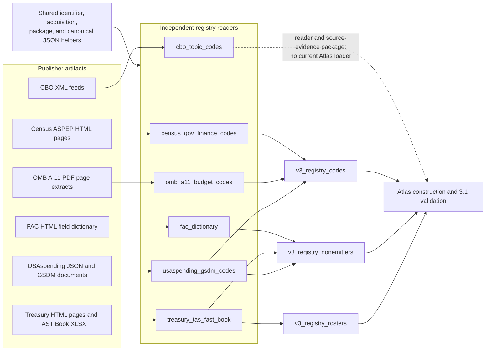
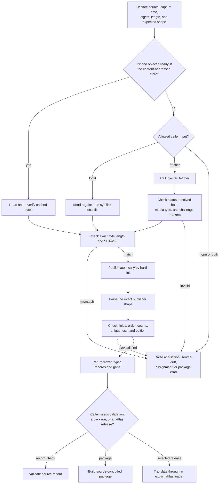
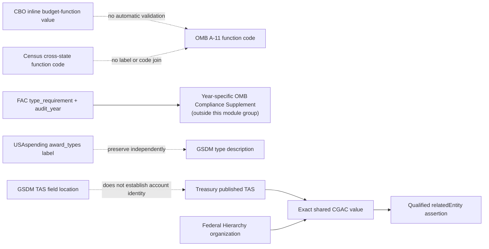

# Fiscal and spending code sources

<!-- markdownlint-disable MD013 -->

This page documents six fiscal and spending readers in the
`registry_code_and_classification_sources` module-tree group. Each reader owns
one publisher's source shape and limits. Together they cover Congressional
Budget Office (CBO) cost-estimate evidence, Census government-finance mapping
codes, the Federal Audit Clearinghouse (FAC) field dictionary, Office of
Management and Budget (OMB) Circular A-11 fiscal codes, Treasury Account Symbol
(TAS) and FAST Book records, and USAspending/Governmentwide Spending Data Model
(GSDM) codes and schema metadata.

This is a documentation grouping over independent Python modules. There is no
`registry_code_and_classification_sources_fiscal_and_spending.py` file and no
aggregate runtime API. Import the source module that owns the publisher data.
Return to [Registry code and classification
sources](registry_code_and_classification_sources.md) for the complete module
group and links to the other source families.

The common rule is narrow: preserve what the publisher states, preserve the
source context and capture limits, and refuse unsupported reinterpretation.
A readable label does not make a value a general subject concept. A field
dictionary does not enumerate field values. Two authorities using similar
codes do not establish a crosswalk.

## At a glance

| Question | Answer |
| --- | --- |
| What goes in? | Exact HTML, XML, JSON, plain-text page extracts, PDF reference pins, and an official Excel workbook. Most network-capable readers accept either a regular local file or an injected fetcher; module import never performs network access. |
| What happens? | The reader verifies origin, status, media type, byte length, SHA-256 digest, and source-specific structure. It then parses publisher labels, codes, fields, rows, or assignments into frozen typed records. |
| What comes out? | Closed code lists, field-layout records, fiscal account records, capture-local topic evidence, record-validation results, or inputs to an Atlas registry loader. The output type follows the source's authority. |
| How do we check it? | Focused suites verify exact fixtures, cache rechecks, transport boundaries, counts, order, duplicate handling, malformed shapes, unknown values, deterministic packages, and downstream release construction. |

## Place in RefSpec

These readers sit between reviewed publisher artifacts and the Atlas registry
loaders. They authenticate and interpret source bytes. They do not by
themselves admit a source to an Atlas release, establish cross-publisher
equivalence, or prove source completeness beyond the scope each pin names.



[`controlled_identifier.py`](../src/refspec/registry/infrastructure/controlled_identifier.py),
[`pinned_acquisition.py`](../src/refspec/registry/infrastructure/pinned_acquisition.py),
and
[`source_controlled_resource.py`](../src/refspec/registry/infrastructure/source_controlled_resource.py)
belong to [Registry foundation](registry_foundation.md). Atlas release
translation belongs to [Atlas registry loading](atlas_registry_loading.md),
and package or crosswalk policy belongs to [Registry crosswalk and package
sources](registry_crosswalk_and_package_sources.md). This page explains only
the six source readers and their immediate callers.

The [Atlas 3.1 binding](../bindings/atlas/3.1/README.md) defines the released
RDF and supporting files. [REF-023](../docs/decisions.md#ref-023-supersede-the-compatibility-view--rkaf-ships-on-the-atlas-wire)
governs semantic ownership, [REF-024](../docs/decisions.md#ref-024-record-the-cross-product-ownership-boundary-once)
governs product ownership and file exchange, and
[REF-032](../docs/decisions.md#ref-032-observed-inventories-leave-the-atlas)
distinguishes publisher-written reference data from values harvested out of
ordinary records.

## Source inventory

| Source module | Publisher material and captured scope | Primary typed output | Current downstream use |
| --- | --- | --- | --- |
| [`cbo_topic_codes.py`](../src/refspec/registry/cbo_topic_codes.py) | Two unrelated CBO cost-estimate XML shapes: the `cost-estimates/xml` fiscal-facet feed interface and one pinned 119th-Congress discovery feed. | `ParsedCBOCostEstimatesFeed`, `ParsedCBOPerCongressFeed`, and optional CBO topic-evidence package. | No current Atlas loader imports the module. Callers may use the parsed records or the source-evidence package directly. |
| [`census_gov_finance_codes.py`](../src/refspec/registry/census_gov_finance_codes.py) | Complete ASPEP HTML lists for 33 functional item codes and 16 data flags. | `ParsedCensusFinanceResource`, `CensusFinancePortfolio`, mapping validation, and two source-controlled packages. | `v3_registry_codes.py` creates two complete-capture value-ring code releases. |
| [`fac_dictionary.py`](../src/refspec/registry/fac_dictionary.py) | The complete documented FAC API field layout: 163 distinct endpoint/field rows across 11 endpoints. | `FACDictionaryPortfolio`, `FACFieldDefinition`, and audit-year-bound requirement-code references. | `v3_registry_nonemitters.py` creates one complete-capture value-ring `structureScheme`. |
| [`omb_a11_budget_codes.py`](../src/refspec/registry/omb_a11_budget_codes.py) | Three pinned 2025 page extracts from Circular A-11: 98 function/subfunction rows, 38 object-class rows, and 8 apportionment rows. | Three `ParsedOMBA11Resource` values, one single-edition portfolio, and fiscal-record validation results. | `v3_registry_codes.py` creates three value-ring `codeScheme` releases with `captureSubset` scope. |
| [`treasury_tas_fast_book.py`](../src/refspec/registry/treasury_tas_fast_book.py) | Two Treasury documentation pages, a reference-only component-width flyer pin, and the complete pinned FAST Book Part II/III workbook: 3,582 account rows, 1,159 change rows, and nine documented Intro-sheet fund groups. | Page editions, strict `TASComponents`, 3,582 `FASTBookPublishedAccount` rows, and parsed fund-group ranges. | `v3_registry_nonemitters.py` creates account and fund-group releases. `v3_registry_rosters.py` uses the workbook for a qualified CGAC-code join to the Federal Hierarchy roster. |
| [`usaspending_gsdm_codes.py`](../src/refspec/registry/usaspending_gsdm_codes.py) | Complete 33-code USAspending `award_types` response; GSDM 1.0.1 document pin; all 457 data-dictionary rows; and every inline domain enumeration. | Award-type records, GSDM structure rows, 1,009 published domain values across 203 elements, three reviewed typed crosswalk elements, and validation helpers. | `v3_registry_codes.py` creates the award-type release. `v3_registry_nonemitters.py` creates GSDM structure and domain-value releases. |

Counts above describe the repository's pinned captures. They do not claim that
a mutable live endpoint still serves the same bytes.

## Shared source lifecycle

Most modules implement the same safe sequence, but they do not share one base
class or one parser. Source-specific checks remain beside the source-specific
models.



There are three deliberate variants:

- Treasury loads the XLSX workbook directly from a caller-supplied path and
  `FASTBookWorkbookPin`; it does not pass that workbook through the HTML page
  store.
- `parse_gsdm_data_dictionary()` accepts exact bytes and its own digest and
  length arguments. The GSDM architecture PDF is a declaration and downstream
  input pin, not narrative text converted into codes by this module.
- OMB A-11 runtime parsing uses pinned UTF-8 page extracts. The full PDF's URL,
  digest, length, and last-modified time remain reference provenance, and the
  Atlas loader pins both the full document and each extracted page.

### Identity and use

`ControlledIdentifier` records a publisher value together with its kind,
authority, source, observation time, effective time where available, and
source digest. A parser creates one only when the publisher supplies an
identity or the publisher explicitly defines a transformation between two
forms. It does not create an identifier from a row number or a readable label.

All six modules keep `is_general_subject_concept` false for fiscal codes,
field names, account records, and schema values. CBO topic labels receive the
separate `sourceAssignedEvidence` use and no publisher identifier. The Atlas
builder may place a supported record in a value, entity, or structure scheme;
that placement does not turn the source value into a subject concept.

## CBO cost-estimate sources

[`cbo_topic_codes.py`](../src/refspec/registry/cbo_topic_codes.py) supports two
different XML documents and keeps them separate.

The `https://www.cbo.gov/cost-estimates/xml` interface is modeled as an RSS
2.0 feed with CBO namespace fields for topics, budget functions, mandate
flags, PAYGO, Congress, bill number, and committee. The repository records
that direct and proxy raw-byte acquisition attempts met a DataDome barrier in
August 2026. The module therefore has no verified-live pin constant for this
shape. Its small test fixture reconstructs the documented structure and tests
the parser; it is not an official byte capture.

The per-Congress URL family,
`/rss/{congress}congress-cost-estimates.xml`, uses a custom `<response>` shape.
`CBO_119TH_CONGRESS_REAL_CAPTURE_2026_08_04` pins one official capture with
1,058 items. Each item must contain exactly `Title`, `Date`, `Link`,
`Description`, and `Bill_Number`, in that order. This source supports discovery
only; it has no topic, budget-function, mandate, or PAYGO fields.

### CBO core components

| Component | Responsibility |
| --- | --- |
| `CBOCostEstimatesFeedSnapshotPin`, `CBOPerCongressFeedSnapshotPin` | Validate the allowed URL family, digest, byte length, and retrieval time for each distinct feed shape. |
| `CBOFeedFetcher`, `FetchedCBOFeed` | Define the transport seam. The reader checks the returned status, resolved CBO host, media type, body shape, and known challenge markers. |
| `acquire_cbo_cost_estimates_feed()`, `acquire_cbo_per_congress_feed()` | Resolve cache, local file, or fetcher input into a verified content-addressed object. |
| `capture_initial_cbo_cost_estimates_feed_snapshot()` | Create a first-seen pin only after the response passes origin, media-type, XML-shape, and challenge checks. This is a discovery step, not a substitute for review. |
| `CBOCostEstimateRecord`, `CBOBudgetFunction`, `CBOMandateFlags`, `CBOTopicAssignment` | Preserve one cost estimate's fiscal facets and capture-local topic assignments. Only an inline budget-function `code` becomes a `ControlledIdentifier`. |
| `CBOPerCongressCostEstimateRecord` | Preserve the discovery feed's key, title, date, publication link, description, and optional bill number. |
| `parse_cbo_cost_estimates_feed()`, `parse_cbo_per_congress_feed()` | Enforce the two unrelated XML shapes and return the corresponding parsed result. |
| `build_cbo_topic_evidence_package()` | Build a `sourceTermSnapshot` whose observations have no identifiers and `conceptIdentityClaimed: false`. Fiscal facets stay on parsed records and do not enter this package. |

The RSS parser allows item-level optional fiscal fields, but it requires at
least one topic assignment across the feed. It accepts only `true` or `false`
for tri-state Boolean fields; absence becomes `None`. Repeated topic text on
one or more items remains separate evidence because the observation IRI
includes the source digest and item/topic ordinals.

The per-Congress parser fails on a changed root, an unexpected child, a
missing item key, reordered or extra item fields, malformed XML, or a link
outside the exact CBO publication pattern. An empty `Bill_Number` is a valid
`None`; the pinned source contains this publisher behavior.

No current Atlas loader imports this module. A source-evidence package is not
an Atlas admission decision, and the discovery feed cannot fill the
fiscal-facet feed's missing fields.

## Census government-finance mapping codes

[`census_gov_finance_codes.py`](../src/refspec/registry/census_gov_finance_codes.py)
captures two complete ASPEP (Annual Survey of Public Employment and Payroll)
HTML lists:

- `censusFunctionItemCodes`: 33 three-digit statistical function codes.
- `censusDataFlagCodes`: 16 one-letter flags under the publisher's `Reported
  Data` and `Imputed Data` headings.

These codes support cross-state statistical mapping. They do not replace a
state's enacted funds, accounts, agencies, programs, fiscal year, amounts, or
legal identity. `validate_census_finance_mapping()` therefore requires and
returns the caller's `state_budget_line_item` unchanged; it attaches an
optional, separately validated function code.

### Census core components

| Component | Responsibility |
| --- | --- |
| `CensusFinanceSource`, `CensusFinanceSnapshotPin` | Declare an official Census page, expected row count, exact capture identity, and safe local filename. |
| `CensusFinancePageFetcher`, `FetchedCensusFinancePage`, `acquire_census_finance_page()` | Provide the injected transport seam and exact content-addressed acquisition. |
| `_LandmarkTableParser` | Internal HTML parser that reports the selected heading and table rows. Callers should use the public parse functions. |
| `CensusFinanceCode`, `ParsedCensusFinanceResource` | Preserve the exact label, code identifier, data-flag section where applicable, source facts, and documented gaps. |
| `assemble_census_finance_portfolio()` | Require exactly one instance of both resources. |
| `validate_census_finance_mapping()` | Preserve the state-native reference and fail on an unknown optional Census function code. |
| `build_census_function_item_code_package()`, `build_census_data_flag_code_package()` | Build separate deterministic `controlledCodeList` packages with publisher identifiers and the mapping-only gap. |

The function parser requires one table, the reviewed row count, and one
`CODE = Label` cell per row. The data-flag parser requires publisher section
headings before data rows, one code and definition per row, unique codes, and
the reviewed count. Both parsers tolerate Census's duplicate responsive
`<h1>` rendering only when the recognized heading text still matches.

The 2006 Government Finance and Employment Classification Manual also covers
object-of-expenditure and fund-source categories. This module does not parse
those PDF sections. The package records that omission rather than implying
the two HTML lists cover the full manual.

[`v3_registry_codes.py`](../src/refspec/atlas/v3_registry_codes.py) reads the
two packages and emits `census-function-items` and `census-data-flags` as
complete-capture value-ring code schemes.

## FAC API field dictionary

[`fac_dictionary.py`](../src/refspec/registry/fac_dictionary.py) parses the
HTML documentation at `/api/dictionary/`. Despite its path, this source is a
documentation page rather than a JSON endpoint. It names 11 API endpoints and
the General Services Administration (GSA) field name, SQL type, and optional
legacy Census field for each documented field.

This is a field-identity dictionary. It does not list any field's allowed
values. In particular, the `findings.type_requirement` row says only that the
field is `TEXT`. Its letter codes and meanings belong to the OMB Compliance
Supplement for the record's audit year, not to this FAC page and not to
Circular A-11.

### FAC core components

| Component | Responsibility |
| --- | --- |
| `FACDictionaryDocSource`, `FACSnapshotPin` | Pin the official HTML page, retrieval time, digest, byte length, and optional publisher last-modified time. |
| `FACFetcher`, `FetchedFACResponse`, `acquire_fac_dictionary_doc()` | Acquire exact HTML through cache, local file, or an injected `www.fac.gov` fetcher. |
| `FACFieldDefinition` | Preserve one endpoint/field pair, former endpoint, GSA name, legacy Census field, SQL type, source URL, and `facApiFieldName` identifier. |
| `FACDictionaryPortfolio` | Hold all endpoints and fields, with exact endpoint and field lookups. |
| `validate_fac_field_reference()` | Fail closed on an unknown endpoint or GSA field. |
| `FACRequirementCodeReference`, `reference_finding_requirement_code()` | Keep the raw `type_requirement` code attached to a four-digit `audit_year` and record that RefSpec has not interpreted it. |
| `build_fac_dictionary_package()` | Build one endpoint-scoped deterministic field package. |

The parser requires the reviewed endpoint order and the exact distinct-field
count per endpoint. It collapses the publisher's one exact duplicate
`general.fac_accepted_date` row. A repeated field with a different legacy
mapping or SQL type fails as source drift.

`findings_text.finding_text` remains free narrative. The field definition is
schema metadata; assigning subjects to the narrative belongs elsewhere.

[`v3_registry_nonemitters.py`](../src/refspec/atlas/v3_registry_nonemitters.py)
converts all 163 endpoint/field records into the complete-capture
`fac-api-field-dictionary-2026-08-03` structure scheme. It treats an
`(endpoint, field)` pair as the member identity because field names recur
across endpoints.

## OMB Circular A-11 fiscal codes

[`omb_a11_budget_codes.py`](../src/refspec/registry/omb_a11_budget_codes.py)
parses three named page extracts from the 2025 Circular A-11 PDF:

- Exhibit 79A: budget functions and subfunctions.
- Exhibit 83A: Schedule O object classes and the appendix form that the
  Circular's own rule derives from the Schedule O value.
- Section 120.13: apportionment categories with line ranges and four
  non-apportioned line codes.

The reader binds every result to the printed fiscal-year edition. It refuses
to assemble or validate across editions because the same code under a later
Circular is a separately observed fact.

### OMB A-11 core components

| Component | Responsibility |
| --- | --- |
| `OMBA11PageSource`, `OMBA11PageSnapshotPin` | Name the exhibit or section, PDF page, printed page label, expected count, extraction filename, edition, and exact bytes. |
| `OMBA11Fetcher`, `FetchedOMBA11Page`, `acquire_omb_a11_page()` | Acquire the pinned UTF-8 page extract through a provider-neutral seam. |
| `OMBA11Code`, `ParsedOMBA11Resource` | Preserve category, edition, publisher label, source, and one or more publisher-supported identifier forms. |
| `parse_omb_a11_functional_classification()` | Distinguish major functions from subfunctions and retain the publisher's code or code range. |
| `parse_omb_a11_object_classification()` | Preserve both `objectClassScheduleCode` and `objectClassAppendixCode` on the same row. |
| `parse_omb_a11_apportionment_categories()` | Preserve category code, documented line range, and the 6180-6183 non-apportioned line codes. |
| `assemble_omb_a11_control_portfolio()` | Require all three resources and one shared edition. |
| `validate_budget_fiscal_codes()` | Validate a fiscal record's edition, function, optional subfunction, object class in either published form, and apportionment category. |

Each parser checks exact row counts and source-specific terminal conditions.
For example, the object parser stops only after the published `9999` total row
and refuses unrecognized trailing content. The apportionment parser requires
all four category tokens and exactly the reviewed non-apportioned line set.

The source module does not build a `SourceControlledResourceBundle`.
[`v3_registry_codes.py`](../src/refspec/atlas/v3_registry_codes.py) converts the
three parsed tables directly into `omb-a11-functional-classification`,
`omb-a11-object-classification`, and
`omb-a11-apportionment-categories`. Each release pins the full PDF and its
page extraction and declares `captureSubset`, because one page family is not
the whole Circular.

## Treasury TAS and FAST Book

[`treasury_tas_fast_book.py`](../src/refspec/registry/treasury_tas_fast_book.py)
combines several publisher statements without treating them as one source:

- the CARS `Component TAS format` page names eight fields: `SP`, `ATA`, `AID`,
  `BPOA`, `EPOA`, `A`, `MAIN`, and `SUB`;
- Treasury's Component TAS-BETC flyer supplies the field widths as
  reference-only provenance;
- the FAST Book Description of Contents page names Parts I-III and a coarse
  fund-group list;
- the official workbook publishes all Part II and III accounts plus separate
  Intro-sheet fund-group tables and a Changes sheet.

The two HTML pages contain per-request analytics values, so logically
equivalent fetches need not share a digest. Each captured response still has
an exact pin; the pin authenticates that capture rather than promising one
permanent page hash.

### Treasury core components

| Component | Responsibility |
| --- | --- |
| `TreasuryPageSource`, `TreasuryPageSnapshotPin`, `TreasuryPageFetcher` | Declare and acquire the two HTML pages and their structural markers. |
| `parse_tas_component_page()`, `ParsedTASComponentFormat` | Verify all eight field labels and extract the page's `Last Updated` edition. |
| `parse_fast_book_description_page()`, `ParsedFASTBookDescription` | Verify the part/fund-group prose and extract its separate edition. |
| `FASTBookWorkbookPin` | Pin the rolling TFX workbook by URL, exact bytes, workbook modified time, edition, sheets, and expected Part II, Part III, and Changes row counts. |
| `parse_fast_book_workbook()`, `ParsedFASTBookWorkbook` | Parse every Part II/III row, retain the workbook's `TAS` cell as authoritative, and report publisher anomalies without rewriting them. |
| `FASTBookPublishedAccount`, `published_fast_book_identifier()` | Preserve the published TAS, account title, agency, fund type, optional legislation and update date, and produce a source-anchored publisher identifier. |
| `parse_fast_book_fund_groups()`, `ParsedFASTBookFundGroups` | Read eight Part II and one Part III group directly from the workbook's Intro sheets, including one or more four-digit symbol ranges. |
| `TASComponents`, `parse_tas_components()` | Validate the eight-field Component TAS shape. `AID` and `MAIN` are required; `SUB` defaults to `000`; beginning and ending availability years appear together. |
| `tas_identifier()`, `parse_tas_canonical_value()` | Round-trip RefSpec's order-preserving eight-part dot encoding. The encoding is capture-local and is not a Treasury-published display string. |
| `FASTBookAccountRecord`, `validate_fast_book_account_record()`, `fast_book_identifier()` | Validate a small page-shaped account record against the Description page's part/fund-group rules. This path is separate from the official workbook row parser. |
| `assemble_treasury_tas_fast_book_edition()` | Report the two HTML page edition dates together without claiming they form one universal edition. |

The workbook parser verifies the XLSX ZIP header, workbook modified timestamp,
sheet list, headers, and all three row counts. It retains 3,582 published
account rows and 3,581 distinct TAS values. Six known publisher anomalies,
including one duplicate TAS and convenience cells that disagree with the TAS
cell, remain in `publisher_anomalies`; the parser never repairs the source.

The Description page's `PART_FUND_GROUPS` and the workbook's Intro-sheet rows
are different statements. The page groups Part II into five broad categories;
the workbook states eight named groups with symbol ranges. Callers must choose
the artifact appropriate to their task and must not extend one list with the
other.

### Downstream releases and the CGAC join

[`v3_registry_nonemitters.py`](../src/refspec/atlas/v3_registry_nonemitters.py)
builds two releases from the workbook:

- `treasury-fast-book-accounts-parts-ii-iii-2026-07` is an entity-ring
  `identifierScheme` keyed by distinct published TAS. Duplicate publisher rows
  remain attached to that TAS.
- `treasury-fast-book-fund-groups-2026-07` is a value-ring `codeScheme` over
  the nine Intro-sheet groups and their publisher ranges. It is the documented
  successor to the removed set of distinct `Fund Type` strings harvested from
  account rows.

[`v3_registry_rosters.py`](../src/refspec/atlas/v3_registry_rosters.py) also
reads the workbook when it builds the Federal Hierarchy roster. It joins a
Federal Hierarchy organization to FAST Book accounts only when both publishers
report the same CGAC Agency Identifier. The resulting `relatedEntity`
assertion says only that the values match. Its source data explicitly denies
identity equivalence and administrative ownership. Count checks pin the
reviewed join so a changed match set fails before release construction.

## USAspending and GSDM

[`usaspending_gsdm_codes.py`](../src/refspec/registry/usaspending_gsdm_codes.py)
handles three related but independently authoritative inputs:

1. The USAspending `/references/award_types/` endpoint publishes six
   categories and 33 operational codes.
2. The GSDM 1.0.1 architecture PDF defines the metadata-registry shape and is
   pinned as a document; this module does not mine its prose for codes.
3. The online GSDM data dictionary publishes 457 structural rows and per-row
   domain text. It reports 17 named headers but supplies 18 cells per row, so
   the parser retains the unnamed final cell without inventing a header.

### USAspending and GSDM core components

| Component | Responsibility |
| --- | --- |
| `USASpendingConstantSource`, `USASpendingSnapshotPin`, `USASpendingFetcher` | Declare and acquire the exact `award_types` JSON response. |
| `USASpendingCode`, `ParsedAwardTypesResource`, `parse_award_types()` | Require all six categories, validate unique codes and labels, and distinguish `awardTypeCode` from `assistanceTypeCode`. |
| `GSDMDocumentPin`, `GSDM_DOCUMENT` | Record architecture version 1.0.1, former name DAIMS, revision date, document pin, and the ISO/IEC 11179-aligned registry attribute names. |
| `GSDMDataDictionaryRow`, `ParsedGSDMDataDictionary`, `parse_gsdm_data_dictionary()` | Retain all 457 unique element rows, 17 headers, 18 scalar cells per row, metadata, and sections from exact JSON bytes. |
| `GSDMPublishedDomainValue`, `GSDMDomainValuesColumn`, `parse_gsdm_domain_values()` | Parse and account for every inline enumeration, codeless value, placeholder, reference-only cell, empty cell, and description mismatch. |
| `GSDMFileElement`, `GSDMDomainValue`, `GSDMCrosswalkElement` | Model the reviewed `ActionType`, `AssistanceType`, and `ContractAwardType` crosswalks to download files, account files, submission tables, and award-category fields. |
| `USASpendingGSDMPortfolio`, `assemble_usaspending_gsdm_portfolio()`, `portfolio_digest()` | Combine the acquired endpoint codes with the three reviewed crosswalk elements and produce a stable content digest. |
| `validate_usaspending_award_type()` | Fail closed on an unknown award or assistance type code from the endpoint. |
| `validate_gsdm_action_type()` | Require both the action code and its `assistance` or `contracts` domain because the same letters have different meanings. |

The domain-value parser handles the source's documented irregular forms:
`CODE = LABEL`, assistance/contracts headings, `N/A = VALUE` codeless values,
two tightly shaped `CODE - LABEL` rows, wrapped label text, and a bare-value
list paired by the description column. It records future-code placeholders
without emitting them. It fails on repeated identities, unrecognized leading
text, missing required columns, and incomplete row accounting.

Across the pinned dictionary, 203 elements enumerate 1,009 values inline, 86
refer to external code sources without enumerating, and 168 have no domain
text. Eighteen emitted values have no code. `GSDMDomainValuesColumn` carries
these counts and every excluded or unpaired case so downstream output remains
reviewable.

The 33 endpoint codes and the GSDM `AssistanceType` or `ContractAwardType`
rows overlap in subject matter, but they publish independent labels. The
module preserves both and does not reconcile them.

### Downstream releases

[`v3_registry_codes.py`](../src/refspec/atlas/v3_registry_codes.py) emits the
endpoint's 33 codes as the complete-capture `usaspending-award-types` value
scheme.

[`v3_registry_nonemitters.py`](../src/refspec/atlas/v3_registry_nonemitters.py)
emits two GSDM releases:

- `gsdm-online-data-dictionary-2026-08-03` is a complete-capture
  `structureScheme` over all 457 elements. Its native data keeps the unnamed
  publisher cell.
- `gsdm-data-dictionary-domain-values-2026-08-03` is a `captureSubset`
  `codeScheme`. It contains every value the data dictionary enumerates inline
  and reports the 86 reference-only and 168 empty elements as limits.

## Cross-source boundaries

Similar terms in these modules are not automatic joins. The table states the
implemented boundary.

| Sources | Similar-looking data | Implemented rule |
| --- | --- | --- |
| CBO cost-estimate feed and OMB A-11 | Both can carry a `budgetFunctionCode`. | CBO retains only the value CBO publishes inline, under the CBO authority. It does not validate or translate that value through the A-11 portfolio. |
| Census finance and OMB A-11 | Both classify spending by function. | Census codes are cross-state statistical mapping references; A-11 codes describe federal budget functions for one Circular edition. Never join by code shape or label. |
| FAC and OMB publications | `findings.type_requirement` depends on an OMB source. | The governing source is the audit year's OMB Compliance Supplement, which this group does not ingest. A-11 is not a substitute. The code remains raw and attached to `audit_year`. |
| Treasury TAS and GSDM | GSDM names TAS-related file and table fields; Treasury publishes account symbols and component rules. | GSDM locates data elements across USAspending files. Treasury remains the identifier source for published FAST Book TAS values. Field correspondence does not establish account identity. |
| USAspending endpoint and GSDM dictionary | Award and assistance type codes appear in both sources. | Preserve both publisher statements. Do not overwrite short endpoint labels with dictionary descriptions or claim they are the same release. |
| Treasury FAST Book and Federal Hierarchy | Both report a CGAC Agency Identifier. | The Atlas roster adapter emits only a weak `relatedEntity` assertion for matching publisher values and explicitly disclaims identity and administration claims. |
| FAST Book Description page and workbook Intro sheets | Both name fund groups. | Keep the coarse page transcription and the finer parsed sheet rows separate. Neither silently supplements the other. |
| CBO topic labels and subject vocabularies | CBO calls the strings `Topic`. | Package them as capture-local `sourceAssignedEvidence` with no identifiers and no concept identity. |



## Completeness and unknown-value policy

| Resource | Completeness represented by the reader | Unknown or missing value behavior |
| --- | --- | --- |
| CBO `cost-estimates/xml` | Strict parser for a reconstructed documented shape; no verified-live pin in this repository. Topics are capture-local assignments, not a closed vocabulary. | Optional per-item fiscal fields may be absent. Malformed present values fail. No cross-check fills or rejects an inline budget-function code against OMB A-11. |
| CBO per-Congress feed | Complete parse of the exact pinned 119th-Congress capture. | Missing required elements fail; empty `Bill_Number` becomes `None`. The source has no fiscal facets to infer. |
| Census function items and data flags | Complete captures of the two named HTML lists. | Unknown mapping codes fail. A record may omit the optional Census function mapping only when it preserves a non-empty state-native reference. |
| FAC dictionary | Complete field dictionary for the documented endpoint set; no field-value enumerations. | Unknown endpoint or field fails. A requirement code is accepted only as uninterpreted raw text paired with a four-digit audit year. |
| OMB A-11 tables | Closed capture of three named page tables within one edition, not the whole Circular. | Unknown, wrong-kind, or off-edition fiscal codes fail. Optional budget subfunction may be absent. |
| Treasury workbook | Complete capture of Part II and III rows and Intro-sheet fund-group rows; Part I remains outside the workbook reader. | Workbook shape, headers, or counts fail on drift. Publisher row anomalies are retained. The component parser rejects unknown fields and malformed widths. |
| USAspending `award_types` | Complete six-category endpoint response. | Unknown code fails. Duplicate labels are allowed; duplicate codes are not. |
| GSDM dictionary | Complete structural capture of 457 rows; inline domain values are a declared subset of the wider domains. | Reference-only and empty domains remain counted gaps. ActionType validation requires its domain. Placeholders are recorded, not emitted as codes. |

## Contribution workflow

### Add or update a source

1. Identify the publisher statement and its exact use before writing a parser:
   code list, field layout, account roster, mapping reference, or source
   assignment evidence.
2. Read the raw source around every candidate value. For PDF or printed-page
   material, inspect the rendered page as pixels as well as the text layer.
   Keep the page, table, section, sheet, or row context that rules the value in
   or out.
3. Declare the allowed origin, filename, retrieval time, digest, byte length,
   edition, and expected shape. If the live response varies per request, pin
   the exact capture and state that limit.
4. Keep network access behind an injected fetcher. Reject credentials,
   off-domain redirects, challenge pages, wrong media types, and ambiguous
   local inputs. Reverify cache hits.
5. Parse the publisher's structure without filling omissions. Keep exact
   labels, publisher anomalies, codeless values, duplicate rows, and known
   gaps where the source requires them.
6. Add `ControlledIdentifier` only for a publisher-issued value or an
   explicitly publisher-defined form. Never derive identity from label text,
   row order, or a similarity to another source.
7. Add a record validator, package consumer, or Atlas loader only when the
   structure has a real use. Every new required field or boundary needs a
   negative fixture that fails when violated.
8. When a source enters Atlas, update the explicit loader, release selection,
   registry descriptors, source accounting, and independent source-fidelity
   coverage. A parsed source alone is not a released source.

### Change an existing parser

1. Preserve the old check as a test-only oracle before replacing it. Copy the
   old logic into the test rather than importing the implementation under
   replacement.
2. Compare verdicts over the retained real source and a mutation battery.
   Real valid data proves acceptance behavior; mutations prove rejection
   behavior.
3. Freeze every intended divergence. An unlisted difference must fail the
   suite.
4. Re-run the immediate reader tests and every downstream loader that consumes
   the changed type. State separately what was tested and what still requires
   a live acquisition or full Atlas build.

See the repository [agent guidance](../AGENTS.md) for the source-context and
replacement-oracle requirements. [Managed release
validation](managed_release_validation.md) and [Atlas source fidelity
audit](atlas_source_fidelity_audit.md) document the later release and
independent comparison checks.

## Focused verification

Run the source suites from the repository root:

```bash
uv run pytest -q \
  tests/test_cbo_topic_codes.py \
  tests/test_census_gov_finance_codes.py \
  tests/test_fac_dictionary.py \
  tests/test_omb_a11_budget_codes.py \
  tests/test_treasury_tas_fast_book.py \
  tests/test_treasury_fast_book_fund_groups.py \
  tests/test_usaspending_gsdm_codes.py
```

Run the affected loader and fidelity suites when a parsed type, pin, count, or
package changes:

```bash
uv run pytest -q \
  tests/test_atlas_v3_registry_codes.py \
  tests/test_atlas_v3_registry_nonemitters.py \
  tests/test_atlas_v3_registry_rosters.py \
  tests/test_registry_real_data_audit.py \
  tests/test_verify_atlas_source_fidelity.py
```

Use the repository `make` targets before merging a release change. A focused
green run proves only the local parser and consumer paths. It does not prove
that a live publisher endpoint is unchanged, that an unavailable CBO feed is
now reachable, that every external code source cited by GSDM was ingested, or
that a new Atlas distribution was built, validated, sealed, and published.
