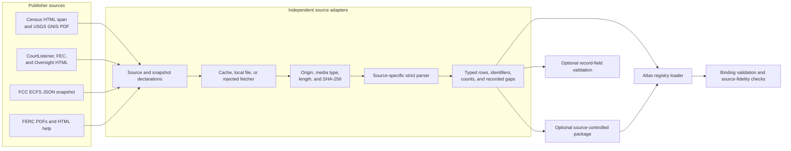
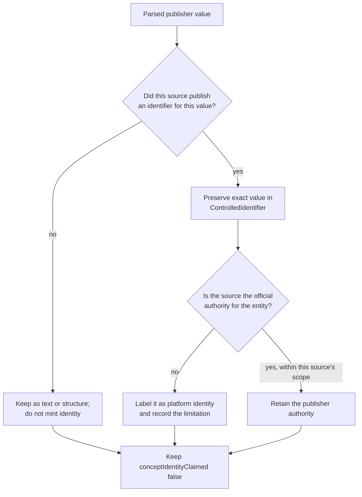
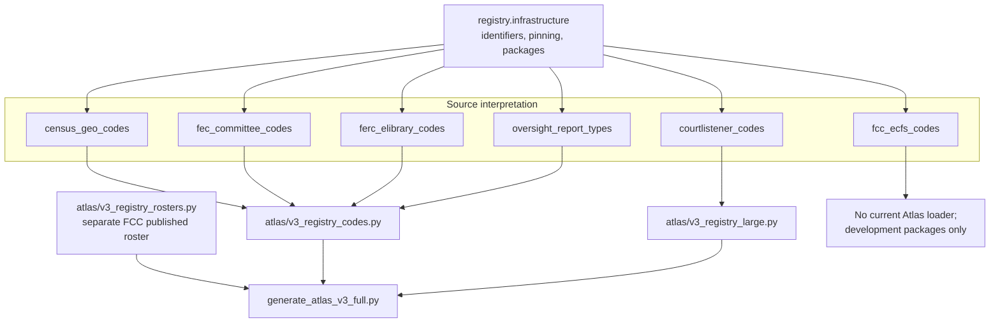

# Institutional, geographic, and filing classification sources

This page documents six source adapters in the
`registry_code_and_classification_sources` logical module. They preserve
publisher-specific geographic structures, platform identifiers, organization
and filing codes, and report genres. They do not turn those values into general
subject concepts.

This is a documentation grouping, not a Python package. Each adapter remains
an independent module under
[`src/refspec/registry/`](../src/refspec/registry/), with its own source pins,
parser, result types, errors, and tests. See [Registry code and classification
sources](registry_code_and_classification_sources.md) for the full 24-module
map and [Registry foundation](registry_foundation.md) for the shared identifier,
acquisition, and package types.

## At a glance

| Question | Answer |
| --- | --- |
| What goes in? | Exact Census and USGS HTML/PDF captures, a CourtListener jurisdictions page, one FCC Electronic Comment Filing System (ECFS) filing-search response, three FEC documentation pages, four current FERC eLibrary reference files, and an Oversight.gov reports page. |
| What happens? | Each adapter verifies the declared origin and exact bytes, parses only the reviewed source region or fields, checks source-specific shape and counts, and preserves publisher values with their source location. |
| What comes out? | Typed rows, record-validation results, source-controlled code-list packages, or normalized registry releases. Outputs remain limited to identifiers, structure, deterministic metadata, or source observations. |
| How do we check it? | Focused tests cover exact pins, cache revalidation, parser shape, duplicate and conflict handling, package determinism, negative mutations, PDF page evidence, and current Atlas loaders. |

## Architecture

The six modules share a pattern, but they do not share one runtime pipeline.
The caller chooses the source-specific functions and carries each typed result
to its intended consumer.



[`ControlledIdentifier`](../src/refspec/registry/infrastructure/controlled_identifier.py)
records publisher values and their authority, source, observation time, and
source digest. A row number or JSON path remains a locator, never an identity.
[`SourceControlledResourceBundle`](../src/refspec/registry/infrastructure/source_controlled_resource.py)
stores deterministic observations and source bytes when an adapter builds a
closed package. The [Atlas 3.1 binding](../bindings/atlas/3.1/README.md), not a
source parser, defines the accepted distribution shape.

## Source inventory

| Source module | Publisher material | Main result | Scope and key boundary |
| --- | --- | --- | --- |
| [`census_geo_codes.py`](../src/refspec/registry/census_geo_codes.py) | The 11-row Census `GEOID Structure` HTML table and the 21-field USGS Geographic Names Information System (GNIS) National File table in a PDF. | `GeoidCompositionRow`, `GNISFieldDefinition`, and one `SourceControlledResourceBundle`. | Identifier grammar and file structure only. The module excludes geographic entities, sample `GEO.ID` values, and the former hand-picked American Community Survey sample. |
| [`courtlistener_codes.py`](../src/refspec/registry/courtlistener_codes.py) | CourtListener's `Available Jurisdictions` table. | `ParsedCourtListenerJurisdictionsPage` and an optional controlled-code package. | CourtListener platform identity, not official court identity. The whole-page pin is a dated observation because case counts and modified times change. |
| [`fcc_ecfs_codes.py`](../src/refspec/registry/fcc_ecfs_codes.py) | One exact ECFS filing-search JSON response. | `ParsedFCCECFSSnapshot`, four code-list bundles, and `FCCECFSCodeListView`. | An observed set of filing types, access statuses, bureaus, and proceedings. The capture is not an exhaustive publisher code list, and proceedings are document records rather than Atlas reference-data members. |
| [`fec_committee_codes.py`](../src/refspec/registry/fec_committee_codes.py) | The FEC committee master-file description plus linked committee-type and party-code pages. | Five `ParsedFECResource` values, `FECCommitteePortfolio`, record validation, and code-list packages. | Committee entity metadata only. Contact, treasurer, and address fields are not captured; report-type codes are unavailable from these pages. |
| [`ferc_elibrary_codes.py`](../src/refspec/registry/ferc_elibrary_codes.py) | Current FERC class/type and docket-prefix PDFs plus search-help and accessibility HTML; a separate constructed compatibility fixture remains explicit. | Complete official captures, compatibility `ParsedFercResource` values, a portfolio, and filing-field validation. | FERC-only filing metadata. Docket prefixes, sectors, and security levels must not classify another agency's records. |
| [`oversight_report_types.py`](../src/refspec/registry/oversight_report_types.py) | The ten values in the `Report Type` multiple-select control on Oversight.gov's federal reports page. | `ParsedOversightReportTypesPage` and a controlled-code package. | Deterministic report genre, not a topic taxonomy. The page includes changing result rows, so its digest identifies one dated scrape. |

## Shared behavior and deliberate differences

### Acquisition and exact-byte checks

Five modules expose a small injected fetcher protocol. The protocol returns
body bytes, HTTP status, content type, and resolved URL; the source adapter
then applies its own official-host and media-type checks. `census_geo_codes`
uses the same fetcher interface for its Census page and GNIS PDF. FERC's
current full-source parsers also accept caller-supplied bytes directly because
their Atlas path reads already pinned PDF and HTML files.

The content-addressed acquisition functions follow these rules:

1. A caller may provide a local source or a fetcher on a cache miss, never
   both.
2. Local sources must be regular, non-symlink files.
3. Fetched responses must remain on the allowed HTTPS host and use an allowed
   media type.
4. The byte length and SHA-256 digest must match the pin before publication.
5. A cache hit is reread and reverified; its path does not make it trusted.
6. Publication writes a temporary file, flushes and syncs it, then uses a hard
   link so an existing content-addressed object is never overwritten.

CourtListener and Oversight also reject common challenge-page markers. FCC
rejects malformed JSON and an unexpected response shape. Census verifies that
the GNIS payload is a PDF. These checks keep access-denied pages and unrelated
responses from becoming apparently empty code lists.

### Identity is source-specific



The final node is intentional. An official code can be valid identity for a
metadata field without being a reusable subject concept.

Important distinctions include:

- A Census GEOID composition string describes how an identifier is assembled;
  it is not a list of every geography.
- A CourtListener `Abbreviation` identifies a court inside CourtListener. It
  does not replace a code issued by that court or another official source.
- An FCC ECFS `bureau_code` observed on a filing is not the maintained FCC
  organization roster. That roster belongs to
  [Registry organization sources](registry_organization_sources.md).
- An FEC party code classifies a committee-master record. It does not create a
  general political-party entity or a document subject.
- A FERC docket prefix or security level applies inside eLibrary. It carries no
  cross-agency meaning.
- An Oversight.gov report type describes document genre. `Audit` or `Review`
  does not state the report's policy topic.

## Component responsibilities

### Census GEOID and GNIS structures

`CensusGeoHtmlSpanSource` identifies the exact anchor pair around the Census
table. `CensusGeoHtmlSpanPin` adds retrieval time, digest, and length.
`acquire_census_geo_html_span()` locates the begin marker exactly once and
stores only the table span, so changing report results or page chrome cannot
become evidence for the table.

`parse_geoid_structure_span()` reads the eleven area types in their reviewed
order. Each `GeoidCompositionRow` retains the area type, composition text,
digit count, example area, example GEOID, and source ordinal. The examples
remain fields that explain a rule; the package does not emit them as separate
identifier values.

`GNISFileFormatPin` identifies the complete 23-page official PDF.
`parse_gnis_file_format()` reads the National File table from the first two
pages and requires the reviewed 21-row name/type/length shape. A merged PDF
description cell is copied to every covered `GNISFieldDefinition`, and
`description_shared_with` records the whole group. This retains publisher
wording without pretending that a merged cell described only its first row.

`build_census_geo_identifier_authority_package()` combines both captures in
one deterministic bundle. The current Atlas code loader splits it into an
11-member identifier-structure release and a 21-member file-structure release.
It does not load Census entities, GNIS feature rows, or sample API keys.

### CourtListener platform jurisdictions

`CourtListenerJurisdictionsSnapshotPin`, `CourtListenerPageFetcher`, and
`acquire_courtlistener_jurisdictions_page()` define and acquire one exact help
page. `_JurisdictionsTableParser` is private implementation detail; callers
use `parse_courtlistener_jurisdictions_page()`.

The parser requires exactly one settings table, one header row, and the ten
reviewed columns. Every row must provide a name, CourtListener abbreviation,
valid date-or-`Unknown` fields, an `In Use` value, and a modified timestamp.
It preserves known malformed or empty jurisdiction cells instead of correcting
them. An empty jurisdiction cell omits only the jurisdiction-type identifier;
the CourtListener court identifier remains.

`CourtListenerJurisdictionRow.identifiers` may contain:

- `courtlistenerCourtId` from the platform abbreviation;
- `courtlistenerJurisdictionType` when that cell is nonempty; and
- `courtlistenerCitationAbbreviation` when published.

`build_courtlistener_jurisdictions_package()` builds a controlled code list
with the captured source and explicit gaps. The current large-registry loader
reads the full pinned page, requires its expected row count, and creates an
entity-ring identifier release whose metadata says that official court
identity is not claimed.

### FCC ECFS observed filing controls

`FCCECFSCaptureSource`, `FCCECFSSnapshotPin`, and
`acquire_fcc_ecfs_snapshot()` identify one filing-search request and its exact
JSON response. API credentials belong to the injected transport; the pinned
URL must not contain them.

`parse_fcc_ecfs_snapshot()` checks the exact response keys, filing count,
regular-versus-express-comment field sets, nested submission type and viewing
status shapes, proceeding fields, and required scalar types. It deduplicates
repeated observations by primary code only when their labels and identifiers
agree. A conflicting observation fails as drift.

`ParsedFCCECFSSnapshot` retains four collections and both distinct and raw
occurrence counts:

| Collection | Primary identity | Additional retained identity |
| --- | --- | --- |
| `filing_types` | `filingTypeAbbreviation` | Publisher record ID. |
| `access_statuses` | `accessStatusId` | None. |
| `bureaus` | `bureauCode` | None. |
| `proceedings` | `proceedingNumber` | Publisher record ID and bureau code. |

The four `FCCECFSCodeListPackageSpec` declarations pin the expected distinct
count, raw occurrence count, allowed use, known gaps, and final logical digest.
`FCCECFSCodeListView.open()` verifies the closed package, checks the external
logical digest, rereads retained source bytes, rebuilds every artifact, and
indexes observations by primary publisher code.

These packages are development source artifacts. The current Atlas loaders do
not consume `fcc_ecfs_codes.py`. In particular, FCC proceedings form a changing
document population and are refused from Atlas. A separate published FCC
bureaus/offices source supplies the maintained organization roster.

### FEC committee metadata

`FECDocSource` and `FECSnapshotPin` describe three official HTML pages.
`acquire_fec_doc()` applies the shared local/fetcher/cache pattern.

The master-file page supplies three inline code families:

- `CMTE_DSGN` through `parse_committee_designation_codes()`;
- `CMTE_FILING_FREQ` through `parse_filing_frequency_codes()`; and
- `ORG_TP` through `parse_organization_type_codes()`.

The parser also requires that this page still links to the two independently
pinned pages used by `parse_committee_type_codes()` and `parse_party_codes()`.
It checks exact field labels, table widths, code syntax, counts, and uniqueness.
This prevents a linked list from disappearing while the inline fields continue
to parse successfully.

`assemble_fec_committee_portfolio()` requires exactly one of all five resource
families. `validate_committee_master_record()` accepts null optional values but
fails on a non-string or unknown code. `build_fec_committee_code_package()`
creates one development controlled-code package per family and keeps report
type, effective-date, and restricted contact-data gaps visible.

The current code loader builds five complete-capture value-ring releases from
the exact three source pages. A code's `effective_at` remains unknown because
the pages publish no per-cycle validity range.

### FERC eLibrary filing metadata

This module contains two clearly separated paths:

1. The current real-data path parses FERC's pinned January 2025 class/type PDF,
   June 2025 docket-prefix PDF, general-search help, and accessibility guide.
2. An older compatibility path parses a small constructed HTML fixture whose
   `provenance` is explicitly `constructedFixture`.

The current path is authoritative for Atlas loading. `parse_ferc_class_type_pdf()`
checks the exact PDF bytes, seven pages, and 235 rows. It reconstructs the
publisher's four columns—category, library, classification, and type
description—from the PDF text layer using reviewed closed value sets. It keeps
the original joined line beside the split fields so the interpretation remains
replayable.

`parse_ferc_docket_prefix_pdf()` checks six pages and 95 active or discontinued
rows. `parse_ferc_general_search_help()` reads six sectors and four security
levels. `parse_ferc_accessibility_tips()` retains the two printed accession
search examples, but the Atlas loader excludes them because one is a wildcard
search string rather than a governed identifier format.

The compatibility API exposes `FercELibrarySource`, `FercSnapshotPin`,
`parse_ferc_elibrary_resource()`, `assemble_ferc_elibrary_control_portfolio()`,
and `validate_ferc_elibrary_fields()`. It remains useful for source-shape and
record-validation tests, but its explicit constructed provenance must never be
reported as an official capture.

For PDF changes, extracted text is insufficient evidence. Inspect the rendered
pages and compare the surrounding columns and repeated headers. The focused
`test_ferc_pdf_attestation.py` suite protects the page-visible row splits,
publisher punctuation, repeated-header exclusion, and known defects.

### Oversight.gov report genres

`OversightReportTypesSnapshotPin`, `OversightPageFetcher`, and
`acquire_oversight_report_types_page()` identify and acquire one full listing
page. `_ReportTypeSelectParser` is private; callers use
`parse_oversight_report_types_page()`.

The parser requires exactly one `field_report_type[]` multiple-select control.
Every option must have a publisher value and label, and both sets must be
unique. Each `OversightReportTypeOption` retains an
`oversightReportTypeId`, label, and source ordinal.

`build_oversight_report_types_package()` emits all ten options as a
`controlledCodeList`, preserves the source page, and keeps
`conceptIdentityClaimed` false. The current code loader requires ten members
and emits a complete-capture value-ring code release. `completeCapture` here
means the captured select control, not a general Oversight.gov topic system or
a stable independently versioned release.

## Component interactions



This diagram reports current local call paths, not publication status. A
successful loader produces a `RegistryRelease`; later construction, independent
binding validation, source-fidelity review, sealing, and delivery remain
separate steps. See [Atlas registry loading](atlas_registry_loading.md),
[Atlas distribution builder](atlas_distribution_builder.md), and [Atlas source
fidelity audit](atlas_source_fidelity_audit.md).

## Failure model

| Failure stage | Examples in this group | Maintainer response |
| --- | --- | --- |
| Declaration | Off-host URL, embedded credentials, malformed digest, unsafe file name, or impossible expected count. | Correct the declaration before acquisition. |
| Acquisition | Cache miss without a source, both local and fetcher inputs, non-200 response, redirect to another host, wrong media type, or symlink input. | Provide a reviewed source through one allowed path. Do not weaken origin checks. |
| Byte identity | Length or digest differs from the pin. | Keep the old and new bytes, inspect the change, and update the pin only with reviewed evidence. |
| Source shape | Missing table, changed columns, wrong JSON keys, changed PDF page or row count, repeated span marker, or malformed select control. | Read the raw surrounding source; inspect rendered PDF pixels; change the parser only when the new meaning is understood. |
| Identity | Missing primary code, duplicate ID, conflicting label for one FCC code, or unsupported identifier kind. | Preserve the conflict or refuse the source. Never substitute row position or label text for identity. |
| Scope | Treating a platform abbreviation as official, an observed ECFS set as exhaustive, a report type as a topic, or a FERC code as cross-agency. | Keep the existing narrow role and recorded gap unless a separately reviewed source proves a broader claim. |
| Package | Retained bytes, counts, logical digest, source URL, or deterministic rebuild differ. | Reject and rebuild from the reviewed exact source. Do not patch generated package files. |

## Developer workflow

### Change an adapter

1. Read the module declaration, output models, current consumer, and focused
   tests before changing a parser.
2. Open the exact source around every affected value. For HTML, inspect the
   containing row or control. For PDF, inspect the rendered page as pixels and
   compare it with the extracted text.
3. State whether the source publishes a complete list, a full page capture,
   an observed subset, a field dictionary, or an identifier format. Do not
   infer scope from the number of rows.
4. Preserve publisher values, order, source paths, anomalies, and refusals.
   Add a `ControlledIdentifier` only when the source publishes the identity.
5. Add a negative fixture for every new structural rule. If replacing a check,
   keep the old implementation in the test as an independent oracle and test
   both real data and deliberate mutations.
6. Run the source suite, package/view tests, every affected registry loader,
   and the source-fidelity audit when that release is covered.
7. Update pins, expected counts, gaps, loader metadata, and documentation in
   the same reviewed change.

### Add a source to this group

- Reuse shared acquisition only when its checks fit the publisher's transport.
  Otherwise expose a small injected fetcher and keep network access out of
  module import.
- Prefer a maintained parser for PDF, spreadsheet, XML, or JSON mechanics.
  Keep project code focused on publisher-specific meaning and strict shape.
- Give every new structure a validator or real consumer that fails on a
  negative fixture. Remove fields that no consumer or verifier checks.
- Keep entity rosters, official legal identifiers, document populations, and
  topic vocabularies in their owning modules. Link to those pages instead of
  building a second representation here.
- Add the module and its intended use to the planning index and downstream
  selection explicitly. A source reader does not authorize Atlas admission.

### Focused checks

Run source tests from the repository root:

```bash
uv run pytest -q \
  tests/test_census_geo_codes.py \
  tests/test_courtlistener_codes.py \
  tests/test_fcc_ecfs_codes.py \
  tests/test_fec_committee_codes.py \
  tests/test_ferc_elibrary_codes.py \
  tests/test_ferc_pdf_attestation.py \
  tests/test_oversight_report_types.py
```

Then run the affected loader and distribution-boundary tests:

```bash
uv run pytest -q \
  tests/test_atlas_v3_registry_codes.py \
  tests/test_atlas_v3_registry_large.py \
  tests/test_atlas_v3_registry_rosters.py \
  tests/test_atlas_v3_registry_coverage.py \
  tests/test_producer_prebuild_validation.py
```

These local checks do not establish that a live endpoint is unchanged, that a
new capture is complete, that an Atlas release was built and sealed, or that an
external consumer accepted it.

## Related documentation

- [Registry code and classification sources](registry_code_and_classification_sources.md)
- [Registry organization sources](registry_organization_sources.md)
- [Registry legal and identifier sources](registry_legal_and_identifier_sources.md)
- [Registry crosswalk and package sources](registry_crosswalk_and_package_sources.md)
- [Registry foundation](registry_foundation.md)
- [Atlas planning index](atlas_planning_index.md)
- [Atlas registry loading](atlas_registry_loading.md)
- [Atlas source fidelity audit](atlas_source_fidelity_audit.md)
- [Atlas distribution builder](atlas_distribution_builder.md)
- [Atlas 3.1 binding](../bindings/atlas/3.1/README.md)
- [Decision ledger](../docs/decisions.md), especially
  [REF-023](../docs/decisions.md#ref-023-supersede-the-compatibility-view--rkaf-ships-on-the-atlas-wire),
  [REF-024](../docs/decisions.md#ref-024-record-the-cross-product-ownership-boundary-once),
  and
  [REF-032](../docs/decisions.md#ref-032-observed-inventories-leave-the-atlas)
