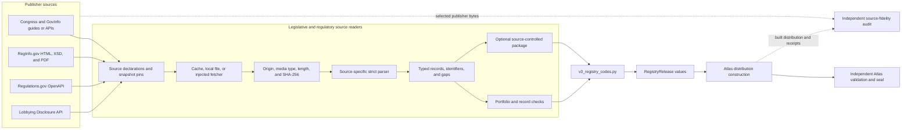
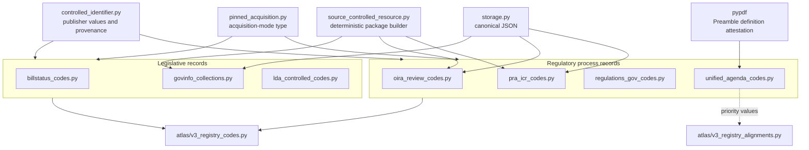
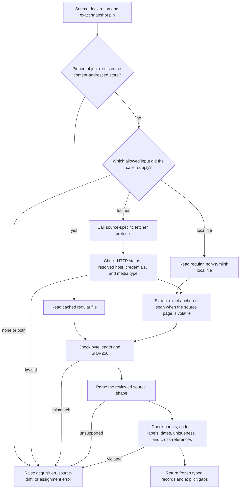
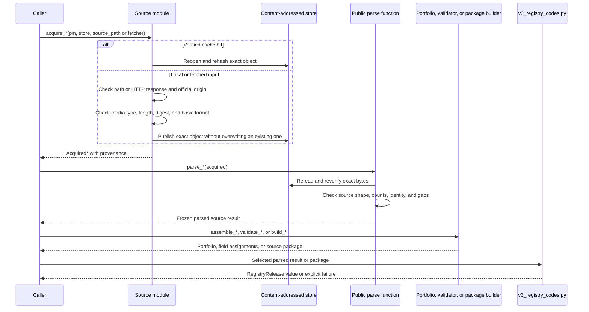

# Legislative and regulatory code and classification sources

The `registry_code_and_classification_sources_legislative_and_regulatory`
logical module reads publisher-issued codes and structural classifications used
in legislative and regulatory records. Its seven source readers cover
Congressional bill-status metadata, GovInfo and Electronic Code of Federal
Regulations (eCFR) structure, lobbying
filings, Office of Information and Regulatory Affairs (OIRA) review fields,
Paperwork Reduction Act information-collection requests, Regulations.gov API
types, and Unified Agenda records.

This is a documentation grouping, not a Python package or aggregate import
surface. The implementation remains in seven independent files under
[`src/refspec/registry/`](../src/refspec/registry/). Callers import the public
declarations, acquisition functions, parsed models, package builders, and
record validators from the source module that owns them.

The readers preserve the publisher's meaning and its limits. Most values are
operational metadata, not subjects. The LDA General Issue Codes record
filer-selected evidence, but the module still refuses to call them general
subject concepts. Unknown values fail or survive according to what the source
publisher says about completeness; the [unknown-value
matrix](#completeness-and-unknown-value-rules) records those differences.

Return to [Registry code and classification
sources](registry_code_and_classification_sources.md) for the complete module
map. Fiscal classifications belong in [Fiscal and spending
sources](registry_code_and_classification_sources_fiscal_and_spending.md), and
award, assistance, and procurement controls belong in [Procurement and
assistance
sources](registry_code_and_classification_sources_procurement_assistance_and_workforce.md).

## At a glance

| Question | Answer |
| --- | --- |
| What goes in? | Exact publisher bytes from Markdown, JSON, XML, XML Schema (XSD), YAML, HTML, and PDF documents; a reviewed source declaration and snapshot pin; and, on a cache miss, either a regular local file or an injected fetcher. |
| What happens? | Each reader checks the allowed origin, media type, byte length, SHA-256 digest, and source-specific structure. It then parses exact values, checks counts and identity, and records known gaps. Some readers also cross-check related sources or validate fields in application records. |
| What comes out? | Frozen typed source records, code lookups, validated field assignments, optional `SourceControlledResourceBundle` values, and inputs for Atlas registry releases. No reader grants publication authority by parsing a source successfully. |
| How do we check it? | Source tests cover exact pins, cache rechecks, injected fetchers, malformed inputs, source drift, count changes, duplicates, unknown assignments, package rebuilds, and downstream `v3_registry_codes.py` integration. |

## Place in RefSpec

These readers implement the source-reading part of RefSpec's build process.
They interpret publisher formats and retain the evidence needed by later
stages. Shared acquisition and package behavior belongs to [Registry
foundation](registry_foundation.md). Release selection and normalization belong
to [Atlas registry loading](atlas_registry_loading.md). The [Atlas 3.1
binding](../bindings/atlas/3.1/README.md) governs the final distribution.



The diagram shows a recurring shape, not one shared runtime pipeline. For
example, `billstatus_codes.py` feeds the Atlas loader from parsed records,
`oira_review_codes.py` first builds a package, and
`govinfo_collections.py` uses both paths for different source resources.

### Authority and scope

| Result | What it establishes | What it does not establish |
| --- | --- | --- |
| Valid source and pin objects | The expected URL, filename, retrieval time, digest, byte length, and source-specific counts have a checked representation. | That the endpoint still serves the same bytes today. |
| `Acquired*` result | The cached, local, or fetched bytes match the exact pin and passed origin and media checks. | That the source is complete, is a subject vocabulary, or should enter an Atlas release. |
| Parsed resource | The pinned bytes match the parser's reviewed shape and can be represented without guessing. | Cross-source authority, managed-release membership, or permission for accepted output. |
| `ControlledIdentifier` | The record retains a publisher-supplied value with its authority, source, observation time, and source digest. | A claim that a readable label names a general subject concept. |
| Validated assignment | One application field matched the source rule, or followed a documented open-list rule. | Validation of the surrounding bill, docket, filing, review, or RIN record. |
| Source-controlled package | The retained source artifacts and observations form a deterministic closed package with declared uses and gaps. | A published Atlas distribution. |
| `RegistryRelease` | The current Atlas loader normalized selected source records into its internal release model. | Live publisher currency, independent source fidelity, or a deployed release. |

Source selection and semantic ownership follow
[REF-023](../docs/decisions.md#ref-023-supersede-the-compatibility-view--rkaf-ships-on-the-atlas-wire)
and
[REF-024](../docs/decisions.md#ref-024-record-the-cross-product-ownership-boundary-once).
This page does not restate their ownership tables. The [United States and
Europe comparison](../ATLAS_US_EU_COMPARISON.md) provides strategic context;
the current binding, code, and decision ledger establish implementation
authority.

## Code structure and dependencies

Every source reader owns its publisher-specific declarations, exact pins,
parsing rules, typed results, and error family. The readers reuse a small set of
shared components and feed one current Atlas code loader.



[`controlled_identifier.py`](../src/refspec/registry/infrastructure/controlled_identifier.py),
[`pinned_acquisition.py`](../src/refspec/registry/infrastructure/pinned_acquisition.py),
and
[`source_controlled_resource.py`](../src/refspec/registry/infrastructure/source_controlled_resource.py)
are documented in [Registry foundation](registry_foundation.md). The separate
LDA package reader and the Unified Agenda priority alignment belong in
[Registry crosswalk and package
sources](registry_crosswalk_and_package_sources.md).

Names that begin with an underscore are implementation details. This includes
table and option parsers, HTML fragment extractors, regular-expression helpers,
identifier payload builders, and observation-ID helpers. Application code
should use the public source and pin dataclasses, fetcher protocols,
`acquire_*`, `parse_*`, `assemble_*`, `validate_*`, and `build_*` functions.

## Adapter inventory

| Source module | Publisher input and captured scope | Main typed result | Completeness and current Atlas path |
| --- | --- | --- | --- |
| [`billstatus_codes.py`](../src/refspec/registry/billstatus_codes.py) | GovInfo-endorsed `usgpo/bill-status` Markdown user guide: bill types, action codes, and Library of Congress summary version codes. | `BillStatusControlPortfolio` and `ValidatedBillStatusRecord`. | Bill types and summary versions are closed. Action codes are an explicitly incomplete courtesy list. `v3_registry_codes.py` emits three value-ring releases: 8 bill types, 88 summary-version rows, and 36 action codes. |
| [`govinfo_collections.py`](../src/refspec/registry/govinfo_collections.py) | GovInfo Collections JSON, eCFR Titles JSON, one Code of Federal Regulations (CFR) package-summary JSON object, and that package's Preservation Metadata: Implementation Strategies (PREMIS) XML fixity record. | `ParsedGovInfoCollections`, `ParsedECFRTitles`, `GovInfoCFRPackageSummary`, `ParsedGovInfoPackageFixity`, and `GovInfoControlPortfolio`. | Collection and title rosters are closed at 42 and 50 rows. The package parser covers the reviewed CFR package shape only. The current loader emits the collection package and the eCFR title roster; it does not emit the package-summary or PREMIS records. |
| [`lda_controlled_codes.py`](../src/refspec/registry/lda_controlled_codes.py) | Lobbying Disclosure API JSON constants for 79 General Issue Codes and 50 Filing Types; six filing-period values retained from a pinned OpenAPI document. | `ParsedLDAResource`, `LDAControlPortfolio`, and `ValidatedLDAFilingCodes`. | Known values are closed during record validation. General Issue Codes carry `sourceAssignedEvidence`; Filing Types and periods are deterministic metadata. The current loader emits two value-ring releases. Separate development packages preserve each list's declared use. |
| [`oira_review_codes.py`](../src/refspec/registry/oira_review_codes.py) | Four exact HTML control spans from OIRA EO 12866 review and meeting search pages. | `ParsedOIRAField`, `OIRAControlPortfolio`, and `ValidatedOIRARecordCodes`. | The four controls are closed sets with 2, 6, 9, and 3 values after excluding two blank placeholders. The package builder emits 20 deterministic observations for the Atlas loader. |
| [`pra_icr_codes.py`](../src/refspec/registry/pra_icr_codes.py) | One server-rendered PRASearch page: 10 request types, 5 ICR statuses, 5 burden-range widgets, and the OMB Control Number field shape. | `ParsedPRAResource` and `ValidatedPRAICRControls`. | Present request/status codes fail closed. The package emits only the 15 genuine code rows; it excludes the five numeric-range widgets and the OMB-number form shape. |
| [`regulations_gov_codes.py`](../src/refspec/registry/regulations_gov_codes.py) | Regulations.gov API v4 OpenAPI YAML: `DocumentType`, `DocketType`, and `SubmitterType` enum blocks. | `ParsedRegulationsGovResource`, `RegulationsGovControlPortfolio`, and `RGovCodeAssignment`. | All three enums are closed at 5, 2, and 3 values. The current loader parses the same pinned file three times by resource name and emits three value-ring releases. |
| [`unified_agenda_codes.py`](../src/refspec/registry/unified_agenda_codes.py) | RegInfo.gov Regulatory Information Number (RIN) data XSD with 20 documented option lists, plus the RISC Preamble PDF for three legal-authority citation-type prefixes and definitions. | `ParsedReginfoSchema`, `UARiscPreambleEvidence`, `UAControlPortfolio`, and `ValidatedUARinFields`. | All 20 documented lists are treated as closed and emitted. Free-text `LEGAL_AUTHORITY` remains open; classification may return no known prefix. The current loader emits 20 field releases plus one three-item citation-type release, 113 rows in total. |

## Shared source lifecycle

Importing these modules performs no network access. A cache miss requires a
caller-supplied local file or an injected fetcher; supplying both is an error.
Every cache hit is reread and reverified.



The span step applies to OIRA's volatile search pages. Other readers verify the
whole captured response. The following sections describe the differences that
matter to callers.

## BILLSTATUS codes

[`billstatus_codes.py`](../src/refspec/registry/billstatus_codes.py) reads the
single GovInfo-endorsed Bill Status XML user guide. Congress.gov does not
publish these values through a constants API, so the reader pins the exact
Markdown guide rather than inferring codes from bill records.

| Public component | Responsibility |
| --- | --- |
| `BillStatusDocumentSource`, `BILLSTATUS_USER_GUIDE` | Restrict the source to the reviewed HTTPS `raw.githubusercontent.com` document and one safe filename. |
| `BillStatusSnapshotPin`, `BILLSTATUS_USER_GUIDE_2026_08_03` | Record retrieval time, exact SHA-256, and exact byte length. |
| `BillStatusFetcher`, `FetchedBillStatusResponse`, `AcquiredBillStatusSource`, `acquire_billstatus_source()` | Keep transport outside parsing and publish verified bytes under `sha256/<digest>/billstatus-xml-user-guide.md`. |
| `BillStatusCode`, `ParsedBillStatusResource`, `BillStatusControlPortfolio` | Retain labels, publisher identifiers, declared use, completeness status, source pins, and known gaps. |
| `parse_billstatus_code_sets()` | Parse one sentence and two Markdown tables; require the reviewed headings, columns, code shapes, uniqueness, and counts. |
| `validate_billstatus_record_codes()` | Validate a required bill type, zero or more actions, zero or more summary version/chamber pairs, and a required pass-through schema version. |

The parser returns 8 `billTypes`, 36 `actionCodes`, and 88
`summaryVersionCodes`. Summary identity uses `(version_code, chamber)` because
the numeric code alone is not always unique. `by_code_and_chamber()` is the
safe lookup; `by_code()` refuses a repeated code.

The action table carries the publisher's warning that no complete,
authoritative list exists. An unknown action therefore becomes an unmatched
`BillStatusCodeAssignment` with the raw value and no identifier. Unknown bill
types and summary version/chamber pairs raise `BillStatusAssignmentError`.
The XML `<version>` value is a document schema version, not a code-list member;
the validator requires it and passes it through unchanged.

## GovInfo collections, eCFR titles, and CFR package evidence

[`govinfo_collections.py`](../src/refspec/registry/govinfo_collections.py)
combines four related but distinct resources. One acquisition implementation
accepts GovInfo JSON, eCFR JSON, or GovInfo PREMIS XML according to the
`GovInfoSourceSpec.content_kind` field.

| Public component | Responsibility |
| --- | --- |
| `GovInfoSourceSpec` and the four `GOVINFO_*`/`ECFR_*` declarations | Restrict each source to `api.govinfo.gov` or `www.ecfr.gov`, identify JSON or XML, and assign a safe content-addressed filename. |
| `GovInfoSnapshotPin`, `GovInfoFetcher`, `FetchedGovInfoResponse`, `AcquiredGovInfoSource`, `acquire_govinfo_source()` | Verify exact response bytes and require redirects to stay on the source's original official host. |
| `parse_govinfo_collections()` | Read the complete `collectionCode`/`collectionName` list, validate holdings-count fields without emitting them, require unique codes, and require 42 rows. |
| `parse_ecfr_cfr_titles()` | Read 50 title identities, names, currency dates, and the `reserved` flag; require active titles to carry dates and reserved titles to omit them. |
| `parse_govinfo_cfr_package_summary()` | Validate the exact field shape for one annual-edition CFR package, its collection and title identity, links, dates, document classification, Superintendent of Documents (SuDoc) number, and six download roles. |
| `parse_govinfo_cfr_package_fixity()` | Read SHA-256 file digests from PREMIS 2.0 file objects and retain their official names and locations. |
| `assemble_govinfo_control_portfolio()` | Require the package summary's collection and title to exist and require the PREMIS package ID to equal the summary package ID. |
| `validate_collection_code()`, `validate_cfr_title_number()` | Resolve exact known collection and title values. |
| `build_govinfo_collections_package()` | Build the deterministic 42-row collection-code package from one exact local capture. |

The module deliberately omits volatile `packageCount` and `granuleCount`
values from collection records, although the parser checks their types in the
pinned bytes. It also treats collection names and CFR title names as plain
labels rather than subjects.

`ECFR_CFR_HIERARCHY_LEVEL_TYPES` is different from the two closed API rosters.
It records nine values observed in selected eCFR structure captures because
eCFR publishes no separate constants endpoint. Callers must not describe that
tuple as a publisher release. A PREMIS file object without a fixity element is
also valid and is skipped; a present fixity block must use a well-formed
SHA-256 value.

The current Atlas loader packages collection codes and directly converts the
title roster. It does not emit the reviewed CFR package summary, PREMIS fixity
records, or observed hierarchy-level tuple. That current consumer path is a
code fact, not a statement that those other records may never be used.

## Lobbying Disclosure Act controls

[`lda_controlled_codes.py`](../src/refspec/registry/lda_controlled_codes.py)
reads two complete JSON constants endpoints. The source arrays require a
`value` and `name`; optional publisher fields such as `id`, `identifier`,
`code`, and `url` become additional `ControlledIdentifier` values rather than
being discarded.

| Public component | Responsibility |
| --- | --- |
| `LDAConstantSource`, `LDA_GENERAL_ISSUE_CODES`, `LDA_FILING_TYPES` | Declare each official endpoint, intended use, filename, and expected row count. |
| `LDASnapshotPin`, `LDAFetcher`, `FetchedLDAResponse`, `AcquiredLDASource`, `acquire_lda_constants()` | Acquire exact JSON bytes from cache, a local file, or an injected `lda.gov` fetcher. |
| `LDACode`, `ParsedLDAResource`, `parse_lda_constants()` | Preserve codes, labels, optional identifiers, interface version, source digest, and gaps; reject malformed, duplicate, missing, or extra data. |
| `LDAControlPortfolio`, `assemble_lda_control_portfolio()` | Require exactly one General Issue Code resource and one Filing Type resource, then add the six OpenAPI filing-period values. |
| `validate_lobbying_filing_codes()` | Require a known Filing Type, validate an optional filing period, validate every lobbying activity's General Issue Code, and check any supplied display label. |

General Issue Codes use `sourceAssignedEvidence` because filers select them.
That use does not make the codes a subject scheme. Filing Types and filing
periods use deterministic metadata. The current Atlas loader places both code
lists in the value ring; downstream placement and source use remain separate
decisions.

The API publishes no independent filing-status list. Status-like meaning stays
inside Filing Type labels, and `ValidatedLDAFilingCodes.filing_status` remains
`None`. The filing-period tuple comes from a separately pinned OpenAPI
document; there is no independent constants endpoint or official display-label
list for those values.

[`lda_controlled_list_resources.py`](../src/refspec/registry/packages/lda_controlled_list_resources.py)
builds and reopens two development-only source-controlled packages. That
separate module authenticates each package's external logical digest and
rebuilds its observations from the retained source bytes. See [Registry
crosswalk and package sources](registry_crosswalk_and_package_sources.md) for
that package layer.

## OIRA EO 12866 review and meeting controls

[`oira_review_codes.py`](../src/refspec/registry/oira_review_codes.py) reads
four HTML form controls. Full RegInfo.gov pages contain changing session and
Cross-Site Request Forgery (CSRF) values, so full-page bytes are unstable. Each
`OIRAFieldSource` uses a begin and end marker to locate one control span. The
begin marker must occur exactly once, and the extracted span must match its own
digest and length.

| Public component | Responsibility |
| --- | --- |
| `OIRAFieldSource`, `OIRA_FIELD_SOURCES` | Describe the field name, input type, HTML name, page URL, anchor pair, expected real-option count, and excluded placeholder count. |
| `OIRAFieldSnapshotPin`, `OIRA_FIELD_PINS_2026_08_03` | Pin the four exact markup spans rather than volatile pages. |
| `OIRAFetcher`, `FetchedOIRAResponse`, `AcquiredOIRAField`, `acquire_oira_field()` | Fetch or read a full page, extract the selected span, verify it, and store it by digest. |
| `OIRAValue`, `ParsedOIRAField`, `parse_oira_field()` | Parse radio, checkbox, or select options; validate code shapes, labels, placeholders, counts, and uniqueness. |
| `OIRAControlPortfolio`, `assemble_oira_control_portfolio()` | Require exactly `reviewStatus`, `ruleStage`, `concludedAction`, and `meetingStatus`. |
| `validate_oira_record_codes()` | Require a known review status; validate optional rule-stage entries, concluded action, and meeting status when present. |
| `build_oira_review_and_meeting_package()` | Package all 20 real values, four source spans, and the excluded-placeholder count as a closed deterministic resource. |

The four value counts are 2 review statuses, 6 stages, 9 concluded actions,
and 3 meeting statuses. The parser excludes one blank option from each select
control and reports both exclusions in package accounting.

The pages publish no code-list release identifier. They also use inconsistent
stage labels across review and meeting search forms. The module records that
publisher difference and does not create a new canonical label. Subjects, when
needed, come from the linked rule or its source-assigned topic, not the review
or meeting event.

## Paperwork Reduction Act ICR controls

[`pra_icr_codes.py`](../src/refspec/registry/pra_icr_codes.py) pins the complete
server-rendered PRASearch HTML page. It parses the controls needed by
`pra-icr-v1`, but its package builder emits only publisher code lists.

| Public component | Responsibility |
| --- | --- |
| `PRAPageSource`, `PRA_SEARCH_PAGE`, `PRASnapshotPin`, `PRA_SEARCH_PAGE_2026_08_03` | Declare and pin the official page plus expected request-type, status, and burden-row counts. |
| `PRAFetcher`, `FetchedPRAResponse`, `AcquiredPRASource`, `acquire_pra_search_page()` | Acquire exact HTML bytes and require the resolved URL to remain on `www.reginfo.gov`. |
| `PRACode`, `ParsedPRAResource`, `parse_pra_icr_controls()` | Parse 10 request types, 5 statuses, 5 paired burden widgets, and the OMB Control Number input name and maximum length. |
| `OMB_CONTROL_NUMBER_PATTERN` | Validate the derived `NNNN-NNNN` shape for an optional Office of Management and Budget (OMB) Control Number. |
| `validate_icr_record()` | Validate optional request/status codes and their optional display labels; reject malformed OMB numbers. |
| `build_pra_icr_controlled_value_package()` | Emit only the 15 request/status codes and retain the source page and explicit exclusions. |

The package excludes six parsed rows: one OMB-number form shape and five
burden-range widgets. These rows help validate records and detect page drift,
but they are form mechanics rather than code-list members.

The current scope also excludes Conclusion Action, Type of Review,
Certification, ICR Ended Due To, and Date Type controls. Agency and Sub-Agency
values arrive through client-side JavaScript and do not occur in the captured
HTML. Extending scope requires reviewed rendered-browser evidence or a
publisher source that exposes those values; a regular expression over the
server page cannot recover absent data.

## Regulations.gov API types

[`regulations_gov_codes.py`](../src/refspec/registry/regulations_gov_codes.py)
reads one pinned OpenAPI 3.0 YAML document. The parser selects one enum at a
time by its exact schema name and reviewed indentation. A layout change fails
as source drift, even if a permissive YAML reader could still load the file,
because the current check deliberately pins the source shape as well as the
values.

| Public component | Responsibility |
| --- | --- |
| `RGovOpenAPISource`, `RGOV_OPENAPI_SOURCE`, `RGovSnapshotPin`, `RGOV_OPENAPI_2026_08_03` | Declare the official static file, API version, exact bytes, retrieval time, and observed `Last-Modified` value. |
| `RGovFetcher`, `FetchedRGovResponse`, `AcquiredRGovSource`, `acquire_regulations_gov_openapi()` | Acquire exact YAML bytes and accept only the reviewed static-file media types from `open.gsa.gov`. |
| `RGovCode`, `ParsedRegulationsGovResource`, `parse_regulations_gov_resource()` | Parse one named enum; preserve exact values as both labels and identifier values; require the expected count and uniqueness. |
| `RegulationsGovControlPortfolio`, `assemble_regulations_gov_control_portfolio()` | Require one `documentType`, one `docketType`, and one `submitterType` resource. |
| `validate_regulations_gov_document_type()`, `validate_regulations_gov_docket_type()` | Require and resolve the exact field on document and docket records. |

The three lists contain 5 document types, 2 docket types, and 3 submitter
types. A source line with trailing whitespace is normalized only by removing
that YAML presentation whitespace. The module does not validate a live comment
submission against `SubmitterType`.

`subtype`, `category`, `organizationType`, `govAgencyType`,
`restrictReasonType`, and attachment `format` remain free text because the
OpenAPI document does not enumerate them. The module records that limit instead
of building a list from observed API records.

## Unified Agenda controls

[`unified_agenda_codes.py`](../src/refspec/registry/unified_agenda_codes.py)
uses two source documents. The RIN-data XSD supplies 20 closed lists in
`xs:documentation` text even though each element's XSD type is unrestricted
`xs:string`. The RISC Preamble PDF supplies definitions for three citation-type
prefixes found in free-text `LEGAL_AUTHORITY` values.

| Public component | Responsibility |
| --- | --- |
| `UASourceDocument`, `UA_REGINFO_SCHEMA`, `UA_RISC_PREAMBLE` | Distinguish the XSD and PDF while restricting both to official HTTPS RegInfo.gov URLs. |
| `UASnapshotPin`, `UAFetcher`, `FetchedUADocument`, `AcquiredUADocument`, `acquire_unified_agenda_document()` | Acquire either exact document, accept the source's observed media behavior, and publish verified bytes by digest. |
| `UAControlledFieldValues`, `ParsedReginfoSchema`, `parse_reginfo_schema()` | Find every documented option list, parse exact publisher strings, preserve raw and distinct counts, and require a census of exactly 20 fields. |
| `UARiscPreambleEvidence`, `pin_risc_preamble_evidence()` | Verify the exact PDF and attest that every transcribed citation-type definition remains in its extracted text. |
| `UAControlPortfolio`, `assemble_unified_agenda_portfolio()` | Combine the three record-validation fields with the three legal citation-type prefixes. |
| `classify_legal_authority_citation()` | Return `U.S.C.`, `Pub. L.`, or `E.O.` when present; otherwise return `None` because the source field is free text. |
| `validate_rin_controlled_fields()` | Validate optional rule stage and priority, timetable actions, and non-empty legal-authority strings. |

`parse_reginfo_schema()` checks that the number of documentation blocks equals
both `UA_DOCUMENTED_OPTION_LIST_COUNT` and the internal 20-field roster. Each
field also has expected raw and distinct counts. The publisher repeats `Not
Major` and `NPRM`; the parser preserves the raw counts, folds literal duplicates
in first-seen order, and emits one identifier per distinct value. It preserves
publisher casing and the joined `Supplemental NPRM. FInal Action` text rather
than repairing either one.

The record validator uses only `RULE_STAGE`, `PRIORITY_CATEGORY`,
`TTBL_ACTION`, and `LEGAL_AUTHORITY_LIST`. The parsed result still carries all
20 documented lists, and the current Atlas loader emits every list as its own
release. The loader also emits a three-item citation-type release from the
Preamble, for 113 source rows across the module.

The citation types and their definitions are reviewed transcriptions, not an
enumeration discovered by parsing the PDF. `pin_risc_preamble_evidence()` uses
`pypdf` to require each normalized definition to remain present. When a future
change moves a citation or definition, maintainers must also inspect the
rendered page as pixels under the repository source-review rule.

The Unified Agenda priority values also support a separately evidenced
alignment in
[`v3_registry_alignments.py`](../src/refspec/atlas/v3_registry_alignments.py).
That cross-source decision is outside this source reader and belongs in
[Registry crosswalk and package
sources](registry_crosswalk_and_package_sources.md).

## Completeness and unknown-value rules

Unknown-value behavior is a source claim, not a preference shared by every
adapter.

| Source field or resource | Rule | Result for an unknown or absent value |
| --- | --- | --- |
| BILLSTATUS `bill_type` | Closed enumeration. | A missing non-string value or unknown code raises `BillStatusAssignmentError`. |
| BILLSTATUS `actions[*].action_code` | Publisher describes the table as an open courtesy list. | A non-empty unknown code survives as `matched=False`, with its raw value and no identifier. |
| BILLSTATUS summary `version_code` plus `chamber` | Closed, compound identity. | An unknown pair raises `BillStatusAssignmentError`. |
| BILLSTATUS `schema_version` | Required free document-version text. | Missing or blank text fails; any non-empty string passes through unchanged. |
| GovInfo collections and eCFR title numbers | Closed captured rosters. | Lookup of an unknown code or title raises `GovInfoAssignmentError`. A roster count change is source drift before lookup. |
| GovInfo PREMIS file without fixity | Documented incomplete per-file coverage. | The parser skips the file. A present non-SHA-256 or malformed fixity block fails. |
| LDA Filing Type, filing period, and General Issue Code | Closed captured values for validation. | Unknown values and a mismatched supplied issue label raise `LDAAssignmentError`; optional activity and period containers may be absent. |
| OIRA review status | Required closed control. | Missing or unknown values raise `OIRAAssignmentError`. |
| OIRA rule stages, concluded action, and meeting status | Optional closed controls. | Absence is valid; an unknown present value raises `OIRAAssignmentError`. |
| PRA OMB number, request type, and ICR status | Optional shape or closed control. | Absence is valid. A malformed number, unknown present code, or display mismatch raises `PRAAssignmentError`. |
| Regulations.gov document and docket types | Required closed enums in their validators. | Missing, non-string, or unknown values raise `RegulationsGovAssignmentError`. |
| Regulations.gov Submitter Type | Closed source enum without a live-record validator in this module. | The parsed list is available; callers must not imply record validation that the module does not perform. |
| Unified Agenda 20 documented fields | Closed lists derived from exact XSD documentation. | The source parser fails on census or count drift. `validate_rin_controlled_fields()` rejects unknown values for the three fields it consumes. |
| Unified Agenda `LEGAL_AUTHORITY` | Free text with three recognized citation-type prefixes. | A non-empty citation with no known prefix remains valid and receives `citation_type=None`. |

## Component interaction

The usual caller interaction separates transport, source interpretation,
record validation, and Atlas conversion. A caller can stop after any completed
stage whose result it needs.



Current Atlas loading follows these paths:

| Source | Loader input | Current normalized result |
| --- | --- | --- |
| BILLSTATUS | `BillStatusControlPortfolio` | Three releases. Action codes retain `captureSubset`; the two closed resources retain `completeCapture`. |
| GovInfo/eCFR | Collections package plus direct `ParsedECFRTitles` conversion | One value-ring collection code release and one legal-identity-ring CFR title structure release. |
| LDA | Two direct `ParsedLDAResource` results | General Issue Code and Filing Type releases. The separate source packages are not this loader path. |
| OIRA | `SourceControlledResourceBundle` from four acquired spans | One 20-item code release. |
| PRA | `SourceControlledResourceBundle` from the exact local page | One 15-item code release; form mechanics stay excluded. |
| Regulations.gov | Three direct `ParsedRegulationsGovResource` results | Three releases from one pinned OpenAPI input. |
| Unified Agenda | Direct XSD and Preamble parsed results | Twenty documented-field releases and one legal citation-type release. |

[`v3_registry_codes.py`](../src/refspec/atlas/v3_registry_codes.py) checks
fixture pins and measured row counts again before creating releases. The
generic `RegistryRelease` profile and ring do not replace each source module's
gaps or source-use limits. [Atlas registry loading](atlas_registry_loading.md)
documents that conversion layer, and [Atlas distribution
builder](atlas_distribution_builder.md) documents how selected releases enter
a distribution candidate.

## Failure model

Each module defines a `ValueError` family with separate acquisition,
source-drift, and assignment errors. Callers should report the failing stage
and reject partial output.

| Failure stage | Representative causes | Required response |
| --- | --- | --- |
| Declaration | Non-HTTPS or unofficial URL, embedded credentials, unsafe filename, malformed digest, empty retrieval time, or invalid expected count. | Correct the source or pin declaration before acquisition. |
| Acquisition | Cache miss without an input, both local and fetcher inputs, non-positive timeout, symlink or non-file input, non-200 response, disallowed redirect, or unexpected media type. | Supply an allowed reviewed input or fix the transport. Keep the origin and media checks. |
| Exact-byte verification | Byte length or SHA-256 differs from the pin, or the basic JSON/XML/PDF/OpenAPI format check fails. | Retain old and new bytes, inspect the source change, and update the pin only after review. |
| Source shape | Missing heading, field, option block, anchor, namespace, documentation prefix, form marker, or table column; changed order or cardinality. | Read the surrounding raw bytes. Extend the parser only when the source meaning remains unambiguous. |
| Identity and count | Duplicate code or label, malformed identifier, unknown chamber, repeated PREMIS object, or changed complete-list count. | Preserve the ambiguity or fail. Never replace publisher identity with a row number or label-derived IRI. |
| Cross-source assembly | Missing required resource, unknown GovInfo collection or title, or different package IDs between summary and fixity. | Fix or re-review the inputs; do not assemble a partial portfolio silently. |
| Record assignment | Missing required field, wrong container type, unknown closed value, or supplied display label that disagrees with the pinned source. | Reject the assignment. Use an open-list outcome only where the source explicitly supports one. |
| Package | Parsed bytes differ from the retained artifact, deterministic content changes, exclusion accounting changes, or a row claims subject identity. | Reject and rebuild from reviewed exact inputs. Do not patch generated package members. |

The base error names are `BillStatusResourceError`, `GovInfoResourceError`,
`LDAResourceError`, `OIRAResourceError`, `PRAResourceError`,
`RegulationsGovResourceError`, and `UnifiedAgendaResourceError`. Their
`*AcquisitionError`, `*SourceDriftError`, and `*AssignmentError` subclasses let
callers distinguish transport, source, and application-record failures.

## Material source limits

The following limits affect consumer behavior and release claims:

| Source | Limit retained by the code |
| --- | --- |
| BILLSTATUS | Action codes are incomplete by publisher statement. The guide has no machine-readable code-list release identifier. Its House Bill prose and machine-value section also use different abbreviations; the parser follows the machine-value section. |
| GovInfo/eCFR | The package-summary parser certifies one reviewed CFR annual-edition shape, not every GovInfo collection. PREMIS fixity covers only some file objects. Hierarchy level types are observed evidence, not a standalone release. |
| LDA | No code-list release identifier, filing-status list, or independent filing-period constants endpoint exists in the captured sources. |
| OIRA | Exact control spans stand in for volatile full pages. The pages publish no code-list revision identifier, and stage labels differ across forms. |
| PRA | The package excludes five parsed burden widgets, the OMB-number form shape, several out-of-scope controls, and JavaScript-populated agency values absent from the server bytes. |
| Regulations.gov | Several agency-configured classification fields and attachment format are free text. The code contains no live comment-submission validation. |
| Unified Agenda | The 20 closed lists come from XSD documentation, not XSD enum restrictions. The source contains duplicates, a joined action string, casing differences, and a stage discrepancy. Legal authority remains free text; the three prefixes cover only a documented subset. |

These statements describe the checked code, fixtures, and dated pins. They do
not assert that a live endpoint is reachable or unchanged now.

## Developer workflow

### Change an existing reader

1. Read the source declaration, acquisition code, parser, typed output,
   validators, package builder, focused tests, and current Atlas loader before
   changing a rule.
2. Open the exact source bytes around the affected value. A search result only
   locates the evidence. Read the neighboring fields, rows, or lines that give
   it meaning. For a PDF, inspect the rendered page as pixels as required by
   [`AGENTS.md`](../AGENTS.md).
3. State whether the change affects the pin, parser shape, completeness rule,
   identifier, record validation, package membership, or downstream release.
4. Preserve raw publisher values and their source context. Use
   `ControlledIdentifier` only for identity the publisher supplies.
5. Add a positive fixture and a negative fixture for every new structural
   rule. If replacing a running check, copy the old implementation into the
   test as an independent oracle and prove agreement on real data and a
   mutation battery before deleting the production path.
6. Update expected counts, explicit gaps, package accounting, and loader counts
   together. A count change without source review remains drift.
7. Run the source tests, package tests, and current Atlas consumer tests. Add an
   independent source-fidelity reader when a release makes a fidelity claim;
   reusing the production parser would make the comparison circular.

### Add another legislative or regulatory source

1. Confirm that the new source belongs here rather than in the fiscal,
   procurement/assistance, organization, legal-identifier, or vocabulary
   groups.
2. Identify the official artifact, exact captured scope, update signal,
   release identifier when available, rights evidence, and unknown-value rule.
3. Prefer a maintained format library when it covers most of the source. Keep
   project code focused on origin checks, source-specific invariants, and typed
   output.
4. Keep imports offline. Reuse shared acquisition where it fits or define the
   smallest fetcher protocol that preserves exact response bytes.
5. Choose the narrowest output: deterministic metadata, source-assigned
   evidence, controlled code list, structural scheme, or identifier scheme.
   Do not turn a readable operational label into a subject.
6. Add a validator or a real downstream consumer and at least one negative
   fixture for every new structure. Remove fields that no consumer checks.
7. Add source selection explicitly in the appropriate Atlas loader, update the
   resource catalog and planning index, and record the measured row count and
   completeness scope. A parser's presence does not admit a source to Atlas.

### Update a snapshot pin

1. Acquire the new object without replacing the old content-addressed object.
2. Compare exact bytes, source context, field or table shape, counts, labels,
   identifiers, and publisher anomalies.
3. Explain every added, removed, or changed value in source-native terms.
4. Update the pin, fixture, expected counts, gaps, and downstream measured
   counts in one reviewed change.
5. Rebuild source packages and compare logical digests where the source has a
   package reader.
6. Keep the old check or release as test-only evidence when parser behavior
   changes, and freeze every deliberate verdict difference.

### Focused checks

Run the source and package suites from the repository root:

```bash
uv run pytest -q \
  tests/test_billstatus_codes.py \
  tests/test_govinfo_collections.py \
  tests/test_lda_controlled_codes.py \
  tests/test_lda_controlled_list_resources.py \
  tests/test_oira_review_codes.py \
  tests/test_pra_icr_codes.py \
  tests/test_regulations_gov_codes.py \
  tests/test_unified_agenda_codes.py \
  tests/test_risc_preamble_attestation.py
```

Then run the current consumer checks for an affected release or mapping:

```bash
uv run pytest -q \
  tests/test_registry_public_api.py \
  tests/test_atlas_v3_registry_codes.py \
  tests/test_atlas_v3_registry_alignments.py \
  tests/test_producer_prebuild_validation.py
```

Run the repository's full test targets before merging a source or release
change. A focused green suite proves only the local paths it ran. It does not
prove live endpoint currency, complete publisher coverage, a full Atlas build,
distribution validation, sealing, deployment, or external consumer behavior.

## Related documentation

- [Registry code and classification
  sources](registry_code_and_classification_sources.md)
- [Registry foundation](registry_foundation.md)
- [Registry crosswalk and package
  sources](registry_crosswalk_and_package_sources.md)
- [Atlas registry loading](atlas_registry_loading.md)
- [Managed release validation](managed_release_validation.md)
- [Atlas distribution builder](atlas_distribution_builder.md)
- [Atlas source fidelity audit](atlas_source_fidelity_audit.md)
- [Atlas 3.1 binding](../bindings/atlas/3.1/README.md)
- [Decision ledger](../docs/decisions.md)
- [Repository overview and document index](../README.md)
