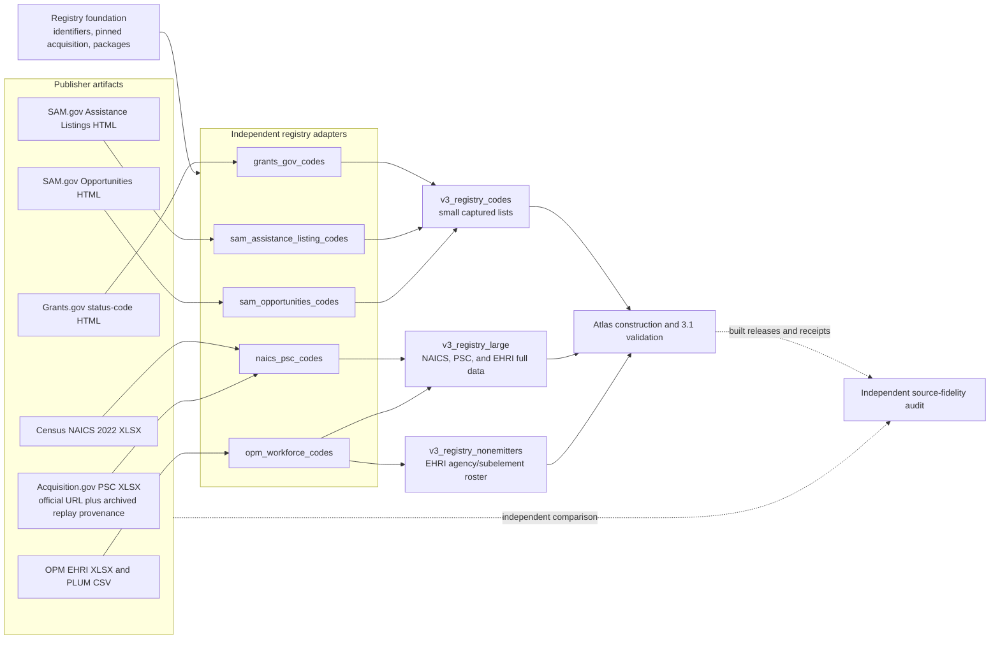
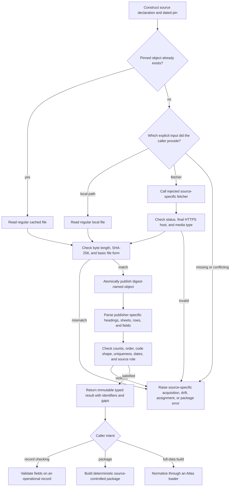

# Procurement, assistance, and workforce code sources

The `registry_code_and_classification_sources` module includes five independent
source adapters for procurement, assistance, industry, and federal workforce
codes. They preserve publisher codes and the evidence needed to replay each
import. They do not turn a readable code label into a general subject concept.

This page is a documentation grouping over these source files:

- [`grants_gov_codes.py`](../src/refspec/registry/grants_gov_codes.py)
- [`naics_psc_codes.py`](../src/refspec/registry/naics_psc_codes.py)
- [`opm_workforce_codes.py`](../src/refspec/registry/opm_workforce_codes.py)
- [`sam_assistance_listing_codes.py`](../src/refspec/registry/sam_assistance_listing_codes.py)
- [`sam_opportunities_codes.py`](../src/refspec/registry/sam_opportunities_codes.py)

There is no Python package with this page's name and no shared aggregate API.
Callers import the source-specific module they need. See [Registry code and
classification sources](registry_code_and_classification_sources.md) for the
wider module and [Registry foundation](registry_foundation.md) for shared
identifier, acquisition, and package behavior.

## At a glance

| Question | Answer |
| --- | --- |
| What goes in? | Digest-pinned Grants.gov and SAM.gov HTML documentation, the 2022 Census NAICS workbook, the April 2025 Product and Service Code workbook, OPM's Electronic Human Resources Integration (EHRI) workbook, the PLUM all-data CSV, and small legacy OPM JSON samples. |
| What happens? | Each adapter verifies the source identity and shape it supports, parses exact publisher codes or field definitions, preserves revision and completeness limits, and applies source-specific assignment rules. |
| What comes out? | Typed code portfolios, validated record fields, deterministic source-controlled packages, or full-data inputs for Atlas registry loaders. |
| How do we check it? | Focused tests cover byte pins, source origin, content-addressed cache behavior, exact counts, schema drift, duplicates, unknown values, retired values, deterministic packages, downstream loading, and independent source-fidelity checks. |

The practical boundary is simple: these codes describe a record's operational
classification or status. They may support filters, joins, validation, or
ranking. They do not state a document's general policy topic unless a source
explicitly publishes a separate topic assignment, and these five adapters do
not make that broader claim.

## Place in RefSpec

The adapters sit on the source-reading side of RefSpec's build process. Small
HTML code lists become deterministic source-controlled packages before the
Atlas code loader normalizes them. Large workbooks go through full-data loaders
that retain their exact input pins. OPM's agency/subelement rows leave the
workforce-code path because the publisher defines them as an organization
roster.



The normalized releases use the Atlas `codeScheme` profile and `value` ring,
except for the OPM `AGENCY/SUBELEMENT` roster, which uses the `entity` ring.
The [Atlas 3.1 binding](../bindings/atlas/3.1/README.md#registry-resource-profiles)
defines these profiles and rings. A source adapter establishes source-faithful
records; it does not, by itself, authorize release membership or public
delivery. [Managed release validation](managed_release_validation.md), [Atlas
registry loading](atlas_registry_loading.md), and [Atlas distribution
builder](atlas_distribution_builder.md) own those later checks.

### Scope and authority

| Result | What it establishes | What it does not establish |
| --- | --- | --- |
| Source declaration and snapshot pin | The supported official URL, file name, retrieval facts, byte length, and SHA-256 digest. | That the live endpoint still serves those bytes or that a page lists every value the publisher uses elsewhere. |
| Successful acquisition | The cached, local, or fetched bytes match the declared pin and allowed source origin. | That the source is a subject vocabulary or belongs in an Atlas release. |
| Parsed portfolio | The exact capture has the reviewed headings, columns, code shapes, counts, and uniqueness properties. | Cross-source equivalence, subject meaning, or a broader claim than the parsed table. |
| Validated record field | A submitted value satisfies that adapter's captured-list, shape, label, lifecycle, or vintage rule. | That the code replaces the record's native identity or legal meaning. |
| Source-controlled package | The retained source and observations form a deterministic closed package with declared uses and gaps. | A sealed Atlas distribution or authority to omit the package's recorded gaps. |
| Normalized `RegistryRelease` | A downstream loader represented the verified rows in the Atlas source-data model. | Independent proof that the normalized release matches every publisher row; the source-fidelity audit supplies that comparison. |

## Source inventory

| Source module | Publisher input and reviewed extent | Main output | Completeness and unknown handling | Current downstream path |
| --- | --- | --- | --- | --- |
| [`grants_gov_codes.py`](../src/refspec/registry/grants_gov_codes.py) | Grants.gov status-code HTML: 17 eligibility codes and 26 funding-category codes. The HTTP status table is a page-shape check only. | `GrantsGovCodePortfolio`; optional package per code family. | Both captured tables reject unknown submitted codes. The adapter records that funding instrument, opportunity status, and statutory initiative lists are absent from this page. | `v3_registry_codes` emits two `codeScheme`/`value` releases with `completeCapture` scope for the captured tables. |
| [`naics_psc_codes.py`](../src/refspec/registry/naics_psc_codes.py) | Full 2022 North American Industry Classification System (NAICS) workbook: 2,125 rows. Full April 2025 Product and Service Code (PSC) workbook: 6,108 source rows, of which 2,344 active four-character codes are emitted. Small CSV fixtures exercise narrow parser paths. | `ParsedNaicsPscResource`, `NaicsPscPortfolio`, and one package per classification. | A supplied NAICS or PSC value must match the pinned edition exactly. The module covers the 2022 NAICS vintage and active April 2025 PSC rows, not future or retired editions. | `v3_registry_large` loads the full workbooks as `naics-2022` and `psc-april-2025`; both use `codeScheme`/`value`. |
| [`opm_workforce_codes.py`](../src/refspec/registry/opm_workforce_codes.py) | Full three-sheet EHRI workbook: 534 field definitions, 17,263 current values, and 16,425 past values. Optional PLUM CSV parser: 15,777 exact rows in the pinned test capture. Five small JSON code samples remain for compatibility. | `OPMEHRIDataStandardsExport`, `OPMPLUMAllDataExport`, `OPMControlPortfolio`, validated field records, and legacy sample packages. | The EHRI workbook is checked as a complete pinned capture. The legacy JSON samples are explicitly non-exhaustive; shape-valid unmatched codes are retained with `in_pinned_sample=False`. PLUM validation also requires certification, the matching vintage, and redaction evidence where applicable. | `v3_registry_large` emits current EHRI values after removing `AGENCY/SUBELEMENT`; `v3_registry_nonemitters` emits that element as an organization roster. PLUM bulk rows and the five legacy sample packages are not the current full-data Atlas path. |
| [`sam_assistance_listing_codes.py`](../src/refspec/registry/sam_assistance_listing_codes.py) | SAM.gov Assistance Listings HTML: 17 assistance types, 44 eligible applicant types, 73 eligible beneficiary types, and documented Assistance Listing Number fields. | `SAMAssistanceListingCodePortfolio`; validated assistance-listing records; optional package per code family. | The three captured tables reject unknown codes and mismatched display names. The Assistance Listing Number is shape-checked as `NN.NNN`, not looked up in a bounded list. | `v3_registry_codes` emits three `codeScheme`/`value` releases with `completeCapture` scope for the documented tables. |
| [`sam_opportunities_codes.py`](../src/refspec/registry/sam_opportunities_codes.py) | SAM.gov Opportunities HTML: 11 notice types, 5 documented status values, 18 set-aside codes, and change-log evidence. | `SAMOpportunitiesCodePortfolio`; query-value validators; optional package per code family. | Unknown values fail. Two notice types remain in the portfolio as retired history but fail current-query validation. Set-aside matching preserves publisher case. | `v3_registry_codes` emits three `codeScheme`/`value` releases with `completeCapture` scope for the documented tables. |

`completeCapture` above refers to the exact captured table or field set named by
the release. It does not mean that the publisher exposes every related code at
the same URL or that RefSpec has captured every historical edition.

## Common design

Four adapters share the same explicit acquisition shape. OPM's legacy JSON
path follows it too. The full EHRI and PLUM readers accept caller-supplied
bytes; the Atlas loader verifies those bytes through its own `RegistryInputPin`
before parsing.



### Shared responsibilities

The adapters depend on three shared registry services instead of defining a
second copy of their behavior:

- [`controlled_identifier.py`](../src/refspec/registry/infrastructure/controlled_identifier.py)
  records the publisher value, identifier kind, authority, source, observation
  time, optional effective time, and source digest.
- [`pinned_acquisition.py`](../src/refspec/registry/infrastructure/pinned_acquisition.py)
  supplies the common acquisition-mode type. Each source module still checks
  its own origin and media type.
- [`source_controlled_resource.py`](../src/refspec/registry/infrastructure/source_controlled_resource.py)
  builds and reopens deterministic packages. [Registry foundation](registry_foundation.md)
  documents the package files and shared invariants.

`canonical_json()` from [`storage.py`](../src/refspec/storage.py) makes local
observation identifiers and package output reproducible. `naics_psc_codes.py`
and `opm_workforce_codes.py` use `openpyxl` to read publisher workbooks.

Every module has source-specific error classes. Their meanings are consistent:

| Error category | Meaning |
| --- | --- |
| Acquisition | The caller supplied conflicting inputs, an unsafe path, a disallowed URL, an invalid response, or no source for a cache miss. |
| Source drift | The bytes fail their pin or the source structure no longer matches the reviewed parser assumptions. |
| Assignment | An operational record contains a missing, malformed, unknown, retired, or internally inconsistent value under that source's rules. |
| Package | The requested resource family, retained source, logical digest, or rebuilt package differs from the declared package. |

Importing these modules opens no network connection. A live request occurs only
through an injected fetcher. Cache hits are reread and reverified; the digest in
the directory name is never treated as proof by itself.

## Grants.gov status codes

[`grants_gov_codes.py`](../src/refspec/registry/grants_gov_codes.py) reads one
server-rendered page because Grants.gov exposes no JSON or OpenAPI code-list
endpoint for these values.

### Grants.gov core components

| Component | Responsibility |
| --- | --- |
| `GrantsGovDocSource` | Restricts the source to the official HTTPS Grants.gov page and a plain file name. |
| `GrantsGovSnapshotPin` | Pins retrieval time, SHA-256, and byte length. The reviewed source has no publisher revision identifier or usable response revision header. |
| `FetchedGrantsGovResponse` and `GrantsGovFetcher` | Define the provider-independent fetch boundary and retain exact response bytes plus HTTP facts. |
| `AcquiredGrantsGovSource` | Records the verified object path, source and resolved URLs, content type, acquisition mode, and cache status. |
| `GrantsGovCode` | Holds one code, label, declared use, source URL, and `ControlledIdentifier`; `is_general_subject_concept` remains false. |
| `GrantsGovCodePortfolio` | Holds both parsed tables and the source gaps; its lookup methods index exact publisher codes. |
| `validate_eligibility_code()` and `validate_funding_category_code()` | Return the matching `GrantsGovCode` directly; the module does not introduce a second assignment type. |

### Parse and use rules

`parse_grants_gov_status_codes()` requires all three page landmarks. It parses
the eligibility and category tables, requires exact reviewed counts, validates
code shapes, and rejects duplicates. It only checks the HTTP status-code table
to confirm that the expected page was captured.

The two emitted families have different roles:

- `eligibilities` are `deterministicMetadata`: they identify eligible applicant
  types.
- `fundingCategories` are `sourceAssignedEvidence`: they preserve the category
  a funder attaches to an opportunity. They remain assignment evidence rather
  than a general subject vocabulary.

Both validation functions reject an unknown value. The package builder emits
one `controlledCodeList` at a time and records all gaps, including the missing
funding-instrument, opportunity-status, and statutory-initiative lists.

## NAICS and Product and Service Codes

[`naics_psc_codes.py`](../src/refspec/registry/naics_psc_codes.py) deliberately
keeps two publishers and two release schedules distinct. A `NaicsPscPortfolio`
groups them for record validation; it does not merge their identities.

### Source paths and capture status

The module declares both narrow CSV fixture sources and full workbook sources:

| Path | Intended use | Evidence status |
| --- | --- | --- |
| `NAICS_CODES_2026_08_03` | Fast parser and package tests over 14 representative rows. | Constructed CSV fixture; its package records `unverifiedLiveCapture`. |
| `PSC_CODES_2026_08_03` | Fast parser and package tests over 8 representative rows. | Constructed CSV fixture; its package records `unverifiedLiveCapture` and `pscManualBinaryFormat`. |
| `NAICS_CODES_2022_XLSX` | Full 2022 U.S. Structure import. | Exact official Census workbook, 2,125 rows. |
| `PSC_CODES_APRIL_2025_XLSX` | Full April 2025 PSC import. | Exact publisher workbook bytes recovered from an Internet Archive replay when Acquisition.gov was unavailable; original and replay URLs remain distinct provenance. |

The full PSC parser checks the two worksheet names, fourteen reviewed headers,
and all 6,108 publisher rows. It retains only valid four-character rows whose
publisher-authored `END DATE` cell is empty. It carries the `START DATE` as the
identifier's `effective_at` value and obtains the facet from the publisher's
category columns.

The NAICS parser checks the one-sheet, three-column workbook, sequence numbers,
code shapes, and exact count. `_naics_facet()` derives only the documented level
name from code width. It preserves multi-sector values such as `31-33` exactly.
That derived level is a field facet, not a publisher hierarchy edge.

### NAICS and PSC core components

| Component | Responsibility |
| --- | --- |
| `NaicsPscSource` and `NaicsPscSnapshotPin` | Declare one publisher, edition or vintage, expected row count, file form, origin, digest, and byte length. |
| `FetchedNaicsPscResponse`, `NaicsPscFetcher`, and `AcquiredNaicsPscSource` | Support cache, local, or injected-fetcher acquisition while retaining exact provenance. |
| `NaicsPscCode` | Holds a publisher code and label, deterministic-metadata use, identifier, and source-specific facet. |
| `ParsedNaicsPscResource` | Represents one pinned classification edition and provides exact code lookup. |
| `NaicsPscPortfolio` | Requires exactly one NAICS resource and one PSC resource. |
| `NaicsPscAssignment` and `ValidatedNaicsPscClassification` | Preserve a record's native reference and attach optional, independently validated NAICS and PSC values. |

`validate_naics_psc_classification()` requires a non-empty
`record_reference`. The NAICS and PSC fields are optional, but a present value
must occur in the corresponding pinned edition. The validator never replaces
the native record reference with a classification code.

`build_naics_code_package()` and `build_psc_code_package()` create separate
deterministic packages. The full-data Atlas loader also keeps them separate and
emits no broader-value relation because the parser exposes no publisher parent
relation. See [Registry crosswalk and package sources](registry_crosswalk_and_package_sources.md)
for later cross-source work; this adapter creates no NAICS-to-PSC mapping.

## OPM workforce and PLUM data

[`opm_workforce_codes.py`](../src/refspec/registry/opm_workforce_codes.py) has
two different implementation paths. Developers must keep them separate:

1. The current full-data path parses OPM's complete EHRI workbook and, when
   explicitly supplied, the complete PLUM all-data CSV.
2. The older JSON path preserves five small documented-shape samples and their
   package reader. These samples test compatibility behavior; they are not the
   evidence used by the current Atlas EHRI loader.

### Full-data path

`parse_opm_ehri_data_standards_xlsx()` verifies the workbook's exact three
sheets and headers, then reads every field definition and every current and
past value. The returned `OPMEHRIDataStandardsExport` retains the digest and
byte length, supports exact field-name lookup, and keeps publisher explanation
and lifecycle dates unchanged.

`split_opm_ehri_element()` removes exactly one named element from an export and
returns both sides under the same source digest. Its default target,
`AGENCY/SUBELEMENT`, is a federal organization roster rather than a workforce
code list. The current pinned workbook splits 798 current and 3,004 past roster
values from the code-list remainder. The organization release belongs with
[Registry organization sources](registry_organization_sources.md), even though
the source parser lives in this file.

`parse_opm_plum_all_data_csv()` checks the exact fourteen-column header and
retains every row, including incumbent-name columns. It also reports sorted
distinct appointment-type, position-status, and pay-plan values observed in
the capture. The rows and observed values are not an Atlas unit. The EHRI
workbook remains the publisher-defined source for codes and definitions.

### Legacy sample and validation path

| Component | Responsibility |
| --- | --- |
| `OPMConstantSource` and `OPMSnapshotPin` | Declare one of five sample resources, its allowed code categories, expected count, capture pin, optional PLUM vintage, and certification requirement. |
| `FetchedOPMResponse`, `OPMFetcher`, and `AcquiredOPMSource` | Provide the explicit JSON acquisition boundary. |
| `OPMCode` and `ParsedOPMResource` | Preserve one sample code and one parsed sample resource. |
| `OPMControlPortfolio` | Requires all five sample families: pay plan, work schedule, appointment type, occupational series, and PLUM position status. |
| `OPMFieldAssignment` | Records the exact value, optional label, identifier, and whether the value appeared in the pinned sample. |
| `ValidatedOPMWorkforceCodes` | Returns validated pay-plan, work-schedule, optional appointment-type, and occupational-series fields. |
| `ValidatedPLUMPositionCodes` | Returns the certified PLUM appointment authority, incumbent status, optional status marker, redaction reason, and exact release vintage. |

All five `OPMConstantSource` values set `is_closed_enumeration=False`.
`_lookup_field()` therefore distinguishes malformed codes from unsampled
codes. A malformed value fails. A shape-valid value outside the small sample
returns an assignment with no publisher label and `in_pinned_sample=False`.
This behavior prevents a six-row development sample from masquerading as the
complete occupational series list or another complete OPM list.

PLUM record validation adds three controls:

- `release_certified` must be `True`;
- `release_vintage` must equal the pinned resource's vintage; and
- a redacted incumbent must carry a non-empty `redaction_reason`.

The validator maps `vacant` and `redacted` states to the `VACANT` and
`REDACTED` markers. A named incumbent carries no status marker.

### Legacy package integrity

`OPMControlledListPackageSpec` pins each sample package's resource identity,
source pin, known gaps, and expected logical digest.
`build_opm_controlled_list_package()` rebuilds the parsed observations from the
retained bytes. `OPMControlledListView.open()` then checks the external logical
pin, rechecks the embedded source, rebuilds every package artifact, and compares
the result byte for byte. Application code should use the full EHRI loader for
current registry construction, not substitute these sample packages.

## SAM.gov Assistance Listings

[`sam_assistance_listing_codes.py`](../src/refspec/registry/sam_assistance_listing_codes.py)
reads the API documentation page itself. The page publishes reference values
as prose HTML tables and publishes Assistance Listing Number identity fields in
a flattened response-parameter dictionary.

### Assistance Listings core components

| Component | Responsibility |
| --- | --- |
| `SAMAssistanceListingDocSource` and `SAMAssistanceSnapshotPin` | Pin the official documentation URL, exact bytes, retrieval time, publisher `Last-Modified` time, and documented `v1.0` interface version. |
| `FetchedSAMAssistanceResponse`, `SAMAssistanceFetcher`, and `AcquiredSAMAssistanceSource` | Provide and record explicit, origin-checked acquisition. |
| `SAMAssistanceCode` | Preserve one assistance, applicant, or beneficiary code; financial and non-financial assistance rows also retain their category. |
| `SAMAssistanceListingIdentityField` | Preserve one documented identity-related response field, description, type, and specification version. |
| `SAMAssistanceListingCodePortfolio` | Hold all three code families, identity fields, source revision facts, and unresolved documentation gaps. |
| `ValidatedAssistanceListingRecord` | Preserve the native listing identity, title, status, and resolved embedded code assignments. |

`parse_sam_assistance_listing_codes()` requires the financial and non-financial
assistance tables, both eligible-entity tables, the reviewed counts, unique
codes, and the required root identity fields. It follows the response schema's
applicant/beneficiary placement because the page's request-parameter links are
reversed; the portfolio records that inconsistency.

`validate_assistance_listing_record()` checks:

- an `assistanceListingId` in documented `NN.NNN` form;
- non-empty `title` and `status`, with status equal to `Active` or `Inactive`;
- every nested assistance, applicant, and beneficiary code against its exact
  captured table; and
- an optional submitted display name against the publisher label.

The module does not parse `overview.functionalCodes`,
`overview.missionSubCategories`, or `overview.subjectTerms`. The source
describes those as mission or subject evidence, not these deterministic code
families. Future topic-assignment work belongs on the source-evidence path
documented in [Registry vocabulary sources](registry_vocabulary_sources.md),
with its own source checks.

The package builder emits one closed code family at a time. It does not package
the Assistance Listing Number fields, restriction types, usage types, or any
field for which the page publishes no bounded list.

## SAM.gov Opportunities

[`sam_opportunities_codes.py`](../src/refspec/registry/sam_opportunities_codes.py)
preserves values that exist only in the Get Opportunities API documentation.
The live API's current-record behavior cannot recover the two retired notice
types, so the documentation capture also supplies lifecycle evidence.

### Opportunities core components

| Component | Responsibility |
| --- | --- |
| `SAMOpportunitiesDocSource` and `SAMSnapshotPin` | Pin the official page, exact bytes, retrieval time, and publisher `Last-Modified` time. |
| `FetchedSAMResponse`, `SAMFetcher`, and `AcquiredSAMSource` | Define and record the explicit acquisition boundary. |
| `SAMCode` | Preserve one exact code, label, source, identifier, declared use, and retirement status. |
| `SAMOpportunitiesCodePortfolio` | Hold notice types, opportunity statuses, set-aside codes, latest documented page version, and status-related change-log entries. |

The parser reads three different HTML shapes:

- line-oriented `ptype` prose for 11 notice types, including a checked
  9-active/2-retired split;
- one comma-separated sentence for 5 documented status values; and
- an 18-row set-aside table whose mixed-case publisher codes remain unchanged.

It also requires at least one status-related change-log entry. This records
documented history without pretending that the page's `status (Coming Soon)`
parameter maps cleanly to the response schema's `active` flag.

Current-query validation rejects both unknown and retired notice types.
Opportunity status validation rejects unknown values. Set-aside validation is
case-sensitive because case is part of the captured publisher value.

`build_sam_opportunities_code_package()` packages all documented rows,
including retired notice types with `retired=true`. Packaging history does not
make a retired value valid for a current query.

## Completeness and assignment policy

Unknown handling is part of each source's meaning. Do not replace these
different policies with one registry-wide lookup rule.

| Resource | Admitted claim | Unknown or historical input |
| --- | --- | --- |
| Grants.gov eligibility and funding category | Complete capture of the two exact tables on the pinned page. | Reject unknown codes. Missing related families remain explicit gaps. |
| NAICS 2022 | Complete pinned 2022 U.S. Structure workbook. | Reject a submitted code absent from that vintage. Do not infer 2027 availability. |
| PSC April 2025 | Complete set of active four-character rows selected from the pinned workbook by publisher end date. | Reject an absent submitted code. Preserve retired rows only in source bytes unless a separate historical release is built. |
| OPM EHRI | Complete pinned workbook and complete current-value release after the agency roster split. | Reject workbook shape or count drift. Past-only values remain lifecycle evidence, not current members. |
| OPM legacy JSON samples | Documented-shape, non-exhaustive compatibility samples. | Accept a shape-valid unmatched value and mark it `in_pinned_sample=False`; reject malformed shapes. |
| OPM PLUM record validation | A certified record from the exact pinned vintage with explicit redaction handling. | Reject uncertified records, a mismatched vintage, invalid status, or unexplained redaction. |
| SAM Assistance Listings | Complete capture of the three bounded tables on the pinned documentation page. | Reject unknown codes and label mismatches. Shape-check the native listing number without treating it as a bounded table member. |
| SAM Opportunities | Complete capture of three documented value sets and their captured lifecycle notes. | Reject unknown values; retain retired notice types as history but reject them for current-query use. |

Every emitted observation keeps `conceptIdentityClaimed=false`. The current
Atlas loaders place these resources on the value ring, not the subject ring.
NAICS levels, PSC categories, eligibility labels, occupational explanations,
funding categories, and set-aside labels therefore remain source fields or
code labels. They do not acquire SKOS hierarchy, equivalence, or subject
semantics inside these adapters.

## Component interactions

The sequence below shows the common HTML-package path used by Grants.gov and
both SAM.gov adapters. NAICS and PSC use the same source verification rules but
parse CSV or XLSX. The OPM full-data path begins with an independently verified
Atlas input pin rather than a source-controlled package.

```mermaid
sequenceDiagram
    participant Caller
    participant Adapter as Source adapter
    participant Fetcher as Injected fetcher
    participant Store as Content-addressed store
    participant Parser as Source parser
    participant Package as Package builder
    participant Loader as Atlas registry loader

    Caller->>Adapter: pin, store, and local path or fetcher
    alt cache hit
        Adapter->>Store: read and reverify exact object
    else local capture
        Adapter->>Adapter: reject symlink; read exact bytes
        Adapter->>Store: publish only after pin verification
    else injected fetch
        Adapter->>Fetcher: fetch(source_url, timeout_seconds)
        Fetcher-->>Adapter: body, status, content type, resolved URL
        Adapter->>Adapter: check official origin and response form
        Adapter->>Store: publish only after pin verification
    end
    Adapter-->>Caller: acquired source record
    Caller->>Parser: acquired source
    Parser->>Store: reread and reverify bytes
    Parser->>Parser: check source-specific structure and counts
    Parser-->>Caller: typed portfolio with gaps
    Caller->>Package: one resource family, portfolio, source
    Package-->>Loader: deterministic source-controlled bundle
    Loader->>Loader: normalize exact members and input pins
```

### Current downstream consumers

| Consumer | Source use |
| --- | --- |
| [`v3_registry_codes.py`](../src/refspec/atlas/v3_registry_codes.py) | Acquires checked-in Grants.gov and SAM.gov captures, parses them, builds each source-controlled package, and converts each package to a small `RegistryRelease`. |
| [`v3_registry_large.py`](../src/refspec/atlas/v3_registry_large.py) | Verifies and parses the full NAICS, PSC, and OPM EHRI inputs. It emits source-local resource identities, labels, notations, native fields, and exact input pins without creating cross-source mappings. |
| [`v3_registry_nonemitters.py`](../src/refspec/atlas/v3_registry_nonemitters.py) | Converts the EHRI `AGENCY/SUBELEMENT` split into the separate entity-ring roster release. |
| [`verify_atlas_source_fidelity.py`](../tools/verify_atlas_source_fidelity.py) | Independently reads the five source families and compares reconstructed source claims with the corresponding built releases in both directions. |
| [`build_registry_source_manifest.py`](../tools/build_registry_source_manifest.py) | Records source URLs, retained local artifacts, and module roles for registry source accounting. |

The adapters exchange typed values and immutable artifacts with downstream
code. They do not import sibling product source trees or read sibling product
databases. This follows [REF-024](../docs/decisions.md#ref-024-record-the-cross-product-ownership-boundary-once).
Shared semantic terms come from Rulespec's `rkaf` vocabulary; RefSpec does not
mint a parallel term for them. See [REF-023](../docs/decisions.md#ref-023-supersede-the-compatibility-view--rkaf-ships-on-the-atlas-wire).

## Developer guide

### Adding or updating a source capture

1. **Name the exact source and use.** Record what the publisher page, workbook,
   or feed actually controls. Decide whether each field is deterministic
   metadata, source-assigned evidence, an organization roster, or something
   outside this module. Do not infer subject meaning from a readable label.
2. **Inspect the raw context.** Read the surrounding HTML section, workbook
   columns and neighboring rows, or CSV fields. A search match locates a code;
   the surrounding source establishes what the code means and whether the row
   is current, historical, structural, or merely an example.
3. **Declare the source and pin.** Restrict the official HTTPS host, reject
   credentials and unsafe file names, and record retrieval time, byte length,
   digest, edition or vintage, and reviewed counts. Keep original and replay
   provenance distinct when an archive supplies publisher bytes.
4. **Keep transport outside parsing.** Add or extend a source-specific fetcher
   protocol only when live acquisition needs it. Preserve exact bytes and check
   HTTP status, final host, and media type before publication.
5. **Parse the closed shape.** Check headings, sheets, columns, row order,
   count, code form, duplicates, labels, lifecycle dates, and all source-specific
   structural landmarks. A new optional field needs a clear consumer or
   validator and a negative test.
6. **State completeness honestly.** Choose closed lookup, shape-only
   acceptance, or historical retention from publisher evidence. Record every
   excluded field, inaccessible source, sample limitation, and unresolved
   inconsistency in the returned gaps and package coverage report.
7. **Preserve publisher identity.** Use the publisher's code as a
   `ControlledIdentifier`. Keep row order and local source paths as locators,
   not identity. Never derive an identifier from a label.
8. **Add record validation only for a real caller shape.** Test required,
   optional, unknown, retired, case-sensitive, label-consistency, vintage, and
   certification behavior as applicable.
9. **Build one package per governed family.** Recheck the retained bytes,
   preserve the declared use, set `conceptIdentityClaimed=false`, and prove
   deterministic output and reopen behavior.
10. **Wire and audit the release separately.** Update the appropriate small or
    large Atlas loader, its measured counts, the registry source manifest, and
    the independent source-fidelity reader. A valid parser alone does not prove
    a release is ready.

When replacing a running parser or check, keep the previous implementation as
a test-only oracle copied into the test. Compare verdicts over real source data
and a mutation set before deleting the production path. Freeze any deliberate
differences so an unlisted difference fails.

### Tests to run

Run the focused source suites after any change in this group:

```sh
uv run pytest -q \
  tests/test_grants_gov_codes.py \
  tests/test_naics_psc_codes.py \
  tests/test_opm_workforce_codes.py \
  tests/test_sam_assistance_listing_codes.py \
  tests/test_sam_opportunities_codes.py
```

Then run the downstream loader checks for any change that affects parsed
records, package fields, counts, identities, or source paths:

```sh
uv run pytest -q \
  tests/test_atlas_v3_registry_codes.py \
  tests/test_atlas_v3_registry_large.py
```

Run the source-fidelity suite when a release reader, evidence locator, native
field, or count changes:

```sh
uv run pytest -q tests/test_verify_atlas_source_fidelity.py
```

The small fixtures run offline. Full-data tests use retained source files when
available and accept these explicit overrides:

| Environment variable | Source |
| --- | --- |
| `REFSPEC_NAICS_2022_XLSX_PATH` | Exact Census 2022 NAICS workbook. |
| `REFSPEC_PSC_APRIL_2025_XLSX_PATH` | Exact April 2025 PSC workbook. |
| `REFSPEC_OPM_EHRI_DATA_STANDARDS_PATH` | Exact OPM EHRI workbook. The test also checks the default file under `output/registry-real-data-sources/` when present. |
| `REFSPEC_OPM_PLUM_ALL_DATA_PATH` | Exact PLUM all-data CSV. |

Do not weaken a pin so a newer or larger source happens to pass. Review the new
bytes, inspect the source around each changed row, update the parser and
expected counts together, add negative cases for the new boundary, and preserve
the older edition when a consumer still needs it.

### Required negative coverage

| Change area | Minimum refusal evidence |
| --- | --- |
| Source declaration or acquisition | Wrong host, credentials, bad media type, non-200 response, symlink or non-file local path, conflicting inputs, and a reverified corrupt cache object. |
| Byte pin | Same-length content mutation and byte-length change both fail before parsing. |
| HTML parser | Missing heading, changed table shape, malformed code, duplicate code, and count drift. |
| CSV or workbook parser | Wrong sheet or header, missing cells, row-order or count drift, invalid date, malformed code, duplicate code, and unexpected edition. |
| Assignment | Missing required native identity, wrong type, malformed shape, unknown closed-list value, retired current-query value, case change, label mismatch, certification failure, vintage mismatch, and unexplained redaction as applicable. |
| Package | Unknown family, source/parse mismatch, changed manifest data, changed logical digest, nondeterministic rebuild, and concept-identity promotion. |
| Atlas integration | Wrong profile or ring, count mismatch, invented hierarchy, unstable identities, missing input pin, and source-fidelity difference. |

## Related documentation

- [Registry code and classification sources](registry_code_and_classification_sources.md)
  places this group beside the other code, field, and identifier adapters.
- [Registry vocabulary sources](registry_vocabulary_sources.md) documents
  actual vocabularies and source-assigned topic evidence; these operational
  codes must not inherit that role by name similarity.
- [Registry organization sources](registry_organization_sources.md) owns the
  organization-roster interpretation of OPM `AGENCY/SUBELEMENT`.
- [Registry crosswalk and package sources](registry_crosswalk_and_package_sources.md)
  covers cross-source mappings and package-specific adapters rather than the
  native code readers on this page.
- [Registry foundation](registry_foundation.md) documents
  `ControlledIdentifier`, pinned acquisition, source-controlled packages, and
  registry source identity.
- [Atlas registry loading](atlas_registry_loading.md) documents normalization
  into `RegistryRelease` records.
- [Atlas source fidelity audit](atlas_source_fidelity_audit.md) documents the
  independent publisher-to-Atlas comparison.
- [Atlas 3.1 binding](../bindings/atlas/3.1/README.md) is the implementation
  authority for releases, profiles, rings, source records, and accepted
  distributions. [Atlas in the United States and
  Europe](../ATLAS_US_EU_COMPARISON.md) supplies strategic context only.
