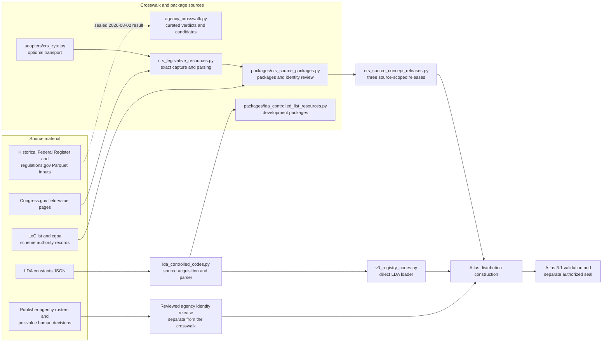
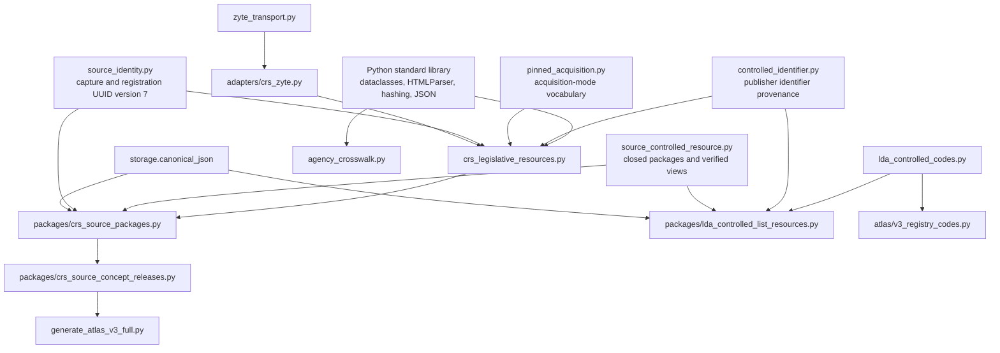
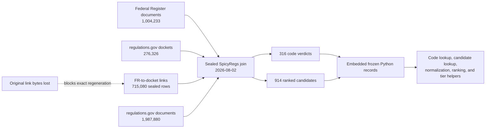
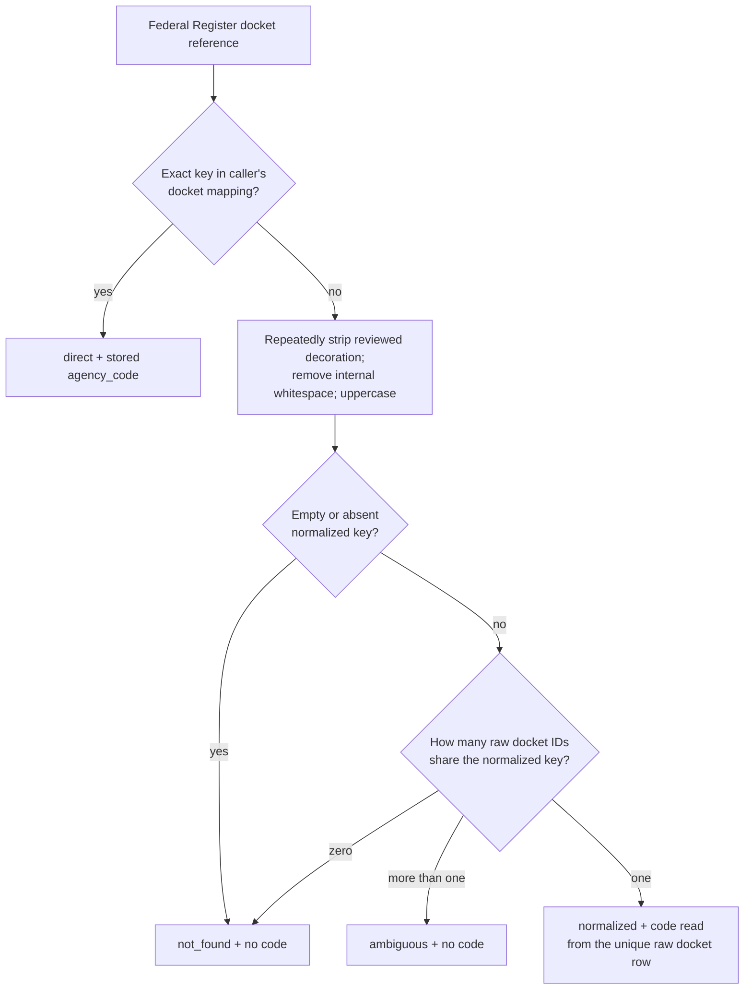
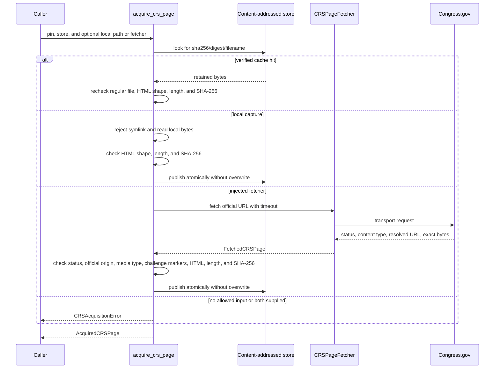
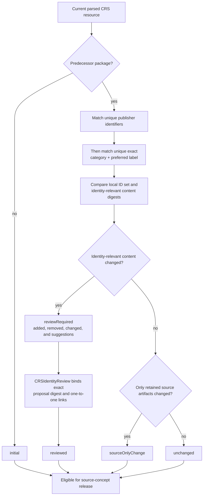
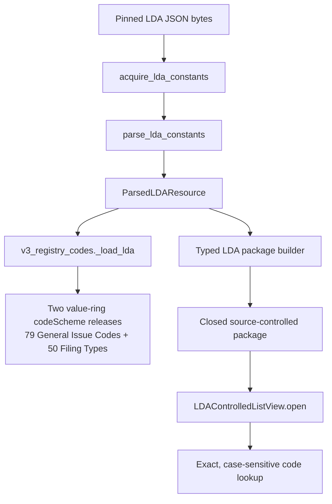
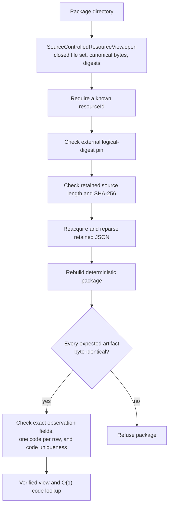

# Registry crosswalk and package sources

<!-- markdownlint-disable MD013 -->

The `registry_crosswalk_and_package_sources` logical module connects source
records that cannot safely move through a simple parser-to-release path. It
contains three independent capabilities:

- a curated crosswalk from regulations.gov agency codes to Federal Register
  agency slugs, including ranked alternatives and explicit uncertainty;
- exact capture, parsing, packaging, and identity review for Congressional
  Research Service (CRS) Legislative Subject Terms and Policy Areas; and
- development packages that reopen Lobbying Disclosure Act (LDA) controlled
  lists from their retained publisher bytes.

This is a documentation group, not a Python package or aggregate import API.
The five implementation files have different callers and different authority.
In particular, the agency crosswalk is reference evidence rather than a current
Atlas input, and the LDA development packages are not the route used by the
current Atlas loader.

See [Registry organization sources](registry_organization_sources.md) for the
publisher-maintained agency rosters and reviewed agency identity decisions,
[Legislative and regulatory code sources](registry_code_and_classification_sources_legislative_and_regulatory.md)
for the LDA source reader, and [Registry vocabulary sources](registry_vocabulary_sources.md)
for the wider source-reader portfolio.

## At a glance

| Question | Answer |
| --- | --- |
| What goes in? | A sealed historical agency-crosswalk result and its surviving receipt evidence; four exact Congress.gov HTML pages plus two Library of Congress (LoC) scheme records; or exact LDA JSON constants already governed by their source pins. Live CRS capture may use an injected `CRSPageFetcher`, including the bounded Zyte adapter. |
| What happens? | The crosswalk preserves the sealed rows and exposes the documented docket-matching, candidate-ranking, and tiering rules without rerunning the lost join. CRS code verifies source bytes, parses exact page structures, retains capture-local observations, and reconciles local record identity across captures. LDA package code reuses the LDA source parser and closes each list into a deterministic package. |
| What comes out? | Curated `AgencyCrosswalkEntry` and `AgencyCrosswalkCandidate` rows; one `CRSSourcePackages` ledger containing two bundles and reconciliation reports, which can feed three source-scoped CRS releases when review is complete; and two development-only LDA package views with exact code lookup. |
| How do we check it? | Focused tests recompute crosswalk ranks and tiers, exercise negative docket cases, verify source pins and parser drift checks, reopen packages from retained bytes, compare deterministic artifacts, test CRS identity review, and check the actual CRS and LDA Atlas loading paths. |

## Place in RefSpec

These components sit between source-specific readers and later release
construction, but they do not form one shared runtime pipeline.



Solid arrows show current code dependencies or build inputs. Dotted arrows
mark historical or non-authorizing evidence. The diagram deliberately omits an
arrow from `LDAControlledListView` to `v3_registry_codes.py`: the current Atlas
loader acquires and parses the LDA JSON directly. It also omits an arrow from
the agency crosswalk to Atlas construction: current agency equivalence comes
from a separately reviewed mapping release.

### Scope and authority

| Result | What it establishes | What it does not establish |
| --- | --- | --- |
| `AgencyCrosswalkEntry` | The sealed historical join's primary Federal Register slug, measured share, support, and confidence tier for one regulations.gov code. | A publisher-issued equivalence, a human-reviewed `atlas:sameEntityAs` claim, or a current roster entry. |
| `DocketAgencyResolution` | An exact or uniquely normalized lookup in a caller-supplied `docket_id -> agency_code` mapping, or an explicit refusal. | An agency code inferred from a docket prefix. |
| `AcquiredCRSPage` | The retained bytes match the HTML-shape, length, and SHA-256 checks. Fetcher mode also checked HTTP status, resolved official origin, and response media type; cache and local modes rely on the reviewed source declaration and exact pin. | A stable publisher identifier for any term. |
| `ParsedCRSResource` | The pinned pages contain the expected categories, counts, labels, and Policy Area descriptions. | A named publisher release or permission to merge duplicate labels. |
| `CRSSourcePackages` | The exact source artifacts and capture-local observations form two closed packages, with local identity changes reconciled or queued for review. | Publisher-issued term identity or automatic permission to enter Atlas. |
| CRS source-concept release | Reconciled local records were selected into an explicit subject or entity release. | Admission, retrieval, or accepted-output permission. |
| `LDAControlledListView` | A known package is byte-for-byte reproducible from its retained, pinned LDA source and supports exact code lookup. | A subject vocabulary, a publisher-named release, or the current Atlas ingestion path. |

The boundaries follow
[REF-024](../docs/decisions.md#ref-024-record-the-cross-product-ownership-boundary-once):
products exchange immutable files and packages instead of importing sibling
source trees. [REF-048](../docs/decisions.md#ref-048-docspec-owns-the-platform-source-catalog)
changes source-catalog ownership but leaves RefSpec's independent vocabulary
and mapping evidence responsibilities intact. Agency projection authority comes
from the reviewed identity release recorded in
[REF-038](../docs/decisions.md#ref-038-the-regulationsgov-agency-roster-lands-and-reviewed-identity-claims-govern-the-agency-projection),
not from `agency_crosswalk.py`. The movement and remaining loss of the
crosswalk's regeneration inputs is recorded in
[REF-055](../docs/decisions.md#ref-055-the-staging-ground-empties--corpora-was-temporary-and-the-win-is-anchoring-not-durability).

The [Atlas 3.1 binding](../bindings/atlas/3.1/README.md), current code, and
[decision ledger](../docs/decisions.md) establish implementation authority.
[Atlas in the United States and Europe](../ATLAS_US_EU_COMPARISON.md) is
strategic context rather than runtime authority. This page describes checked
local code and evidence; it does not claim that an Atlas distribution has been
published or deployed.

## Code structure and dependencies

The source files depend on shared registry services, but the dependency arrows
do not converge on one facade.



Shared source-controlled package rules are implemented in
[`source_controlled_resource.py`](../src/refspec/registry/infrastructure/source_controlled_resource.py).
Transport conventions for another publisher are documented in
[Managed vocabulary source adapters](managed_vocabulary_source_adapters.md).
The LDA acquisition and validation path is documented under
[Lobbying Disclosure Act controls](registry_code_and_classification_sources_legislative_and_regulatory.md#lobbying-disclosure-act-controls).

### Component inventory

| File | Main public components | Responsibility | Current system use |
| --- | --- | --- | --- |
| [`adapters/crs_zyte.py`](../src/refspec/registry/adapters/crs_zyte.py) | `ZyteCRSPageFetcher`, `CRSZyteError`, `DEFAULT_CRS_MAX_BYTES` | Implements the small `CRSPageFetcher` interface with the shared Zyte transport, a positive byte limit, and CRS-specific errors. | Optional live capture only; parsing and pin checks remain in `crs_legislative_resources.py`. |
| [`agency_crosswalk.py`](../src/refspec/registry/agency_crosswalk.py) | `AgencyCrosswalkEntry`, `AgencyCrosswalkCandidate`, `CrosswalkCandidateShare`, lookup and rule helpers, provenance constants | Preserves one sealed historical mapping and the rules that produced its verdicts. | Reference and tests. No production Python caller currently feeds it into Atlas. |
| [`crs_legislative_resources.py`](../src/refspec/registry/crs_legislative_resources.py) | `CRSPageSource`, `CRSSourceScheme`, snapshot and parsed models, `acquire_crs_page`, `parse_crs_field_value_page`, assembly functions, bill-assignment parser | Owns official CRS source declarations, exact acquisition, strict HTML and API parsing, source observations, and managed-release readiness. | Supplies the CRS package builder. The separate bill-assignment parser remains evidence, not a vocabulary importer. |
| [`packages/crs_source_packages.py`](../src/refspec/registry/packages/crs_source_packages.py) | `CRSSourcePackages`, `CRSSchemeAuthorityPin`, `CRSResourceReconciliation`, `CRSIdentityReview`, package builders and evidence functions | Combines exact Congress.gov pages with exact LoC scheme records, assigns local record IDs, compares captures, records human decisions, and writes or reopens the two-resource ledger. | Reconciled packages feed `crs_source_concept_releases.py`, which feeds the current Atlas build. |
| [`packages/lda_controlled_list_resources.py`](../src/refspec/registry/packages/lda_controlled_list_resources.py) | `LDAControlledListPackageSpec`, `LDAControlledListView`, two dated specs, generic and typed builders | Builds and fully re-verifies development-only packages for General Issue Codes and Filing Types. | Lookup, evidence, and tests. `v3_registry_codes.py` reads `lda_controlled_codes.py` directly. |

Names beginning with an underscore are implementation details. This includes
`_FieldValuesParser` and package observation, matching, and serialization
helpers. Application code should use public declarations, acquisition and
parse functions, typed builders, and verified views.

The root [`refspec.registry`](../src/refspec/registry/__init__.py) module lazily
re-exports the main CRS package types and builders plus the two typed LDA
builders and `LDAControlledListView`. It does not re-export the crosswalk or
the Zyte CRS adapter. Import those defining modules directly. The lazy root
exports are compatibility conveniences, not a reason to hide source ownership.

## Agency code crosswalk

### Purpose and retained evidence

`agency_crosswalk.py` answers a narrow question: which Federal Register agency
slug is supported by the records associated with a regulations.gov
`agency_code`? It ships the answer as static Python rows so importing the
module performs no network access and reads no Parquet files.

The sealed 2026-08-02 build joined four inputs:

| Input | Sealed row count | Current evidence status |
| --- | ---: | --- |
| Federal Register documents | 1,004,233 | Retained file matches the receipt digest. |
| regulations.gov dockets | 276,326 | Retained file matches the receipt digest. |
| Federal Register-to-docket links | 715,080 | Original bytes are lost. The remaining file has 893,766 rows, additional columns, and a different digest. |
| regulations.gov documents | 1,987,880 | Retained file matches the receipt digest. |

Because one input no longer matches, RefSpec cannot exactly rerun the sealed
join. A measured rebuild with the replacement link file produced 124
confident, 30 probable, 23 ambiguous, and 139 unmapped codes. The sealed
result contains 124 confident, 29 probable, 23 ambiguous, and 140 unmapped
codes. The module therefore preserves the sealed result as curated data:

- 316 `AgencyCrosswalkEntry` verdicts from `agency-codes.parquet`;
- 914 `AgencyCrosswalkCandidate` rows from `agency-crosswalk.parquet`; and
- receipt, artifact, input-digest, row-count, and regeneration-status
  constants that explain the result's lineage and limitation.

This is an explicit blocked-regeneration state, not a claim that the current
replacement file reproduces the artifact. The sealed artifact identifier is
`urn:spicyregs:agency-crosswalk-artifact:80864133d2e5d484fef4afd0`.



### Data model

| Type or index | Meaning |
| --- | --- |
| `AgencyCrosswalkEntry` | One code's sealed verdict: table presence, tier, primary slug, primary share and support, evidence counts by path, and whether only the documents path supplied evidence. |
| `AgencyCrosswalkCandidate` | One ranked code/slug reading with hierarchy depth, share, support, rank, and primary flag. |
| `CrosswalkCandidateShare` | The smaller input record used to recompute ranking from slug, share, and hierarchy depth. |
| `AGENCY_CROSSWALK_BY_CODE` | Expected constant-time lookup of the 316 verdicts by exact code. |
| `candidates_for_code()` | Exact code lookup returning all sealed candidates in rank order, or `()` for an unknown code. |
| `DocketAgencyResolution` | A result with `direct`, `normalized`, `ambiguous`, or `not_found` status; an agency code exists only for the two success states. |

The record classes are frozen and slotted. The exported dictionaries are
annotated as `Mapping` but remain ordinary mutable dictionaries at runtime;
consumers must treat them as constants.

### Docket resolution and candidate ranking



Three rules carry the meaning of the sealed build:

1. **Never infer from a prefix.** `resolve_docket_agency_code()` reads a code
   only from the caller's docket mapping. Strings such as `FRL-...`,
   `REG-...`, or compound docket text do not manufacture an agency code.
2. **Normalize only to one raw docket.** The comparison key may recover a
   decorated Federal Register reference, but multiple raw matches return
   `ambiguous` even when their agency codes happen to agree.
3. **Prefer a sub-agency only inside the 0.05 share margin.** Candidates at or
   above `best_share - 0.05` are treated as tied; greater hierarchy depth then
   wins, followed by share and lexical slug order. Outside the margin, share
   wins without consulting depth. This selects the Federal Aviation
   Administration over its parent for `FAA`, but keeps the Department of the
   Interior ahead of the lower-share sub-agency for `BOEM`.

The current `DOCKET_DECORATION_PATTERN` deliberately extends the sealed
builder's spelling. It handles plural `Docket Nos.` and an abutting
`Docket No.CDC-...` while preserving every form the sealed pattern already
stripped. Tests check that identifiers such as `DOC-2005-0010` and the real
organization prefix in `Docket NOS-...` are not truncated. The retained
276,326-row dockets file still has zero normalized-key collisions. The sealed
claim that normalization recovered 88,073 link rows cannot be remeasured
without the lost original links file.

Tiering requires both share and document support:

| Condition | Tier |
| --- | --- |
| `support_documents <= 0` | `unmapped` |
| `share >= 0.8` and `support_documents >= 5` | `confident` |
| `share >= 0.6` and `support_documents >= 2` | `probable` |
| Any other evidence-bearing result | `ambiguous` |

Batch callers should build the normalized docket index once and pass it to
every resolution. Omitting `index` is convenient for a few lookups but rebuilds
the full index on every call.

```python
from refspec.registry import agency_crosswalk

index = agency_crosswalk.build_normalized_docket_index(docket_codes)
resolution = agency_crosswalk.resolve_docket_agency_code(
    federal_register_docket,
    docket_codes,
    index=index,
)
if resolution.status in {"ambiguous", "not_found"}:
    # Preserve the refusal; do not guess from the docket text.
    ...
```

The helper trusts a caller-supplied index to match the supplied docket mapping.
It does not validate that relationship, and the ranking helpers do not validate
arbitrary numeric inputs. Keep those functions behind a checked batch loader.

### Current Atlas boundary

No current production Python caller imports `agency_crosswalk.py` to build the
Atlas. The Atlas planning index classifies it as derived in-house reference
data, and coverage tests treat it as an implementation module rather than a
registry resource. Do not substitute its statistical tiers for the reviewed
agency identity decisions described in
[Registry organization sources](registry_organization_sources.md#scope-and-authority).

## CRS source capture and parsing

CRS means the Congressional Research Service. Congress.gov publishes its
controlled values on four HTML pages, while the LoC Linked Data Service names
the two source schemes. The source reader keeps scheme identity, page content,
term observations, and bill-assignment evidence separate.

### Reviewed source set

| Resource | Page category | Expected rows | Role | LoC scheme |
| --- | --- | ---: | --- | --- |
| Legislative Subject Terms | `subject` | 565 | `selectableSubject` | `lst` |
| Legislative Subject Terms | `geographicEntity` | 301 | `selectableSubject` | `lst` |
| Legislative Subject Terms | `organizationName` | 177 | `selectableSubject` | `lst` |
| Policy Areas | `policyArea` | 32 | `navigation` | `cgpa` |

The `lst` and `cgpa` Internationalized Resource Identifiers (IRIs) identify
the two schemes. They do not identify individual terms. The captured pages do
not publish stable term IDs or a named, versioned vocabulary release.

`CRSPageSource` restricts source URLs to official credential-free HTTPS
Congress.gov locations, requires a plain filename, and pins an expected heading
and positive count. `CRSSourceScheme` separately checks the canonical LoC
scheme IRI, JSON authority-record URL, code, label, and publisher page.

### Acquisition interaction

Importing the CRS modules never opens a network connection. A cache miss needs
one regular local file or one injected fetcher.



`ZyteCRSPageFetcher` is one implementation of `CRSPageFetcher`. It delegates
transport to `ZyteHttpFetcher`, defaults to a 5 MiB maximum response, requires a
positive bound, obtains the token explicitly or from the environment, and
translates transport failures into `CRSZyteError`. It also refuses a response
without `Content-Type`. Origin, status, allowed HTML media types, challenge
pages, and exact pins are still checked by `acquire_crs_page()`.
`from_environment()` reads the single `ZYTE_TOKEN` variable and validates the
credential before constructing the transport.

`capture_initial_crs_page_snapshot()` supports the first reviewed capture. It
checks origin and content before establishing the length and digest. When the
caller does not supply a recorded `SourceCaptureEvent`, it derives a repeatable
UUIDv7 from the retrieval time, source URL, and body digest; replaying the same
capture does not mint a different acquisition identity.

Verified page bytes live at
`<store>/sha256/<64-hex-digest>/<reviewed-filename>.html`. The path is derived
from the pin, and every cache reopen rechecks the regular file, HTML shape,
length, and digest before returning it.

### Parser behavior

`_FieldValuesParser` is a private, dependency-free `HTMLParser` collector. It
records headings, candidate lists, tables, and page text; public parse functions
apply the source rules:

- each page must decode as UTF-8 and contain its reviewed heading;
- each Legislative Subject Terms page must contain the declared category/count
  marker, and the longest collected list must have the exact expected size;
- the Policy Areas page must contain its count statement and exactly one
  `Policy Area`/`Description` table with 32 complete, uniquely labelled rows;
- duplicate labels on Legislative Subject Terms pages remain separate source
  observations and appear as `CRSDuplicateLabelEvidence`; and
- every term receives a capture-local record IRI derived from source digest,
  category, source path, and ordinal. That IRI is not a publisher identifier.

`assemble_crs_legislative_subject_terms()` requires exactly one page for each
of the three categories and preserves their reviewed order.
`assemble_crs_policy_areas()` keeps the broad navigation list separate.
`CRSManagedReleaseReadiness.require_ready()` fails because current captures
lack publisher term identity and a named release; duplicate-label groups add a
further blocker where present.

The separate `parse_crs_bill_subject_assignments()` function reads one exact
Congress.gov `/bill/.../subjects` JSON payload. It preserves names, update
dates, and any publisher IDs or term IRIs if those fields appear. It rejects
unreviewed assignment-record fields, malformed values, duplicate labels, and
pagination-count drift. This result records an assignment on a bill; it does
not import a vocabulary or repair missing term identity by matching a label.

## CRS source packages and identity review

### Package contents

`build_crs_source_packages()` combines all four parsed pages with the two exact
LoC JSON for Linked Data (JSON-LD) scheme records. The scheme records are
checked-in base64 resources, then decoded and checked against
`CRSSchemeAuthorityPin`: exact length and digest, one canonical identity,
expected Metadata Authority Description Schema (MADS) and Simple Knowledge
Organization System (SKOS) types, code, label, and Congress.gov editorial
link.

| Package | Observations | Kind | Declared uses | Known limits |
| --- | ---: | --- | --- | --- |
| Legislative Subject Terms | 1,043: 565 subject, 301 geographic entity, 177 organization name | `sourceTermSnapshot` | `sourceAssignedEvidence`, `searchExpansion` | No publisher term IDs; no publisher-named release. |
| Policy Areas | 32 | `navigationList` | `sourceAssignedEvidence`, `navigation` | No publisher term IDs; no publisher-named release. |

Both packages set `conceptIdentityClaimed` to false and retain the exact HTML
and scheme-authority bytes. A complete row capture can still have a coverage
status that names these authority gaps.

The identity fields have distinct meanings:

| Field | Meaning | Stability |
| --- | --- | --- |
| Page `fetch_id` | One recorded source acquisition event. | Fixed for the persisted capture. |
| Observation `id` | The exact row as seen in one source capture. | Changes when the source digest or row location changes. |
| `localRecordId` | RefSpec identity for a registry record. | May continue across captures only through conservative matching or an exact human review. |
| LoC `lst` or `cgpa` IRI | Publisher authority for the source scheme. | Does not identify a term. |
| Publisher term identifier | An identifier issued for one term. | Absent from the current captured pages. |

### Reconciliation process

The builder compares a new package with an optional predecessor. It first
reuses a previous local ID when a publisher identifier is unique on both sides.
For remaining rows, it reuses identity only for a unique exact
`(category, preferred label)` match. It never auto-links a fuzzy label.



For additions and removals, `_match_suggestions()` may report a normalized
label match, unchanged definition, or label similarity of at least 0.80. These
are review hints only and always carry `humanReviewRequired`.

`CRSIdentityReview` must name the exact resource and proposal-change digest,
use a UUIDv7 review ID and time, identify the reviewer with an absolute IRI,
and provide one-to-one `CRSIdentityLink` values. Each link must connect a
proposed addition to a proposed removal in the same category. Applying a valid
review replaces the new local ID with the reviewed predecessor ID, rebuilds
the package, and preserves the review record. `CRSSourcePackages.require_reconciled()`
blocks any resource that still needs review.

### Ledger layout and reopening

`CRSSourcePackages.write_to()` creates one new immutable directory:

```text
crs-ledger/
├── ledger.json
├── legislative-subject-terms/
│   ├── bundle-manifest.json
│   ├── resource-manifest.json
│   ├── coverage-report.json
│   ├── observations.jsonl
│   └── sources/...
└── policy-areas/
    └── same closed-package file set
```

Writing refuses an existing destination and uses a temporary directory plus an
atomic rename. `CRSSourcePackages.open()` requires exactly these three top-level
entries, rejects symlinks, verifies canonical `ledger.json` bytes and its
logical digest, opens both closed packages through `SourceControlledResourceView`,
and checks manifest IDs, logical digests, registration events, and the two
reconciliation bindings. Package evidence functions serialize the same
identities and limitations deterministically.

### Current downstream path

[`crs_source_concept_releases.py`](../src/refspec/registry/packages/crs_source_concept_releases.py)
is the next explicit stage. It requires both reconciliations to be complete and
bound to the exact manifest, local-ID-set digest, and content digest. It then
creates:

- 565 Legislative Subject Terms in the subject ring;
- 478 geographic and organization terms in the entity ring; and
- 32 Policy Areas in a separate subject-ring release.

The release builder checks the exact category sets, carries the source package
and reconciliation record forward, records source rights as `notStated`, and
uses explicit observation-selection policies. These source-scoped releases do
not grant admission, retrieval, or output permission. The full Atlas builder
reopens externally pinned `SourceConceptReleaseView` values before conversion.

## LDA controlled-list development packages

The LDA package layer covers two exact lists already owned by
[`lda_controlled_codes.py`](../src/refspec/registry/lda_controlled_codes.py).
That reader's acquisition, parsing, identifier, portfolio, filing-validation,
and unknown-value rules are documented in
[Legislative and regulatory code sources](registry_code_and_classification_sources_legislative_and_regulatory.md#lobbying-disclosure-act-controls).
This section describes only the downstream packages and their actual system
placement.



The two specifications are intentionally separate:

| Specification | Rows | Primary identifier | Declared use | Explicit gaps |
| --- | ---: | --- | --- | --- |
| `LDA_GENERAL_ISSUE_CODE_PACKAGE` | 79 | `generalIssueCode` | `sourceAssignedEvidence` | The publisher provides no named list release. |
| `LDA_FILING_TYPE_PACKAGE` | 50 | `filingTypeCode` | `deterministicMetadata` | No named list release, standalone filing-status list, or independent filing-period package. |

General Issue Codes remain filer-selected evidence; they are not promoted to
general subject concepts because they have readable labels. Filing Types
remain filing metadata. The six filing-period enum values are handled in the
source module and have no package here.

### Build and verified reopen

`build_lda_controlled_list_package()` requires a regular, non-symlink source
file. It writes the bytes to a temporary source location, then calls the normal
LDA acquisition and parser. This reuse prevents the package layer from growing
a second interpretation of the publisher JSON.

For every parsed row, the builder:

1. checks the resource name, allowed use, and denial of general-subject
   identity;
2. preserves all structured publisher identifiers and requires exactly one
   primary code of the specification's kind;
3. records `sourceOrdinal` only as a locator; and
4. derives the observation ID from package version, resource ID, source
   artifact, source path, and publisher identifiers rather than row position
   alone.

The result is a `controlledCodeList` package with
`publisherIdentifiersPreserved`, exact source bytes, declared uses, known
gaps, and `conceptIdentityClaimed` set to false.

`LDAControlledListView.open()` performs layered verification:



`lookup_code()` is exact and case-sensitive; an unknown code returns `None`.
Package building can raise source-layer drift errors as well as
`LDAControlledListPackageError`. Opening may first raise the shared
source-controlled-package error when the outer package is malformed.

The current Atlas loader does not open these packages. It independently checks
the two fixture pins, calls `acquire_lda_constants()` and
`parse_lda_constants()`, verifies the 79 and 50 row counts, and emits two
value-ring `codeScheme` releases. Keep the direct loading and development
package branches consistent through shared source code and focused tests, not
by inserting the package view into the Atlas path without a separate decision.

Tracked package evidence is described in
[LDA controlled-list development packages](../research/evidence/lda-controlled-lists-2026-07-30/README.md).

## Failure and refusal model

These modules fail closed when a mismatch would change source meaning or local
identity. Normal absence and uncertainty remain data where callers need to
handle them.

| Area | Refusal or failure |
| --- | --- |
| Agency docket lookup | Returns `not_found` for empty or unknown keys and `ambiguous` for normalization collisions. It never guesses a prefix or splits compound text. |
| Agency candidate lookup | Returns an empty tuple for an unknown code. Direct dictionary indexing retains normal `KeyError` behavior. |
| Crosswalk regeneration | Keeps the sealed curated rows because the original link input is unavailable. A near-match rebuild cannot silently replace them. |
| CRS acquisition | Rejects non-positive timeouts, supplying both `source_path` and `fetcher`, supplying neither on a cache miss, symlinks, non-200 fetched responses, off-origin redirects, credentials, unapproved fetched media types, challenge pages, non-HTML content, and pin drift. |
| CRS parsing | Rejects non-UTF-8 input, parser exceptions, missing headings or count statements, wrong lists or tables, incomplete Policy Area rows, duplicate Policy Area labels, and unexpected page composition. Python's `HTMLParser` is lenient; structural checks, not general HTML conformance, detect source drift. |
| CRS identity | Refuses managed-release readiness without publisher term identity, refuses fuzzy automatic continuation, and blocks a changed capture until a review bound to the exact proposal digest is applied. |
| CRS ledger | Rejects an existing write target, unsafe or extra entries, noncanonical JSON, stale logical digests, package identity drift, inconsistent registration events, or reconciliation rows naming the wrong package. |
| LDA package build | Rejects a wrong source resource, wrong use, subject-concept claim, missing primary code, malformed identifier kind, unsafe source file, or drift reported by the shared source parser. |
| LDA package open | Rejects an unknown resource, external logical-pin drift, retained-source drift, any deterministic rebuild difference, unexpected observation fields, missing or repeated publisher codes, or shared package-integrity failures. |

## Performance and scaling

The current datasets are bounded, but batch behavior still matters.

| Path | Time | Additional memory | Engineering note |
| --- | --- | --- | --- |
| Crosswalk code or candidate lookup | Expected O(1) | O(1) after import | Static indexes are built at module import. |
| Crosswalk normalized index | O(total docket-ID characters) | O(number of dockets) | Build once per batch. Omitting it makes each resolution rebuild the full index. |
| Crosswalk candidate ranking | O(k log k) | O(k) | `k` is candidates for one code. Current data has 914 total candidates and at most 44 for one code. |
| Crosswalk import grouping | O(sum of squared per-code candidate counts) | O(914) | Tuple concatenation is superlinear but bounded for the checked-in table. Replace it before allowing unbounded generated input. |
| CRS acquisition and parsing | O(source bytes + terms) | O(source bytes + terms) | Pages are read into memory; the Zyte response is bounded at 5 MiB by default. |
| CRS package build and reopen | O(package bytes + terms) | O(package bytes + terms) | Reverification and deterministic rebuilding are intentional integrity work. |
| CRS exact matching | Expected O(terms) | O(terms) | Publisher-ID and exact category/label maps avoid repeated full scans. |
| CRS review suggestions | O(added rows x removed rows x label-length squared) worst case | O(number of suggestions) | `difflib.SequenceMatcher` makes this the main superlinear refresh path. Profile here first if reconciliation slows. |
| LDA package build or open | O(source bytes + rows + package bytes) | O(rows + package bytes) | Open reparses, rebuilds, and byte-compares the package. |
| LDA code lookup | Expected O(1) | O(129) for the two current indexes | The lookup map is built only after all package checks pass. |

## Developer workflow

### Choose the owning layer first

Before changing code, identify which statement is changing:

- change `agency_crosswalk.py` only for the crosswalk's documented matching,
  ranking, tier, curated data, or provenance behavior;
- change `crs_legislative_resources.py` for official source declarations,
  acquisition checks, HTML/API parsing, or source-level meaning;
- change `crs_source_packages.py` for retained package shape, local identity,
  reconciliation, or ledger verification;
- change `lda_controlled_codes.py` for LDA source meaning, then adapt
  `lda_controlled_list_resources.py` only if the development package must also
  change; and
- change downstream release or Atlas code in its owning module instead of
  teaching a source package to grant output authority.

Search for an existing helper in the source module or shared infrastructure
before adding package-local hashing, canonical JSON, acquisition, identifier,
or closed-file logic.

### Refresh the crosswalk

Do not edit the embedded verdicts as if they were hand-maintained policy. An
accepted refresh needs a new reproducible build with all raw inputs, exact
digests and row counts, a receipt, candidate and verdict artifacts, and tests
that recompute every tier and rank. If the lost 715,080-row link file
resurfaces, first compare its raw bytes and schema with the sealed receipt;
path or filename equality is not enough.

Keep ambiguous and unmapped codes. Add negative fixtures for prefix-like false
matches, decoration drift, compounds, and normalization collisions whenever
the matching grammar changes.

### Refresh CRS captures

1. Capture through `capture_initial_crs_page_snapshot()` or reopen an exact
   local capture. Read the raw HTML around the chosen list or table, not only a
   search hit.
2. Review any changed heading, marker, table, count, label, description, source
   URL, LoC authority record, or challenge-page behavior before moving a pin.
3. Build packages with the previous `CRSSourcePackages` value. Inspect added,
   removed, changed, and suggested rows.
4. Let exact unique matches continue automatically. Express any remaining
   identity continuation through one `CRSIdentityReview` bound to the pending
   change digest; do not weaken the matcher to clear the queue.
5. Reopen the written ledger, generate the three source-concept releases, and
   check the externally pinned materialized evidence before changing Atlas
   source pins.

If a publisher later supplies term IDs, preserve them as
`ControlledIdentifier` values first. Add fixtures for duplicates and conflicts,
then revisit readiness and matching in a separate change. Do not derive a
publisher ID from a label, scheme IRI, row number, or RefSpec local UUID.

### Refresh LDA packages

Update the source declaration, exact pin, and parser in
`lda_controlled_codes.py` first. Then rebuild each affected package, review its
declared use and gaps, update the external logical digest only for an explained
source or package-rule change, and reopen the package from retained bytes. The
current Atlas loader reuses the same `LDASnapshotPin` constants but has its own
fixture input pins and expected-count checks; verify that direct branch
explicitly.

Do not create Filing Status or Filing Period packages from label fragments.
Add a package only when an authoritative standalone source and a supported use
exist.

### Focused verification

Run the suites that own the changed boundary:

```bash
uv run pytest -q tests/test_agency_crosswalk.py

uv run pytest -q \
  tests/test_crs_legislative_resources.py \
  tests/test_crs_zyte.py \
  tests/test_crs_source_packages.py \
  tests/test_crs_source_concept_releases.py \
  tests/test_crs_source_concept_release_generation.py \
  tests/test_atlas_source_release_readers.py

uv run pytest -q \
  tests/test_lda_controlled_codes.py \
  tests/test_lda_controlled_list_resources.py \
  tests/test_registry_public_api.py \
  tests/test_atlas_v3_registry_codes.py
```

For crosswalk source evidence, the focused test verifies the retained docket
input and zero normalized-key collisions when the real file is available. It
does not rerun the lost four-input join or compare every embedded row with the
sealed Parquet files. State that boundary when reporting verification.

For any parser or matching change, keep the old behavior as a test-only oracle
and compare verdicts over real data plus deliberate mutations before removing
the production path it replaces.

## Related documentation

- [RefSpec overview](../README.md)
- [Registry vocabulary sources](registry_vocabulary_sources.md)
- [Legislative and regulatory code sources](registry_code_and_classification_sources_legislative_and_regulatory.md)
- [Registry organization sources](registry_organization_sources.md)
- [Managed vocabulary source adapters](managed_vocabulary_source_adapters.md)
- [Atlas planning index](atlas_planning_index.md)
- [Atlas 3.1 binding](../bindings/atlas/3.1/README.md)
- [Decision ledger](../docs/decisions.md)
- [CRS source-package evidence](../research/evidence/crs-source-packages-2026-08-03/package-evidence.json)
- [CRS source-concept release evidence](../research/evidence/crs-source-concept-releases-2026-08-04/release-evidence.json)
- [LDA controlled-list package evidence](../research/evidence/lda-controlled-lists-2026-07-30/README.md)
