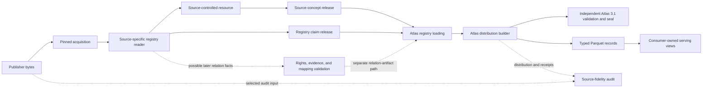
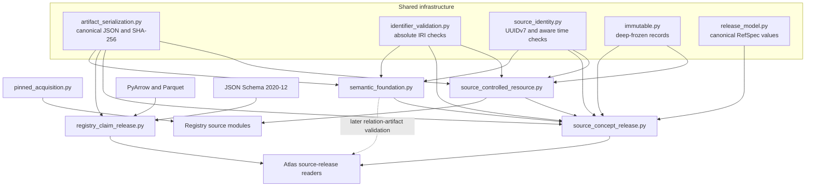
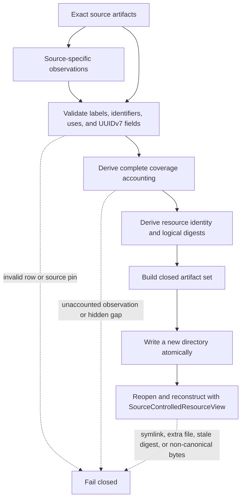
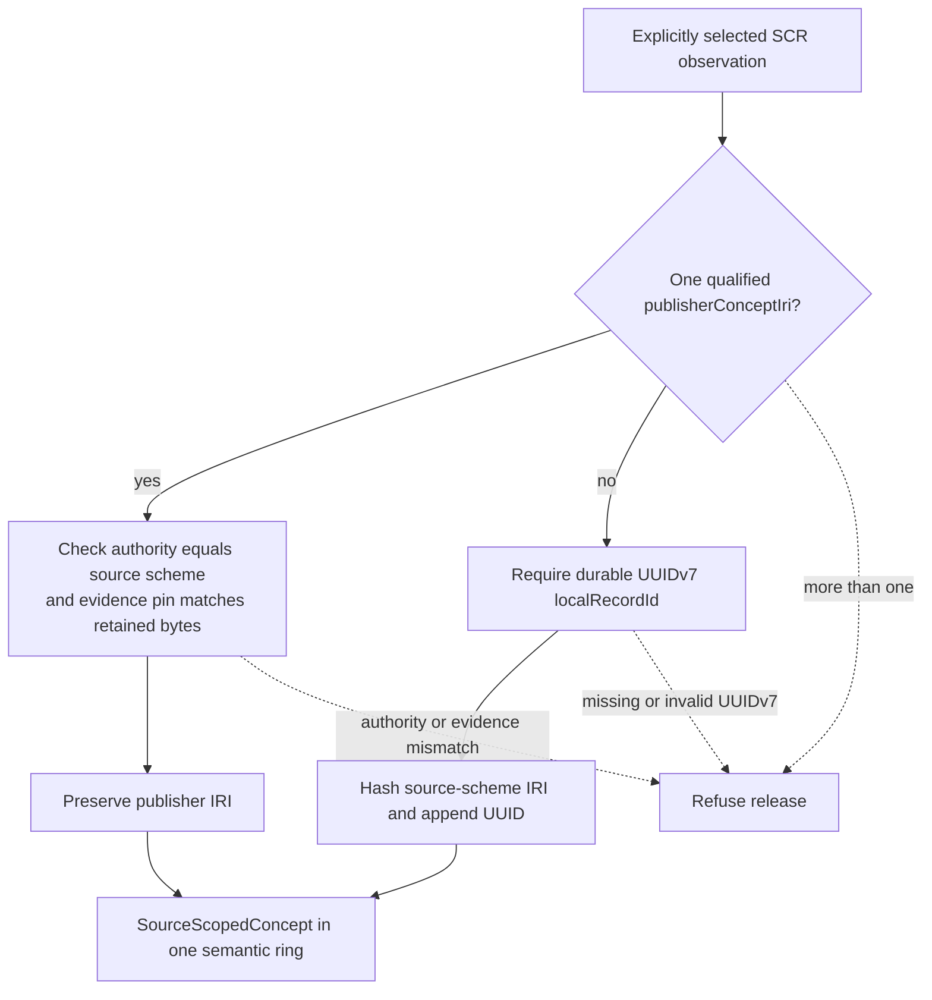
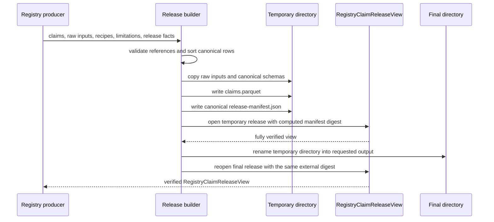
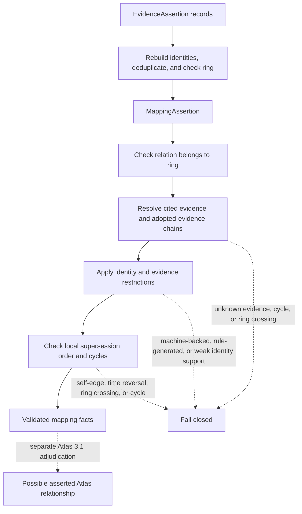
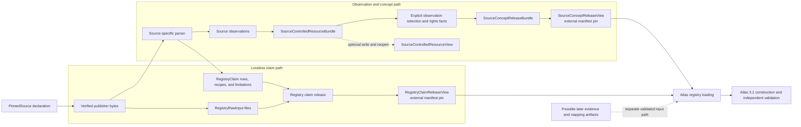

# Registry foundation

<!-- markdownlint-disable MD013 -->

The `registry_foundation` logical module supplies the shared trust, identity,
and semantic-record rules used by RefSpec registry sources. It acquires exact
publisher bytes, preserves source observations in closed packages, promotes
selected observations into source-scoped concepts, packages lossless registry
claims, and validates evidence and mapping records for four semantic rings.

This is a module-tree group, not a Python package or a single
`registry_foundation.py` file. Its implementation spans five modules under
[`src/refspec/registry/infrastructure/`](../src/refspec/registry/infrastructure/).
Source-specific parsing belongs to the [publisher source portfolio and
adapters](publisher_source_portfolio_and_adapters.md). Atlas selection and
normalization belong to [Atlas registry loading](atlas_registry_loading.md),
and final distribution rules belong to the [Atlas 3.1
binding](../bindings/atlas/3.1/README.md).

## At a glance

| Question | Answer |
| --- | --- |
| What goes in? | A declared source pin, exact publisher bytes, source-specific parsed observations or claims, explicit concept selections, rights facts, and evidence or mapping records. |
| What happens? | The foundation checks byte length and SHA-256 digests, creates deterministic closed packages, derives content identities, enforces source and semantic invariants, and rejects unknown or unsafe structure. |
| What comes out? | A verified content-addressed object, `SourceControlledResourceView`, `SourceConceptReleaseView`, `RegistryClaimReleaseView`, or validated `EvidenceAssertion` and `MappingAssertion` records. |
| How do we check it? | The claim-release builder self-verifies its temporary and final output. Consumers reopen source-concept and claim releases with external pins; readers verify canonical bytes, exact file membership, schemas, digests, evidence links, and deterministic reconstruction. Focused tests cover clean and deliberately corrupted artifacts. |

## Purpose and boundaries

The foundation gives all source families the same answers to five questions:

1. Which exact bytes did the producer use?
2. Which observations or claims came from those bytes?
3. When may an observation receive a stable source-concept identity?
4. What evidence supports a relationship, and which semantic ring owns it?
5. Can another process reopen the artifact and independently reproduce those
   answers?

It deliberately does not answer whether a source, concept, claim, or mapping
should enter an Atlas distribution. It also does not grant product permission,
prove that the publisher exposed every record, define final Atlas Resource
Description Framework (RDF) semantics, or serve query results.

| Verified result | What it establishes | What it does not establish |
| --- | --- | --- |
| Acquired pinned source | The bytes match the declared length and SHA-256 digest. | Correct parsing, publisher completeness, semantic authority, or permission to use the data. |
| Source-controlled resource | The exact source artifacts, observations, uses, counts, and declared gaps reproduce as one closed package. | Concept identity, managed vocabulary status, or Atlas admission. |
| Source-concept release | An explicit observation set has stable preserved publisher identities or RefSpec source-scoped identities, exact source provenance, rights facts, and one semantic ring. | Cross-source equivalence, product policy, or final Atlas membership. |
| Registry claim release | Source-shaped claims, raw captures, recipes, limitations, and their Parquet table form one externally pinned closed release. | That each claim is accepted as an Atlas assertion or that this path has replaced every existing normalized registry parser. |
| Evidence or mapping assertion | The record has a valid ring, relation, evidence shape, content identity, and local lineage. | Authorization to publish or use the result; distribution-wide closure remains an Atlas binding check. |

Rights records state what a source said about rights; they never create a
permission. An evidence `useCeiling` is a maximum allowed by the evidence
class, not an authorization. The [Atlas 3.1 binding](../bindings/atlas/3.1/README.md)
applies the same separation to accepted Atlas content and product use.

## Place in RefSpec

Registry foundation sits between source-specific readers and Atlas
construction. The source readers retain publisher-specific shapes and error
types. Foundation artifacts provide stable handoff points that downstream code
can verify without importing the producer's parser.



This diagram shows possible paths, not one mandatory pipeline. A source may
produce a source-controlled resource, a claim release, a managed release, or a
source-specific view. A claim release currently lets consumers use exact
claims without importing the producer's parser; during parity work, existing
registry readers may still supply the normalized Atlas members. See [Atlas registry
loading](atlas_registry_loading.md) for the current loaders and [managed
release validation](managed_release_validation.md) for the separate managed
vocabulary model.

The [decision ledger](../docs/decisions.md) assigns shared document semantics
to RuleSpec (`rkaf`), source fidelity to the registry, Atlas-specific terms to
the Atlas binding, and serving to consumers. In particular, REF-023 defines
semantic ownership, REF-024 records the cross-product artifact boundary, and
REF-048 keeps RefSpec resources independent of the platform catalog. This page
uses those decisions rather than restating their ownership tables.

The binding, not this module, determines final graph authority. It treats the
validated asserted graph as authoritative, generated projections as
reproducible views, and separately admitted derived relations as
non-authoritative.

## Architecture and dependencies

Identifier fields use Internationalized Resource Identifiers (IRIs). Source
registration and local-record events use UUID version 7 (UUIDv7) when a
time-ordered RefSpec identifier is required.



### Public component map

| File | Core public components | Responsibility |
| --- | --- | --- |
| [`pinned_acquisition.py`](../src/refspec/registry/infrastructure/pinned_acquisition.py) | `PinnedSource`, `PinnedAcquisitionLabels`, `acquire_pinned_source()` | Shared, opt-in acquisition into a content-addressed local store. |
| [`source_controlled_resource.py`](../src/refspec/registry/infrastructure/source_controlled_resource.py) | `SourceControlledResourceBundle`, `SourceControlledResourceView`, `build_source_controlled_resource_bundle()` | Deterministic source-observation packages that preserve exact bytes without claiming concept identity. |
| [`source_concept_release.py`](../src/refspec/registry/infrastructure/source_concept_release.py) | `SourceConceptReleaseBundle`, `SourceConceptReleaseView`, `build_source_concept_release_bundle()` | Explicit identity promotion for selected observations in one semantic ring. |
| [`registry_claim_release.py`](../src/refspec/registry/infrastructure/registry_claim_release.py) | `RegistryClaim`, `RegistryRawInput`, `RegistryClaimReleaseView`, `build_registry_claim_release()` | Lossless claim and evidence packages backed by a fixed Parquet schema. |
| [`semantic_foundation.py`](../src/refspec/registry/infrastructure/semantic_foundation.py) | `RightsMetadata`, `EvidenceAssertion`, `MappingAssertion`, validation functions | Ring-specific relationships, evidence provenance, rights facts, temporal context, and mapping lineage. |

`PinnedSource` is a structural interface, and core record dataclasses are
frozen. Package view instances returned by their `open()` methods expose facts
after validation; the public dataclass constructors do not perform that work
and must not be used as a trusted-reader shortcut. Source modules keep their
own pin classes, fetched-result records, and domain errors. They should adapt
to these small shared APIs instead of making the foundation understand every
publisher.

### Trust anchors and digest roles

The module uses several digests for different questions. Do not substitute one
for another.

| Digest or identity | Question answered |
| --- | --- |
| Source SHA-256 and byte length | Are these the exact declared publisher bytes? |
| Artifact SHA-256 | Did one packaged file change? |
| Observation or claim-set logical digest | Did the canonical logical rows change, independent of physical container details? |
| Release digest | Did the source-concept release's factual basis change? |
| Externally pinned manifest digest | Did the intended source-concept bundle manifest or registry-claim release manifest change? |
| Content-derived record identifier | Did the complete semantic assertion basis change? |

`SourceControlledResourceView.open()` proves internal closure and
reconstruction but does not take an external manifest digest.
`SourceConceptReleaseView.open()` and `RegistryClaimReleaseView.open()` require
the caller to supply an expected manifest SHA-256 digest. Atlas loaders must
carry that external pin rather than trust a directory merely because its
internal files agree with one another.

## Pinned acquisition

[`pinned_acquisition.py`](../src/refspec/registry/infrastructure/pinned_acquisition.py)
is the shared exact-byte acquisition helper. Importing it never opens a
network connection. A caller either supplies a regular local file or explicitly
sets `allow_network=True`; a cache lookup is always local.

### Inputs and result

`PinnedSource` is a protocol with four required properties:

| Property | Meaning |
| --- | --- |
| `source_url` | Publisher location recorded as source provenance. |
| `expected_sha256` | Lowercase `sha256:<64 hex>` content pin. |
| `expected_byte_length` | Exact maximum and final byte length. |
| `filename` | Trusted basename supplied by the pin implementation for the content-addressed object directory. |

`PinnedAcquisitionLabels` supplies source-specific error wording and request
headers. The shared code returns `AcquiredPinnedSource`, which records the
verified path, source and resolved URLs, digest, size, cache status,
acquisition mode, and optional resolved local path. A source module should
translate `PinnedAcquisitionError` into its domain-specific error where that
module exposes a separate error API.

Two acquisition-mode types intentionally record who performed retrieval:

| Type | Modes | Use it when |
| --- | --- | --- |
| `AcquisitionMode` | `cache`, `local`, `network` | `acquire_pinned_source()` itself may open the outbound connection through `urllib`. |
| `FetcherAcquisitionMode` | `cache`, `local`, `fetcher` | A source module accepts an injected domain-specific fetcher and does not open the connection itself. |

`network` and `fetcher` are not interchangeable names. They preserve a real
provenance distinction at the module boundary.

### Resolution and publication flow

```mermaid
sequenceDiagram
    participant C as Caller
    participant A as acquire_pinned_source
    participant S as Content-addressed store
    participant I as Local file or network

    C->>A: pin, store, labels, optional source path
    A->>A: validate timeout and digest syntax
    A->>S: inspect sha256/hex/filename
    alt cached path exists
        S-->>A: candidate file
        A->>A: reject symlink; verify length and digest
        A-->>C: cache result
    else caller supplied a local path
        A->>I: open regular non-symlink file
        A->>A: stream, count, hash, and fsync temporary file
        A->>S: publish with atomic hard link
        A-->>C: local result
    else network explicitly allowed
        A->>I: HTTP GET with declared headers and timeout
        A->>A: stream, count, hash, and fsync temporary file
        A->>S: publish with atomic hard link
        A-->>C: network result with resolved URL
    else no permitted source
        A-->>C: PinnedAcquisitionError
    end
```

The final path is:

```text
<store>/sha256/<64-lowercase-hex>/<source.filename>
```

The helper validates the digest and payload, but it does not currently validate
`filename` as a safe leaf. Pin implementations must supply a trusted basename
with no separator, absolute path, `.` component, or `..` component. Never take
this value from response headers or other remote content.

The writer reads 64 KiB chunks. It stops as soon as the input exceeds the
declared size, then requires exact length and digest equality before publishing
the object. It flushes and `fsync`s the temporary file, uses an atomic hard
link to avoid overwriting another writer's result, and re-verifies a concurrent
winner. Cleanup removes the temporary path on success or failure.

### Acquisition invariants

- Never trust a cache location by name alone; a cache hit is reread and
  rehashed.
- Reject a cached target or local input that is a symbolic link or not a
  regular file.
- Require a positive timeout even when the cache will satisfy the request.
- Refuse a cache miss unless the caller supplied a local path or explicitly
  enabled direct network access.
- Record the HTTP response's resolved URL when the shared helper performs the
  request.
- Treat `store_dir` and `filename` as trusted application configuration. The
  shared helper does not enforce path containment for them.
- Never weaken a pin to accept changed bytes. Update a pin only after reviewing
  the publisher release and its surrounding source context.

Source-specific origin, media-type, status, archive-member, and parser checks
remain in the source module. See [registry vocabulary
sources](registry_vocabulary_sources.md), [registry code and classification
sources](registry_code_and_classification_sources.md), and the other
source-family pages for those rules.

## Source-controlled resources

[`source_controlled_resource.py`](../src/refspec/registry/infrastructure/source_controlled_resource.py)
defines package version `2.0`. A source-controlled resource (SCR) preserves
useful publisher terms, codes, navigation values, or metadata when the source
does not yet support a named concept release. It is a deterministic,
development-oriented lookup artifact. It never claims that an observation is
a publisher or RefSpec concept.

### Resource vocabulary

| Field | Supported values | Meaning |
| --- | --- | --- |
| `resourceKind` | `sourceTermSnapshot`, `controlledCodeList`, `navigationList` | The source-shaped collection being preserved. |
| `identityStatus` | `captureLocalObservationsOnly`, `publisherIdentifiersPreserved`, `mixed` | Producer declaration that rows contain only capture-local identity, publisher identifiers, or both. |
| `uses` | `sourceAssignedEvidence`, `searchExpansion`, `candidateGeneration`, `mappingReference`, `navigation`, `deterministicMetadata` | The factual uses declared for the package. They are not product permissions. |
| Label `role` | `preferred`, `alternate`, `hidden` | The canonical label roles shared with Atlas-facing registry code. |

The generic SCR validator checks that `identityStatus` uses a supported value;
it does not infer the status from each row. The source-specific builder and
tests must establish that the declaration accurately describes the packaged
identifiers.

Every observation must include its capture-local `id`, exact source artifact
and path, source order, at least one label, a qualified identifier array, one
or more declared uses, and `conceptIdentityClaimed: false`. It may retain
additional source-specific factual fields. At least one preferred label is
required, and a row may contain only one preferred label per language.

Qualified identifiers carry their value and kind together with authority,
source URI, source path, observation time, and source digest. Their digest must
match the retained source artifact. This keeps an identifier tied to the bytes
and location where it appeared.

Optional UUID version 7 fields identify RefSpec events and records:

- `sourceFetchId` plus `sourceObservedAt` identifies an acquisition event.
- `registrationEvent` identifies when the source was registered locally.
- `localRecordId` is a durable RefSpec record key used across captures.

These identifiers never become publisher concept identifiers. If one
observation carries `localRecordId`, every observation must carry a unique
UUIDv7 value. The package then records separate digests for local-record
membership and capture-independent record content.

### Package contents

```text
bundle-manifest.json
coverage-report.json
observations.jsonl
resource-manifest.json
sources/
  source-<content-derived-name>.bin
```

The exact source file paths come from `source_artifact_path()` and are listed
in `resource-manifest.json`. `bundle-manifest.json` describes every other file
by path, role, byte length, and SHA-256 digest. `observations.jsonl` and all JSON
documents use deterministic serialization.



### Coverage and identity checks

The coverage report must account for every publisher observation:

```text
sourceObservedCount = parsedCount + excludedCount + failedCount
parsedCount = packagedCount = number of packaged observations
```

A `pass` report cannot contain exclusions, failures, or gaps. Otherwise the
status is `gap`, and the package retains the gap records. The observation-set
digest appears in both resource and coverage manifests so a stale report fails
validation.

The resource manifest identifier is derived from every factual manifest field
except the identifier itself. Its form is:

```text
urn:ref:source-controlled-resource:v2:<resourceId>:<sha256-hex>
```

The builder deep-freezes normalized records. `write_to()` first checks that the
destination does not exist, writes into a sibling temporary directory, and
uses `os.replace()` only after every file exists. That precheck is not a
cross-process no-replace lock; callers must give concurrent writers different
destinations. `SourceControlledResourceView` then checks:

- the root and every member are non-symlinks;
- the observed file set exactly equals the manifest's closed file set;
- each path is relative, unique, and safe;
- each byte length and digest matches;
- package, resource, and coverage versions agree;
- rebuilding the bundle from loaded facts reproduces every canonical byte;
- the logical digest agrees with the reconstructed package.

Unlike the two release views below, the SCR reader has no caller-supplied
manifest pin. It proves that the directory is internally closed and
self-consistent. A catalog or downstream release must authenticate the SCR by
carrying its identity or logical digest.

## Source-concept releases

[`source_concept_release.py`](../src/refspec/registry/infrastructure/source_concept_release.py)
is the explicit step from source observations to stable concept identity. The
release selects named observations from one verified SCR and assigns every
selected row to exactly one of the `subject`, `entity`, `value`, or
`legalIdentity` semantic rings.

### Identity policy

The fixed identity policy is
`urn:ref:policy:source-concept-identity:v1`. It uses two paths:

1. **Preserve publisher identity.** If the observation has exactly one
   qualified `publisherConceptIri`, its `authorityUri` must equal the source
   scheme, and its source URI, path, and digest must bind it to the retained
   artifact. The release preserves that IRI and records
   `identityKind: publisherConceptIri`.
2. **Mint source-scoped identity.** Otherwise, the observation must have a
   durable UUIDv7 `localRecordId`. RefSpec derives an IRI from the complete
   SHA-256 fingerprint of the source-scheme IRI plus the readable UUID and
   records `identityKind: refspecSourceScoped`.

The second form is:

```text
urn:ref:source-concept:v1:<source-scheme-sha256-hex>:<local-uuid>
```

Labels and capture-local observation identifiers never participate in either
identity decision. A rename therefore does not silently create a new concept,
and matching text from two unrelated schemes does not collapse their
identities.



### Required release facts

`build_source_concept_release_bundle()` requires:

- a verified `SourceControlledResourceBundle` with an explicit source scheme;
- one semantic ring;
- a unique, non-empty list of observation identifiers from that exact capture;
- an `explicitObservationSet` selection policy containing only `id` and
  `type`;
- rights metadata that exactly covers the source artifacts used by the
  selected observations;
- optional concept lifecycle events;
- an optional completed reconciliation record; and
- optional verified earlier source releases that this release supersedes.

Rights rows must bind each covered artifact to its exact digest. A
`rightsStatus` of `stated` requires a rights-statement IRI and may also
preserve a license, rights holders, and attribution. A status of `notStated`
must not imply facts the publisher did not state.

A reconciliation record must name the current SCR manifest and set
`requiresHumanReview` to `false`. This makes unresolved identity review a
build failure rather than an implicit acceptance.

### Lifecycle and release lineage

Concept lifecycle and publisher-release lineage are different records:

| Change | Record and rules |
| --- | --- |
| A concept is renamed | Lifecycle `rename`; one prior concept equals one resulting concept. |
| One concept divides | Lifecycle `split`; one prior concept and at least two results. |
| Concepts combine | Lifecycle `merge`; at least two prior concepts and one result. |
| Concepts leave the source | Lifecycle `retire`; one or more prior concepts and no result. |
| A publisher release replaces earlier releases | `SourceReleaseSupersession`; exact predecessor release ID, semantic ring, source scheme, manifest digest, release digest, and logical digest. |

Lifecycle events also require an effective time, evidence, reviewer, and
review time. Release supersession requires the same semantic ring and source
scheme, binds the complete canonical predecessor set with a lineage digest,
and refuses self-supersession. Neither record decides whether Atlas should
publish a concept or mapping.

Mapping-assertion supersession is a third, separate mechanism documented under
[Semantic relationships](#semantic-relationships). Do not use one kind of
lineage to stand in for another.

### Package and reader

Release schema version `1.0` has no predecessor lineage. Version `1.1` applies
when `sourceReleaseSupersessions` are present; the reader supports both and
requires the outer bundle and inner release versions to agree.

```text
bundle-manifest.json
release-manifest.json
concepts.jsonl
rights.jsonl
lifecycle.jsonl
reconciliation.json          # optional
source/
  bundle-manifest.json       # complete nested SCR
  resource-manifest.json
  coverage-report.json
  observations.jsonl
  sources/...
```

The release manifest seals the source capture, explicit selection,
complete-membership concept set, rights set, lifecycle set, identity policy,
and optional release lineage. Its release identifier is content-derived:

```text
urn:ref:source-concept-release:<semantic-ring>:<release-digest-hex>
```

`write_to()` checks for an existing path, builds a complete sibling temporary
directory, and publishes it with `os.replace()`. The check and replace are not
one cross-process no-replace operation, so callers must provide an exclusive
destination. `SourceConceptReleaseView.open()` accepts the directory or its
`bundle-manifest.json` and requires an expected external manifest digest. It
rejects symbolic links, unsafe paths, missing or extra files, unsupported
roles or versions, stale file pins, duplicate JSON keys, non-canonical
JSON/JSON Lines, and any nested SCR that fails its own reader. It then rebuilds
the release and requires exact byte-for-byte agreement with the package.

Downstream Atlas code should reopen a release through this view for each pinned
input instead of importing a producer object or trusting a previously parsed
directory. See [Registry crosswalk and package
sources](registry_crosswalk_and_package_sources.md) for source-specific package
producers and [Atlas registry loading](atlas_registry_loading.md) for consumers.

## Registry claim releases

[`registry_claim_release.py`](../src/refspec/registry/infrastructure/registry_claim_release.py)
defines release version `1.0`. It gives a registry-specific parser a lossless,
closed output boundary: source-shaped claims, the exact raw inputs behind
them, and the recipes and limitations needed to interpret them. A consumer
opens that output with an external manifest digest and does not need to import
the producer's parser.

This path is parallel to SCR and source-concept releases. Use it when preserving
source-shaped claims and their derivation is the primary requirement; do not
wrap it around a concept release or assume every source must produce both.
The current migration and parity boundary is recorded in [Atlas registry
claim-release boundary](../docs/atlas-registry-claim-release-architecture.md).

### Claim record

Each immutable `RegistryClaim` carries:

| Field group | Fields and rule |
| --- | --- |
| Release and statement | Absolute-IRI `release_id`, `subject`, and `predicate`. |
| Object | Either `object_kind: iri` plus `object_iri`, or `object_kind: literal` plus `lexical_value` and optional language or datatype. A literal cannot have both language and datatype. |
| Evidence | `source_record_id`, `source_locator`, `source_path`, and exact `source_digest`. |
| Derivation | `origin`, `recipe_id`, optional `confidence`, and sorted unique `limitation_ids`. |

Supported origins are `observed`, `scraped`, `normalized`, `inferred`, and
`extrapolated`. The origin describes how the producer obtained the claim. It
does not upgrade the claim's authority.

`RegistryRawInput` copies one regular non-symlink source file into the release.
It gives the file a safe relative logical path, source locator, role, and
optional ZIP member pins. ZIP member descriptors must be sorted and unique and
must match each member's path, byte length, and SHA-256 digest.

### Package contents and Parquet format

```text
release-manifest.json
claims.parquet
schemas/
  registry-claim.schema.json
  registry-claim-release-manifest.schema.json
<producer-chosen raw input paths...>
```

The claim table uses one fixed nullable/non-nullable PyArrow schema. The writer
uses Parquet `2.6`, Zstandard level 9 compression, data page version `2.0`,
statistics, no dictionary encoding, and row groups of 50,000 rows. The
manifest records:

- the physical Parquet SHA-256 digest and byte length;
- a logical digest over canonical claim records;
- the exact Arrow schema descriptor and its digest;
- row, object-kind, and origin counts;
- canonical recipe and limitation definitions;
- raw input and optional archive-member pins; and
- byte pins for the two bundled JSON Schemas.

The logical digest distinguishes claim changes from harmless physical-format
questions, while the physical digest still seals the exact distributed file.

### Build and reopen flow



The builder refuses an existing output, an empty claim or raw-input set,
duplicate raw paths, claims from another release, or undeclared recipe and
limitation references. It sorts claims by their complete logical value and
sorts named rows by IRI before writing. The initial output check and final
`os.rename()` are not a cross-process no-replace operation. Callers must assign
one writer to each destination.

`RegistryClaimReleaseView.open()` then checks all of the following:

- the caller-supplied `sha256:` manifest digest before trusting manifest data;
- strict canonical UTF-8 JSON with no duplicate keys;
- the bundled manifest against JSON Schema Draft 2020-12;
- the exact supported package kind, version, fields, and schema members;
- physical file length and digest for every declared member;
- Arrow schema, Parquet row count, canonical claim order, logical digest, and
  summary counts;
- recipe and limitation reference closure;
- raw files and declared ZIP members against their pins;
- every claim's `(source_locator, source_digest)` against a retained raw input
  or archive member; and
- exact file membership, with no undeclared file or symbolic link.

The reader materializes all claim rows as immutable `RegistryClaim` objects.
It is a verification view, not a lazy query interface. Downstream record
projection and queries belong to [Atlas record
projection](atlas_record_projection.md) and [Atlas serving
views](atlas_serving_views.md).

## Semantic relationships

[`semantic_foundation.py`](../src/refspec/registry/infrastructure/semantic_foundation.py)
defines facts shared by source-concept releases and later relation artifacts.
It keeps four kinds of meaning separate so a valid relationship in one domain
cannot silently cross into another.

Current production source-concept releases use `RightsMetadata`. The public
`EvidenceAssertion` and `MappingAssertion` dataclasses are validation
primitives for later relation artifacts; current non-test Atlas registry
loaders do not construct them as direct inputs. An Atlas RDF resource whose
type is named `MappingAssertion` follows the separate Atlas binding shape and
must not be confused with this Python record.

### Semantic rings and relations

| Ring | Supported relations | Required context |
| --- | --- | --- |
| `subject` | Simple Knowledge Organization System (SKOS) `exactMatch`, `closeMatch`, `broadMatch`, `narrowMatch`, `relatedMatch` | None; context is rejected. |
| `entity` | `sameIdentityAs`, `successorOf`, `relatedEntity` | None; context is rejected. |
| `value` | `exactCrosswalk`, `broadCrosswalk`, `narrowCrosswalk`, `replacedBy` | `effectiveFrom`; optional `effectiveThrough`. |
| `legalIdentity` | `cites`, `amends`, `authorizes`, `implements` | `effectiveFrom`; optional `effectiveThrough`. |

The value and legal-identity bounds are inclusive ISO 8601 calendar dates. An
end date cannot precede the start. A producer that knows only that a mapping
was true at one instant cannot present that fact as an open-ended effective
period. The Atlas binding owns the exact RDF representation and UTC boundary
conversion for these dates.

Use the exported constants rather than reconstructing relation IRIs:

- `SUBJECT_EXACT_MATCH`, `SUBJECT_CLOSE_MATCH`, `SUBJECT_BROAD_MATCH`,
  `SUBJECT_NARROW_MATCH`, and `SUBJECT_RELATED_MATCH` use
  `http://www.w3.org/2004/02/skos/core#`.
- `ENTITY_SAME_IDENTITY`, `ENTITY_SUCCESSOR`, and `ENTITY_RELATED` use
  `urn:ref:relation:entity:`.
- `VALUE_EXACT_CROSSWALK`, `VALUE_BROAD_CROSSWALK`,
  `VALUE_NARROW_CROSSWALK`, and `VALUE_REPLACED_BY` use
  `urn:ref:relation:value:`.
- `LEGAL_CITES`, `LEGAL_AMENDS`, `LEGAL_AUTHORIZES`, and `LEGAL_IMPLEMENTS`
  use the easy-to-miss `urn:ref:relation:legal-identity:` prefix.

### Evidence assertions

`EvidenceAssertion` records how evidence was produced. Every assertion has one
ring, evidence class, allowed basis, responsible IRI, timezone-aware assertion
time, and a non-empty unique set of evidence IRIs. Its evidence class selects
one closed set of additional fields:

| Evidence class | Allowed basis | Derived use ceiling | Required specialization |
| --- | --- | --- | --- |
| `machineQualified` | `statisticalInference` | `searchOnly` | Candidate and machine proof, exact endpoints, releases and relation, plus at least two validation receipts. |
| `machineReviewed` | `statisticalInference` | `notApplicable` | The same scoped machine fields and exactly one validation receipt. |
| `publisherAsserted` | `sourceExplicit` or `publisherCrosswalk` | `searchOnly` | Pinned source artifact and source digest. |
| `operatorAdopted` | `operatorDirection` | `localOperationalUse` | Another evidence assertion named by `adoptedEvidence`. |
| `humanReviewed` | `editorialReview` or `identifierAgreement` | `productPolicyRequired` | Review decision IRI. |
| `ruleGenerated` | `deterministicDerivation` or `nameEquality` | `notApplicable` | Generator and non-empty generator-input IRIs. |

The use ceiling is derived from the class and cannot be supplied independently.
It limits what evidence alone can support; it never grants product use.
Fields associated with another evidence class are rejected rather than
ignored.

`validate_evidence_assertions()` reconstructs records from their serialized
form, rejects duplicate content identities, optionally enforces one ring, and
returns identifier-sorted assertions. In a complete supplied set,
`operatorAdopted` evidence must point directly to one `machineReviewed`
assertion in the same ring.

### Machine proof pins

`validate_machine_evidence_proof_pin()` validates an adapter-produced,
content-derived proof record. The shared part fixes:

- proof type and schema version;
- adapter, ring, evidence class, endpoints, releases, and allowed relation;
- exact proof-source, candidate, and validation record identities and digests;
- the adapter-defined `proofKind` and canonical JSON `proofDetails`; and
- required effective-period context for the `value` and `legalIdentity` rings;
  the `subject` and `entity` rings reject context.

A `machineQualified` proof needs at least two unique validations and a
`qualificationPolicy`. A `machineReviewed` proof needs exactly one validation
and cannot carry that policy. The validator recomputes the content digest and
the `urn:ref:machine-evidence-proof:<ring>:<digest>` identifier, then requires
the supplied record to equal the normalized result.

This proof shape records a reproducible machine verdict. It does not admit
that verdict to an Atlas mapping. Atlas 3.1 resolver-proof adjudication owns
that later decision.

### Mapping assertions

`MappingAssertion` joins two distinct concept IRIs and their exact release IRIs
with one relation, an evidence set, a timezone-aware assertion time, current
lifecycle status, and optional superseded mapping identifiers. Its identifier
is derived from the canonical basis:

```text
urn:ref:mapping-assertion:<semantic-ring>:<content-digest-hex>
```



`validate_mapping_assertions()` applies these rules:

- Evidence lookup keys must equal each evidence assertion's content-derived
  identifier.
- Every directly cited evidence record must exist. Adopted-evidence chains are
  traversed and checked for cycles and ring crossings.
- `machineReviewed` and `ruleGenerated` evidence are candidate provenance and
  cannot directly support a mapping.
- Any machine-backed evidence in the supporting chain is refused. Machine
  verdicts reach a published mapping only through the Atlas 3.1 adjudicated
  proof path.
- `ruleGenerated` evidence anywhere in the supporting chain cannot establish a
  mapping.
- Entity `sameIdentityAs` cannot rely on name equality. It needs at least one
  source assertion, publisher crosswalk, editorial review, or identifier
  agreement in its supporting evidence.

Mapping supersession is immutable lineage. Within the supplied set, a
successor must stay in the same ring, have a later `assertedAt` time, avoid
self-reference, and form no cycle. A local set may name a predecessor stored
in another immutable package, so this validator permits unresolved external
supersession IRIs. The complete Atlas distribution must resolve them; the
binding validator performs that distribution-wide check.

### Facts, not policy

All semantic records recursively reject fields that would blur evidence with
admission or permission, including `authorized`, `admitted`, `productPolicy`,
`outputProfile`, and related variants. Add review or product-policy decisions
in their owning artifact. Do not extend these records with a Boolean shortcut.

## End-to-end component interaction

The common source-concept path and claim path share acquisition and downstream
loading but preserve different producer facts.



The distinction is important:

- SCR keeps source observations factual and explicitly denies concept
  identity.
- A source-concept release selects from one SCR and makes the identity decision.
- A registry claim release preserves the producer's parsed claims and their raw
  evidence without requiring the source-concept model.
- Semantic records describe evidence and relationships; they do not select
  Atlas members. `EvidenceAssertion` and `MappingAssertion` are not currently
  direct production registry-loader inputs.
- Atlas loading adapts verified source models into Atlas inputs. It should
  remain a thin boundary and must not move publisher-specific parsing into the
  foundation.

## Failure model

Each module defines a `ValueError` subtype for failed invariants. Low-level
filesystem or library exceptions can still propagate after cleanup. The
modules do not return a partially trusted view or silently drop unsupported
fields.

| Failure area | Representative rejection |
| --- | --- |
| Pin or transport | Malformed digest, non-positive timeout, disabled network on a cache miss, unexpected byte length, or digest mismatch. |
| Filesystem safety | Symbolic link, non-regular input, absolute or traversing member path, duplicate path, missing file, undeclared extra file, or attempted overwrite. |
| Serialization | Invalid UTF-8 JSON, duplicate key, non-canonical bytes, wrong JSON Schema, changed Arrow schema, or unsupported package version. |
| Source accounting | Stale observation digest, inconsistent counts, a passing report that hides gaps, or claim evidence absent from raw pins. |
| Identity | Invalid or credential-bearing IRI, invalid UUIDv7 key, label-based identity, mismatched publisher authority, or stale content-derived identifier. |
| Rights and selection | Missing rights coverage, rights digest mismatch, selected observation outside the source capture, or unresolved reconciliation review. |
| Semantics | Relation in the wrong ring, invalid effective period, evidence-class field mismatch, machine-backed mapping support, weak entity identity, or forbidden policy field. |
| Lineage | Self-supersession, ring or source-scheme crossing, non-increasing assertion time, duplicate predecessor, or local cycle. |

Catch and translate a shared exception only at a source-specific API boundary
where callers already depend on that domain error. Keep the original exception
as the cause so the exact failed invariant remains visible.

## Security and robustness

- Treat publisher files, package directories, manifests, Parquet metadata, and
  archive tables as untrusted input.
- Keep imports offline. Network access must remain an explicit runtime choice
  or occur through an injected fetcher owned by the source module.
- Validate paths before joining them to a package root. Do not extract archive
  members to validate them; the claim reader streams the named member from the
  pinned ZIP.
- Authenticate a release with a digest obtained outside that release. Internal
  self-consistency alone cannot identify the intended artifact.
- Keep structural shapes closed. Unknown fields in fixed manifests and typed
  records, and extra files in a closed package, are errors because an older
  reader cannot safely interpret them. Intentional extension mappings remain:
  SCR observations may retain source-specific factual fields; claim metadata,
  scopes, recipes, and limitations carry canonical producer data; and machine
  `proofDetails` remain adapter-defined.
- Write only to caller-exclusive new destinations and publish completed output
  with one directory rename or replace. The initial existence checks are not
  cross-process locks. Treat the returned verified view, not path existence,
  as the success signal; a claim release that fails its final post-rename open
  can leave the renamed output for explicit inspection or cleanup.
- Preserve exact raw bytes and source locations. A normalized value without its
  evidence cannot support later source-fidelity review.

## Performance and scaling

The package readers favor complete verification over lazy access. Account for
that choice when adding large sources.

| Path | Time | Memory and I/O characteristics |
| --- | --- | --- |
| New pinned acquisition | `O(B)` for `B` source bytes. | Streams in 64 KiB chunks with constant working memory, plus filesystem buffers. |
| Cached acquisition | `O(B)`. | The current cache verifier uses `read_bytes()`, so peak Python memory is `O(B)`. |
| SCR build or open | `O(B + N)` in the common case; local-record normalization adds `O(N log N)`. | Holds observations and all retained source bytes in memory; deterministic reconstruction materializes package bytes. |
| Source-concept release | `O(B + N + K log K + P log P)` for nested bytes, source observations, selected concepts, and predecessors. | Nests and re-verifies the complete SCR; each release duplicates the source capture on disk. |
| Claim release build or open | `O(B + C log C)` for raw bytes and `C` claims. | Sorts and materializes all claims. Parquet row groups organize the file, but the verified view is not lazy. |
| Evidence normalization | `O(E log E)` for `E` evidence records. | Holds normalized assertions and an identifier lookup in memory. |
| Mapping validation | Up to `O(M * E)` for `M` mappings when each mapping traverses much of the evidence graph. | Suitable for bounded release sets; profile before using it for very large crosswalk graphs. |
| Mapping supersession | `O(M + S)` for mappings and locally resolved supersession edges. | Recursive depth-first traversal keeps visited and active identifier sets. A linear chain can use `O(M)` call depth and reach Python's recursion limit. |

`B` means total retained bytes, `N` source observations, `K` selected concepts,
`P` predecessor releases, `C` claims, `E` evidence assertions, `M` mappings,
and `S` supersession edges.

If a build or open operation grows unexpectedly, measure the source-byte copy,
canonical serialization, claim sort, Parquet conversion, and evidence
traversal separately. For new very large sources, prefer an existing streaming
reader or maintained storage library and keep this module as the small
verification boundary.

## Developer workflow

### Adding a source that reuses pinned acquisition

1. Define a frozen source pin with the four `PinnedSource` properties. Record
   the official URL, exact length, lowercase SHA-256 digest, and filename.
2. Define source-specific labels, request headers, result records, and errors
   in the source module.
3. Decide whether the shared helper opens the connection (`network`) or the
   caller injects a fetcher (`fetcher`). Preserve that choice in provenance.
4. Read the raw bytes around each matched field before admitting a parser rule.
   A search hit locates evidence; it does not validate its meaning.
5. Test cache, local, explicit fetch, malformed pin, short and long input,
   digest mismatch, symlink, timeout, and concurrent publication behavior that
   the source exposes.

### Adding or changing a package format

1. Start from the consumer that needs the invariant. Do not add a field or
   layer without a validator and a negative fixture that fails when it drifts.
2. Reuse `artifact_serialization`, source identity, identifier validation,
   PyArrow, JSON Schema, and RuleSpec (`rkaf`) semantics. Do not create a local
   substitute for a concept those dependencies already define.
3. Separate factual source data from selection, admission, and product policy.
4. Derive counts, digests, and identifiers from canonical facts. Do not ask a
   caller to provide values the builder can compute.
5. Keep the file set closed, paths safe, ordering deterministic, and writes
   atomic. Add corruptions for extra files, missing files, symlinks, stale
   digests, duplicate keys, reordered rows, and unsupported fields.
6. Make the reader rebuild the artifact where practical. A reader that only
   checks its writer's summary repeats the producer's assumptions.
7. If a running check is replaced, retain its implementation as a copied
   test-only oracle and prove verdict agreement on real data and a mutation
   battery before removing the production path.
8. Change a sealed identity or schema version only when behavior genuinely
   changes, and record the reason in the same change.

### Choosing the correct artifact

| Need | Use |
| --- | --- |
| Cache exact bytes for a source-specific parser | Pinned acquisition. |
| Preserve source observations without asserting concepts | Source-controlled resource. |
| Give explicitly selected observations stable identity in one ring | Source-concept release. |
| Preserve source-shaped claim rows, raw bytes, recipes, and limitations | Registry claim release. |
| Describe rights, evidence provenance, or a ring-specific relation | Semantic foundation records. |
| Validate governed vocabulary membership and expressions | [Managed release validation](managed_release_validation.md). |
| Select and convert verified inputs into Atlas records | [Atlas registry loading](atlas_registry_loading.md). |

### Imports and API stability

Public semantic and source-package names are available through the lazy
`refspec.registry` exports, while lower-level acquisition and claim-release
APIs can be imported from their defining infrastructure modules. Lazy exports
prevent importing one source from initializing every publisher adapter. Do not
make a public caller depend on underscore-prefixed helpers or a parser's
internal event state.

When adding a public registry name, update the lazy export map and
[`tests/test_registry_public_api.py`](../tests/test_registry_public_api.py).
Keep imports free of network calls and unrelated source initialization.

## Verification

Run the focused foundation and integration tests from the repository root:

```bash
uv run pytest -q -rs \
  tests/test_elsst_acquisition.py \
  tests/test_source_controlled_resource.py \
  tests/test_source_concept_release.py \
  tests/test_registry_claim_release.py \
  tests/test_semantic_foundation.py \
  tests/test_registry_public_api.py \
  tests/test_atlas_registry_claim_input.py \
  tests/test_atlas_source_release_readers.py
```

The suites cover deterministic round trips and mutations such as changed
bytes, stale digests, unsafe paths, extra files, schema drift, invalid concept
identity, incomplete rights, wrong ring relations, evidence cycles, machine
support refusal, and invalid supersession.

For a changed source parser, also run its source-family tests and the relevant
Atlas loader tests. A passing package round trip proves that the package is
closed and reproducible; it does not prove source-to-Atlas fidelity. Use the
[Atlas source-fidelity audit](atlas_source_fidelity_audit.md) for selected raw
source comparisons and the Atlas binding validator for distribution-wide
closure and authority.

## Related documentation

- [RefSpec overview](../README.md) explains repository responsibilities,
  delivery status, and the complete build-and-verify path.
- [Source release trust and fidelity assurance](source_release_trust_and_fidelity_assurance.md)
  places these artifacts beside managed-release validation and the independent
  source-fidelity audit.
- [Publisher source portfolio and adapters](publisher_source_portfolio_and_adapters.md)
  explains the source inventory and routes to each source family.
- [Registry vocabulary sources](registry_vocabulary_sources.md), [code and
  classification sources](registry_code_and_classification_sources.md),
  [organization sources](registry_organization_sources.md), [legal and
  identifier sources](registry_legal_and_identifier_sources.md), and
  [crosswalk and package sources](registry_crosswalk_and_package_sources.md)
  document publisher-specific inputs and parsers.
- [Managed vocabulary source adapters](managed_vocabulary_source_adapters.md)
  covers bridges, acquisition adapters, and source-coverage readers.
- [Managed release validation](managed_release_validation.md) documents the
  separate governed-vocabulary release model.
- [Atlas registry loading](atlas_registry_loading.md) documents normalization
  and selection after these views verify.
- [Atlas distribution builder](atlas_distribution_builder.md) and the [Atlas
  3.1 binding](../bindings/atlas/3.1/README.md) define construction, independent
  validation, sealing, and final graph authority.
- [Atlas record projection](atlas_record_projection.md) and [Atlas serving
  views](atlas_serving_views.md) cover generated tables and consumer access.
- [Atlas in the United States and
  Europe](../ATLAS_US_EU_COMPARISON.md) supplies strategic context. Current
  code, the binding, and the [decision ledger](../docs/decisions.md) remain
  implementation authority.
