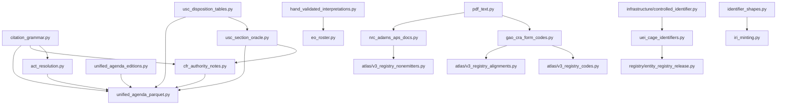
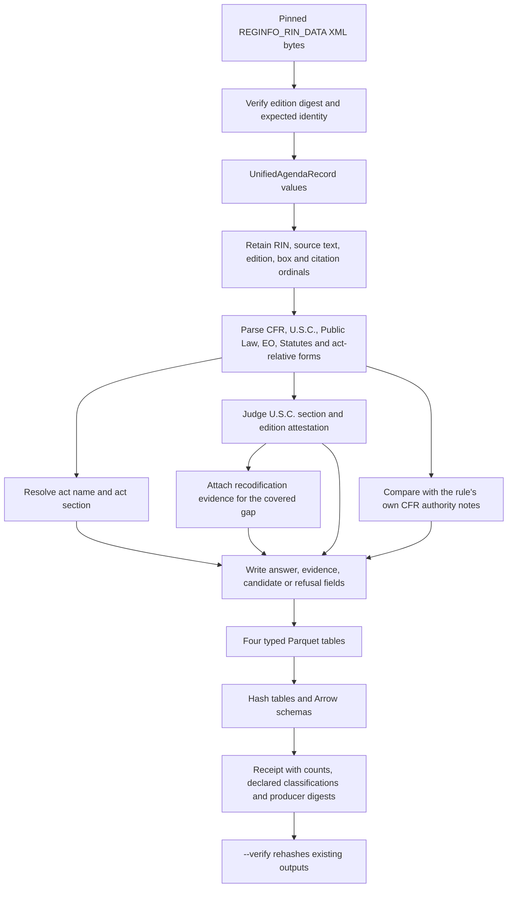

# Registry legal and identifier sources

<!-- markdownlint-disable MD013 -->

The `registry_legal_and_identifier_sources` module-tree group reads official
legal-reference sources, validates government identifier forms, and turns the
Unified Agenda's legal-authority fields into traceable records. Its readers
answer narrow questions such as whether a U.S. Code section exists, which Code
section an act section became, whether a publisher's authority note names a
citation, or whether a string has the shape of a Regulation Identifier Number
(RIN).

This name describes a documentation group, not a Python package or aggregate
import API. The implementation remains in source-specific files under
[`src/refspec/registry/`](../src/refspec/registry/). Import the module that owns
the source or decision. Do not add a wrapper merely to reproduce this wiki
grouping.

The shared rule is simple: preserve what the source said, publish only what the
available evidence supports, and make every refusal or coverage gap visible.
A normalized identifier never replaces the observed spelling, an authority
lookup never selects one of several valid targets, and a missing row becomes
`absent` only where measured source coverage permits that conclusion.

## At a glance

| Question | Answer |
| --- | --- |
| What goes in? | Reviewed Office of the Law Revision Counsel (OLRC), eCFR, National Archives and Records Administration (NARA), Federal Register, Government Accountability Office (GAO), Nuclear Regulatory Commission (NRC), SAM.gov, and Unified Agenda artifacts; trusted catalog fields or running prose; and a small table of review decisions backed by committed source bytes. Most source artifacts are loader-pinned; the Unified Agenda builder records content digests for four other required local evidence tables in its output receipt. |
| What happens? | Pinned readers authenticate bytes before parsing. Other required local readers enforce their declared row shape, while the Unified Agenda receipt records the bytes they used. The modules normalize spelling without changing identity, consult authority rosters or legal tables, and return typed answers with evidence, caveats, candidates, or refusal reasons. The Unified Agenda builder joins those answers to the publisher's original rows. |
| What comes out? | Legal-resolution records, existence and disposition verdicts, identifier candidates, authority-qualified `ControlledIdentifier` values, checked publisher-form captures, four Unified Agenda Parquet tables, and receipts that bind outputs to schemas, code, inputs, and supporting evidence. |
| How do we check it? | Focused tests cover exact pins, source drift, ambiguity, coverage windows, negative mutations, old-oracle parity where an implementation was replaced, source-context specimens, deterministic output digests, and receipt verification. |

## Purpose and system boundary

The group supplies source interpretation and corroboration. It does not own a
general legal ontology, document acquisition for the wider platform, search
policy, or release admission. Rulespec's `rkaf` model defines shared identifier
spaces. RefSpec reads publisher sources and produces checked records or release
inputs. DocSpec owns the platform source catalog and document-processing path.
SpicySearch owns retrieval and serving. The [decision
ledger](../docs/decisions.md), especially
[REF-023](../docs/decisions.md#ref-023-supersede-the-compatibility-view--rkaf-ships-on-the-atlas-wire),
[REF-024](../docs/decisions.md#ref-024-record-the-cross-product-ownership-boundary-once),
and
[REF-048](../docs/decisions.md#ref-048-docspec-owns-the-platform-source-catalog),
governs those boundaries.

The readers also do not share one delivery path:

| Path | Current role |
| --- | --- |
| Legal-authority oracles and Unified Agenda readers | Build the separately receipted Unified Agenda Parquet artifact. They do not publish an Atlas distribution. |
| GAO CRA forms and NRC APS documentation | Feed named Atlas registry loaders for value-ring code or structure releases. GAO's institutional report also supports a reviewed mapping to Unified Agenda priority values. |
| UEI and CAGE sources | Feed `entity_registry_release.py`, whose registrant and facility records have a separate cadence from the Atlas reference artifact. The planning index rejects those open populations from Atlas participation. |
| Catalog identifier shapes | Feed `iri_minting.py` and other explicit consumers. Detection describes source text; it does not decide search policy. |
| Executive Order roster | Provides a checked `exists` / `absent` / `unknown` API. [REF-057](../docs/decisions.md#ref-057-an-executive-order-existence-oracle-window-split-by-publisher-density--and-its-first-published-claim-was-wrong) records corpus wiring as follow-up work, so the current Unified Agenda build still uses its older series fence. |
| Hand-validated interpretations | Supply a small consulted-only table. A consumer may surface a flag or correction with its witnesses; the table never rewrites source data automatically. |

The [Atlas planning index](atlas_planning_index.md) inventories source and
implementation modules without authorizing publication. Its current-status
section records `eo_roster` and `hand_validated_interpretations` as
unclassified, so this wiki group does not imply planning closure. [Registry
code and classification
sources](registry_code_and_classification_sources.md) documents adjacent
publisher code lists. [Registry organization
sources](registry_organization_sources.md) documents organization rosters.
[Registry vocabulary sources](registry_vocabulary_sources.md) documents
publisher vocabularies. The [Atlas 3.1
binding](../bindings/atlas/3.1/README.md), current code, and decision ledger
remain the implementation authority. [Atlas in the United States and
Europe](../ATLAS_US_EU_COMPARISON.md) provides strategic context only.

## Architecture

The group has three cohesive areas. Legal-source readers answer citation and
existence questions. Identifier-authority readers describe identifier forms or
publisher-defined controls. The Unified Agenda pipeline applies the first area
to a pinned historical corpus and records each decision beside the source row.

```mermaid
flowchart LR
    subgraph SOURCES["Publisher and reviewed evidence"]
        OLRC["OLRC Code tables and archives"]
        ECFR["eCFR authority notes"]
        EO["NARA and Federal Register EO captures"]
        FORMS["GAO and NRC PDFs"]
        SAM["SAM.gov and DLA authority material"]
        UA["60 pinned Unified Agenda XML editions"]
        REVIEW["Committed review witnesses"]
    end

    subgraph LEGAL["Legal-authority resolution"]
        ACT["act_resolution.py"]
        USC["usc_section_oracle.py"]
        DISP["usc_disposition_tables.py"]
        NOTES["cfr_authority_notes.py"]
        EOR["eo_roster.py"]
        HAND["hand_validated_interpretations.py"]
    end

    subgraph IDENT["Identifier authorities and documented controls"]
        SHAPES["identifier_shapes.py"]
        UEI["uei_cage_identifiers.py"]
        NRC["nrc_adams_aps_docs.py"]
        GAO["gao_cra_form_codes.py"]
    end

    subgraph AGENDA["Unified Agenda artifact"]
        EDITIONS["unified_agenda_editions.py"]
        PARQUET["unified_agenda_parquet.py"]
        TABLES["actions, CFR references,<br/>legal authorities, timetables"]
        RECEIPT["receipt.json"]
    end

    OLRC --> ACT
    OLRC --> USC
    OLRC --> DISP
    ECFR --> NOTES
    EO --> EOR
    REVIEW --> HAND --> EOR
    FORMS --> NRC
    FORMS --> GAO
    SAM --> UEI
    UA --> EDITIONS

    ACT --> PARQUET
    USC --> PARQUET
    DISP --> USC
    NOTES --> PARQUET
    EDITIONS --> PARQUET
    PARQUET --> TABLES
    PARQUET --> RECEIPT

    SHAPES --> MINT["iri_minting.py"]
    UEI --> ENTITY["entity_registry_release.py"]
    NRC --> ATLAS["Named Atlas registry loaders"]
    GAO --> ATLAS
```

Solid arrows show current imports or explicit build inputs. `eo_roster.py` is
absent from the Unified Agenda branch because its wiring remains follow-up
work. The diagram also keeps the entity registry separate from Atlas: common
identifier spelling enables joins, but it does not merge release cadences or
ownership.

### Dependency direction

The source readers depend on shared grammar and registry primitives; builders
depend on the readers. Source modules do not import the Atlas distribution
builder.

`cfr_authority_notes.py` imports only the U.S. Code section normalizer from the
oracle; it does not use the oracle's existence verdict to repair a note. The
Unified Agenda builder owns the wider conjunctions because it has the source
row, its edition, its CFR parts, and all required evidence in one place.

## Detailed documentation

<!-- SUBMODULE_DOCS_START -->

| Detailed page | Source modules | Use it for |
| --- | --- | --- |
| [Legal-authority resolution and source checks](registry_legal_and_identifier_sources_legal_authority_resolution.md) | `act_resolution`, `usc_section_oracle`, `usc_disposition_tables`, `eo_roster`, `cfr_authority_notes`, and `hand_validated_interpretations` | Source verification, typed legal answers, ambiguity and coverage rules, correction boundaries, performance, and extension guidance. |
| [Identifier authorities and publisher-documented controls](registry_legal_and_identifier_sources_identifier_authorities.md) | `identifier_shapes`, `uei_cage_identifiers`, `nrc_adams_aps_docs`, and `gao_cra_form_codes` | Catalog identifier detection, authority-qualified entity identifiers, checked publisher PDFs, downstream Atlas and entity-registry paths, and contribution rules. |
| [Unified Agenda edition and derived-table pipeline](registry_legal_and_identifier_sources_unified_agenda_pipeline.md) | `unified_agenda_editions` and `unified_agenda_parquet` | Edition pins, XML parsing, ordered legal-authority enrichment, four Parquet outputs, receipt verification, CLI use, and build changes. |

<!-- SUBMODULE_DOCS_END -->

## Source and component map

### Legal-authority readers

| Module | Main components | Responsibility and boundary |
| --- | --- | --- |
| [`act_resolution.py`](../src/refspec/registry/act_resolution.py) | `ActIndex`, `SourceCreditIndex`, `ActResolution`, `resolve_act_relative_citation()` | Resolves a popular act name and act section through OLRC's Popular Name Tool, Table III, and U.S. Code source credits. It consults complementary sources, reports which answered, and refuses disagreement or ambiguity instead of selecting one target. |
| [`usc_section_oracle.py`](../src/refspec/registry/usc_section_oracle.py) | `UscSectionOracle`, `SectionVerdict`, `Candidate`, `Correction`, `_SpanIndex` | Answers whether a U.S. Code section exists in the oracle window, whether the citing edition attests it, and which narrowly licensed correction candidates survive. `unknown` names structural coverage gaps; `absent` carries the oracle-window caveat. `_SpanIndex` makes range checks logarithmic after one sorted index build. |
| [`usc_disposition_tables.py`](../src/refspec/registry/usc_disposition_tables.py) | `Recodification`, `UscDispositionTables`, `Disposition` | Reads printed positive-law recodification tables. It returns every successor, preserves printed rows, narrows on supported subsections, expands stated spans over table-listed members, and distinguishes repeal, transfer without a successor, table absence, and lack of a table. A successor is evidence, not a replacement identity. |
| [`cfr_authority_notes.py`](../src/refspec/registry/cfr_authority_notes.py) | `CfrAuthorityNotes`, `AuthorityNote`, `Citation`, `NoteVerdict` | Loads the pinned eCFR authority-note cache and judges U.S.C., Public Law, CFR, and act-name citations as `present`, `near-miss`, or `absent`. The verdict describes the current note beside historical filer text; it never declares the filer wrong or repairs the row. |
| [`eo_roster.py`](../src/refspec/registry/eo_roster.py) | `EoRosterOracle`, `EoVerdict` | Checks Executive Order numbers against a digest-pinned, source-tagged roster. Only the fully dense Federal Register API window may authorize `absent`; sparse or uncovered windows return `unknown`. A route-level 404 cannot establish nonexistence. |
| [`hand_validated_interpretations.py`](../src/refspec/registry/hand_validated_interpretations.py) | `Witness`, `Interpretation`, `lookup()` | Stores small human-reviewed interpretations backed by committed, byte-matching witness files and literal anchors. Corrections require two distinct witnesses; flags and explicit refusals require one. Lookup returns the full reviewed record or raises `NotReviewed`. |

### Identifier authorities and publisher controls

| Module | Main components | Responsibility and boundary |
| --- | --- | --- |
| [`identifier_shapes.py`](../src/refspec/registry/identifier_shapes.py) | `IdentifierKind`, `NumberingSystem`, `IdentifierCandidate`, `detect_identifier_shapes()` | Detects and normalizes RINs, Federal Register document numbers, Regulations.gov document identifiers, dockets, and labeled numbering systems. Running prose and trusted columns use different admission rules; overlap arbitration keeps the longest, most specific candidates. IRI minting remains in `iri_minting.py`. |
| [`uei_cage_identifiers.py`](../src/refspec/registry/uei_cage_identifiers.py) | `UeiRecord`, `CageRecord`, `AuthorityDocumentPin`, `SamEntityApiPin`, `AuthorityDocumentFetcher` | Validates Unique Entity Identifier (UEI) and Commercial and Government Entity (CAGE) syntax, builds authority-qualified identifiers, parses bounded captures and a pinned public SAM response, and verifies or acquires authority documentation through an injected fetcher. It preserves the distinction between a registrant and a related facility. |
| [`nrc_adams_aps_docs.py`](../src/refspec/registry/nrc_adams_aps_docs.py) | `NRCAPSPdfPin`, `ParsedAPSUserManual`, `ParsedAPSAPIGuide` | Reads exact NRC ADAMS Public Search (APS) manuals and API documentation. It preserves documented profile properties, the two official accession-number elements, API operators, and request fields, while refusing the older inferred identifier decomposition and unreviewed PDF drift. |
| [`gao_cra_form_codes.py`](../src/refspec/registry/gao_cra_form_codes.py) | `GaoCraFormPin`, `GaoCraFormOption`, `GaoCraInstitutionalEvidencePin` | Reads two GAO Congressional Review Act form revisions and report GAO-09-205. It exposes current rule-type options, retired priority levels, and institutional bridge evidence from exact PDF text; it does not turn form mechanics or the statutory major-rule definition into GAO vocabulary members. |

### Unified Agenda ingestion and artifact construction

| Module | Main components | Responsibility and boundary |
| --- | --- | --- |
| [`unified_agenda_editions.py`](../src/refspec/registry/unified_agenda_editions.py) | `UnifiedAgendaEditionPin`, `UnifiedAgendaRecord`, `TimetableEntry`, `AuthorityContinuation`, `parse_unified_agenda_edition()` | Authenticates and parses the complete pinned edition series into regulatory actions, CFR references, legal-authority boxes, timetable entries, and labeled continuations. Publisher irregularities stay recorded and narrowly handled rather than normalized away. |
| [`unified_agenda_parquet.py`](../src/refspec/registry/unified_agenda_parquet.py) | `UnifiedAgendaParquetReceipt`, four Arrow schemas, `build_unified_agenda_parquet()`, `verify_unified_agenda_parquet()`, `main()` | Reads each edition once, applies citation grammar and checked legal sources, emits exploded `actions`, `cfr_references`, `legal_authorities`, and `timetables` tables, and writes a receipt over output and schema digests plus producer inputs. Some source loaders verify literal pins; four required local CSV readers instead record their content digests in the receipt. It adds corroborated readings in separate columns and keeps original text and refusal reasons. |

## End-to-end Unified Agenda flow

The Unified Agenda path demonstrates how the group's legal readers interact.
It separates parsing, corroboration, and artifact verification so a consumer
can tell what the filer wrote from what a publisher source later established.

An `exists` verdict and `attested_at_edition = false` can coexist: the current
and historical sources establish different questions. Likewise, a
recodification disposition can sit beside an `unknown` section verdict without
changing it. The disposition answers what became of the former section; it
does not fill the annual archive that the oracle lacks.

## Design rules and invariants

### Authenticate before parsing

Pinned loaders hash the exact buffer they parse or return a path only after
checking its expected digest. Multi-table oracles verify every pinned table at
load, even when a caller will ask only one kind of question. A digest proves
byte identity with the reviewed capture; it does not prove that a mutable
publisher endpoint is still current or that the publisher signed the file.

The Unified Agenda builder's Public Law roster, Office of the Federal Register
part index, Federal Register document roster, and act-initialism roster have a
different boundary: the CLI requires the files, their readers check the shape
needed for their decisions, and `receipt.json` records their observed content
digests. Those readers do not compare the bytes with code-owned expected
digests before parsing. Treat the receipt as replay provenance, not as prior
authentication of those four inputs; the [pipeline input
section](registry_legal_and_identifier_sources_unified_agenda_pipeline.md#inputs-and-local-dependencies)
keeps the distinction with the exact paths.

PDF readers also check the reviewed text runs, page structure, option counts,
or table geometry after the byte check. A maintainer who updates a PDF pin must
inspect the rendered pages and the source text around every changed datum.

### Keep negative answers typed

The modules use closed result vocabularies rather than `None` for every kind of
failure:

| Result | Meaning |
| --- | --- |
| `absent` | The measured source window supports a negative existence result. The result carries any scope caveat. |
| `unknown` | The source cannot answer because coverage is sparse, structurally missing, or outside its declared window. The result names the reason. |
| refusal code | A lookup reached ambiguity, disagreement, invalid shape, source drift, or another declared condition. The source observation remains available. |
| candidate | One supported reading exists, but the available inputs do not license replacing the parsed identity. |
| correction | Exactly one licensed reading survives the source-specific gates, with the original spelling and evidence retained. |
| flag | A reviewer found a concern that should travel beside an otherwise honest source verdict. It changes no automated answer. |

Dataclass `__post_init__` methods enforce these combinations. For example, an
`ActResolution` carries either an IRI or a declared refusal reason, never both
or neither. An `EoVerdict` may say `absent` only in an absence-capable window.
A `SectionVerdict` attaches a recodification disposition only to the specific
coverage gap that table can address.

### Preserve source identity and context

Source spelling, source location, digest, edition or retrieval date, and
surrounding evidence remain beside normalized output. Normalization collapses
presentation differences such as dash characters or case only where the
publisher's identity permits it. It does not erase an ambiguous token, replace
a historical citation with a current section, or convert one source's code
into another source's authority.

This rule also governs hand review. A `Witness` points to a committed regular
file, checks that its working bytes match `HEAD`, and requires a literal source
anchor. Review prose without reopenable bytes cannot enter the table.

### Separate judging from proposing

Range stubs may judge whether a parsed section falls inside a source's stated
span, but they do not generate candidate sections. A CFR authority-note range
can cover a filed citation, while `et seq.` remains a citation to its stated
start rather than an invented open range. A recodification span enumerates only
the former sections the printed table lists between its endpoints.

### Bound repeated work

Readers pay fixed source costs once and cache reusable indexes:

- `ActIndex.acts_supplying_year` derives its reverse index once.
- `UscSectionOracle._SpanIndex` sorts ranges once and rejects the common
  no-match case in `O(log n)` time.
- `CfrAuthorityNotes` parses its cache once and memoizes verdicts by part,
  family, and identity.
- `unified_agenda_parquet.py` loads each immutable oracle once per build and
  reads each pinned edition once.
- Banded edit distance and bounded candidate rules prevent unbounded fuzzy
  comparison in hot paths.

When a new path scans every source row for every citation, profile it before
accepting the design. A per-item linear pass over a large roster is usually a
missing index.

## Failure model

The group fails closed at four boundaries:

1. **Source identity:** wrong URL authority, missing file, changed byte length,
   changed digest, unsafe path, or incomplete artifact directory.
2. **Reviewed structure:** changed PDF wording, XML root or edition mismatch,
   wrong columns, duplicates, unknown statuses, impossible counts, or
   inconsistent source ranges.
3. **Interpretation:** several targets, source disagreement, invalid lexical
   space, unresolved aliases, unsupported coverage, or correction ambiguity.
4. **Artifact closure:** missing required oracle, changed Arrow schema, output
   digest mismatch, incomplete declared classifications, or producer drift.

Application code should catch source-specific errors only when it can preserve
the failed observation and report the reason. Converting these errors to an
empty result makes source drift look like a source with no records.

## Developer workflow

Use the detailed page for the component being changed; it owns the exact test
commands, source-refresh steps, and downstream checks.

| Change area | Detailed workflow |
| --- | --- |
| Legal resolver, oracle, note reader, or reviewed interpretation | [Legal-authority contribution guide](registry_legal_and_identifier_sources_legal_authority_resolution.md#contribution-guide) and [verification](registry_legal_and_identifier_sources_legal_authority_resolution.md#verification) |
| Identifier detector, entity identifier, or checked publisher PDF | [Identifier contribution workflow](registry_legal_and_identifier_sources_identifier_authorities.md#contribution-workflow) and [verification](registry_legal_and_identifier_sources_identifier_authorities.md#verification) |
| Unified Agenda edition, enrichment pass, schema, or receipt | [Pipeline developer workflow](registry_legal_and_identifier_sources_unified_agenda_pipeline.md#developer-workflow) and [focused tests](registry_legal_and_identifier_sources_unified_agenda_pipeline.md#focused-tests) |

Across all three areas, open the raw source around the affected value, inspect
rendered sources as pixels, retain enough evidence to replay the decision, and
add a negative fixture for every widened boundary. A replacement check keeps
the old implementation as a test-only oracle until real-data and mutation
comparisons establish verdict agreement. Update pins, schemas, receipt counts,
and consumer tests together when behavior changes; never refresh a digest only
to silence a failure.

Run `make test` before merging a change to shared grammar, identifier spaces,
Atlas loaders, or published schemas. A skipped corpus test is missing evidence,
not proof, and a local build or green test run does not publish or deploy an
artifact.

## Related documentation

- [Publisher source portfolio and adapters](publisher_source_portfolio_and_adapters.md)
- [Atlas planning index](atlas_planning_index.md)
- [Registry foundation](registry_foundation.md)
- [Registry code and classification sources](registry_code_and_classification_sources.md)
- [Registry organization sources](registry_organization_sources.md)
- [Registry vocabulary sources](registry_vocabulary_sources.md)
- [Registry crosswalk and package sources](registry_crosswalk_and_package_sources.md)
- [Atlas registry loading](atlas_registry_loading.md)
- [Managed release validation](managed_release_validation.md)
- [Atlas source fidelity audit](atlas_source_fidelity_audit.md)
- [Atlas distribution builder](atlas_distribution_builder.md)
- [Atlas 3.1 binding](../bindings/atlas/3.1/README.md)
- [Decision ledger](../docs/decisions.md)
- [Atlas in the United States and Europe](../ATLAS_US_EU_COMPARISON.md)
