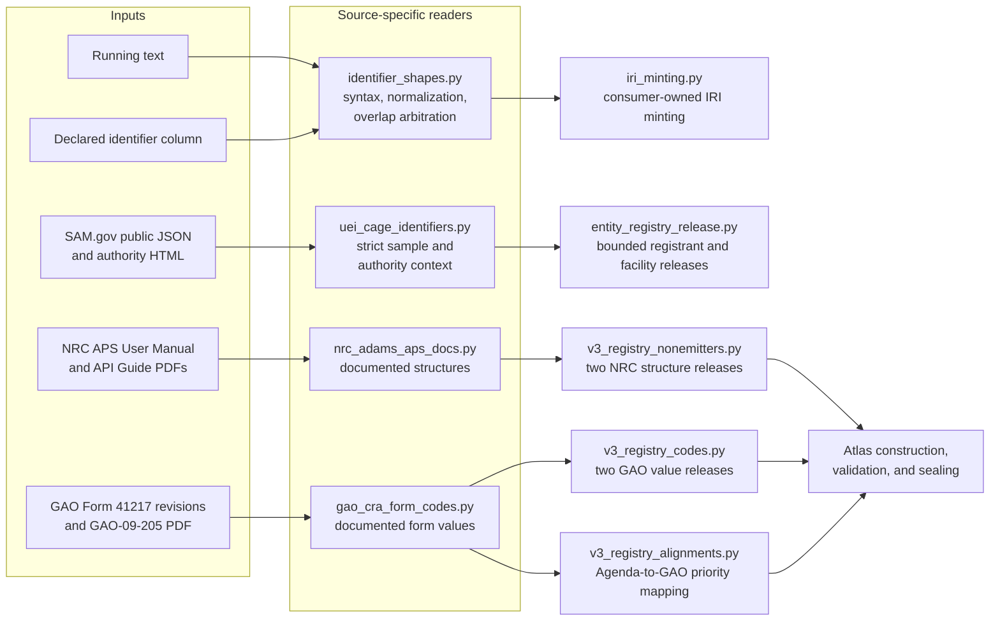
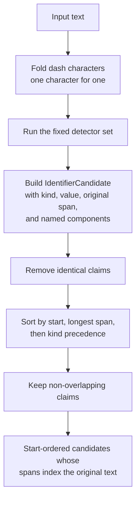
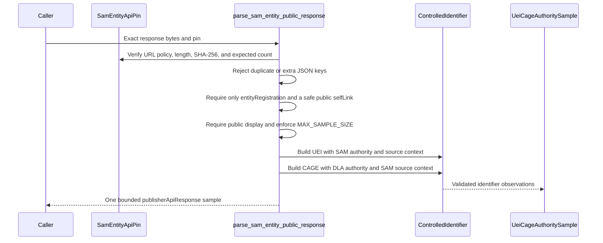
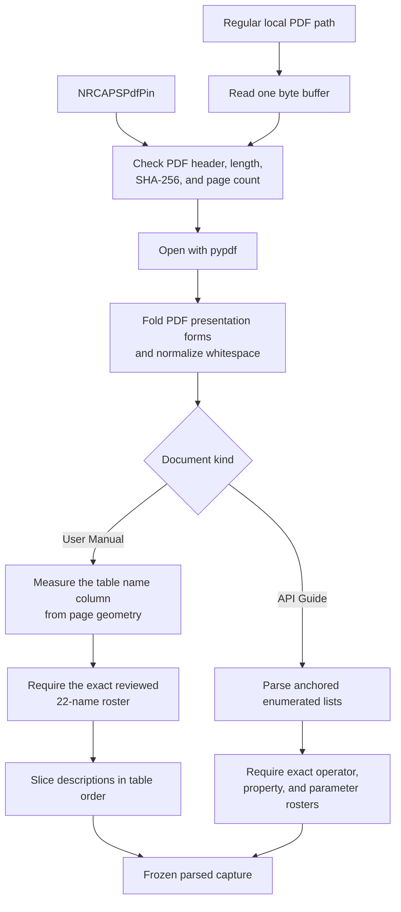

# Identifier authorities and publisher-documented controls

<!-- markdownlint-disable MD013 -->

This page documents four readers in the
`registry_legal_and_identifier_sources` group. Together they recognize catalog
identifier syntax, preserve two entity-identifier authorities, and recover
publisher-written controls from Nuclear Regulatory Commission (NRC) and
Government Accountability Office (GAO) documents.

This is a documentation group, not an aggregate Python package. Import the
source-specific module that answers the question at hand. See [Registry legal
and identifier sources](registry_legal_and_identifier_sources.md) for the
module overview and its legal-authority readers.

## At a glance

| Question | Answer |
| --- | --- |
| What goes in? | Running prose or a source-declared identifier column; a small, exact public SAM.gov response; one pinned SAM.gov authority page; two NRC ADAMS Public Search PDFs; two revisions of GAO Form 41217; and GAO report GAO-09-205. |
| What happens? | Each reader applies the evidence available at its input boundary. Text grammars detect or normalize syntax. Source readers authenticate exact bytes, parse reviewed source regions, retain publisher wording, and refuse unexpected shape or ambiguity. |
| What comes out? | `IdentifierCandidate` values and normalized catalog keys; `ControlledIdentifier`-backed UEI and CAGE records; parsed NRC profile, accession, operator, and request-parameter records; and parsed GAO form options and institutional evidence. |
| How do we check it? | Focused tests cover whole-value validation, overlap arbitration, roster-fenced corrections, strict JSON fields, sample-size limits, exact source pins, PDF structure, negative mutations, and the downstream entity-registry and Atlas loaders. |

The four modules share a fail-closed posture, but they do not share one data
path. A successful syntax match does not carry source provenance. A successful
publisher-document parse does not automatically create an identifier or admit
a value to an Atlas release.

## Architecture and system fit



[`identifier_shapes.py`](../src/refspec/registry/identifier_shapes.py) is a
syntax layer. It deliberately leaves Internationalized Resource Identifier
(IRI) minting to
[`iri_minting.py`](../src/refspec/registry/iri_minting.py), whose output space
is governed by the Rulespec `rkaf` identifier rules and explicit partner
extensions. [REF-052](../docs/decisions.md#ref-052-the-column-is-the-license--the-federal-register-document-number-recall-ruling),
[REF-054](../docs/decisions.md#ref-054-rkafs-frdoc-and-cfr-spaces-widen-upstream--28862-documents-come-in-from-the-partner-hatch-and-one-gap-is-deliberately-left-open),
and [REF-056](../docs/decisions.md#ref-056-the-fr-short-tail-widening-cycle--1656-more-document-numbers-read-and-the-remaining-360-named-one-by-one)
record the current Federal Register document-number boundaries.

[`uei_cage_identifiers.py`](../src/refspec/registry/uei_cage_identifiers.py)
uses the shared
[`ControlledIdentifier`](../src/refspec/registry/infrastructure/controlled_identifier.py)
type because each UEI and CAGE value is an observation tied to an authority,
source, date, and optional source digest. The open populations that those
identifiers name belong to the standalone entity registry under
[REF-030](../docs/decisions.md#ref-030-registrant-populations-leave-the-atlas-for-the-entity-registry),
not to an Atlas vocabulary release.

The NRC and GAO modules capture publisher-written structures and value lists.
They replaced scraped controls and inferred shapes removed under
[REF-032](../docs/decisions.md#ref-032-observed-inventories-leave-the-atlas).
Their frozen capture records retain exact publisher text and source metadata;
they do not wrap every row in `ControlledIdentifier` because the rows describe
form values or an identifier's structure, not observed identifier instances.

## Shared identifier type versus source-specific records

`ControlledIdentifier` answers a narrow question: what identifier value did a
named authority expose through a named source, and when was that observation
made or effective? Its fields are `value`, `kind`, `authority_uri`,
`source_uri`, `observed_at`, `effective_at`, and `source_digest`. It validates
nonempty values and kinds, absolute credential-free URIs, ISO 8601 dates, and
the canonical `sha256:<64 lowercase hex>` digest form.

The four modules use different result types because they answer different
questions:

| Module | Question | Main result | Authority carried in each result? |
| --- | --- | --- | --- |
| `identifier_shapes` | Does this string have a known catalog-identifier shape, and where is it in the text? | `IdentifierCandidate`, normalized strings, `NumberingSystem`, or a roster-backed RIN correction. | No. Syntax alone does not establish publisher authority. |
| `uei_cage_identifiers` | What UEI or CAGE observation did the exact source make? | `UeiRecord`, `CageRecord`, and `UeiCageAuthoritySample`. | Yes, through `ControlledIdentifier`. |
| `nrc_adams_aps_docs` | What profile properties, accession elements, operators, and parameters do the pinned NRC PDFs document? | `ParsedAPSUserManual` and `ParsedAPSAPIGuide`. | Source URL, digest, length, retrieval time, and PDF revision markers sit on the capture. No identifier instance is minted. |
| `gao_cra_form_codes` | What options do the pinned form revisions print, and what report supports the Agenda relationship? | Current-form, retired-form, and institutional-bridge capture records. | Source URL, revision or report number, digest, length, and retrieval time sit on the capture. |

Do not substitute one model for another. In particular, an
`IdentifierCandidate` is not a weak `ControlledIdentifier`; it is a different
claim with less evidence by design.

## Catalog identifier shape reader

[`identifier_shapes.py`](../src/refspec/registry/identifier_shapes.py) owns the
catalog strings that name rulemakings, Federal Register documents, and
dockets. Citation grammar for the Code of Federal Regulations (CFR), United
States Code (U.S.C.), Public Laws, Executive Orders, and Statutes at Large
lives in `citation_grammar.py` and remains outside this module.

### Two input readers

The module keeps prose detection separate from declared-column reading:

| Reader | Input evidence | Main APIs | Boundary |
| --- | --- | --- | --- |
| Prose reader | Characters in running text only. | `detect_identifier_shapes()` | Uses guarded patterns and refuses forms that would be ambiguous in ordinary prose. |
| Column reader | A field name has already declared the value's role. | `normalize_rin()`, `normalize_regsgov_identifier()`, `normalize_docket_reference()`, `is_federal_register_document_number(..., column_licensed=True)`, and `numbering_system()` | May admit additional documented shapes because the column supplies type evidence. |

Whole-value validators answer whether the complete value is an identifier.
They never search for a valid substring. For example, a labeled value can be
detected in prose, but `normalize_rin("RIN 2060-AV45")` returns `None` because
the label is not part of the RIN.

`docket_reference_as_stated()` preserves the source's trimmed characters. It
returns an empty string for the exact null sentinels and for a label with no
value. The normalizers separately fold case and Unicode dash forms for joins.
That separation keeps evidence about the original spelling beside a stable
comparison key.

### Detection and arbitration



`IdentifierCandidate` carries:

- `kind`: `docket`, `federal_register_document`,
  `regulations_gov_document`, or `rin`;
- `value`: the normalized surface value;
- `span`: offsets into the original string; and
- `components`: source structure such as organization, year, office, docket
  sequence, or document sequence.

`keep_longest_then_most_specific()` resolves overlaps. A Regulations.gov
document can also match a docket grammar over the same characters, so the
more specific document claim wins. The post-detection sort costs
`O(k log k)` for `k` candidates, and the sweep costs `O(k)`. The detector set
is fixed; regex cost still depends on the input and the individual Python
regular expressions.

### Normalization, classification, and correction

`normalize_rin()` accepts the module's chosen Regulation Identifier Number
(RIN) space and returns the uppercase join key. The space fits the pinned
Unified Agenda roster; it is not presented as a universal publisher grammar.

`is_federal_register_document_number()` has an explicit license flag. Its
default path accepts only the modern mintable form. A trusted
`document_number` column can additionally license reviewed legacy,
letter-opening, and short-tail families. The prose detector remains narrow
when the column path widens.

`normalize_docket_reference()` tries the value as stated before removing a
leading docket label. The remainder must have a Regulations.gov docket shape,
must begin with an organization token rather than digits, and must not match a
Federal Energy Regulatory Commission (FERC) docket. A well-formed identifier
is never stripped as though its first token were a label.

`numbering_system()` classifies only a system that the value states. It
recognizes Regulations.gov and FERC dockets plus labeled systems such as
airworthiness directives, airspace dockets, amendment numbers, EPA Federal
Register locators, file numbers, Office of Management and Budget control
numbers, projects, public notices, and release numbers. Bare digits yield
`None`; the function does not infer a system from number shape alone.

`corrected_rin()` is the only reader in this file allowed to change a
character. It generates values one named damage operation away, checks each
against the caller's roster, and returns a correction only when exactly one
roster member survives. The evidence string is
`unique-roster-existence`. An already valid RIN, no survivor, or several
survivors returns `None`.

The correction generator creates `O(n)` variants for an input of length `n`.
Use a `set` or `frozenset` roster for expected constant-time membership; a
linear `Container` makes the lookup cost scale with roster size.

### Maintainer rules

- Preserve the prose-versus-column split. A publisher column can license a
  shape that running text cannot distinguish safely.
- Keep validators whole-value and keep candidate spans on the original text.
- Add a detector only with overlap tests against every existing kind. Update
  `_KIND_PRECEDENCE` only when a measured exact-span contest needs a ruling.
- Keep normalization one character for one character when a caller relies on
  source spans.
- Treat correction operators as proposals. A roster and a single survivor
  authorize the answer.
- Coordinate mintable-space changes with `iri_minting.py`, the pinned
  Rulespec package, and the applicable decision-ledger entry.

## SAM.gov UEI and DLA CAGE identifier authorities

[`uei_cage_identifiers.py`](../src/refspec/registry/uei_cage_identifiers.py)
documents two related but distinct identities:

- a SAM.gov Unique Entity ID (UEI) identifies a registrant; and
- a Defense Logistics Agency Commercial and Government Entity (CAGE) code
  identifies a facility or location.

`associated_uei` records which registrant a CAGE facility is filed under. It
does not claim that the two identifiers name the same entity. Parent and
highest-level-owner fields belong to the UEI record because they describe
registrant ownership, not facility identity.

### Inputs and hard scope limit

The module accepts two source forms:

1. a deterministic sample-capture JSON document used for schema and fixture
   tests; and
2. exact bytes from the pinned public SAM Entity Management v4 response,
   limited to the `entityRegistration` section.

`MAX_SAMPLE_SIZE` caps the UEI and CAGE collections at 25 records each. Both
the model constructor and parsers enforce the ceiling. The parser therefore
cannot become an accidental bulk-entity ingestion path.

UEIs must contain exactly 12 uppercase alphanumeric characters; CAGE codes
must contain exactly five. Both shapes exclude `I` and `O`. `UeiRecord` and
`CageRecord` also enforce the identifier kind, documented status vocabulary,
access classification, nonempty name, and syntax of related UEIs.

### Public-response flow



The SAM response carries the entity's registration status but no DLA CAGE
status. The parser therefore records CAGE status as `notObserved` instead of
copying the SAM status. It also refuses additional or protected sections, a
nonpublic display flag, a self-link that exposes an API credential, an
unexpected response count, duplicate JSON keys, and any unknown field.

`render_capture()` writes stable, sorted JSON for review. The sample's
`digest` property hashes the canonical native payload, while `parse_capture()`
requires the exact format identifier, parser version, field set, provenance,
and sample-size declaration before constructing records.

### Source pins and acquisition seam

`SamEntityApiPin` restricts the pinned request to official HTTPS
`api.sam.gov`, refuses credentials or an `api_key` in the retained URL, and
pins digest, length, retrieval time, content type, and expected record count.
`verify_sam_entity_api_response()` authenticates the bytes before JSON
parsing.

`SAM_UEI_DOCUMENTATION_PIN` identifies the stable SAM.gov entity-registration
HTML capture. `AuthorityDocumentFetcher` is a small injected transport seam;
`acquire_authority_document()` accepts either one regular, non-symlink local
file or one injected fetcher. It requires HTTP 200 for fetched material and
then verifies the exact body length and digest. Importing the module performs
no network access.

The current DLA documentation does not have a reproducible byte pin. The
module retains `DLA_CAGE_AUTHORITY_URI` as the authority citation and states
that limitation instead of authenticating unstable page bytes as a durable
capture.

### Output and downstream use

[`entity_registry_release.py`](../src/refspec/registry/entity_registry_release.py)
loads the bounded public SAM sample into separate UEI-registrant and
CAGE-facility releases. It carries the facility-to-registrant relation with
`identityEquivalenceClaimed: false`. Atlas construction refuses these open
registrant populations; [Registry organization
sources](registry_organization_sources.md) documents the finite institutional
rosters that remain valid Atlas reference data.

## NRC ADAMS Public Search documentation

[`nrc_adams_aps_docs.py`](../src/refspec/registry/nrc_adams_aps_docs.py)
reads two official PDFs for the NRC's ADAMS Public Search (APS):

| Source | Parsed content | Result type |
| --- | --- | --- |
| APS User Manual | All 22 rows in `Properties in Profile`, each description, the official two-element accession-number definition, the statement that APS replaces Web-Based ADAMS, and PDF document-information markers. | `ParsedAPSUserManual` with `APSProfileProperty` and `APSAccessionNumberDefinition` members. |
| APS API Guide | Printed version, six text-filter operators, two date properties, eight search request parameters, the one get-document parameter, 13 Appendix A document properties, developer-portal statements, and PDF document-information markers. | `ParsedAPSAPIGuide` with `APSTextOperator` and `APSRequestParameter` members. |

The official accession definition names a two-character alphabetic code and a
nine-character numeric ADAMS Item ID. The reader emits those two documented
elements and no inferred decomposition of the item ID.

### Verification and parsing



`NRCAPSPdfPin` limits source URLs to credential-free HTTPS on
`adams-search.nrc.gov` and validates its digest, length, page count, and
retrieval marker. `_read_pinned_pdf()` accepts a regular, non-symlink local
file and parses the same byte buffer whose digest it checked.

The manual parser first measures the property-name column by text position on
the two table pages. It then compares that measured string with the reviewed
22-name roster before slicing descriptions. A row added, removed, renamed,
or moved outside the measured table fails instead of disappearing into a
neighboring description.

The API-guide parser uses source headings and list markers to isolate each
region. It requires exact operator tokens, date-property names, request
parameter names, and Appendix A property names. List-item regexes stop at the
next item, so a newly documented parameter becomes roster drift instead of
unexamined text inside the preceding description.

The two parsed documents feed
[`v3_registry_nonemitters.py`](../src/refspec/atlas/v3_registry_nonemitters.py),
which builds:

- `nrc-adams-documented-profile-properties-2026-08-15`, a complete capture of
  the manual's profile-property table; and
- `nrc-adams-documented-accession-number-2026-08-15`, a complete capture of
  the two documented accession elements.

The API guide's Appendix A list is captured and checked but recorded under
`notEmitted` metadata. The accession release sets
`identifierAuthorityRowsMinted` to false because its members describe
structure; they are not accession-number instances.

## GAO Congressional Review Act form codes

[`gao_cra_form_codes.py`](../src/refspec/registry/gao_cra_form_codes.py)
reads publisher-written values from GAO Form 41217, *Submission of Federal
Rules Under the Congressional Review Act* (CRA), plus institutional evidence
from report GAO-09-205.

| Source | Required source statement | Parsed output |
| --- | --- | --- |
| Current Rev. 12/24 form | Form number and revision, item 6's five rule types, current major/non-major wording, and absence of `Priority of Regulation`. | `GaoCraCurrentFormCapture` with five active rule-type options. |
| Retired Rev. 11/17/23 form | Form title, item 8's five priority levels and routing note, and the retired major/non-major wording. | `GaoCraRetiredFormCapture` with five retired priority options. |
| GAO-09-205 | Four reviewed statements connecting GAO's standardized CRA form and database to Unified Agenda priority categories. | `GaoCraInstitutionalBridgeCapture`. |

Each `GaoCraFormOption` keeps a normalized value beside the printed option
text, form item, and source ordinal. The printed text retains list joiners and
instructions such as `Other (specify)`; consumers can audit the normalized
value without reconstructing the source wording.

The parsers receive bytes directly and perform no acquisition. They check
length and SHA-256 first, require a PDF header, read with `pypdf`, fold PDF
presentation forms through `fold_pdf_text()`, normalize whitespace, and then
require exact reviewed text runs. A repinned document whose wording changes
still fails structure checks.

The current form acts as negative evidence for the retired priority list. If
`Priority of Regulation` reappears in the current bytes, the current parser
refuses; a downstream release cannot continue claiming that the retired form
is the last publisher statement.

[`v3_registry_codes.py`](../src/refspec/atlas/v3_registry_codes.py) builds the
`gao-cra-rule-types` and `gao-cra-priority-of-regulation` value releases. The
priority release pins both revisions and marks the old values `retired`. It
does not emit the major/non-major question because the quoted definition
belongs to 5 U.S.C. 804(2), not to a GAO code list.

[`v3_registry_alignments.py`](../src/refspec/atlas/v3_registry_alignments.py)
parses GAO-09-205 again before building the reviewed Unified Agenda-to-GAO
priority mapping. Equal labels support the mapping, but the report provides
the institutional link; label similarity alone does not.

## Failure model

The modules report a refusal at the boundary that has enough evidence to name
it:

| Module | Public error types or refusal form | Meaning |
| --- | --- | --- |
| `identifier_shapes` | `None` or an empty candidate list. | The syntax, source license, roster evidence, or unique-survivor rule did not authorize an answer. This module does not use exceptions for ordinary nonmatches. |
| `uei_cage_identifiers` | `UeiCageIdentifierError`; wrapped `ControlledIdentifierError` when shared identifier context is invalid. | Identifier syntax, fields, access policy, pin, JSON shape, sample scope, or acquisition conditions failed. |
| `nrc_adams_aps_docs` | `NRCAPSAcquisitionError`, `NRCAPSSourceDriftError`, and base `NRCAPSDocsError`. | The source declaration or local file is unsafe; exact bytes or reviewed document structure changed; or a parser dependency is unavailable. |
| `gao_cra_form_codes` | `GaoCraFormError` and `GaoCraFormSourceDriftError`. | A pin is malformed, the wrong revision parser was selected, bytes changed, the payload is not a PDF, or reviewed wording moved. |

Do not turn an ordinary syntax nonmatch into a guessed value, or turn source
drift into an empty capture. Both changes would erase why the reader could not
answer.

## Contribution workflow

Use this sequence when extending one of these readers:

1. Identify the publisher statement that authorizes the new value, shape, or
   relation. Distinguish a maintained list or documented structure from a
   value merely observed in records.
2. Read the raw source around the proposed datum. For a PDF, inspect the
   rendered page as pixels as well as the text layer before changing an anchor
   or option run.
3. Decide which input boundary supplies the evidence. Add a narrow prose
   grammar, a column-licensed production, a source-specific capture field, or
   a separate downstream interpretation; do not merge those questions.
4. Preserve source text and context beside normalized output. Keep option
   text, descriptions, source order, URLs, retrieval markers, and digests
   where the source exposes them.
5. Add a negative fixture or mutation for every new invariant. A successful
   parse proves acceptance only; mutations prove the reader still refuses
   malformed or drifted material.
6. Update downstream loader tests if release membership or metadata changes.
   Keep entity-registry, Atlas value-release, and identifier-minting ownership
   separate.
7. Run the focused suite, then the repository checks appropriate to the
   release path.

Common mistakes to avoid:

- widening prose detection because a declared column can identify a value;
- treating an identifier's syntax as proof that a publisher issued it;
- copying SAM registration status onto a CAGE record;
- accepting protected or bulk SAM entity data;
- reviving the undocumented `MLYYDDDNNNN` ADAMS decomposition;
- replacing GAO's numbered form with values scraped from a search widget; or
- repinning a PDF without rechecking the rendered source region and negative
  drift tests.

## Verification

Run the source-reader tests from the repository root:

```sh
uv run pytest -q \
  tests/test_identifier_shapes.py \
  tests/test_uei_cage_identifiers.py \
  tests/test_nrc_adams_aps_docs.py \
  tests/test_gao_cra_form_codes.py
```

Run the immediate consumer tests when changing output or an integration
boundary:

```sh
uv run pytest -q \
  tests/test_iri_minting.py \
  tests/test_entity_registry_release.py \
  tests/test_atlas_v3_registry_nonemitters.py \
  tests/test_atlas_v3_registry_codes.py \
  tests/test_atlas_v3_registry_alignments.py
```

Some corpus-wide identifier-shape tests carry the `slow` marker and skip when
their pinned Parquet inputs are absent. Treat a skip as a missing measurement,
not as current proof of the measured counts. `make test` remains the complete
repository gate.
