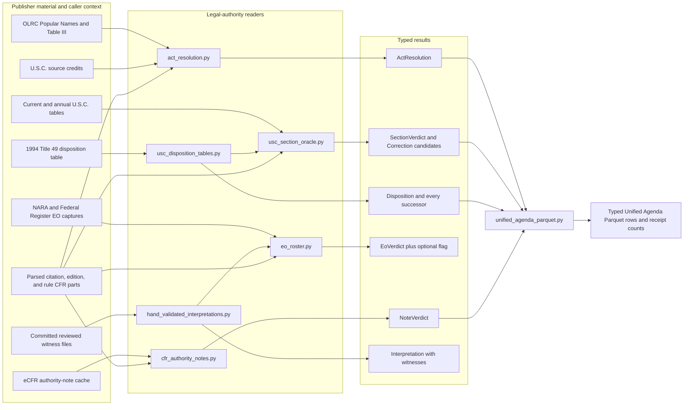
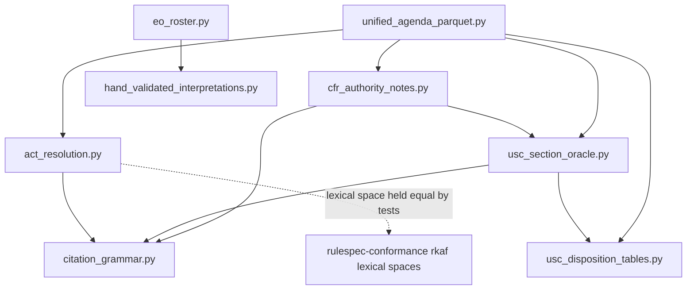
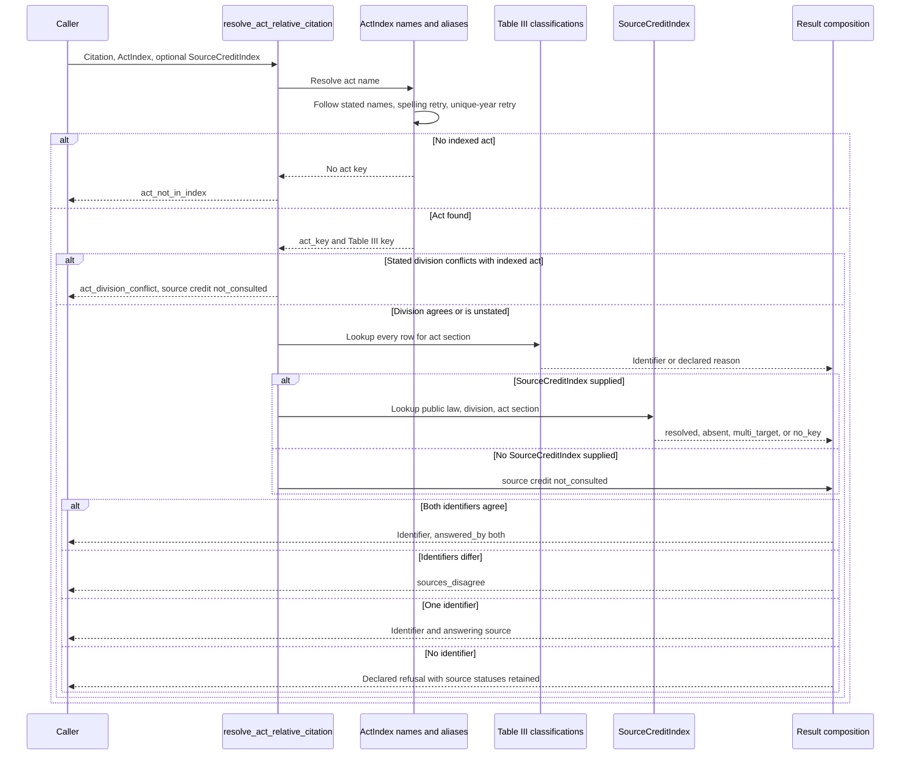
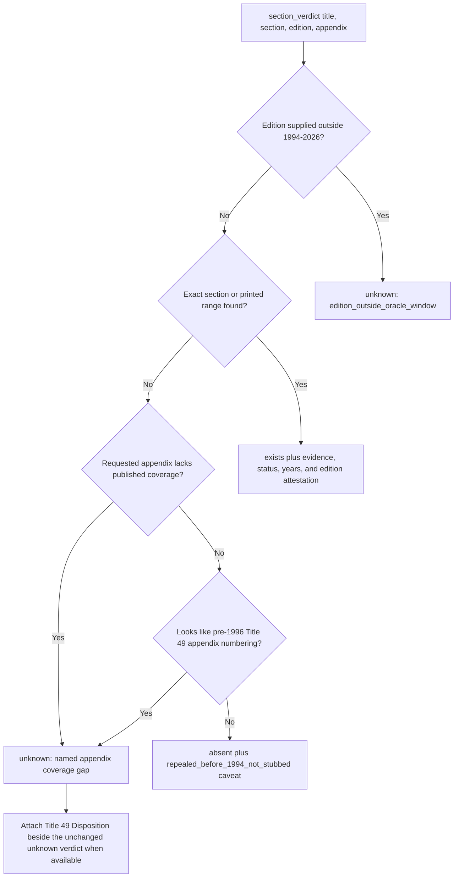
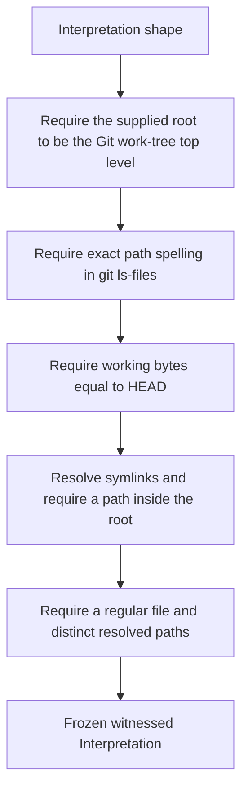
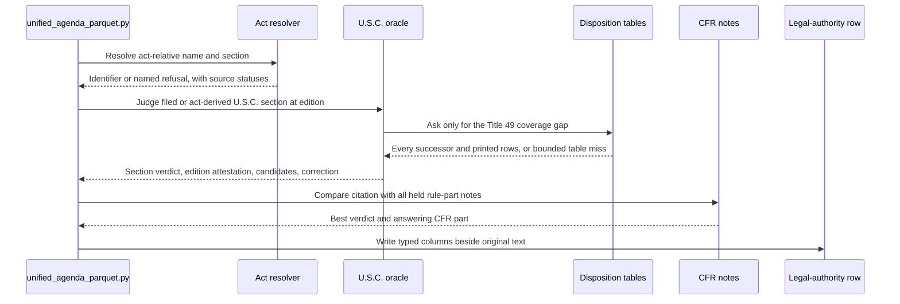

# Legal-authority resolution and source checks

<!-- markdownlint-disable MD013 -->

This page documents the legal-authority half of
[`registry_legal_and_identifier_sources`](registry_legal_and_identifier_sources.md).
Six source-specific modules resolve act-relative citations, check United States
Code (U.S.C.) sections, describe recodified sections, check Executive Order
numbers, compare citations with Code of Federal Regulations (CFR) authority
notes, and retain a small register of hand-reviewed interpretations.

The modules share one rule: publish the strongest statement the source supports
and keep every weaker result visible. A source-backed identifier is different
from a bounded absence, an unknown caused by missing coverage, a possible
reading, and a human flag. The types and closed reason lists preserve those
differences for downstream code.

This name describes a documentation group, not a Python package or aggregate
import API. Import each source-owning module directly from
[`src/refspec/registry/`](../src/refspec/registry/). The Unified Agenda build
that consumes four of these modules is documented in [Unified Agenda source and
Parquet pipeline](registry_legal_and_identifier_sources_unified_agenda_pipeline.md).

## At a glance

| Question | Answer |
| --- | --- |
| What goes in? | Parsed legal-authority citations; sealed Parquet and comma-separated-value artifacts derived from the Office of the Law Revision Counsel (OLRC), National Archives and Records Administration (NARA), Federal Register, GovInfo, and eCFR; the rule's own CFR parts; edition years; and exact source values backed by committed witness files. |
| What happens? | Each loader checks the bytes it will read. Source-specific logic resolves names and sections, checks existence only within measured coverage, retains all ambiguous targets, and emits a typed answer or a named refusal. |
| What comes out? | `ActResolution`, `SectionVerdict`, `Disposition`, `EoVerdict`, `NoteVerdict`, and full `Interpretation` records. Each result carries the source, coverage status, evidence, caveat, or witness needed to read it correctly. |
| How do we check it? | Focused tests verify every pin, result invariant, source-composition rule, coverage boundary, ambiguity path, correction fence, real-data population, performance replacement, and hand-witness constraint. The Unified Agenda tests check the downstream columns and receipt counts. |

## Place in RefSpec

These modules sit between citation parsing or exact source values and the
derived Unified Agenda tables. They do not publish an Atlas distribution on
their own. They provide checked source facts and conservative interpretations
that a builder may record beside the publisher's original text.



Solid arrows into `unified_agenda_parquet.py` show current imports. The
Executive Order roster has no current builder arrow: [REF-057](../docs/decisions.md#ref-057-an-executive-order-existence-oracle-window-split-by-publisher-density--and-its-first-published-claim-was-wrong)
accepts the oracle itself but records builder wiring as follow-up work.
`hand_validated_interpretations.py` has one live consumer,
`EoRosterOracle.flag_for`; a reviewed flag never changes `EoRosterOracle.verdict`.

The [Atlas 3.1 binding](../bindings/atlas/3.1/README.md), current code, and
[decision ledger](../docs/decisions.md) establish implementation authority.
[Atlas in the United States and
Europe](../ATLAS_US_EU_COMPARISON.md) supplies strategic context, not runtime
authority. [REF-023](../docs/decisions.md#ref-023-supersede-the-compatibility-view--rkaf-ships-on-the-atlas-wire)
places shared identifier meaning in Rulespec's `rkaf` vocabulary, and
[REF-024](../docs/decisions.md#ref-024-record-the-cross-product-ownership-boundary-once)
keeps cross-product exchange on immutable releases and installed packages.
[REF-048](../docs/decisions.md#ref-048-docspec-owns-the-platform-source-catalog)
does not give this group a platform catalog role.

## Result meanings

Read each result according to its source and coverage. Identical words in two
modules can carry different scopes; for example, `absent` in the U.S.C. oracle
and `absent` in an eCFR note answer different questions.

| Result form | Practical meaning | Required context |
| --- | --- | --- |
| Resolved identifier or `exists` | The named source positively supports this identity or number. | The result names its answering source, evidence class, source window, or source capture. |
| `present` | One of the rule's held CFR-part notes names the citation, directly or through a stated U.S.C. span. | `cfr_note_part` identifies the note that answered. |
| `absent` | The searched source covers the question strongly enough to support a miss. | The U.S.C. oracle attaches `ABSENT_CAVEATS`; the EO roster permits absence only in its fully dense Federal Register API window; a CFR-note absence applies to the note as fetched, not to all historical editions. |
| `unknown` | The source lacks the coverage needed to answer. | A closed reason identifies the gap, such as an unpublished appendix, an edition outside the oracle window, a sparse NARA window, or a number outside every declared EO window. |
| Refusal | The input reached a known source path, but ambiguity, source conflict, obsolete classification, inexpressible identifier, incomplete source, or another declared condition prevents publication. | The result carries the exact code; callers count it rather than treating it as an exception to hide. |
| Candidate | A checked source supports a possible reading, but the available inputs cannot license it as a replacement. | `Candidate.corrects` is false for candidate-only rules, and `fenced_by` records any evidence that struck a reading. |
| Correction | Exactly one unfenced, correction-capable reading survives. | The result retains the original section, the replacement, the named rule, and evidence. |
| Flag | A reviewer doubts an exact source value but asserts no replacement. | The full `Interpretation` carries committed witnesses, reviewer, date, context, and notes beside the independent source verdict. |

Do not collapse `unknown`, `absent`, and an unconsulted source into one Boolean.
Do not use a `Disposition.successors` tuple as one corrected identity. Do not
apply an `Interpretation.interpreted_value` without reading its disposition and
witnesses.

## Component inventory

| Source module | Main public components | Checked input | Main consumer |
| --- | --- | --- | --- |
| [`act_resolution.py`](../src/refspec/registry/act_resolution.py) | `ActIndex`, `SourceCreditIndex`, `ActResolution`, `resolve_act_name`, `resolve_act_relative_citation`, `canonical_usc_iri` | Two pinned OLRC-derived act-index tables and one pinned U.S.C. source-credit table | `unified_agenda_parquet.py` and IRI minting tests |
| [`usc_section_oracle.py`](../src/refspec/registry/usc_section_oracle.py) | `UscSectionOracle`, `SectionVerdict`, `SubsectionVerdict`, `Candidate`, `Correction`, `ActSectionClaim` | Six pinned derived tables from OLRC release point 119-102 and annual archives 1994–2024 | `unified_agenda_parquet.py`; `cfr_authority_notes.py` reuses only `normalize_section` |
| [`usc_disposition_tables.py`](../src/refspec/registry/usc_disposition_tables.py) | `Recodification`, `UscDispositionTables`, `Disposition`, `DispositionRow`, `Successor` | Pinned Parquet extracted from the GovInfo 1994 Title 49 printed volume | `UscSectionOracle` and `unified_agenda_parquet.py` |
| [`eo_roster.py`](../src/refspec/registry/eo_roster.py) | `EoRosterOracle`, `EoVerdict`, `window_for` | One pinned 6,147-number roster re-derived from NARA and Federal Register captures | Direct callers and tests; Unified Agenda wiring remains open |
| [`cfr_authority_notes.py`](../src/refspec/registry/cfr_authority_notes.py) | `CfrAuthorityNotes`, `AuthorityNote`, `Citation`, `NoteVerdict`, citation constructors | One pinned 8,240-record eCFR authority-note cache | `unified_agenda_parquet.py` |
| [`hand_validated_interpretations.py`](../src/refspec/registry/hand_validated_interpretations.py) | `Witness`, `Interpretation`, `build_interpretation`, `load_interpretations`, `lookup` | Exact source values and repo-relative witness paths checked against Git | `EoRosterOracle.flag_for` |

### Import relationships



An arrow means the source module imports the target or depends on a tested copy
of its rule. The CFR note reader imports `normalize_section` from the U.S.C.
oracle so both sides compare one section spelling. The disposition reader
restates private dash and section-order helpers and tests them against their
owners instead of creating a reverse import cycle.

## Source verification boundaries

Every loader checks the exact bytes it parses, but the kind of evidence differs
by source. A SHA-256 pin detects byte drift; it does not prove that a publisher
signed the bytes or that a rolling endpoint remains current.

| Module | Load-time check | Source boundary that remains visible |
| --- | --- | --- |
| `act_resolution.py` | `_read_pinned_parquet` hashes each requested table against code-owned pins. `ActIndex.from_artifact` and `SourceCreditIndex.from_artifact` also require a readable `receipt.json`. | The resolver authenticates the sealed derived tables, not the live OLRC pages. The source receipts record acquisition and coverage; changing an artifact requires re-derivation and review. |
| `usc_section_oracle.py` | `from_directory` hashes all six tables before any lazy property can answer. Each property rechecks its own table before parsing it with PyArrow. | The six Parquet files are derived oracle tables. Their [evidence README](../research/evidence/usc-section-oracle-2026-08-24/README.md) records the 32 source archives and row-for-row reproduction. |
| `usc_disposition_tables.py` | `from_directory` hashes every table declared by `RECODIFICATIONS`; each lazy read verifies again. | The current registry contains one recodification table, Title 49 in 1994. `RECODIFICATIONS_NOT_PINNED` names known tables that remain outside coverage. |
| `eo_roster.py` | The reader hashes one CSV buffer, parses that same buffer, checks every row's window and source, remeasures dense windows, and proves each declared source range equals the rows it attained. | Only the `fr_api` window may support `absent`. Full density in another captured run does not silently grant absence authority. |
| `cfr_authority_notes.py` | `from_file` verifies SHA-256, byte length, and record count before parsing all records. | Raw title XML is not retained. Each reduced record keeps its concrete API URL plus the source XML digest and byte length so a re-fetch can be compared. |
| `hand_validated_interpretations.py` | `build_interpretation` and `load_interpretations` require an exact Git-tracked path, bytes equal to `HEAD`, a resolved path inside the work tree, and a regular file. | This is checkout tooling, not a wheel-safe digest bundle. A future packaged form must ship and pin its witnesses instead of weakening the Git checks. |

Importing these modules performs no network request. The readers bind to local
artifacts or to caller-supplied values. Acquisition and re-derivation live in
the evidence directories and build tools linked from each section below.

## Act-relative citation resolution

[`act_resolution.py`](../src/refspec/registry/act_resolution.py) answers a
question such as “Clean Air Act section 111” without pretending that the text
already names a U.S.C. title and section. It performs two joins over OLRC
material and consults two complementary sources:

1. `ActIndex` maps a normalized popular name through aliases to an act and its
   Table III key.
2. The same index maps the act's own section number to every Table III U.S.C.
   classification.
3. `SourceCreditIndex` independently asks the U.S.C. section source credits by
   `(public law, division, act section)`.

Table III has broad coverage and may return several classifications. Source
credits cover far fewer laws but include the division in the lookup key. The
resolver returns `act_division_conflict` before either source lookup when a
stated division conflicts with the indexed act; this path records
`source_credit_status="not_consulted"`. Otherwise, it always consults Table III
and consults source credits only when the caller supplies a `SourceCreditIndex`.
An omitted source-credit index also records `not_consulted`. When both sources
are available, one may answer alone; agreement records `answered_by="both"`;
disagreement returns `sources_disagree`.

### Name resolution

`resolve_act_name` applies three ordered passes. The order is part of
`ALIAS_PRECEDENCE_RULE` and has real-data tests.

1. Follow the Popular Name Tool's stated cross-reference chain and accept the
   first name the index lists.
2. Retry each stated name after removing a leading article that the tool itself
   added only in the cross-reference spelling.
3. Supply a trailing year only when exactly one indexed act completes that
   yearless stem.

`stated_name_chain` stops on a repeated name and also enforces
`ALIAS_MAX_DEPTH`. It never chooses among several year-bearing acts.

### Resolution sequence



### Ambiguity and range handling

`ActIndex.classifications` stores a tuple of every Table III row for one
`(table3_key, act_section)`. It never lets input order choose a survivor. When
several rows exist, `act_page_range` derives the act division's Statutes at
Large range from division start pages. That range supports one safe conclusion:
if every row falls outside it, the result is `act_section_outside_act`. An
in-range row does not prove that the row belongs to the named act, so the
resolver returns `act_section_ambiguous` instead of narrowing to one.

The source-credit lookup handles multiplicity at the key. More than one target
returns `multi_target`; the resolver records the status and publishes no
credit-based identifier.

### Output invariants

`ActResolution.__post_init__` enforces the public result shape:

- exactly one of `iri` and `unresolved_reason` is set;
- a resolved identifier always names `answered_by`, and a refusal never does;
- `answered_by`, `unresolved_reason`, `table3_reason`, and
  `source_credit_status` come from closed vocabularies; and
- source-credit provenance remains available even when Table III supplies the
  identifier.

`canonical_usc_iri` mints only the `rkaf:us-usc` lexical space that the pinned
Rulespec package accepts. It normalizes spelling, drops a parenthetical to
resolve a subsection to its section, and refuses an unexpressible identity.
Tests hold the restated regular expression equal to the vendored Rulespec
contract and run every identifier minted from the real tables through it.

The default `USC_ACT_INDEX_ARTIFACT` is the bulk
`output/usc-act-index-2026-08-22` build: 15,189 Table III keys and 302,156
classification rows. The older 24-law per-page build remains pinned and
readable but is not the default. The source-credit artifact contains 3,721
rows over 109 laws. See the [bulk Table III evidence](../research/evidence/act-index-bulk-table3-2026-08-22.md)
before changing the default or its coverage claims.

## U.S.C. section oracle

[`usc_section_oracle.py`](../src/refspec/registry/usc_section_oracle.py) checks
whether a U.S.C. section appears in the oracle's measured window and, where an
edition is supplied, whether that edition attests it. Its current tables combine
OLRC release point 119-102 with annual archives from 1994 through 2024.

The module exposes two membership questions on purpose:

| API | Uses exact rows | Uses printed range stubs | Intended use |
| --- | --- | --- | --- |
| `section_is_enumerated` | Yes | No | Candidate generation and corrections. A range must never invent a candidate. |
| `section_exists` | Yes | Yes | Judging a section a parser already produced. A publisher-printed range can support that membership test. |

The exact non-appendix union contains 66,780 `(title, section)` pairs. The
oracle also retains release-point statuses, annual attestation years,
subsection trees, chapter numbers, and exact range stubs.

### Section-verdict flow



An edition narrows attestation; it does not rewrite a window-wide existence
verdict. `attested_at_edition=False` beside `verdict="exists"` means the section
exists somewhere in the oracle but the cited edition did not print it. Treat
that combination as an era mismatch, not a misread. An edition outside the
oracle window returns `unknown` because the caller asked a question the source
cannot answer.

Every `absent` verdict carries `ABSENT_CAVEATS`. The oracle cannot exclude a
section repealed before 1994 and omitted from later stubs. Every `unknown`
names one of four structural gaps: edition outside the window, unpublished
Title 49 appendix, another unpublished appendix title, or unavailable
subsection structure.

The current annual extractor deliberately excludes OLRC's bracketed withdrawn
stubs from edition attestation. OLRC zeroes the section field of their `usckey`,
and admitting those stubs created false `exists` verdicts in measured data.
[REF-059](../docs/decisions.md#ref-059-olrcs-bracketed-stubs-are-excluded-from-attestation-on-purpose)
records the decision and the deferred third state for “printed as a withdrawn
placeholder.”

### Subsections, diagnostic classes, and corrections

`subsection_verdict` uses the current, non-appendix release-point tree. A live
section with no matching child may support `absent`; a transferred or repealed
stub returns `unknown` because its former subsection structure is unavailable.

`classify_section_miss` assigns the first matching diagnostic class in
`MISS_CLASSES`. The classes distinguish impossible titles, zero padding,
subsection/section confusion, lost suffixes, date-year captures, appendix
coverage, chapter tokens, lost hyphen parts, letter-o/zero confusion, malformed
ranges, pre-1996 Title 49 numbering, near misses, and unresolved cases. This
classification explains a miss; it does not by itself authorize a correction.

Correction follows a stricter path:

1. `correction_candidates` emits every source-affirmed reading, including
   `parse-as-filed` when the original reading has a witness.
2. `ActSectionClaim` values supplied by the caller may strike the A4
   lost-parenthesis reading when the row's own Regulation Identifier Number
   (RIN) or agency roster shows that the token is an act section classified
   elsewhere in the same title.
3. `Candidate.fenced_by` records why a reading was struck. A struck candidate
   remains visible but cannot publish or block another survivor.
4. `corrected_section` returns a `Correction` only when exactly one unfenced
   survivor remains and its rule is correction-capable.

`B8-lettered-section-rather-than-a-pinpoint` is explicitly candidate-only.
Even one unopposed B8 reading remains a candidate because the oracle cannot
distinguish two real sections using only section shape. `Correction` refuses a
candidate-only rule at construction time, preventing accidental promotion by a
new caller.

### Range-index performance

`_SpanIndex` replaces a full scan of every range stub for every query. It sorts
each title bucket once, bisects the low endpoints in `O(log n)`, and uses a
running maximum of high endpoints to reject a miss in `O(1)` after the bisect.
Only a genuine hit scans the pruned prefix to collect year payloads. The module
records a measured change from 8.8 seconds to 0.26 seconds over 95,492 corpus
keys. `test_attested_years_index_matches_the_old_linear_scan_on_every_corpus_key`
keeps the former scan as a test-only oracle, and adversarial interval tests
prove overlapping and nested spans.

## U.S.C. recodification disposition tables

[`usc_disposition_tables.py`](../src/refspec/registry/usc_disposition_tables.py)
answers a separate question: what did a positive-law recodification do with a
former section? It currently reads one printed table, the 1994 “TABLE SHOWING
DISPOSITION OF FORMER SECTIONS OF TITLE 49,” derived as 3,102 Parquet rows over
909 former sections.

The section oracle attaches a `Disposition` only beside
`unknown/title_49_appendix_not_published`. The oracle verdict and reason stay
unchanged because OLRC still publishes no annual Title 49 appendix. The
disposition adds the answer to a different question; it never converts a
successor into the citation's identity.

### Lookup rules

- Return every successor in printed order. A former section may split across
  several current sections, and printed prose may be the only discriminator.
- Treat `repealed-no-successor`, `stated-without-successor`, and
  `exists-as-recodified` as different verdicts. A pointer to another act is not
  a repeal.
- Let a stated subsection narrow matching rows. If the table does not resolve
  that subsection, return the section's rows with
  `subsection_resolved=False`; the missed pinpoint does not accuse the section.
- Ask a stated span member by member. `sections_in_span` enumerates the former
  section keys the printed table actually lists between the endpoints, not all
  integers in the range. `Disposition.members` preserves each answer, and
  `successors` is their de-duplicated union.
- Apply a span's pinpoint only to the start member. Carrying one subsection
  across every section in a range would create claims the citation never made.
- Return `no-table-for-title` when no recodification is pinned. Return
  `not-in-table` only after reading the table for that title, and attach
  `NOT_IN_TABLE_CAVEATS` because an earlier-repealed section may never have
  appeared in the recodification table.

The [disposition evidence README](../research/evidence/usc-disposition-tables-2026-08-23/README.md)
documents the retained GovInfo PDF, extractor, row counts, and visual review.
`RECODIFICATIONS_NOT_PINNED` lists known positive-law recodifications that a
future contributor can add without pretending Title 49 covers them.

## Executive Order roster

[`eo_roster.py`](../src/refspec/registry/eo_roster.py) checks whether an
Executive Order number appears in a pinned roster. Its core design separates a
positive roster hit from the authority to call a miss an absence.

| Window | Number range | Measured role | Verdict for a miss |
| --- | ---: | --- | --- |
| `nara_codification` | 9–12,667 | Sparse, affirm-only NARA coverage | `unknown/nara_window_miss` |
| `nara_disposition` | 12,668–12,889 | Pinned 1989–1993 gap closure, kept affirm-only | `unknown/nara_window_miss` |
| `fr_api` | 12,890–14,420 | Fully dense Federal Register API capture | `absent` |
| No declared window | Below 9 or above 14,420 | No density statement | `unknown/outside_known_windows` |

`FR_API_DENSE_MAX` comes from the pinned roster, not from the citation
grammar's current EO ceiling. `_verify_density` refuses a roster with any gap
inside an absence-capable window. It also remeasures the minimum and maximum
attained by each source tag and requires exact equality with `SOURCE_RANGES`.
An `exists` verdict therefore carries a source whose declared range contains
the number, and an `absent` verdict can name only a window in `ABSENT_CAPABLE`.

`EoVerdict.__post_init__` checks the whole statement: verdict vocabulary,
window containment, source range, and reason/window agreement. A caller cannot
construct a coherent-looking absence in a sparse window.

EO 8284 is the module's boundary specimen. The order exists in NARA's 1939
table even though one NARA detail route returns a “Page Not Found” page. The
roster returns `exists`; `flag_for(8284)` separately returns a hand-reviewed
relevance flag. The flag neither changes the existence verdict nor proposes EO
8248 as a correction. See [REF-057](../docs/decisions.md#ref-057-an-executive-order-existence-oracle-window-split-by-publisher-density--and-its-first-published-claim-was-wrong)
and the [EO roster evidence](../research/evidence/eo-roster-2026-08-31/README.md).

## CFR authority-note reader

[`cfr_authority_notes.py`](../src/refspec/registry/cfr_authority_notes.py)
compares one legal-authority citation with the publisher's authority note at
the head of the rule's own CFR parts. It reports evidence beside the filer text;
it never decides which text is wrong or repairs either one.

The pinned JSON Lines cache contains 8,240 authority notes from the 49
non-reserved CFR titles. `AuthorityNote` keeps the publisher's note text,
source note, concrete API URL, fetch date, source-document digest and byte
length, authority level, and authority scope. Eighty records use the first
subdivision's note because the part itself states none; `authority_level` and
`authority_scope` keep that choice visible.

### Reading and comparison

`read_note_citations` uses the same `parse_authority_citation` grammar that
reads the Unified Agenda field. It compares four families:

- `usc`: normalized title and section, with a note's stated range retained;
- `public_law`: the public-law number;
- `cfr`: title and part, because sections within one part share its authority
  note; and
- `act`: the normalized popular name.

The reader removes the `Authority:` label, decodes HTML entities, and handles a
tightly fenced publisher convention in which a semicolon-separated section
list carries the last stated U.S.C. title. It preserves the whole note so a
maintainer can inspect any reading, including known elision and ampersand
costs.

`AuthorityNote.judge` returns:

| Verdict | Rule | Interpretation limit |
| --- | --- | --- |
| `present` | Exact family identity, or a U.S.C. section covered by the note's explicit range. | `et seq.` names its starting section; it is not expanded into a range. |
| `near-miss` | Damerau–Levenshtein distance at most one over the full identity, including the title. | A lead only. The module's measured review found low standalone precision, so consumers must combine it with independent evidence. |
| `absent` | Neither exact/range membership nor a one-edit neighbor appears. | Absent from the note as fetched. The corpus reaches back to 1995, and a current note may differ from the note in force when the rule was filed. |

`CfrAuthorityNotes.judge` checks every held CFR part named by the rule and keeps
the best result in the order `present`, `near-miss`, `absent`. It returns
`None` when none of the parts is held. Ties use citation order after sorting,
so publisher input order does not change the result. The returned `NoteVerdict`
names the part whose note answered.

Construction parses each note once. `_by_part` indexes normalized
`(title, part)` keys, and `_memo` caches each `(part, family, identity)` verdict.
The first near-miss question scans that note's identities; repeated questions
on the same key are dictionary lookups. See the [authority-note evidence
README](../research/evidence/ecfr-authority-notes-2026-08-24/README.md) for
capture coverage and known holes.

## Hand-validated interpretations

[`hand_validated_interpretations.py`](../src/refspec/registry/hand_validated_interpretations.py)
holds exceptional, exact-value judgments that no grammar should generalize.
[REF-058](../docs/decisions.md#ref-058-hand-validated-interpretations--human-judgment-on-the-same-receipt-discipline-as-everything-else)
defines it as a consulted-never-applied table.

### Typed dispositions

| Disposition | Witness floor | Replacement value | Meaning |
| --- | ---: | --- | --- |
| `correction` | 2 distinct resolved files | Required | The reviewed value and replacement identify one thing. |
| `flag` | 1 | Forbidden | The exact value is doubtful, but the row asserts no replacement. |
| `refusal-to-interpret` | 1 | Forbidden | A reviewer examined the value and deliberately left it unresolved. |

`Interpretation` is frozen and owns a tuple copy of its witnesses. It rejects
duplicate witness spellings, empty context or reviewer fields, an invalid ISO
review date, an unknown disposition, and any mismatch between disposition and
`interpreted_value`.

`build_interpretation` then checks each witness against the repository:



`load_interpretations` verifies table-wide uniqueness and caches the witnessed
rows. `lookup` returns the complete row or raises `NotReviewed`; it never
returns `None` or a bare replacement string. `EoRosterOracle.flag_for`
converts `NotReviewed` to `None` for its convenience API, returns only a
`flag`, and raises if the table later contains a correction under that EO
number.

The current table has two founding rows: the `E5-2394` source-value correction
to `E5-2394Filed` and the EO 8284 relevance flag. The [hand-attestation
evidence README](../research/evidence/hand-attestations-2026-08-31/README.md)
explains the witness discipline and reopening process.

## Current Unified Agenda interaction

The legal-authority readers enrich rows without replacing the publisher's
original `authority_text` or dropping failed parses.



The builder loads the sealed artifacts once and reuses cached indexes across
rows. Its receipt counts outcomes by result vocabulary, answering source,
correction rule, disposition verdict, authority type, and coverage gap. Those
counts make a disappearing refusal or an unexpected source shift visible.

The EO roster does not yet write Unified Agenda columns. Do not document an EO
verdict census as current build output until the REF-057 follow-up lands in
code and tests.

## Contribution guide

### Choose the narrowest public API

Use `section_verdict` when a consumer needs source scope and caveats. Use
`section_exists` only for a yes/no check within the oracle's full window. Use
`section_is_enumerated` for candidate generation. Use `correction_candidates`
when a UI or audit needs every reading; use `corrected_section` only when the
consumer is authorized to accept the module's single-survivor rules.

For act-relative citations, call `resolve_act_relative_citation` with both
indexes when available. Calling only Table III is supported and records
`source_credit_status="not_consulted"`, but it cannot discover a source
disagreement. For CFR notes, pass all CFR parts owned by the rule; judging one
arbitrary part changes the question.

### Add or replace a pinned source

1. Re-fetch through the source's documented acquisition path and retain the
   raw context needed to review each parsed claim. For a PDF, inspect the
   rendered page as well as its text layer.
2. Derive the candidate artifact with the committed source-specific tool.
3. Compare old and new rows in both directions. Classify every difference as a
   source change, parser change, coverage change, or defect.
4. Update code-owned digests, byte lengths, counts, release points, source
   ranges, and evidence documentation together. Never read a pin from the
   receipt beside the artifact it is meant to authenticate.
5. Run mutation tests that prove the new check rejects damaged data. If one
   implementation replaces another, keep the old one as copied test-only
   logic and prove agreement on real data plus the mutation battery before
   deleting the production path.

Adding a recodification means adding a `Recodification` row and its pinned
table; do not special-case a title in `disposition`. Expanding an EO window's
absence authority requires a new density measurement and review, not a larger
constant. Refreshing eCFR notes requires a semantic comparison because `absent`
describes a dated living document.

### Add a reason, verdict, or correction rule

A new result code changes stored data and downstream receipt counts. Add it to
the module's closed vocabulary, enforce its field invariants in the result
dataclass, add a positive test, add a negative fixture, and update the Unified
Agenda schema and count closure where the builder consumes it.

A correction rule must name its operator, its independent source witness, and
every refusal condition. Generate all survivors before choosing. If the
available inputs cannot distinguish two real identities, publish candidates or
a refusal. Never convert a review flag, range membership, successor list, or
one-edit neighbor into a replacement identity.

### Preserve performance properties

Build each large reader once and reuse it. Keep repeated row questions behind
`cached_property` or a key that contains every input capable of changing the
answer. A missing field in a cache key can make call order choose the result.

For ranges and spans, reason about the largest title bucket and the number of
row questions. Preserve `_SpanIndex`'s `O(log n)` miss path and the
old-versus-new oracle test. For CFR notes, preserve one parse per note and one
memo entry per `(part, family, identity)`. For hand witnesses, preserve the two
cached read-only Git calls per repository root.

## Verification

Run commands from the repository root:

```sh
cd /Users/mikewolfd/Work/RefSpec

# Source composition, note comparison, EO windows, and Git-backed judgments
uv run pytest -q \
  tests/test_act_resolution.py \
  tests/test_cfr_authority_notes.py \
  tests/test_eo_roster.py \
  tests/test_hand_validated_interpretations.py

# Large OLRC and GovInfo tables, real-data counts, correction fences, and the
# indexed-range comparison with the former linear oracle
uv run pytest -q \
  tests/test_usc_disposition_tables.py \
  tests/test_usc_section_oracle.py

# Downstream columns and receipt closure for these sources
uv run pytest -q tests/test_unified_agenda_parquet.py \
  -k 'section_fence or act_resolution or cfr_part_note or note_verdict or disposition_census'

# Registry source-link declarations and the complete repository gate
uv run python tools/build_registry_source_manifest.py --check
make test
```

The U.S.C. oracle and disposition suites contain many `slow` real-artifact
tests. During local development, run their fast structural subset with
`-m "not slow"`, then run the complete files before handing off a source or
rule change. Documentation-only edits need link and Mermaid review; they do not
justify claiming that these code tests ran unless they were executed in the
same worktree.

## Related documentation

- [Registry legal and identifier sources](registry_legal_and_identifier_sources.md)
  gives the whole module-group overview and links the sibling identifier and
  Unified Agenda pages.
- [Unified Agenda source and Parquet pipeline](registry_legal_and_identifier_sources_unified_agenda_pipeline.md)
  documents the builder that records act, section, disposition, and CFR-note
  results.
- [Registry code and classification sources](registry_code_and_classification_sources.md)
  covers publisher-maintained legal and regulatory code lists rather than
  citation resolution.
- [Legislative and regulatory code sources](registry_code_and_classification_sources_legislative_and_regulatory.md)
  documents adjacent congressional, regulatory, and Federal Register source
  adapters.
