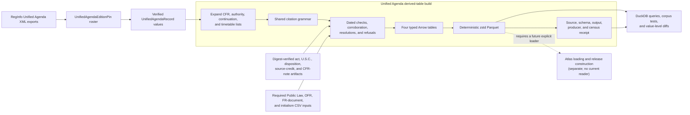
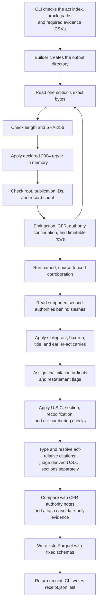

# Unified Agenda edition and derived-table pipeline

<!-- markdownlint-disable MD013 -->

This sub-module turns the Regulatory Information Service Center's pinned
Unified Agenda XML exports into four typed Parquet tables. It authenticates and
parses each edition, keeps the publisher's text beside every interpretation,
uses digest-authenticated readers and required receipt-recorded evidence files
to test or resolve selected citations, and writes a receipt that identifies
the source bytes, output files, schemas, code, and supporting evidence used by
the build.

The implementation spans
[`unified_agenda_editions.py`](../src/refspec/registry/unified_agenda_editions.py)
and
[`unified_agenda_parquet.py`](../src/refspec/registry/unified_agenda_parquet.py).
It belongs to [Registry legal and identifier
sources](registry_legal_and_identifier_sources.md). It is an offline,
repository-local build path, not an acquisition service or an Atlas release
writer. Current code and repository searches show the output serving tests and
analysis tools; no Atlas loader imports these tables. Adding them to an Atlas
release would require a separate source-selection and loader change.

## At a glance

| Question | Answer |
| --- | --- |
| What goes in? | Sixty local, digest-pinned `REGINFO_RIN_DATA_*.xml` exports covering Fall 1995 through Fall 2025; digest-verified act, U.S.C., disposition, source-credit, and CFR-note artifacts; and four required evidence CSV files whose observed digests are recorded in the receipt. |
| What happens? | The edition reader verifies each XML file and emits typed records. The builder expands structured citation lists, preserves unreadable values, runs bounded corroboration and legal-source checks, and writes deterministic Parquet. |
| What comes out? | `unified_agenda_actions.parquet`, `unified_agenda_cfr_references.parquet`, `unified_agenda_legal_authorities.parquet`, `unified_agenda_timetables.parquet`, and `receipt.json`. |
| How do we check it? | The CLI verifies output digests against the receipt. Focused tests also re-read the source series, check schemas and row meaning, recompute receipt counts, exercise refusal paths, and query the real tables with DuckDB. |

## Place in RefSpec

This pipeline is a source-derived legal-authority artifact. It shares the
publisher-source layer with code-list readers, identifier readers, and legal
oracles, but it does not turn an Agenda row into an Atlas record by itself.

[`unified_agenda_codes.py`](../src/refspec/registry/unified_agenda_codes.py),
documented under [Legislative and regulatory code and classification
sources](registry_code_and_classification_sources_legislative_and_regulatory.md#unified-agenda-controls),
solves a different problem. That module reads the publisher's XSD and Preamble
to define documented option lists. This sub-module reads the actual RIN
(Regulation Identifier Number) edition exports and interprets their CFR,
authority, and timetable values.



This boundary follows [REF-024](../docs/decisions.md#ref-024-record-the-cross-product-ownership-boundary-once):
products exchange immutable artifacts rather than importing sibling source
trees. It also respects [REF-048](../docs/decisions.md#ref-048-docspec-owns-the-platform-source-catalog):
these tables are not a platform source catalog. The [Atlas 3.1
binding](../bindings/atlas/3.1/README.md) and current Atlas loaders remain the
authority for any later release use.

## Code structure

### Edition reader

[`unified_agenda_editions.py`](../src/refspec/registry/unified_agenda_editions.py)
owns the exact source-series description and the first fail-closed parse.

| Component | Responsibility |
| --- | --- |
| `UnifiedAgendaEditionPin` | Names the source file stem and content-derived `publication_id`, SHA-256 digest, byte length, expected record count, and publisher run date for one edition. Construction rejects malformed digests, counts, and edition identifiers. |
| `UNIFIED_AGENDA_EDITION_PINS` | Declares all 60 published editions and their exact source identities. |
| `parse_unified_agenda_edition()` | Checks byte length and digest before any repair, applies the two declared in-memory byte repairs, parses XML, checks the root and every record's `PUBLICATION_ID`, and verifies the final record count. |
| `UnifiedAgendaRecord` | Keeps one RIN, edition, ordered CFR references, ordered legal-authority boxes, timetable rows, and raw `ADDITIONAL_INFO`. |
| `TimetableEntry` | Preserves the action, the publisher's date string, and optional Federal Register citation. A projected date such as `11/00/2026` stays text. |
| `legal_authority_continuations()` | Reads the two measured continuation-label families from `ADDITIONAL_INFO` without treating unrelated field continuations as authority text. |
| `AuthorityContinuation` | Carries the label family, exact marker, and whitespace-collapsed continuation text. |

The pin uses the content's `PUBLICATION_ID` rather than trusting the file name.
This matters for Fall 2012: RegInfo serves `REGINFO_RIN_DATA_2012.xml`, its
records identify edition `201210`, and no Spring 2012 export exists.

The 2004 editions each contain one XML 1.0 control byte, `0x19`, where the
publisher intended a typographic apostrophe. The parser hashes the original
bytes, then substitutes `U+2019` only in memory. It also checks that exactly the
two declared editions need this repair. A pin therefore continues to identify
the publisher's bytes rather than an edited copy.

`ADDITIONAL_INFO` keeps whitespace intact because blank lines and the
publisher's `^P` marker separate embedded form fields. The continuation reader
collapses whitespace only after it has found the end of one legal-authority
continuation. It returns the entire continued list to the citation grammar;
pre-splitting would lose the title carried across comma-separated sections.

### Parquet builder

[`unified_agenda_parquet.py`](../src/refspec/registry/unified_agenda_parquet.py)
owns the output schemas, record expansion, corroboration order, legal-source
joins, deterministic writes, receipt, and CLI.

| Public component | Responsibility |
| --- | --- |
| `ACTIONS_SCHEMA` | Defines the one-row-per-RIN-edition action table and flags authority or CFR lists that the publisher declares incomplete. |
| `CFR_REFERENCES_SCHEMA` | Defines one row per parsed CFR citation, including raw text, source ordinal, citation ordinal, title and part checks, and current OFR-part evidence. |
| `LEGAL_AUTHORITIES_SCHEMA` | Defines the detailed legal-authority table. Its fields retain raw text, parsed identities, statuses, refusal reasons, source-specific verdicts, candidate readings, correction evidence, and list-reconstruction context. |
| `TIMETABLES_SCHEMA` | Defines one row per timetable citation and keeps text-grounded, column-grounded, partial, failed, and externally corroborated readings distinct. |
| `build_unified_agenda_parquet()` | Reads each requested pin once, builds all rows in memory, runs the ordered post-parse passes, writes the four tables, and returns a `UnifiedAgendaParquetReceipt`. |
| `UnifiedAgendaParquetReceipt` and `receipt_payload()` | Give `receipt.json` one deterministic shape. The receipt identifies input editions, output and schema digests, row meaning, measured classifications, and producer inputs. |
| `verify_unified_agenda_parquet()` | Reports missing or digest-mismatched output tables and rejects a receipt that does not declare `schemaVersion: exploded-v3`. |
| `main()` | Implements the build and `--verify` CLI, resolves default repository paths, and refuses a CLI build when required local oracles are absent. |

The module tree calls out five private helpers because they carry important
build rules. They remain implementation details; application code should not
import them.

| Private component | Build rule |
| --- | --- |
| `_ActNameMatcher` | Searches act-name candidates only within a small length band, uses a cutoff-aware Levenshtein calculation, refuses tied best matches, and requires every stated year to survive exactly. |
| `_SeriesCalendar` | Derives edition-year bounds for Congresses, Statutes at Large volumes, and later-created U.S.C. titles from the required local Public Law roster. Its observed digest is recorded in the output receipt rather than authenticated against a code-owned pin. A missing date source produces an undated fallback rather than an invented refusal. |
| `_CitationHistory` | Builds RIN-level and agency-level citation rosters from grammar-read rows. Corroborated rows never enter the roster, which prevents a repair from proving itself. |
| `_SplitCitations` | Recognizes a bare section list split across ordered legal-authority boxes and binds it only to a unique neighboring Public Law after the donor, calendar, and competing-reading checks pass. |
| `_ActNumbering` | Supplies the U.S.C. section fence with act-section claims from the RIN's acts, then its agency's acts. It normalizes both sides once and never uses the corpus-wide act pool to break a tie. |

## Inputs and local dependencies

The default source directory is
`output/registry-real-data-sources/unified-agenda-editions`. For each pin, the
builder reads `REGINFO_RIN_DATA_{file_stem}.xml`. The edition module documents
the official `XMLViewFileAction` endpoint, but neither module fetches it. A
maintainer must place reviewed bytes at the requested source path before a
build.

The CLI does not preflight the 60 edition files. It checks the required
act-index, oracle, and evidence paths, then calls the builder. The builder
creates the output directory before it opens the first XML file, so a missing
edition raises from the file read and can leave an empty or partial output
directory.

The default build also requires the local inputs below. The CLI checks their
presence before it calls the builder. The sealed act, source-credit, U.S.C.,
disposition, and CFR-note readers authenticate their content against expected
digests. The Public Law, Office of the Federal Register (OFR), Federal Register
document, and initialism CSV readers do not compare their files with
code-declared expected digests. Instead, the receipt records the observed
SHA-256 value of each required CSV so a later producer-drift check can identify
changed bytes.

| Input | Use in this pipeline | Detailed documentation |
| --- | --- | --- |
| `output/usc-act-index-2026-08-22/` | Popular-name closure, act aliases, RIN and agency act rosters, Table III act-section classifications, and act-relative resolution. | [Legal authority resolution](registry_legal_and_identifier_sources_legal_authority_resolution.md) |
| `output/usc-source-credit-index-2026-08-02/` | Independent U.S. Code source-credit answer for an act section; disagreement with Table III refuses resolution. | [Legal authority resolution](registry_legal_and_identifier_sources_legal_authority_resolution.md) |
| `research/evidence/usc-section-oracle-2026-08-24/` | U.S.C. section existence, edition attestation, correction candidates, chapters, and ranges. | [Legal authority resolution](registry_legal_and_identifier_sources_legal_authority_resolution.md) |
| `research/evidence/usc-disposition-tables-2026-08-23/` | Title 49 recodification evidence attached to the section oracle's named coverage gap. Successors remain evidence, not replacement identities. | [Legal authority resolution](registry_legal_and_identifier_sources_legal_authority_resolution.md) |
| `research/evidence/ecfr-authority-notes-2026-08-24/notes.jsonl` | `present`, `near-miss`, or `absent` comparison against a rule's own held CFR parts. The verdict never rewrites the citation. | [Legal authority resolution](registry_legal_and_identifier_sources_legal_authority_resolution.md) |
| `output/registry-real-data-sources/public-law-roster/public-law-roster.csv` | Public Law existence, approval dates, Statutes volumes, and edition-specific series bounds. | [Legislative and regulatory code sources](registry_code_and_classification_sources_legislative_and_regulatory.md) |
| `research/evidence/cfr-subject-index-2026-08-20/part-subjects.csv` | Current Office of the Federal Register part membership for CFR reference evidence. | [Registry vocabulary sources](registry_vocabulary_sources.md) |
| `research/evidence/unified-agenda-fr-document-roster-2026-08-23/documents.csv` | Corroborates a bounded set of damaged timetable Federal Register citations against publisher document metadata. | This page; the evidence directory's `README.md` records the roster method. |
| `research/evidence/initialism-roster-2026-08-24/roster.csv` | Resolves measured act initialisms only behind RIN or agency evidence tiers. | This page; the evidence directory's `README.md` records the tier rules. |

`citation_grammar.py` supplies the shared readers for CFR, U.S.C., Public Law,
Federal Register, act-relative, and other authority forms.
`identifier_shapes.py` supplies identifier-shape rules used through that
grammar and is included in the receipt's producer-module hashes. Detailed
identifier-shape behavior belongs in [Identifier
authorities](registry_legal_and_identifier_sources_identifier_authorities.md),
not here.

### Current Executive Order boundary

The legal-authority schema includes `eo_in_known_series`, but the current
builder does not import or construct
[`EoRosterOracle`](../src/refspec/registry/eo_roster.py). It asks the existing
series-range rule based on `EO_HIGHEST_KNOWN`. The pinned EO roster and its
window-specific `exists`/`absent`/`unknown` verdicts therefore do not appear in
the current Parquet output. The evidence directory's
[`WIRING-SPEC.md`](../research/evidence/eo-roster-2026-08-31/WIRING-SPEC.md)
describes proposed integration, and
[REF-057](../docs/decisions.md#ref-057-an-executive-order-existence-oracle-window-split-by-publisher-density--and-its-first-published-claim-was-wrong)
records that wiring as follow-up work. Treat this as a verified implementation
gap, not as completed behavior.

## Build and data flow

The builder first emits rows from the publisher's structured fields. It then
runs ordered passes over the legal-authority table. The order is part of the
meaning: later passes may use facts established by earlier passes, and the
builder writes numbering, verdict, and receipt fields only after every row has
arrived.



### Initial row creation

For each `UnifiedAgendaRecord`, the builder creates:

- one action row with the publisher's list counts and incomplete-list flags;
- one or more CFR-reference rows per box, with an all-null parsed row when the
  box yields no citation;
- one timetable row per parsed Federal Register citation, or one explicit
  `absent`, `partial`, `failed`, `relabeled`, `positional`, or `corroborated`
  row when the field's evidence supports that narrower result; and
- one legal-authority row per parsed citation from the structured boxes and
  measured `ADDITIONAL_INFO` continuations. The grammar returns an
  `other`/`failed` row for unreadable text, so an input string never vanishes.

Every exploded citation keeps `(rin, publication_id, ordinal)` and receives a
`citation_ordinal`. Rows from one source box therefore remain grouped even
when the box names several citations. Continuation ordinals start after the
record's structured-box count, and `authority_source` identifies the original
field and label family.

### Ordered legal-authority passes

The main post-parse order is:

1. Build RIN- and agency-scoped act evidence from already readable rows.
2. Run named corroboration rules. Each repair needs a named damage operator,
   its source-specific fence, and exactly one surviving reading.
3. Read supported second authorities behind a slash.
4. Carry an act from an adjacent box when its four refusal checks pass.
5. Detect citation lists cut across box runs. Keep the original rows, add
   joined readings, and record the exact joined text.
6. Carry a U.S.C. title from a bounded earlier box, then carry an act from an
   earlier box. Both record the donor ordinal and exact grammar input.
7. Reject far endpoints that the section oracle cannot print, then assign
   citation ordinals and continuation-restatement flags once.
8. Apply U.S.C. section verdicts and correction-candidate rules to citations
   the filer wrote. Attach Title 49 recodification evidence to the section
   oracle's named coverage gap in this pass, before CFR-note comparison; never
   use a successor as a replacement identity. Keep `exists`, `absent`, and
   named `unknown` results distinct, and preserve edition mismatch separately
   from section existence.
9. Type unresolved rows that still name an act, resolve act-relative
   citations through Table III and source credits, and run a separate U.S.C.
   section census over those derived sections.
10. Compare the final citation reading with the rule's own CFR-part authority
    notes. Then attach slot-reading, bounded-suffix, and placeholder-candidate
    evidence without rewriting the source identity.

This design separates four claims that a consumer could otherwise conflate:
the text parsed, a source judged the target, another source proposed a
candidate, and the builder corrected a value under a measured rule. The schema
uses separate columns and closed status vocabularies for those claims.

## Output tables and row meaning

| Table | Row unit | Important fields and uses |
| --- | --- | --- |
| `unified_agenda_actions` | One `(rin, publication_id)` record. | Publisher list counts and declarations that more CFR or authority values follow. |
| `unified_agenda_cfr_references` | One parsed CFR citation from one source box; one null parsed row when none is readable. | `reference_text`, source and citation ordinals, title, part, section, plausibility flags, and current OFR membership. |
| `unified_agenda_legal_authorities` | One parsed, corroborated, carried, or explicitly unreadable legal-authority citation. | Raw text, source location, type and parse status, legal identities, series checks, U.S.C. and act verdicts, candidate and correction evidence, CFR-note result, and reconstruction fields. |
| `unified_agenda_timetables` | One timetable citation or one explicit non-citation/failure row. | Raw action and date, original citation, Federal Register volume and page, source scheme, corrected document metadata, and correction evidence. |

The current verified local receipt reports 241,726 action rows, 444,847 CFR
reference rows, 800,573 legal-authority rows, and 671,959 timetable rows. These
are build measurements, not source-independent constants. Read
`output/registry-real-data-sources/unified-agenda-parquet/receipt.json` for the
artifact being used and expect a reviewed source or rule change to move them.

The builder writes each table with its declared Arrow schema, zstd compression
level 3, and Parquet statistics disabled. Those fixed settings make repeated
builds from the same inputs byte-comparable. Original publisher strings remain
in `reference_text`, `authority_text`, and `fr_citation_text`; parsed and
corrected fields never replace them.

## Receipt and verification boundary

`receipt.json` contains:

- source SHA-256 values keyed by edition;
- row counts for all four tables;
- SHA-256 values for every Parquet file;
- Arrow schema digests;
- `schemaVersion: exploded-v3`, row semantics, legal-source rules, caveats,
  refusal counts, and measured classification counts under `contract`;
- content digests for the producer modules; and
- observed content digests for direct file inputs.

The CLI writes the receipt after all four Parquet files. A consumer can thus
pin outputs and identify the code and evidence that created them without
guessing a commit from build time.

For the Public Law, OFR, Federal Register document, and initialism CSV files,
the producer block records what the build read; it does not authenticate those
bytes against a separately declared expected digest. The CLI's preflight
requires each file to exist, and `describe_producer_drift()` compares its
current digest with the value in the receipt.

`--verify` has a deliberately narrow job. It checks that the receipt exists,
declares outputs, names `exploded-v3`, and matches every declared Parquet file
digest. When those checks pass, it compares the recorded producer block with
the current code and local evidence and prints a `NOTE` if they differ. Producer
drift does not change the successful exit code because the receipted bytes may
still be internally intact.

`--verify` does not reparse the 981 MB XML source, re-run legal-source checks,
recompute schema digests or row counts, prove source completeness, validate an
Atlas distribution, or seal anything. Corpus tests recompute the receipt's
classification counts and exercise the source readers. Atlas validation and
sealing, if this source gains an Atlas loader later, remain separate steps.

The build is deterministic but not transactional. `build_unified_agenda_parquet()`
creates the output directory before parsing and writes four files in sequence;
the CLI writes the receipt afterward. An interrupted or failed build can leave
a partial directory. Always run `--verify` before using or comparing a build,
and build into a fresh scratch directory when evaluating code changes.

## Failure behavior

| Condition | Result |
| --- | --- |
| Missing edition XML file | The file read raises after the builder has created the output directory and before that edition can produce records. |
| Wrong byte length or SHA-256 | `UnifiedAgendaEditionError`; no edited source is accepted under an old pin. |
| Unexpected `0x19` repair need | `UnifiedAgendaEditionError`; the repair roster must change explicitly. |
| Wrong XML root, record `PUBLICATION_ID`, or final record count | `UnifiedAgendaEditionError` naming the edition and mismatch. |
| Unreadable publisher citation | An `other`/`failed`, `partial`, `unstated`, or source-specific refusal row remains in the appropriate table. The value is not dropped. |
| Several repair or resolution candidates survive | The pass refuses to choose and records a refusal, candidates, or source status where the schema provides one. |
| Table III and U.S. Code source credits disagree | Act-relative resolution refuses with `sources_disagree`. |
| Required CLI oracle is missing | Argument parsing exits with code 2 before `build_unified_agenda_parquet()` creates the output directory. |
| Direct library call omits optional act inputs | The builder can produce rows without those act resolutions. This flexibility supports focused callers; it is not the default CLI's complete build. |
| Output file is missing or its digest differs | `--verify` prints `FAIL` and exits 1. |
| Output bytes match but current producer inputs differ | `--verify` prints `PASS` plus a producer-drift `NOTE` and exits 0. |

## Performance and scaling

The main cost scales with publisher records, exploded citations, and the
number of full-table passes. The builder reads the 60 XML files one at a time,
but retains the four output row lists until the write. The legal-authority
table receives several ordered passes over roughly 800,000 rows. This is a
batch build, not a constant-memory stream.

The implementation bounds repeated work in the hot paths:

- it loads the act index, source credits, U.S.C. oracle, CFR-note cache, and
  file rosters once per build;
- `_ActNameMatcher` groups names by length and uses a cutoff-aware distance
  calculation instead of comparing every full string without a bound;
- act resolution, U.S.C. section questions, recodification questions, and CFR
  note judgments memoize repeated identity queries;
- `_ActNumbering` normalizes its Table III join once, then performs small
  RIN- and agency-roster lookups; and
- the U.S.C. oracle uses its own sorted span index for logarithmic negative
  range checks. See [Legal authority
  resolution](registry_legal_and_identifier_sources_legal_authority_resolution.md)
  for that reader's performance rules.

Source comments report one full build near 97 seconds on the machine used for
that measurement, with the U.S.C. fence taking about 14–17 seconds. Treat those
figures as diagnostic history, not a service-level target. If a build slows
materially, profile before changing rules; repeated source loads or a scan per
row are the first suspects.

[`tools/agenda_value_diff.py`](../tools/agenda_value_diff.py) compares legal
authority or timetable outputs in 8,192-row Parquet batches. It ignores only
`citation_ordinal`, reports columns present on one side, and compares the other
values as a multiset. Use it for rebuild review rather than materializing two
94-column legal-authority tables as Python objects.

## Developer workflow

### Change the edition series or parser

1. Open the exact XML bytes around every affected record. Check the enclosing
   field, neighboring list entries, edition identity, and raw byte spelling.
2. Add or update `UnifiedAgendaEditionPin` only after comparing the source URL,
   byte length, SHA-256, internal `PUBLICATION_ID`, run date, and record count.
3. Keep repairs after digest verification and before XML parsing. Add a
   negative test proving the repair does not widen to another edition or byte
   shape.
4. Preserve `ADDITIONAL_INFO` whitespace until continuation boundaries have
   been found. Measure any new label family across all pinned editions.
5. Run the edition tests, including the slow whole-series checks.

### Change a grammar, corroboration rule, oracle join, or schema

1. Trace the affected source box from `authority_text`, `reference_text`, or
   `fr_citation_text` back to its exact XML context. A match alone does not
   establish what the value means.
2. State the source that licenses the reading, the ambiguity rule, the refusal
   cases, and whether the output is a verdict, candidate, or correction.
3. Preserve the source value and add separate fields for new interpretation or
   evidence. Do not rewrite source ordinals or delete superseded rows.
4. Add positive and negative fixtures. If replacing a running check, keep the
   old implementation as a test-only oracle and prove agreement over real data
   and a mutation battery before deleting the production path.
5. Update the Arrow schema, row builder, receipt text and counts, producer
   inputs, value-diff coverage, and downstream tests together. A new field with
   no consumer or validator has not earned its place.
6. Build into a fresh directory, verify it, and compare the legal-authority and
   timetable tables with `agenda_value_diff.py`. Explain every deliberate
   arrival, disappearance, status change, and refusal-count change.
7. Run the full repository checks before merge. A local rebuild and green
   source tests do not publish, validate, seal, deploy, or deliver an Atlas
   distribution.

### Build, verify, and compare

Run from the repository root. The default build reads the local source and
oracle paths described above and writes the default local output directory.

```bash
uv run python -m refspec.registry.unified_agenda_parquet --verify
```

For a review build, use a fresh directory and leave the current receipted
artifact intact:

```bash
agenda_review_dir="$(mktemp -d)"
uv run python -m refspec.registry.unified_agenda_parquet \
  --source-root output/registry-real-data-sources/unified-agenda-editions \
  --act-index output/usc-act-index-2026-08-22 \
  --output-root "$agenda_review_dir"
uv run python -m refspec.registry.unified_agenda_parquet \
  --verify --output-root "$agenda_review_dir"
```

Compare value changes without treating citation renumbering as a data change:

```bash
uv run python tools/agenda_value_diff.py \
  output/registry-real-data-sources/unified-agenda-parquet \
  "$agenda_review_dir" \
  --table legal-authorities

uv run python tools/agenda_value_diff.py \
  output/registry-real-data-sources/unified-agenda-parquet \
  "$agenda_review_dir" \
  --table timetables
```

### Focused tests

The fast subset includes synthetic fixtures and the cheap artifact-receipt
check:

```bash
uv run pytest -q \
  tests/test_unified_agenda_editions.py \
  tests/test_unified_agenda_parquet.py \
  -m "not slow"
```

The corpus checks require the pinned XML and derived artifact under `output/`:

```bash
uv run pytest -q \
  tests/test_unified_agenda_editions.py \
  tests/test_unified_agenda_parquet.py \
  -m slow
```

Also run the value-diff tests after a schema change:

```bash
uv run pytest -q tests/test_agenda_value_diff.py
```

Finish with `make test`. The `test-package` target covers non-slow tests, and
`test-slow` covers the real source and artifact checks. A skipped corpus test
means its local input was absent; it is not evidence that the source or artifact
passed.

## Related documentation

- [Registry legal and identifier
  sources](registry_legal_and_identifier_sources.md)
- [Legal authority
  resolution](registry_legal_and_identifier_sources_legal_authority_resolution.md)
- [Identifier
  authorities](registry_legal_and_identifier_sources_identifier_authorities.md)
- [Legislative and regulatory code and classification
  sources](registry_code_and_classification_sources_legislative_and_regulatory.md)
- [Registry vocabulary sources](registry_vocabulary_sources.md)
- [Atlas 3.1 binding](../bindings/atlas/3.1/README.md)
- [Decision ledger](../docs/decisions.md)
