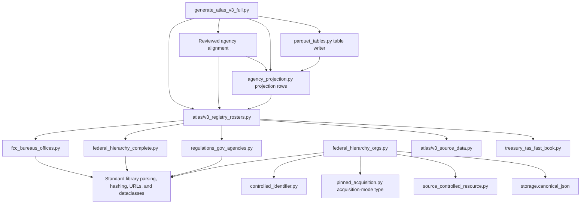
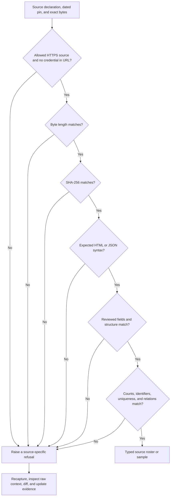
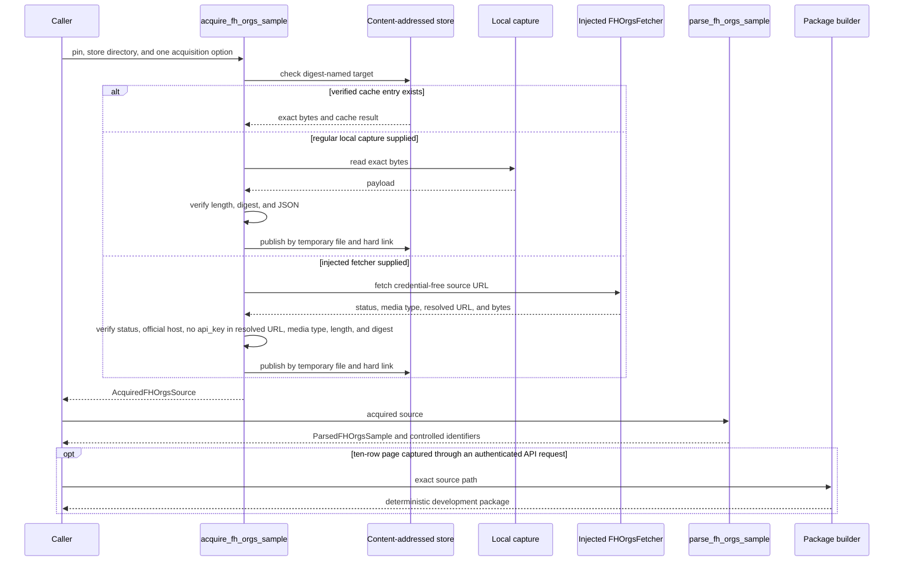
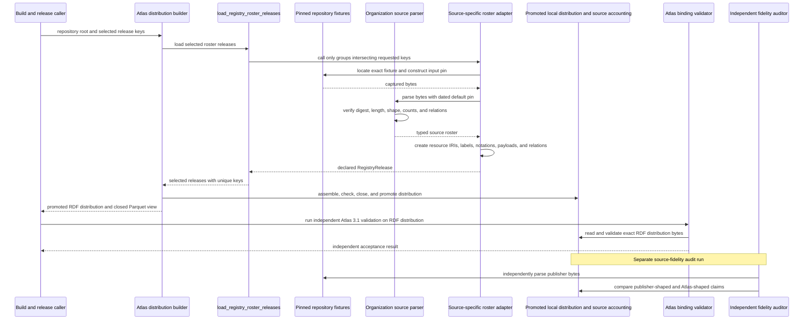
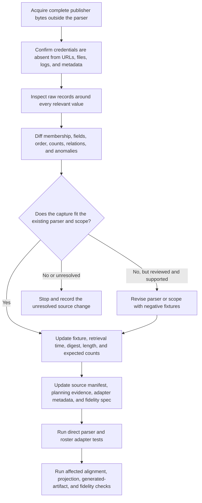

# Registry organization sources

<!-- markdownlint-disable MD013 -->

The `registry_organization_sources` module-tree group contains four independent
readers for publisher-maintained organization rosters. They preserve agency,
department, sub-tier, office, and bureau records from exact source captures so
downstream code can trace each record to its source. They do not treat an
unqualified name or code as authoritative across publishers.

The governing distinction is between a roster that a publisher maintains and
values observed in operational records. These readers use publisher-written
rosters. They do not infer an organization list from a filing sample, promote
organizations into subject concepts, or decide that two publishers describe
the same organization.

This name is a documentation group, not a Python package or aggregate import
API. The implementation remains in four source-specific modules under
[`src/refspec/registry/`](../src/refspec/registry/). Import the module that owns
the source. See [Publisher source portfolio and
adapters](publisher_source_portfolio_and_adapters.md) for the wider registry
inventory and [Registry foundation](registry_foundation.md) for shared source,
identifier, and package behavior.

## At a glance

| Question | Answer |
| --- | --- |
| What goes in? | Exact Federal Communications Commission (FCC) HTML, SAM.gov Federal Hierarchy JSON pages and total-count witnesses, or one regulations.gov JSON response; dated pins containing the source URL, retrieval time, SHA-256 digest, byte length, and source-specific counts; and, for the small Federal Hierarchy sample only, a regular local file or injected fetcher. |
| What happens? | Each reader verifies the exact bytes before parsing, checks a closed publisher-specific shape, preserves source order and relevant raw fields, validates identifiers and parent references, and refuses unreviewed drift. |
| What comes out? | Typed source rosters and lookup helpers; a development-only `SourceControlledResourceBundle` for the small Federal Hierarchy sample; or input to the named Atlas roster adapter, which emits entity-ring `RegistryRelease` values. |
| How do we check it? | Focused parser tests exercise pins, counts, hierarchy rules, credentials, anomalies, mutations, cache behavior, and deterministic packages. Atlas adapter tests check emitted resources and relations, and the independent source-fidelity audit compares built claims with publisher bytes. |

## Place in RefSpec

These readers sit between captured publisher material and Atlas release
construction. Three readers feed the current roster adapter. The fourth,
`federal_hierarchy_orgs.py`, deliberately stops at a small development package
that demonstrates identifier shapes.

```mermaid
flowchart LR
    subgraph PUBLISHERS["Pinned publisher captures"]
        FCCPAGE["FCC Offices and Bureaus HTML"]
        FHAPI["SAM.gov Federal Hierarchy JSON"]
        RGAPI["regulations.gov agencies JSON"]
    end

    subgraph READERS["Source-specific organization readers"]
        FCCREADER["fcc_bureaus_offices.py"]
        FHCOMPLETE["federal_hierarchy_complete.py"]
        FHSAMPLE["federal_hierarchy_orgs.py"]
        RGREADER["regulations_gov_agencies.py"]
    end

    subgraph RESULTS["Checked source results"]
        FCCROSTER["19 FCC units"]
        FHROSTER["907 Federal Hierarchy organizations"]
        FHPACKAGE["Small identifier sample and development package"]
        RGROSTER["331 regulations.gov agencies"]
    end

    ADAPTER["Atlas roster adapter"]
    RELEASES["Entity-ring RegistryRelease values"]
    BUILDER["Atlas distribution builder"]
    DISTRIBUTION["Promoted local Resource Description Framework distribution"]
    PARQUET["Promoted, closed, and re-verified Parquet view"]
    ACCEPT["Independent Atlas 3.1 distribution validation"]
    SEAL["Authorized offline detached seal"]
    VIEWS["Verified DuckDB and explorer access"]
    AUDIT["Independent source-fidelity audit"]

    FCCPAGE --> FCCREADER --> FCCROSTER --> ADAPTER
    FHAPI --> FHCOMPLETE --> FHROSTER --> ADAPTER
    FHAPI --> FHSAMPLE --> FHPACKAGE
    RGAPI --> RGREADER --> RGROSTER --> ADAPTER
    ADAPTER --> RELEASES --> BUILDER
    BUILDER --> DISTRIBUTION
    BUILDER --> PARQUET
    DISTRIBUTION -. "standalone file-consumer check" .-> ACCEPT
    ACCEPT -. "accepted RDF input" .-> SEAL
    PARQUET -. "verified table input" .-> SEAL
    SEAL -. "consumer verifies before access" .-> VIEWS
    PUBLISHERS -. "read again with independent readers" .-> AUDIT
    DISTRIBUTION -. "asserted claims and source paths" .-> AUDIT
```



Solid arrows show current construction through the promoted local Resource
Description Framework (RDF) distribution and the Parquet view that the builder
closes, re-verifies against the distribution manifest, and promotes before it
returns. The standalone Atlas 3.1 validator reads the promoted RDF
distribution, not the Parquet view. Dotted validation, signing, audit, and
access arrows are separate workflow steps; the generator does not perform the
independent file-consumer validation, source-fidelity audit, or offline signing
ceremony. The small-sample package has no arrow to the Atlas roster adapter
because the current Atlas construction loader does not import it. The fidelity
audit remains separate from artifact-internal validation: a valid seal proves
which Atlas bytes passed the binding gates, not that a rolling publisher
endpoint is still current or that every source field was transcribed correctly.
[Source release trust and fidelity
assurance](source_release_trust_and_fidelity_assurance.md) documents those
separate checks.

### Scope and authority

| The readers establish | The readers do not establish |
| --- | --- |
| The input bytes match a reviewed digest and byte length. | The live publisher source still has the same content. |
| Parsed fields match the source shape and invariants encoded for that capture. | Every source field has general meaning outside that publisher's system. |
| A publisher used a name, identifier, parent value, description, or status in the captured record. | Equal names or codes from different publishers identify the same organization. |
| A complete capture agrees with its pinned membership and count checks. | A sample is complete, or a rolling endpoint is complete for all time. |
| A source record can enter an explicit downstream adapter. | The record is admitted to a distribution, accepted, sealed, published, or suitable for a consumer. |

[REF-032](../docs/decisions.md#ref-032-observed-inventories-leave-the-atlas)
sets the roster boundary: publisher-maintained reference data may enter the
Atlas, but a distinct-value scan over operational rows may not. The FCC and
complete Federal Hierarchy readers are documented successors to inventories
removed under that decision.
[REF-033](../docs/decisions.md#ref-033-the-boundary-audits-repair-verdicts-and-the-documented-successors-land)
records the implementation of those two successors.
[REF-038](../docs/decisions.md#ref-038-the-regulationsgov-agency-roster-lands-and-reviewed-identity-claims-govern-the-agency-projection)
governs the regulations.gov roster and the later human-reviewed agency
identity work. [REF-023](../docs/decisions.md#ref-023-supersede-the-compatibility-view--rkaf-ships-on-the-atlas-wire)
and [REF-024](../docs/decisions.md#ref-024-record-the-cross-product-ownership-boundary-once)
govern shared semantics and the product boundary. [REF-048](../docs/decisions.md#ref-048-docspec-owns-the-platform-source-catalog)
supersedes REF-024 only for platform source-catalog ownership. This group does
not restate the remaining rules in a local type system.

The [Atlas 3.1 binding](../bindings/atlas/3.1/README.md), current code, and
[decision ledger](../docs/decisions.md) establish implementation authority.
[Atlas in the United States and
Europe](../ATLAS_US_EU_COMPARISON.md) provides strategic context, not runtime
authority.

## Source inventory

| Source module | Reviewed input | Main result | Completeness boundary | Current downstream path |
| --- | --- | --- | --- | --- |
| [`fcc_bureaus_offices.py`](../src/refspec/registry/fcc_bureaus_offices.py) | One pinned `fcc.gov/offices-bureaus` HTML page. | `FccBureausOfficesRoster` with 12 offices and 7 bureaus. | Exact page, section order, entry counts, names, links, and descriptions from the 2026-08-15 capture. | `v3_registry_rosters.py` emits one 19-resource entity release. |
| [`federal_hierarchy_complete.py`](../src/refspec/registry/federal_hierarchy_complete.py) | Five pinned `/v1/orgs` pages plus two filtered total-count witnesses. | `FederalHierarchyCompleteRoster` with 907 organizations, parent fields, identifier fields, raw records, and anomaly accounting. | Complete for the API response captured on 2026-08-15: 169 departments or independent agencies plus 738 sub-tiers. | `v3_registry_rosters.py` emits the complete entity roster, native parent relations, and a checked join on Treasury's government-wide accounting classification (CGAC). |
| [`federal_hierarchy_orgs.py`](../src/refspec/registry/federal_hierarchy_orgs.py) | A hand-assembled three-row JSON sample or one of two ten-row JSON pages captured through authenticated API requests. | `ParsedFHOrgsSample`, authority-qualified `ControlledIdentifier` values, and an optional development-only `SourceControlledResourceBundle`. | Hard ceiling of 25 records. It demonstrates identifier and hierarchy-field shapes; it is not a bulk roster. | Tests, source inventory, and development packaging only; the current Atlas roster loader does not import it. |
| [`regulations_gov_agencies.py`](../src/refspec/registry/regulations_gov_agencies.py) | One pinned response from the rolling `/v4/agencies` endpoint. | `RegulationsGovAgenciesRoster` with 331 agencies and 160 parent references to 17 distinct parents. | Complete for the exact 2026-08-16 response. The endpoint is absent from the public OpenAPI file, so replacement requires a full recapture and semantic diff. | `v3_registry_rosters.py` emits an entity roster used by reviewed agency alignment and the agency projection. |

The first, second, and fourth modules parse bytes acquired elsewhere. Only the
small Federal Hierarchy module exposes acquisition and package-building APIs.
This difference is intentional; a contributor should not invent one uniform
pipeline merely to match the documentation group.

The pinned Federal Hierarchy OpenAPI YAML files are supporting evidence used by
tests. They document request parameters, including the required API key, but
they are not runtime inputs to the JSON parser or package builder.

## Code structure and dependencies

The FCC, complete Federal Hierarchy, and regulations.gov readers use only the
Python standard library. The small-sample reader also uses shared registry
infrastructure. Atlas construction imports these readers; no reader imports the
Atlas builder.



The fidelity auditor is deliberately absent from this import graph. It reads
pinned captures and the built asserted distribution through separate parsing
logic; it does not import the current Atlas construction readers. A shared
parser defect therefore cannot make production and audit agree automatically.
See [Atlas
source fidelity audit](atlas_source_fidelity_audit.md) for the audit model and
[Atlas registry loading](atlas_registry_loading.md) for `RegistryRelease`
construction.

### Shared dependency roles

| Dependency | Role here | Where to read more |
| --- | --- | --- |
| `ControlledIdentifier` | Gives each identifier value an explicit kind, issuing authority, source URI, observation time, and source digest in the small-sample path. | [Registry foundation](registry_foundation.md) |
| `FetcherAcquisitionMode` | Records whether verified bytes came from the content-addressed cache, a regular local file, or a caller-injected fetcher. This module never opens a network connection itself. | [Registry foundation](registry_foundation.md) |
| `SourceControlledResourceBundle` | Holds exact artifacts, observations, coverage, gaps, and deterministic package identity for the development sample. | [Registry foundation](registry_foundation.md) |
| `RegistryResource`, `RegistryRelation`, and `RegistryRelease` | Carry checked source rows into the Atlas construction path. The four source readers do not define these types. | [Atlas registry loading](atlas_registry_loading.md) |
| Treasury FAST Book reader | Supplies the separately pinned CGAC Agency Identifier side of the complete Federal Hierarchy join. | [Fiscal and spending code sources](registry_code_and_classification_sources_fiscal_and_spending.md) |
| Agency alignment and projection | Apply reviewed cross-publisher identity decisions and build a consumer table without changing the source rosters. | [`v3_registry_alignments_entity.py`](../src/refspec/atlas/v3_registry_alignments_entity.py), [`agency_projection.py`](../src/refspec/atlas/agency_projection.py), and [Atlas distribution projection and access](atlas_distribution_projection_and_access.md) |

Each source section below lists the types and functions that implement that
source. Callers should import only public names from the source-owning module;
names beginning with `_`, such as `_RosterParser`, are implementation details.

## Shared source lifecycle

### Exact bytes come before interpretation

All four readers verify byte length and SHA-256 before parsing content. SHA-256
identifies the exact byte sequence; it does not authenticate the publisher
because these pins are not publisher-signed. Length gives a clearer diagnostic
for truncation or appended bytes. Treat a changed digest as a source-review
trigger; never recompute a pin automatically.



The parser checks more than the digest. Tests can create a new matching pin for
a deliberate mutation and prove that field, count, duplicate, and relationship
checks still refuse the changed structure. This prevents a pin update from
silently bypassing semantic review.

### Source data stays source-specific

The readers retain publisher order through `source_ordinal`; the complete
Federal Hierarchy reader also records `page_index`. Downstream adapters use
the positional fields when a source path depends on row location. The FCC
adapter uses the publisher slug instead. An ordinal locates evidence. It never
becomes organization identity.

Names, slugs, organization IDs, agency codes, CGAC codes, descriptions,
statuses, and parent values keep the meaning assigned by their source. The
readers do not apply fuzzy name matching or cross-publisher normalization.
Cross-source identity belongs to separately reviewed mapping evidence.

The roster dataclasses are frozen and slotted, and record collections use
tuples. The complete Federal Hierarchy and regulations.gov records also retain
`raw` JSON mappings. Those nested dictionaries are ordinary parsed JSON until
the Atlas adapter converts them to deeply frozen native payloads; callers
should not describe the raw mappings as deeply immutable.

### Capture scope stays explicit

| Path | Scope rule |
| --- | --- |
| FCC roster | Exactly two publisher-titled sections in reviewed order, with 12 offices and 7 bureaus. |
| Complete Federal Hierarchy | Exactly five pages totaling 907 unique records, checked against two separately pinned filtered responses from the same API. |
| Small Federal Hierarchy sample | At most 25 returned rows. `FHOrgsSampleSource` also refuses expected counts above 25; the parser repeats the ceiling independently so a mismatched payload cannot bypass it. The package records known gaps. |
| regulations.gov | Exactly 331 records, 160 parent values, and 17 distinct parents for the reviewed capture. A future capture must be compared in full before replacing it. |

An exact capture can be complete for its source response and still become stale
the next day. The SAM.gov and regulations.gov endpoints are rolling and
unversioned. Their release metadata states that limit.

### Credentials stop at acquisition

Both Federal Hierarchy APIs and regulations.gov require project-owned API
keys. Keys belong in the acquisition transport, not in source URLs, response
bytes, pins, fixtures, exceptions, or release metadata.

The complete Federal Hierarchy and regulations.gov modules only parse already
captured bytes. The small Federal Hierarchy fetcher receives a credential-free
URL; its implementation may add a key to the request, but the returned
`resolved_url` must stay on `https://api.sam.gov`, omit user information, and
contain no `api_key` query parameter. The regulations.gov capture records the
environment-variable and request-header names, never the secret value.

Importing any organization source module performs no network access.

## FCC Offices and Bureaus

[`fcc_bureaus_offices.py`](../src/refspec/registry/fcc_bureaus_offices.py)
replaces a five-value bureau inventory observed in one FCC Electronic Comment
Filing System response with the roster the Federal Communications Commission
publishes on its Offices and Bureaus page.

### FCC components

| Component | Role |
| --- | --- |
| `FccPagePin` | Requires an official `https://www.fcc.gov/` URL, canonical lowercase `sha256:<64 hex>`, a positive byte length, and a retrieval time. |
| `FCC_OFFICES_BUREAUS_2026_08_15` | Pins the 51,748-byte reviewed page captured on 2026-08-15. |
| `_RosterParser` | Internal `HTMLParser` state machine that recognizes FCC card headers, card bodies, linked `h3` headings, and description paragraphs. |
| `FccOrganizationalUnit` | Holds `kind`, name, slug, relative and absolute page URLs, description, and one-based source order. |
| `FccBureausOfficesRoster` | Holds the ordered units, office and bureau counts, source identity, retrieval time, and a `by_slug()` index helper. |
| `parse_fcc_bureaus_offices()` | Verifies the pin, runs the internal parser, checks structure and uniqueness, and returns the roster. |

### Parsing rules

The parser expects `Offices` followed by `Bureaus`, with 12 and 7 entries. An
entry must have a nonempty heading, a nonempty description, and a relative path
matching `/[a-z0-9-]+`. Slugs and names must be unique across the page.

`HTMLParser(convert_charrefs=True)` decodes HTML character references, and
`_normalized()` collapses whitespace. The result preserves the publisher's
words after entity decoding and whitespace normalization; it does not preserve
the page's raw rendering verbatim. The exact HTML remains available through
the pinned source fixture.

The current test also proves that the published roster omits the abolished
Common Carrier Bureau and retains its successor, the Wireline Competition
Bureau. That check explains why the publisher roster replaced the observed
ECFS values; it is not a general lifecycle inference rule.

### FCC Atlas adaptation

The current adapter creates one entity resource per slug under
`urn:ref:fcc-organizational-unit:<slug>`. The heading supplies the preferred
label, the paragraph supplies the definition, and the slug supplies the
notation. `office` or `bureau` stays in the native payload; it is not mapped to
the lifecycle `status` field.

## Complete SAM.gov Federal Hierarchy roster

[`federal_hierarchy_complete.py`](../src/refspec/registry/federal_hierarchy_complete.py)
reads every organization returned by the public `/v1/orgs` endpoint in the
reviewed capture. It exists separately from the small sample because live data
contains publisher anomalies that a shape-demonstration sample intentionally
refuses.

### Page set and witnesses

| Input | Expected rows | Expected total | Purpose |
| --- | ---: | ---: | --- |
| Offsets 0, 200, 400, and 600 | 200 each | 907 | Full roster pages. |
| Offset 800 | 107 | 907 | Final full roster page. |
| `fhorgtype=Department/Ind. Agency`, limit 1 | 1 | 169 | Publisher total witness for departments and independent agencies. |
| `fhorgtype=Sub-Tier`, limit 1 | 1 | 738 | Publisher total witness for sub-tiers. |

The two levels partition the 907 total records: 169 plus 738. The number 907
is not a count of departments alone.

### Components and record checks

| Component | Role |
| --- | --- |
| `FHCompletePagePin` | Restricts captures to HTTPS `api.sam.gov`, excludes credentials and `api_key`, and pins byte identity, returned rows, and reported total. |
| `FHCompleteOrgRecord` | Retains organization identity, name, type, status, department parent, agency and CGAC codes, optional legacy code, optional full parent path, source location, anomaly counts, and the raw record. |
| `FederalHierarchyCompleteRoster` | Holds all records, publisher totals, calculated level counts, witness totals, anomaly reports, and a `by_org_id()` helper. |
| `parse_complete_roster()` | Verifies the exact page set, parses every record, closes roster identity and parent references, compares witness totals, and reports anomalies. |

Each response must contain only `totalrecords` and `orglist`. Each record must
contain the required field set and may contain only the documented optional
fields. The reader validates organization ID shapes, closed type and status
values, FPDS-style codes, CGAC codes, name history, optional parent history,
and a nonempty link set containing `self`.

Department or independent-agency records must name themselves in
`fhdeptindagencyorgid`. A sub-tier's parent ID must exist somewhere in the
roster. The current fixture and test also show that every such parent is a
department or independent agency, but the parser currently enforces existence,
not that stronger parent-type rule. Add a negative parser test before relying
on the stronger rule as a source invariant.

### Preserved publisher anomalies

The full roster records anomalous source values instead of repairing them:

- one Department of Defense row carries five CGAC codes, although the
  publisher documents single-CGAC support;
- three records carry a `{"cgac": null}` item;
- the publisher-named `Testing DEPT` record has an empty `agencycode`; and
- eleven records have no `fhorgparenthistory` and therefore no full parent
  path in this capture.

The `anomalies` mapping records the affected organization IDs and names. A
maintainer can distinguish expected publisher data from a new structural
change without hiding either.

### Atlas adaptation and the Treasury join

The adapter emits 907 entity resources and 738 source-native
`atlas:parentEntity` relations. It uses `fhorgid` as the resource notation.
The API's Federal Procurement Data System (FPDS) codes, CGAC codes, and legacy
office codes remain verbatim in the native payload because those issuing
authorities are not declared as identifier schemes for this resource.

The adapter, not this source reader, also reads the separately pinned Treasury
FAST Book. It groups accounts by CGAC Agency Identifier and emits 85,462
`atlas:relatedEntity` relations for organization-account pairs that share a
publisher-reported CGAC value. Relation metadata states that sharing a CGAC
code does not establish organizational identity or administrative control.
See [Fiscal and spending code
sources](registry_code_and_classification_sources_fiscal_and_spending.md) for
the Treasury side of the join.

## Small Federal Hierarchy identifier sample

[`federal_hierarchy_orgs.py`](../src/refspec/registry/federal_hierarchy_orgs.py)
is an acquisition, identifier-shape, and development-package path. It cannot
replace the complete reader: the parser enforces a 25-record maximum and
deliberately rejects shapes that occur in the full live roster.

### Acquisition components

| Component | Role |
| --- | --- |
| `FHOrgsSampleSource` | Declares a credential-free HTTPS URL, one safe filename, and an expected row count no greater than 25. |
| `FHOrgsSnapshotPin` | Adds retrieval time, API version, digest, byte length, and optional publisher release. |
| `FHOrgsFetcher` | Provider-neutral protocol for fetching exact bytes outside the module. |
| `FetchedFHOrgsResponse` | Returns body bytes, status, content type, and resolved URL from the injected fetcher. |
| `AcquiredFHOrgsSource` | Records the verified content-addressed path, source identity, media type, mode, cache status, and local-source provenance. |
| `acquire_fh_orgs_sample()` | Selects cache, local file, or injected fetcher; verifies bytes; and publishes one digest-named object without overwriting an existing object. |



A cache hit is not trusted by location alone. The reader rejects symlinks,
rereads the file, and rechecks length, digest, and JSON. Local publication
writes and flushes a temporary file, then uses a hard link so an existing
digest-named object is never overwritten.

### Parse and identifier rules

`parse_fh_orgs_sample()` accepts only the exact `totalrecords` and `orglist`
top-level fields and no more than 25 rows. A record must use the reviewed field
set, a supported type and status, a nonempty agency code, and zero or one CGAC
entry whose value is a three-digit string; a single `{"cgac": null}` entry is
refused. The parser checks every name-history entry. Parent history must be
nonempty, but the parser currently validates and uses only its first entry;
later entries are not inspected. The link set must contain `self`.

The parser emits these authority-qualified identifier kinds:

| Kind | Issuing authority recorded by the sample path | Source field |
| --- | --- | --- |
| `fhOrgId` | SAM.gov Federal Hierarchy | `fhorgid` |
| `fhFullParentPathId` | SAM.gov Federal Hierarchy | `fhorgparenthistory[0].fhfullparentpathid` |
| `fpdsAgencyCode` | Federal Procurement Data System | `agencycode` |
| `oldFpdsOfficeCode` | Federal Procurement Data System | `oldfpdsofficecode` when present |
| `cgacCode` | U.S. Treasury | `cgaclist[0].cgac` when present |

`ParsedFHOrgsSample.by_org_id()` builds a new unique-ID index.
`hierarchy_levels()` returns observed levels in the fixed department-then-sub-tier
order. `children_of()` scans for rows whose `parent_fhorgid` matches the
requested ID; it does not require that the parent row itself be present in the
sample.

### Development package boundary

`build_federal_hierarchy_orgs_package()` accepts a regular source file only
when its digest and length match one of the two ten-row pages captured through
authenticated API requests. It rejects the hand-assembled three-row fixture.
The builder produces a `controlledCodeList` package with identity status
`publisherIdentifiersPreserved`, the sole declared use `deterministicMetadata`,
exact source artifacts, and the module's known gaps. Every observation sets
`conceptIdentityClaimed` to `False`.

The module derives each deterministic observation ID from
`FH_ORGS_RESOURCE_ID`, the source artifact, source path, and
authority-qualified identifiers. Shared infrastructure validates that IDs are
absolute and unique, and owns manifest identity, coverage accounting, artifact
digests, and round-trip rules. See [Registry foundation](registry_foundation.md)
instead of duplicating that format here.

The package declares four known gaps: it contains sample pages only; the
default API view exposes only the department or independent-agency and sub-tier
levels; move and merge history is largely unavailable; and the publisher
documents single-CGAC support for this API version.

Current-code caveat: the `samplePagesOnly` gap text incorrectly describes 907
as the department or independent-agency count. The reviewed complete capture
establishes 907 total organizations: 169 departments or independent agencies
and 738 sub-tiers. Do not treat that packaged sentence as authoritative until
the source metadata is corrected.

The small reader is stricter than the complete reader by design:

| Small sample | Complete roster |
| --- | --- |
| Refuses more than 25 rows. | The dated default capture has 907 rows across five pages. With custom pins, the parser accepts a different page set but requires one payload per pin, aggregate membership equal to the first page's reported total, and witness totals equal to calculated level counts. |
| Refuses more than one CGAC entry. | Preserves multiple and null CGAC entries as publisher anomalies. |
| Requires a nonempty agency code. | Preserves the one empty publisher value. |
| Requires parent history. | Allows its absence and reports affected records. |
| Builds authority-qualified identifiers in a development package. | Current Atlas adaptation carries `fhorgid` as notation and other codes in native data. |

## regulations.gov agencies

[`regulations_gov_agencies.py`](../src/refspec/registry/regulations_gov_agencies.py)
reads the agency acronyms that regulations.gov uses as docket-ID prefixes,
together with publisher names, participation fields, posting guidance, and
parent acronyms.

### regulations.gov components

| Component | Role |
| --- | --- |
| `RegulationsGovAgenciesSnapshotPin` | Restricts the pin to the exact HTTPS `/v4/agencies` endpoint with no query or fragment, validates canonical digest syntax and positive length and count values, and requires `retrieved_at` to end in `Z` without parsing it. |
| `RegulationsGovAgencyRecord` | Retains agency ID, parent, participation flags, posting guidance, name, type, self link, source order, and the full raw record. |
| `RegulationsGovAgenciesRoster` | Holds all records, parent counts, source identity, and a `by_id()` helper. |
| `verify_payload()` | Checks byte length and digest without parsing. |
| `parse_regulations_gov_agencies()` | Verifies bytes, rejects duplicate JSON keys, checks the exact response shape, closes parent references, and returns the roster. |

### Closed response shape

The response must contain only `data` and exactly 331 records. Each record must
contain only `id`, `type`, `attributes`, and `links`; the attribute and link
objects also use exact field sets. Agency IDs must match the reviewed uppercase
docket-prefix shape. `type` must remain `agencies`, `agencyType` must remain
`Federal`, and `participate` and `partner` must remain Boolean.

Every self link must equal the official endpoint plus the agency ID. Agency IDs
must be unique, and every non-null parent must resolve inside the same roster.
The parser then checks the captured census of 160 parent relations and 17
distinct parents. Unlike the two Federal Hierarchy JSON readers, this module
also rejects duplicate JSON object keys explicitly.

### Endpoint caveat and replacement rule

The publisher operates this endpoint, but the public regulations.gov OpenAPI
document does not describe it. The module defines a rolling-source note. The
current Atlas release copies that note into `sourceCaptures` and copies the
`REGULATIONS_GOV_RECAPTURE_OBLIGATION` text into release metadata.

Before replacing the capture, a maintainer must recapture the complete response
with a project-owned key and compare membership, every reviewed field, and
every parent relation. Matching only the count or a sample of records is
insufficient.

### regulations.gov Atlas adaptation

The adapter emits 331 entity resources and 160 `atlas:parentEntity` relations.
The agency ID becomes a notation and remains the docket-ID prefix in native
data; it does not become an authority-scoped Atlas identifier row.

The roster later participates in a separately reviewed agency identity mapping
and deterministic agency projection. The projection does not perform fuzzy
matching or invent identity. Follow
[`v3_registry_alignments_entity.py`](../src/refspec/atlas/v3_registry_alignments_entity.py),
[`agency_projection.py`](../src/refspec/atlas/agency_projection.py), and [Atlas
distribution projection and access](atlas_distribution_projection_and_access.md)
for those later stages.

## Downstream component interaction

The current Atlas adapter,
[`v3_registry_rosters.py`](../src/refspec/atlas/v3_registry_rosters.py), imports
the three complete roster readers directly. It locates repository fixtures,
creates `RegistryInputPin` values, calls each public parser, and converts typed
rows to registry resources and relations.



The loader rejects unknown requested release keys, skips nonintersecting source
groups, and checks that no two loaded releases share a key. [Atlas registry
loading](atlas_registry_loading.md) documents the common loader and release
types; [Atlas distribution builder](atlas_distribution_builder.md) documents
candidate assembly and the refusal gates.

### Current emitted releases

| Source | Release key | Resources | Native relations | Additional adapter relations |
| --- | --- | ---: | ---: | ---: |
| FCC Offices and Bureaus | `fcc-bureaus-offices-roster-2026-08-15` | 19 | 0 | 0 |
| Complete Federal Hierarchy | `federal-hierarchy-orgs-complete-2026-08-15` | 907 | 738 parent relations | 85,462 Treasury-account `relatedEntity` relations |
| regulations.gov agencies | `regulations-gov-agencies-roster-2026-08-16` | 331 | 160 parent relations | 0 |

All three releases use the `codeScheme` profile on the `entity` ring. The
profile provides a registry release shape; it does not turn organization
resources into subject concepts.

These are current construction values in an unpublished editor's draft. They
do not claim a published release. The complete Federal Hierarchy adapter has
eight inputs because the five roster pages and two total witnesses are joined
with the separately pinned Treasury workbook.

### Planning, fidelity, and serving use different evidence

The [Atlas planning index](atlas_planning_index.md) classifies source modules,
intended uses, and readiness evidence. It does not authorize release loading.
The roster adapter loads explicit release keys and the full builder reconciles
them with the planning and descriptor artifacts.

In the current planning index, all four organization-source rows remain
`planned` with `release: null`. Builder-integrated `RegistryRelease` values
therefore do not establish a portable published release.

The independent fidelity auditor has separate specifications for the FCC,
complete Federal Hierarchy, and regulations.gov releases. It reads exact
source artifacts and compares claims in both directions. A digest check alone
does not replace that semantic comparison.

The agency projection consumes five agency-roster releases and reviewed
identity evidence. Of this page's sources, it consumes the complete Federal
Hierarchy and regulations.gov releases; it does not consume the FCC offices
and bureaus roster or the small Federal Hierarchy package. Projection rows
enter the closed Parquet view that is promoted alongside the local
distribution; later independent distribution validation and offline sealing
gate consumer access. See [Atlas distribution projection and
access](atlas_distribution_projection_and_access.md).

## Failure model

The readers fail closed. Callers should treat a refusal as a request for source
review, not retry with relaxed validation.

| Boundary | Primary errors | Representative refusals | Maintainer response |
| --- | --- | --- | --- |
| Pin declaration | Module base error | Wrong host or path, credentials in a URL, malformed digest, empty retrieval time, nonpositive length, impossible page count, or sample count above 25. | Correct the declaration; never weaken URL or credential checks to admit a capture. |
| Acquisition | `FederalHierarchyAcquisitionError` | Both local path and fetcher supplied, no source on a cache miss, symlink or non-file input, non-200 result, wrong resolved host, `api_key` retained in the resolved URL, or non-JSON media type. | Fix the caller or transport, then reacquire exact bytes. |
| Exact bytes | Source drift error | Length or SHA-256 differs from the dated pin; cached bytes no longer verify. | Quarantine the new bytes, recapture if necessary, and perform a semantic diff before changing the pin. |
| Syntax and top-level shape | Source drift error; malformed FCC UTF-8 may surface as `UnicodeDecodeError` after a matching custom pin | Invalid JSON, unexpected top-level fields, duplicate JSON keys in regulations.gov, or missing FCC card structure. | Inspect the raw source around the failure and add a negative fixture for the reviewed change. |
| Record shape | Source drift error | Added or missing fields, malformed code or ID, unknown type or status, bad self link, missing description, or unsupported parent-history action. | Decide whether the publisher changed its model or the capture is corrupt; update code and evidence together only after review. |
| Membership and graph closure | Source drift error | Wrong section or record count, duplicate identity, absent parent, departments that do not self-parent, mismatched witness total, or changed parent census. | Diff the full roster and its relations. Never accept a partial page as a complete roster. |
| Deliberate sample ceiling | `FederalHierarchyBulkCaptureRefusedError` | More than 25 sample records, regardless of a custom pin. | Use `federal_hierarchy_complete.py` for the bulk roster. Do not raise the ceiling to route around the separation. |
| Package integrity | `SourceControlledResourceError` from shared infrastructure | Stale manifest identity, mismatched source artifacts, incomplete coverage, duplicate observation identity, or a concept-identity claim. | Fix the observation or package inputs through the shared builder; do not hand-edit derived package fields. |
| Atlas adaptation | `ValueError` and common loader refusals | Unknown release key, duplicate release key, changed relation census, unknown identifier authority, or planning and descriptor disagreement. | Review the source and adapter together, then regenerate dependent proofs in order. |

All module-specific public errors derive from `ValueError`. Catch the narrowest
error needed when a caller can add useful context; otherwise let the refusal
stop the build with its source-specific message.

## Scaling and operational behavior

The source parsers are linear in the bytes and nested values they inspect. They
do not compare every organization with every other organization.

| Path | Time and memory behavior |
| --- | --- |
| FCC parse | One HTML pass plus linear uniqueness and count checks over 19 entries; memory grows with captured text and units. |
| Complete Federal Hierarchy parse | One JSON parse per page, then linear identity, parent, count, and anomaly passes over 907 records and their nested fields. The ID index makes parent closure linear rather than quadratic. |
| Small Federal Hierarchy parse | Linear in the source and returned rows, with a hard 25-row ceiling. Each `by_org_id()` call builds a fresh dictionary, and each `children_of()` call scans the sample. |
| regulations.gov parse | One JSON parse plus linear record, uniqueness, parent, and census checks over 331 rows. |
| Federal Hierarchy and Treasury adaptation | Builds accounts grouped by CGAC, then emits only matching organization-account pairs. Cost is linear in input rows plus emitted relations, but a large shared-code bucket can produce many outputs; the reviewed output is pinned at 85,462 relations. |

Profile a refresh if it runs materially longer than these bounded scans suggest.
For the Treasury join, measure grouping and relation emission before changing
the algorithm; the number of emitted rows is itself a material cost.

## Developer workflow

### Choose the correct source path

Before adding a reader, answer these questions:

1. Did the publisher maintain and name the roster, or did someone collect
   distinct values from operational rows? Only the first belongs here.
2. Does the source identify organizations, document a code list, or classify
   subjects? Route codes to [Registry code and classification
   sources](registry_code_and_classification_sources.md) and subject terms to
   [Registry vocabulary sources](registry_vocabulary_sources.md).
3. Is the input a complete roster or a bounded shape sample? Name that scope in
   the source type, parser, result, tests, and downstream metadata.
4. Who issues each identifier? Preserve the publisher value, but do not mint an
   authority-qualified identifier under the wrong scheme.
5. Which validator or consumer needs a new field or abstraction? Add structure
   only with the check that fails when it is violated, including a negative
   fixture.

### Refresh an existing capture



For HTML, inspect the raw source around the card headings, links, and
descriptions; render it when visual layout determines meaning. For JSON, read
whole records around changed fields rather than validating a grep result. The
raw-source rule and the independent-oracle rule are in
[`AGENTS.md`](../AGENTS.md).

Update these items as one reviewed change when they apply:

- exact fixture bytes and dated pin;
- source-manifest digest, length, acquisition mode, and provenance;
- parser fields, counts, relationship rules, anomaly reports, and negative
  mutations;
- portfolio index evidence and generated registry descriptors;
- Atlas adapter release metadata and fixed output counts;
- independent source-fidelity selectors and expected claim coverage;
- agency identity review and projection fixtures if organization membership,
  identifiers, names, or parents changed; and
- this page's dated counts and caveats.

The regulations.gov refresh must follow its full recapture-and-diff obligation.
Do not update only its digest and record count.

### Change a parser

Keep the reader source-specific and fail closed on fields that carry meaning.
Preserve raw values and source paths before adding normalized accessors. If a
publisher anomaly is real, decide explicitly whether the source path should
retain and report it, as the complete Federal Hierarchy reader does, or refuse
it because it violates a bounded sample's purpose.

When replacing a running check, copy the previous implementation into the test
as an independent oracle. Prove verdict agreement on real captures and on a
mutation battery before deleting the production path. Freeze deliberate
differences so a new divergence fails the suite.

### Add another organization source

1. Add one source-specific module rather than an aggregate organization
   package.
2. Define a safe source declaration and immutable dated pin. Keep credentials
   out of the declaration.
3. Reuse shared acquisition and package infrastructure where its behavior
   matches the source. Keep provider-specific HTTP behind an injected fetcher.
4. Return typed rows with publisher identity, labels, raw fields, source order,
   and explicit gaps or anomalies.
5. Test exact real bytes, boundary records, duplicates, unknown fields,
   malformed identifiers, parent closure, credential leakage, and the intended
   completeness rule.
6. Add an explicit Atlas adapter only when the source has a supported entity
   use. Do not make parser success authorize release admission.
7. Add an independent fidelity reader and mutations for every claim family the
   release emits.
8. Classify the source in the planning index, regenerate dependent artifacts,
   and run the full repository checks before publication work.

## Focused verification

Run the direct source tests and current roster-adapter checks together:

```sh
uv run pytest -q \
  tests/test_fcc_bureaus_offices.py \
  tests/test_federal_hierarchy_complete.py \
  tests/test_federal_hierarchy_orgs.py \
  tests/test_regulations_gov_agencies.py \
  tests/test_atlas_v3_registry_rosters.py
```

When organization identifiers or parents change, also run the reviewed
alignment and projection layers:

```sh
uv run pytest -q \
  tests/test_atlas_v3_registry_alignments_entity.py \
  tests/test_agency_projection.py \
  tests/test_atlas_parquet_view.py
```

Use the repository's generated-artifact and full-suite targets before treating
a source update as complete. For a built distribution, run the separate
source-fidelity audit as described in the [repository
README](../README.md#what-the-seal-does-and-does-not-prove).

### Current checkout verification

On 2026-09-01, the first focused command above completed with 62 passing tests.
It emitted three existing `rdflib` deprecation warnings from the roster
adapter's identifier-authority test. This is local test evidence only; it does
not prove live-source currency, a full distribution build, acceptance, seal,
publication, deployment, or consumer behavior.

## Related documentation

The flat wiki is built incrementally. Links to companion module pages resolve
when those pages are generated in this directory.

- [Repository overview and document index](../README.md)
- [Publisher source portfolio and adapters](publisher_source_portfolio_and_adapters.md)
- [Atlas planning index](atlas_planning_index.md)
- [Registry foundation](registry_foundation.md)
- [Registry vocabulary sources](registry_vocabulary_sources.md)
- [Registry code and classification sources](registry_code_and_classification_sources.md)
- [Institutional, geographic, and filing classification sources](registry_code_and_classification_sources_institutional_geographic_and_filing.md) for the observed FCC ECFS values that the official roster supersedes
- [Procurement, assistance, and workforce code sources](registry_code_and_classification_sources_procurement_assistance_and_workforce.md) for the OPM agency and subelement roster
- [Fiscal and spending code sources](registry_code_and_classification_sources_fiscal_and_spending.md) for the Treasury side of the CGAC join
- [Atlas registry loading](atlas_registry_loading.md)
- [Atlas source fidelity audit](atlas_source_fidelity_audit.md)
- [Atlas distribution builder](atlas_distribution_builder.md)
- [Atlas distribution projection and access](atlas_distribution_projection_and_access.md)
- [Atlas 3.1 binding](../bindings/atlas/3.1/README.md)
- [Decision ledger](../docs/decisions.md), especially REF-032, REF-033, REF-038, and REF-048
- [RefSpec agent guidance](../AGENTS.md)
