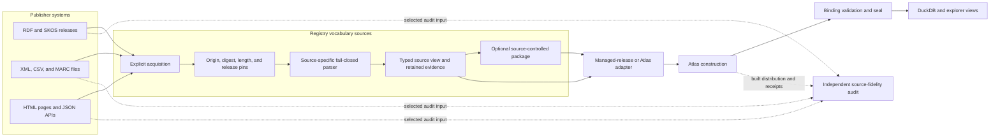
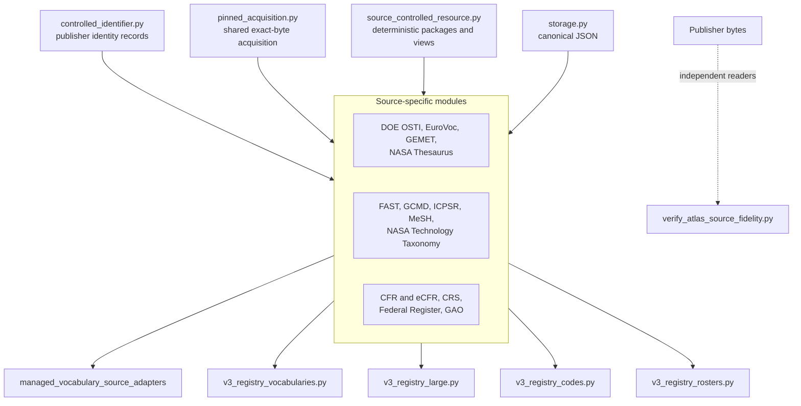
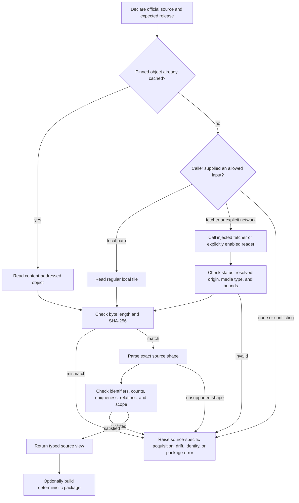
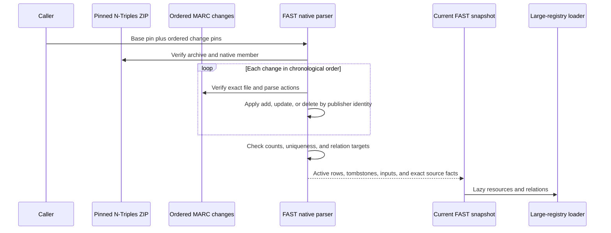
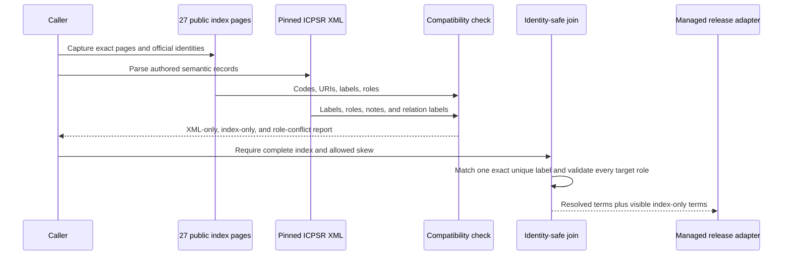
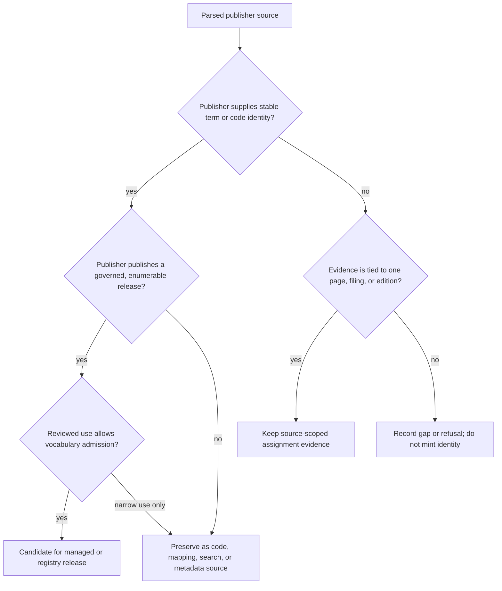

# Registry vocabulary sources

The `registry_vocabulary_sources` logical module reads publisher vocabulary,
taxonomy, roster, and topic-assignment sources without changing what those
sources claim. It verifies exact source bytes, parses each publisher's native
shape, preserves publisher identifiers when they exist, and makes uncertainty
or unsupported promotion visible. These readers supply evidence to later
RefSpec stages; they do not decide by themselves that a source is authoritative
for Atlas output.

This is a module-tree group, not a Python package or a single
`registry_vocabulary_sources.py` file. Its implementation spans thirteen
source-specific modules under [`src/refspec/registry/`](../src/refspec/registry/).
Shared acquisition and package rules belong to [Registry
foundation](registry_foundation.md). Managed release membership belongs to
[Managed release validation](managed_release_validation.md), and downstream
Atlas conversion belongs to [Atlas registry loading](atlas_registry_loading.md).

The group contains several kinds of source. DOE OSTI, EuroVoc, GEMET, and the
NASA Thesaurus are native vocabulary exports. FAST, GCMD, MeSH, and the NASA
Technology Taxonomy have narrower mapping, search, or metadata uses. CFR,
eCFR, Federal Register, GAO, and CRS sources publish lists or assignments with
different scopes. ICPSR combines two publications from the same publisher to
bind stable identities to authored thesaurus relationships. Calling all of
these sources “governed vocabularies” would erase those differences.

## At a glance

| Question | Answer |
| --- | --- |
| What goes in? | Exact publisher bytes from RDF, XML, CSV, JSON, HTML, ZIP, GZIP, or MARC change files; source and snapshot declarations; and, where needed, an injected fetcher or an explicitly enabled network reader. |
| What happens? | Each reader applies the checks its source supports. Across the group these include origin, byte length, SHA-256 digest, media type, source shape, identifiers, counts, and source-specific invariants. The reader then creates deterministic typed records without inventing concepts or relationships. |
| What comes out? | A parsed source view, assignment evidence, a source-controlled package, or an input that a downstream Atlas or managed-release adapter can normalize. The exact result depends on the publisher's authority and the declared use. |
| How do we check it? | Source-focused tests exercise clean fixtures, malformed and drifted fixtures, duplicate and identity failures, deterministic rebuilds, large-file streaming, and downstream loader integration. For sources registered in a given build, the independent source-fidelity audit compares selected publisher bytes with that built distribution and its receipts. |

## Place in RefSpec

These modules sit on the source-reading side of RefSpec's **Build** function.
They turn reviewed publisher artifacts into source-faithful records. Later
components decide which records enter an immutable release, build Atlas, run
the binding validator, seal the result, and expose read-only views.



The [Atlas 3.1 binding](../bindings/atlas/3.1/README.md) defines the Atlas
distribution's release, resource, source-record, assertion, evidence, and
acceptance rules.
It also separates an asserted graph from generated serving tables and a
separately admitted derived graph. These source readers do not move inferred
relationships into the asserted graph. See [REF-023](../docs/decisions.md#ref-023-supersede-the-compatibility-view--rkaf-ships-on-the-atlas-wire)
for semantic ownership and [REF-024](../docs/decisions.md#ref-024-record-the-cross-product-ownership-boundary-once)
for cross-product ownership and artifact exchange. This page does not restate
either decision's ownership table.

### Scope and authority

| Result | What it establishes | What it does not establish |
| --- | --- | --- |
| A valid source or snapshot declaration | The expected official URL, release metadata, file name, digest, byte length, and sometimes expected record counts have a reviewed representation. | That a live endpoint still serves those bytes, that the capture is complete, or that the source is licensed for every use. |
| A successful acquisition | The stored object came from a permitted local or fetched path and matches its exact pin. | That its contents form a governed vocabulary or should enter Atlas. |
| A parsed source view | The bytes match the parser's supported shape and can be represented without guessing. | Managed-release membership, cross-source equivalence, or accepted-output authority. |
| A preserved publisher identifier | The publisher supplied that UUID, IRI, code, slug, term number, or `DescriptorUI`. | A RefSpec claim that the record is a general-subject concept or is suitable for output. |
| A source-controlled package | The retained artifacts and observations form a deterministic closed set with declared uses and gaps. | A managed release, an Atlas release, or permission to broaden the declared uses. |
| A normalized `RegistryRelease` | A downstream loader translated a source view into the Atlas registry input model. | Publisher-source completeness or source-fidelity proof. |
| A sealed Atlas distribution | The built files satisfy the binding and acceptance checks for that exact build. | Complete capture of every publisher source or independent proof that every source fact was translated correctly. |

The [publisher-source portfolio](publisher_source_portfolio_and_adapters.md)
owns the wider source inventory and placement discussion. The [planning
index](atlas_planning_index.md) records non-authorizing placement. Source
selection and public-delivery claims must follow the current binding, code,
and decision ledger; [Atlas in the United States and
Europe](../ATLAS_US_EU_COMPARISON.md) is strategic context, not implementation
authority.

## Code structure and dependencies

The source modules depend on small shared services, then feed several
different downstream readers. A caller should import the specific source
module it needs. The logical group has no aggregate runtime API.



[`controlled_identifier.py`](../src/refspec/registry/infrastructure/controlled_identifier.py),
[`pinned_acquisition.py`](../src/refspec/registry/infrastructure/pinned_acquisition.py),
and [`source_controlled_resource.py`](../src/refspec/registry/infrastructure/source_controlled_resource.py)
are documented in [Registry foundation](registry_foundation.md). The bridge,
ELSST acquisition, ICPSR Zyte transport, and coverage readers are documented
in [Managed vocabulary source adapters](managed_vocabulary_source_adapters.md).

### Source file responsibilities

| Source module | Main components | Responsibility and output |
| --- | --- | --- |
| [`cfr_list_of_subjects.py`](../src/refspec/registry/cfr_list_of_subjects.py) | `CfrSubjectIndexPin`, `EcfrAgenciesSnapshotPin` | Verifies and parses the Office of the Federal Register's per-part subject index, the separate eCFR agency roster, and document-scoped Federal Register topic evidence. |
| [`crs_product_topics.py`](../src/refspec/registry/crs_product_topics.py) | `CRSProductsPageSource`, `CRSProductsPageSnapshotPin`, `CRSProductsPageFetcher`, `FetchedCRSProductsPage`, `_ProductsPageParser` | Captures CRS product genres and the publisher's explanation of product topics; preserves per-edition topic labels as evidence and refuses a managed thesaurus claim. |
| [`doe_osti_thesaurus.py`](../src/refspec/registry/doe_osti_thesaurus.py) | `DoeOstiThesaurusRelease`, `DoeOstiThesaurusFetcher`, `DoeOstiVerificationGap` | Reads the pinned 2020 DOE OSTI RDF/SKOS export, preserves publisher IRIs and relations, and carries unresolved staleness, licensing, and source-shape gaps. |
| [`eurovoc_thesaurus.py`](../src/refspec/registry/eurovoc_thesaurus.py) | `EuroVocReleaseSource`, `EuroVocMetadataSource` | Acquires the exact EuroVoc archive and optional metadata file, selects the pinned RDF member, and preserves concepts, domains, microthesauri, labels, status, and direct relations. |
| [`fast_topical.py`](../src/refspec/registry/fast_topical.py) | `FASTNativeSourcePin`, `FASTTopicalExtractPin` | Rebuilds the current FAST Topical state from a pinned native base plus ordered MARC change files; keeps a compatibility CSV path and packages mapping/search evidence. |
| [`federal_register_native_controls.py`](../src/refspec/registry/federal_register_native_controls.py) | `FRSnapshotPin` | Parses documented Federal Register document types, presidential subtypes, and the publisher's agency roster, including parent relationships and cross-checks between official endpoints. |
| [`gao_published_topics.py`](../src/refspec/registry/gao_published_topics.py) | `GaoPagePin`, `_TopicsParser` | Parses the exact rows shown on GAO's public topics browse page and preserves its publisher slugs, term IDs, names, and descriptions. The pin covers the listing, not every live GAO topic. |
| [`gcmd_science_keywords.py`](../src/refspec/registry/gcmd_science_keywords.py) | `GCMDSnapshotPin`, `GCMDFetcher`, `FetchedGCMDResponse`, `GCMDScienceKeywordsSource` | Verifies and parses a versioned GCMD Science Keywords CSV release and packages publisher UUIDs and columns for mapping and deterministic metadata. |
| [`gemet_thesaurus.py`](../src/refspec/registry/gemet_thesaurus.py) | `GemetReleaseSource` | Verifies compressed and decompressed GEMET bytes, parses RDF/XML, and keeps vocabulary concepts separate from `Group`, `SuperGroup`, and `Theme` organization resources. |
| [`icpsr_subject.py`](../src/refspec/registry/icpsr_subject.py) | `IcpsrPageFetcher`, `_IcpsrLetterIndexParser` | Captures all public letter indexes and the publisher XML, then joins official term identities to authored relationships by an exact, unique label. |
| [`mesh_descriptors.py`](../src/refspec/registry/mesh_descriptors.py) | `_PrefixedStream`, `_DigestingReader`, `MeshDescriptorPackageView` | Streams descriptor-only MeSH XML, hashes the complete input, rejects supplemental records, preserves `DescriptorUI`, and optionally builds a development source snapshot. |
| [`nasa_technology_taxonomy.py`](../src/refspec/registry/nasa_technology_taxonomy.py) | `NASATaxonomySource`, `NASATaxonomySnapshotPin`, `NASATaxonomyFetcher`, `FetchedNASATaxonomyResponse`, `NASATechnologyTaxonomyPackageSpec`, `NASATechnologyTaxonomyView` | Cross-checks the TechPort release index with the seventeen top-level taxonomy nodes and packages publisher codes for mapping and deterministic metadata. |
| [`nasa_thesaurus.py`](../src/refspec/registry/nasa_thesaurus.py) | `NasaThesaurusReleaseSource` | Acquires and parses the pinned NASA Thesaurus RDF/XML without inventing a concept scheme or joining detached annotations by matching local strings. |

Names beginning with an underscore, including `_ProductsPageParser`,
`_TopicsParser`, `_IcpsrLetterIndexParser`, `_DigestingReader`, and
`_PrefixedStream`, are implementation details. Import public declarations,
acquisition functions, parse functions, typed results, package builders, and
verified views from their defining submodule. Do not make application code
depend on an internal parser's event state.

## Shared source lifecycle

The diagram below is a common shape, not one shared runtime path. A source may
start at exact caller-supplied bytes, use only the local and cache branches, or
support an injected fetcher or explicitly enabled network reader. MeSH streams
without content-addressed publication; CFR, Federal Register controls, and GAO
only parse caller-provided bytes. [Registry foundation](registry_foundation.md)
documents the reusable acquisition and package implementations.



### Acquisition rules

- Importing any source module performs no network access.
- A cache hit is still reread and reverified. A file at a content-addressed
  path is not trusted merely because its path contains the expected digest.
- A local source must be a regular, non-symlink file where the module applies
  that restriction.
- An injected fetcher returns a provider-neutral record containing exact body
  bytes and enough HTTP facts for the source module to verify status, media
  type, and final origin.
- Modules that contain a direct reader require explicit opt-in such as
  `allow_network=True` or `allow_direct_network=True`.
- Modules with content-addressed acquisition publish through a temporary file
  and an atomic hard-link into a digest-named directory. A concurrent existing
  object is reopened and compared instead of overwritten. Parser-only and
  streaming modules do not use this branch.
- A snapshot pin normally combines the official URL, retrieval time, digest,
  byte length, release or revision metadata, and source-specific expected
  counts. No one field substitutes for the others.

The APIs are intentionally source-specific. CRS, GCMD, NASA TechPort, DOE
OSTI, and ICPSR expose fetcher protocols because their response checks differ.
EuroVoc, GEMET, NASA Thesaurus, and FAST reuse or closely follow shared pinned
acquisition. MeSH accepts streams and files because buffering its annual XML
would defeat its memory bound.

### Identity and relationship rules

1. Preserve a publisher identifier exactly when the source supplies one.
   Examples include ICPSR numeric codes and public URIs, MeSH `DescriptorUI`,
   GCMD UUIDs, NASA `TX` codes and node IDs, FAST authority identifiers,
   EuroVoc and GEMET IRIs, and GAO slugs and taxonomy term IDs.
2. Treat a label as text unless the publisher explicitly gives it identity.
   A label can be a validated join key between two publications from the same
   source, as in ICPSR, but it never becomes a minted concept identifier.
3. Retain source location, order, raw values, and exact source digest when
   they help replay a decision. A row number is a locator, not identity.
4. Preserve direct source relationships. Do not create transitive hierarchy,
   equivalence, inverse edges, or annotation joins inside a source parser.
5. Keep source role separate from identity. A record can have a valid
   publisher UUID and still be limited to mapping or deterministic metadata.
6. Refuse a governed release when the publisher only supplies record-scoped
   evidence. A refusal is a supported outcome, not missing implementation.

The [decision ledger's mapping evidence rule](../docs/decisions.md#ref-035-mapping-evidence-has-two-axes-standing-governs-warrant-and-recoverability-governs-default-serving)
governs later mapping use. Derived relationships are documented with [Atlas
derived graph](atlas_derived_graph.md); source parsers do not claim those
relationships were publisher assertions.

## Native RDF and SKOS releases

These readers preserve RDF terms and direct assertions. They still differ in
release quality, source shape, and allowed use.

| Source | Source and acquisition | Identity and parsed features | Important refusal or limitation |
| --- | --- | --- | --- |
| DOE OSTI Semantic Thesaurus | One pinned 2020 RDF/XML export; local bytes or an injected fetcher, with direct access only when explicitly enabled. | Reuses numeric OSTI concept IRIs; retains one concept scheme, labels, definitions, scope notes, broader, narrower, related, and scheme structure. | A fixed predicate and `rdf:type` allow-list rejects shape growth. Staleness, missing dataset license, one dangling top concept, and other findings remain explicit `DoeOstiVerificationGap` records. Source-level use remains mapping and research, not current governed authority. |
| EuroVoc | A pinned release archive, exactly one selected RDF member, and optional independently pinned metadata. | Preserves publisher IRIs for concepts, domains, and microthesauri; keeps multilingual labels, status, notations, notes, direct semantic relations, and organization membership. | Rejects archive-member ambiguity, digest drift, unexpected RDF features, or inconsistent release metadata. It does not infer transitive hierarchy. |
| GEMET | A pinned GZIP distribution whose compressed and decompressed identities are both checked. | Preserves concepts, labels, notes, notations, semantic and mapping relations, scheme metadata, and licensing statements. Its source and predicate census keeps unmodeled data visible. | Keeps `Group`, `SuperGroup`, `Theme`, and the two meta-collections separate from thesaurus concepts. The 87 publisher `Source` records are not modeled. Unsupported terms or structural inconsistencies fail instead of being flattened. |
| NASA Thesaurus | One pinned SKOS/RDF XML distribution acquired from cache, a local file, or explicitly enabled network access. | Preserves concepts, preferred and alternate labels, direct hierarchy and use references, term metadata, note-kind markers, and detached annotations. | The publisher supplies neither an external concept IRI nor a `skos:ConceptScheme`; the reader invents neither. Fragment IDs and same-level relative IDs remain separate, so matching local strings cannot synthesize annotation links. |

### DOE OSTI verification gaps travel with the source

`DOE_OSTI_THESAURUS_VERIFICATION_GAPS` records what the research pass could
not prove. The release date appears in catalog metadata, not in the RDF. No
newer public release or changelog was found in that pass. Re-index and
`Last-Modified` dates do not prove a semantic revision. No dataset content
license was found. The source says future exports may add relationship types,
so the parser rejects unknown predicates. These are recorded findings and use
limits, not warnings to suppress after parsing.

### EuroVoc and GEMET organization resources

Both sources contain organization beyond a flat concept list, but their
models remain source-native. EuroVoc domains and microthesauri retain their
own publisher identities and direct membership. GEMET's groups, supergroups,
and themes remain a separate organization layer. Downstream loaders may emit
separate releases or explicit relations, but a parser change must not merge an
organization resource into a concept simply because both have labels.

## Versioned and composite captures

### FAST Topical

FAST uses a base-plus-change process rather than one current-state file.
`FASTNativeSourcePin` identifies the native N-Triples ZIP and each ordered
MARC change file. `parse_fast_topical_native_snapshot` applies changes in
chronological order, preserves active records and tombstones, and checks the
publisher's authority identifiers and relation targets. The compatibility
`FASTTopicalExtractPin` path reads an older CSV extract but is not the source
of the current large Atlas release.



FAST is mapping and search-expansion evidence. Its source package does not
authorize a FAST row to occupy an accepted-output slot. The large Atlas
loader keeps the source's scale manageable with lazy resource and relation
sequences.

### GCMD Science Keywords

`GCMDSnapshotPin` binds the official release URL, version, revision date,
digest, length, header, and expected row count. Acquisition accepts the cache,
a local capture, or `GCMDFetcher`. Parsing checks the category and hierarchy
columns, row continuity, unique publisher UUIDs, and release metadata.

The source package preserves UUIDs and the CSV path as mapping reference and
deterministic metadata. It does not assert a SKOS hierarchy or general-subject
authority. The downstream derived-graph rule may interpret column nesting,
but that rule is separately named, tested, and admitted; it is not a source
assertion made here.

### ICPSR Subject Thesaurus

ICPSR publishes identity and semantics in two places:

- twenty-seven server-rendered letter indexes publish official term codes,
  public term URIs, labels, and preferred or non-preferred status;
- a pinned publisher XML revision publishes descriptors, non-descriptors,
  scope notes, broader, narrower, related, `USE`, `UF`, and timestamps.

The index acquisition reads `robots.txt`, checks each URL against that policy,
limits itself to 28 requests, bounds every page, and waits between requests.
An injected `IcpsrPageFetcher` can provide browser-backed or managed transport;
the Zyte implementation belongs to [Managed vocabulary source
adapters](managed_vocabulary_source_adapters.md).



The label is only a join key between two ICPSR publications. Missing,
duplicate, ambiguous, or role-conflicting labels fail closed. The compatibility
report exposes version skew before the join. The managed release remains a
later artifact with its own development-only status and validation rules.

### MeSH descriptors

MeSH's annual descriptor XML is too large for a whole-document tree. The
reader therefore:

1. reads a small prefix and rejects custom XML entity declarations;
2. replays that prefix through `_PrefixedStream`;
3. hashes and counts every byte with `_DigestingReader` while
   `ElementTree.iterparse` walks the file;
4. requires a `DescriptorRecordSet` root and rejects a
   `SupplementalRecordSet` explicitly;
5. reads one descriptor, validates its class, `DescriptorUI`, heading, tree
   numbers, and non-permuted entry terms, then clears the element;
6. attaches the completed whole-source digest to each publisher identifier
   after the stream ends.

The output is `MeshDescriptorSnapshot`. A fixture-scale caller can build a
development-only `sourceTermSnapshot` and reopen it through
`MeshDescriptorPackageView`. The full annual file should stay external and be
referenced by its pin instead of being embedded in JSON. Stable NLM identity
does not by itself authorize accepted output, and NLM attribution remains
required.

### NASA Technology Taxonomy

TechPort publishes a root index and an endpoint for one root's immediate
children. The two `NASATaxonomySnapshotPin` values are acquired independently,
then `assemble_nasa_taxonomy_portfolio` requires their root ID, release title,
and release status to agree. The current package preserves seventeen level-1
`TX01`–`TX17` codes and publisher node IDs.

The module deliberately does not fetch deeper nodes. It treats all captured
nodes as `mappingReference` and `deterministicMetadata`, with
`is_general_subject_concept=False`. `NASATechnologyTaxonomyView.open` verifies
the closed package, its external logical digest, both retained sources, and a
deterministic rebuild before indexing observations by publisher code.

## Publisher pages, rosters, and assignment evidence

These sources require the most careful scope language. A publisher can make a
strong statement about a page row or a document assignment without publishing
a reusable concept scheme.

### CFR subjects, eCFR agencies, and Federal Register documents

[`cfr_list_of_subjects.py`](../src/refspec/registry/cfr_list_of_subjects.py)
contains three separate source models:

| Source | Publisher statement | Parsed result | Boundary |
| --- | --- | --- | --- |
| Fifty Office of the Federal Register HTML pages | An annually revised `(CFR title, CFR part) -> subject terms` index. | `CfrPartSubjects` records under per-page `CfrSubjectIndexPin` values. | Terms remain publisher strings. Duplicate part keys and known publisher-destroyed terms are recorded, not silently repaired. |
| eCFR administrative agencies JSON | Agency rows, nesting, and direct references to CFR structure. | A complete digest-pinned `EcfrAgencyRoster` with all nested records and references. | It is an organization roster, not List of Subjects evidence. No agency is matched by name to a different publisher's roster. |
| FederalRegister.gov document JSON | One document's `topics` array and `cfr_references` array. | `FederalRegisterDocumentAssignments` and deterministic assignment-evidence JSON. | Both arrays retain document scope. When a document cites several parts, the module does not multiply every topic across every part. No topic identity is invented, and `CFRAssignmentReadiness.require_ready()` refuses promotion. |

The source correction matters: eCFR structure and full-text APIs do not carry
the per-part List of Subjects, but the Office of the Federal Register does
publish that index directly on archives.gov. `inspect_ecfr_part_sources`
records what the eCFR APIs expose and refuses to treat rule text as subject
assignments.

The HTML index contains named, counted publisher irregularities. Its parser
handles only those known cases, checks every CFR-bearing heading, and rejects
a new shape. Title 35 is explicitly reserved and must remain empty. All other
title pages must produce assignments. The source parser enforces digest,
length, headings, declared title, and reserved or non-reserved emptiness. The
downstream roster adapter separately enforces per-title and aggregate counts,
the exact duplicate-key set, and assignment accounting. Unrecoverable source
damage remains named in the source module so neither stage can imply that the
lost text was recovered.

### CRS product types and topics

The Congress.gov help page publishes seven CRS product-type genres and says
how product topics are attached to product editions. It does not publish an
enumerable, versioned topic thesaurus or stable topic identifiers.

`acquire_crs_products_page` verifies the official origin, HTTP result, media
type, challenge-page markers, digest, and byte length before content-addressed
publication. `_ProductsPageParser` reads headings, paragraphs, definition
lists, and two-column tables. `parse_crs_products_page` requires the expected
main heading, one product-type collection with the pinned size, unique labels,
and the topics marker phrase.

`assemble_crs_product_topics` always returns a not-ready result with explicit
blockers. `capture_product_edition_topic_assignment` records labels for one
edition, removes duplicates in source order, and refuses an empty or unofficial
source. Callers must not merge those assignments across products or editions.

### Federal Register documented controls

`FRSnapshotPin` declarations cover the publisher's OpenAPI document and live
facet responses. The parsers preserve documented document types,
presidential-document subtypes, the agency roster, and publisher-supplied
parent IDs. They check exact field sets, expected counts, identifier
uniqueness, and agreement between documented agency enum values and roster
IDs. A count in API metadata is a count, not a vocabulary member.

This source replaced observed distinct-value inventories with publisher
documentation under [REF-032](../docs/decisions.md#ref-032-observed-inventories-leave-the-atlas).
The decision, rather than this page, remains the authority for what left the
Atlas and why.

### GAO topics listing

`GaoPagePin` and `_TopicsParser` capture the rows that GAO renders as taxonomy
terms on its topics browse page. A valid row has the expected topic URL,
publisher slug, Drupal taxonomy term ID, name, and description. Featured
content nodes are recorded separately and excluded from the term list.

The current source module explicitly limits the claim: the pinned thirty-row
count proves the captured listing's size, not the completeness of GAO's wider
topic vocabulary. A live topic page omitted from the listing demonstrates
that distinction. Maintainers must preserve this correction when updating
downstream documentation or release metadata.

> **Current integration mismatch:**
> [`v3_registry_rosters.py`](../src/refspec/atlas/v3_registry_rosters.py)
> still describes the thirty-row GAO listing and its release scope as
> complete. That wording conflicts with the source module's verified
> correction. Treat completeness as unproved until the adapter and its tests
> are reconciled; this documentation does not broaden the source claim.

## Nonnormative source-role review aid

The following diagram is a review aid, not a shared admission algorithm or a
new policy boundary. Actual authority remains in each source declaration, the
current consumer and validator, and the decision ledger. Every admitted source
still needs its own consumer or validator and negative fixture. Use publisher
evidence and declared policy to frame that review; do not choose by file format
or by the presence of a label.



Examples:

- EuroVoc has publisher IRIs and a versioned governed release, so it can feed
  reviewed registry releases.
- GCMD has publisher UUIDs, but its declared source role remains mapping and
  deterministic metadata.
- CRS topic labels and Federal Register document topics are source-scoped
  evidence, so they do not become concepts.
- NASA Thesaurus concepts remain source concepts even though the publisher
  provides no `skos:ConceptScheme`; the parser does not invent one to make the
  source look more regular.
- DOE OSTI has native SKOS identity, but unresolved currency and licensing
  gaps remain attached to its narrower research use.

## Current integration points

The current checkout connects the source modules to downstream components as
follows. This table reports code paths, not public-release status.

| Source modules | Current consumer | Integration result |
| --- | --- | --- |
| DOE OSTI, EuroVoc, GCMD, GEMET, MeSH, NASA Thesaurus | [`v3_registry_vocabularies.py`](../src/refspec/atlas/v3_registry_vocabularies.py) | Normalizes exact parsed sources into keyed `RegistryRelease` values. EuroVoc produces concept, domain, and microthesaurus releases. Source parsers remain authoritative for format interpretation. |
| FAST Topical | [`v3_registry_large.py`](../src/refspec/atlas/v3_registry_large.py) | Rebuilds the current native snapshot and exposes lazy resources and relations for the large release. Alignment readers consume FAST separately. |
| CFR subject index, eCFR agencies, Federal Register controls, GAO listing | [`v3_registry_rosters.py`](../src/refspec/atlas/v3_registry_rosters.py) | Builds documented roster, control, legal-identity, subject, and cross-ring releases. Exact subject-label resolution and unresolved counts belong to the adapter, not the source parser. The GAO completeness mismatch above remains open. |
| NASA Technology Taxonomy | [`v3_registry_codes.py`](../src/refspec/atlas/v3_registry_codes.py) | Checks both exact source pins, builds a deterministic bundle, and loads seventeen nodes as a value-ring `codeScheme`. The loader does not call `NASATechnologyTaxonomyView.open`, so the view's separate external-logical-digest and cold-rebuild checks are not part of this path. |
| ICPSR | [`icpsr_managed_release.py`](../src/refspec/registry/managed_releases/icpsr_managed_release.py) and [`generate_atlas_v3_full.py`](../tools/generate_atlas_v3_full.py) | Seals the joined capture as a development managed release. The generator verifies it, then builds a wider coverage union. For XML-only rows, `_load_icpsr` creates explicitly marked source-scoped fallback identity from the publisher TNR and capture date. [`atlas/icpsr.py`](../src/refspec/atlas/icpsr.py) supplies a separate reusable reader but is not the generator's current path. |
| CFR, GAO, GEMET, ICPSR, FAST, GCMD, and other selected sources | [`verify_atlas_source_fidelity.py`](../tools/verify_atlas_source_fidelity.py) | Independently rereads source formats and compares intended publisher facts with the Atlas result. See [Atlas source fidelity audit](atlas_source_fidelity_audit.md). |
| All selected registry releases | [`generate_atlas_v3_full.py`](../tools/generate_atlas_v3_full.py) | Loads declared release groups before mappings, runs producer-side checks, and writes the distribution plus acceptance metadata. It does not run the independent Atlas 3.1 binding validator; that separate validation and seal step must follow. See [Atlas distribution builder](atlas_distribution_builder.md). |

### Verified source-role and loader differences

Source parsing and downstream placement are separate decisions, and the
current code does not always restate the source module's ceiling in its
normalized release result:

| Source boundary | Current downstream behavior | Maintenance consequence |
| --- | --- | --- |
| DOE OSTI is stale, license-unverified mapping and research material; GCMD is mapping and deterministic metadata; the MeSH package is a development candidate for source evidence and search. | `v3_registry_vocabularies.py` emits all three as subject-ring `conceptScheme` releases. Its normalized release objects do not carry every source verification gap or package-use field. | Treat the profile as a structural Atlas profile, not proof of accepted-output permission. Review the source gaps and the REF-035 decision before changing selection or serving defaults. |
| FAST permits mapping and search expansion, not accepted output. | `v3_registry_large.py` records `resource_kind="mappingReference"` in its catalog binding but emits `fast-topical-current` as a subject-ring `conceptScheme`. | Preserve the mapping-reference catalog decision and do not infer accepted-output authority from the release profile. |
| NASA Thesaurus publishes concepts but no `skos:ConceptScheme` resource. | The vocabulary loader creates `urn:ref:atlas-resource-scheme:nasa-thesaurus` and emits a subject-ring `conceptScheme` release. | Treat that scheme IRI as Atlas-owned organization for the release, not a concept scheme asserted by NASA. Keep it out of source-native RDF claims. |
| The ICPSR managed release is `developmentOnly` and denies accepted output. | The generator's `_load_icpsr` coverage union does not copy those fields into `LoadedRelease`; it also adds XML-only records under explicit RefSpec source-scoped fallback identities. | The generated union is wider than the sealed managed subset. Do not describe every union member as publisher-identified or the union as production-authorized merely because the managed input verified. |
| `NASATechnologyTaxonomyView.open` checks an external logical digest and performs a cold deterministic rebuild. The bundle manifest also records source gaps. | The current code loader builds the bundle directly from two verified source files and does not open it through that view. Its generic bundle conversion retains row-level uses but does not copy the bundle's gap records into `RegistryRelease` metadata. | Describe the loader as exact-source checked and deterministic, but do not claim that it exercised the view's stronger reopen checks or retained every package-level gap. |

CRS product topics currently have no production consumer under `src/` or
`tools/`. Their code provides capture, parsing, and explicit refusal behavior;
that absence is not permission to promote them through an ad hoc loader.
Federal Register document-level topic assignments in
`cfr_list_of_subjects.py` likewise remain source evidence and test coverage;
the current roster loader consumes the separate OFR subject index and eCFR
agency roster.

Three downstream rules deliberately derive relations outside the source
release: MeSH tree numbers can produce broader relations, GCMD hierarchy
columns can produce nesting relations, and EuroVoc microthesaurus notation
can produce `skos:broader` relations from microthesauri to domains. Rule
implementations and registrations live under
[`atlas/derived_graph/`](../src/refspec/atlas/derived_graph/); source-specific
oracles live beside the relevant source or tests, and independent admission
checks live in the Atlas 3.1 binding validator. None changes what the
publisher-source parser asserts.

## Failure model

Each module raises a source-specific `ValueError` family so callers can report
the stage that failed without accepting partial results.

| Failure class | Typical cause | Required response |
| --- | --- | --- |
| Declaration failure | Unofficial or credential-bearing URL, malformed digest, invalid release metadata, impossible count, or unsafe file name. | Correct the declaration. Do not start acquisition. |
| Acquisition failure | Cache miss without an allowed input, conflicting local and fetcher inputs, non-200 response, disallowed redirect, wrong media type, request bound exceeded, or unsafe local path. | Fix the caller or provide a reviewed capture. Do not weaken origin or transport checks. |
| Byte drift | Digest or length differs from the pin. | Stop, retain both old and new bytes, inspect the raw change, and update the pin only after review. |
| Shape drift | Required field, element, heading, archive member, predicate, or root is absent or unexpected. | Inspect the surrounding raw source. Extend the parser only for a source meaning that can be preserved without guessing. |
| Identity failure | Duplicate code, missing publisher identifier, malformed official URI, non-unique join label, or preferred-role conflict. | Preserve the ambiguity or refuse the join. Never manufacture identity from row order or label text. |
| Semantic inconsistency | Relation target is missing, source index and detail disagree, taxonomy roots conflict, or expected reciprocal/source relationships fail. | Report the source conflict and keep the original facts available for replay. |
| Scope or promotion failure | A caller requests a managed release or accepted use from record-scoped or narrow-use evidence. | Return or raise the explicit readiness/refusal result. Make a separate reviewed policy change if the use should change. |
| Package failure | Retained source differs from its pin, logical digest changes, duplicate indexed key appears, or deterministic rebuild differs. | Reject the package. Rebuild from reviewed exact inputs; do not patch generated files. |

A failure may expose a real publisher anomaly rather than a parser defect.
Known anomalies stay named and counted. A new anomaly fails first, so review
can decide whether to preserve it, exclude it with evidence, or correct a bad
assumption.

## Developer workflow

### Change an existing source reader

1. Read the source module's declaration, parser, output model, and tests before
   changing a regular expression or field rule.
2. Open the exact raw bytes around representative matches and failures. For a
   rendered source, inspect the pixels as required by
   [`AGENTS.md`](../AGENTS.md); extracted text alone is not proof.
3. State the publisher claim and the intended output in plain language. Decide
   whether the change affects acquisition, source identity, parsing, package
   use, downstream normalization, or more than one stage.
4. Add or update a small positive fixture and at least one negative fixture
   that proves the boundary. Keep raw evidence sufficient to replay the
   parser decision.
5. If replacing a running check, copy the old implementation into the test as
   an independent oracle. Prove agreement on real data and on a mutation
   battery before deleting the production path. Freeze deliberate divergences.
6. Run the source test, its package/view tests, the relevant Atlas loader test,
   and the fidelity audit when the source participates in it.
7. Update pins, expected counts, gaps, and documentation together only after
   the source review explains every change.

### Add a new publisher source

1. Search for a maintained parser or format library that covers most of the
   source. Keep project-owned code focused on source rules and a small adapter.
2. Identify the official publisher artifact, release or snapshot identity,
   rights statement, update cycle, and exact source context.
3. Define the narrowest pin and typed source model that preserve the publisher
   claim. Use `ControlledIdentifier` only for publisher-supplied identity.
4. Keep import offline. Reuse shared pinned acquisition when its checks fit;
   otherwise define a minimal injected fetcher protocol and retain the same
   exact-byte postconditions.
5. Define the allowed source role before building a package: governed
   vocabulary, code list, mapping reference, deterministic metadata, search
   evidence, or source-scoped assignment evidence.
6. Add a validator or real consumer and a negative fixture for every new
   structure. If no consumer breaks when the structure is violated, omit the
   structure.
7. Add downstream selection explicitly. A parser's existence does not admit a
   source to Atlas. Update the planning index if module placement changes.
8. Add an independent fidelity reader when the source enters a claimed Atlas
   release. Reusing the production parser would make that comparison circular.

### Update a pinned release

1. Acquire the new source without replacing the old object.
2. Compare exact bytes, archive members, counts, predicates or fields,
   identifiers, and relationships.
3. Read raw context around every new or removed pattern. Do not approve a
   release from a digest and aggregate count alone.
4. Record changes in source-native terms, including publisher anomalies,
   unresolved references, license changes, and missing changelog evidence.
5. Update the declaration and tests. Run deterministic rebuild checks and
   compare old and new release outputs deliberately.
6. Keep the prior check or release as a test oracle where the implementation
   changes, and list every accepted divergence.

### Focused checks

Run the source suites from the repository root:

```bash
uv run pytest -q \
  tests/test_cfr_list_of_subjects.py \
  tests/test_cfr_subject_index.py \
  tests/test_ecfr_agencies.py \
  tests/test_crs_product_topics.py \
  tests/test_doe_osti_thesaurus.py \
  tests/test_eurovoc_thesaurus.py \
  tests/test_fast_topical.py \
  tests/test_federal_register_native_controls.py \
  tests/test_gao_published_topics.py \
  tests/test_gcmd_science_keywords.py \
  tests/test_gemet_thesaurus.py \
  tests/test_icpsr_subject.py \
  tests/test_mesh_descriptors.py \
  tests/test_nasa_technology_taxonomy.py \
  tests/test_nasa_thesaurus.py
```

Then run the integration suites for every affected consumer:

```bash
uv run pytest -q \
  tests/test_registry_public_api.py \
  tests/test_atlas_v3_registry_vocabularies.py \
  tests/test_atlas_v3_registry_large.py \
  tests/test_atlas_v3_registry_codes.py \
  tests/test_atlas_v3_registry_rosters.py \
  tests/test_verify_atlas_source_fidelity.py \
  tests/test_producer_prebuild_validation.py
```

Use the repository `make` targets for the full non-slow and slow suites before
merging a source or release change. A focused green suite proves only the
paths it ran. Network acquisition, publisher currency, licensing, full Atlas
construction, sealing, and external consumer behavior require their own
evidence.

### Current checkout verification

Verified locally on 2026-09-01:

- The thirteen source modules, shared infrastructure, current Atlas consumers,
  binding, decision ledger, and sibling documentation were inspected from the
  current checkout.
- The source-focused command above completed with **247 passed** and **11
  skipped**.
- The integration command above completed with **376 passed**, **5 skipped**,
  and 127 existing `rdflib` deprecation warnings.
- Markdown lint passed with only `MD013` line length disabled for the
  table-heavy format used by the sibling module pages. Code fences are
  balanced and the file contains six Mermaid diagrams.
- Forty-nine current local link references resolve. Eight links name planned
  sibling module pages that are not present in this checkout:
  `atlas_derived_graph.md`, `atlas_distribution_builder.md`,
  `atlas_registry_loading.md`, `atlas_source_fidelity_audit.md`,
  `managed_release_validation.md`,
  `publisher_source_portfolio_and_adapters.md`, `registry_foundation.md`, and
  `source_release_trust_and_fidelity_assurance.md`.

These checks did not perform live publisher acquisition, a full Atlas build,
distribution sealing, deployment, or external consumer testing. The dated
pins and current code establish local behavior; they do not prove that a live
publisher endpoint is unchanged.

## Related documentation

- [Repository overview and document index](../README.md)
- [Atlas in the United States and Europe](../ATLAS_US_EU_COMPARISON.md) for
  strategic context
- [Atlas 3.1 binding](../bindings/atlas/3.1/README.md) for normative release
  and acceptance rules
- [Decision ledger](../docs/decisions.md), especially
  [REF-023](../docs/decisions.md#ref-023-supersede-the-compatibility-view--rkaf-ships-on-the-atlas-wire),
  [REF-024](../docs/decisions.md#ref-024-record-the-cross-product-ownership-boundary-once),
  [REF-032](../docs/decisions.md#ref-032-observed-inventories-leave-the-atlas),
  and
  [REF-035](../docs/decisions.md#ref-035-mapping-evidence-has-two-axes-standing-governs-warrant-and-recoverability-governs-default-serving)
- [Publisher source portfolio and adapters](publisher_source_portfolio_and_adapters.md)
- [Atlas planning index](atlas_planning_index.md)
- [Managed vocabulary source adapters](managed_vocabulary_source_adapters.md)
- [Registry foundation](registry_foundation.md)
- [Managed release validation](managed_release_validation.md)
- [Atlas source fidelity audit](atlas_source_fidelity_audit.md)
- [Atlas registry loading](atlas_registry_loading.md)
- [Atlas derived graph](atlas_derived_graph.md)
- [Atlas distribution builder](atlas_distribution_builder.md)
- [Source release trust and fidelity assurance](source_release_trust_and_fidelity_assurance.md)
