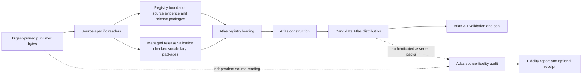
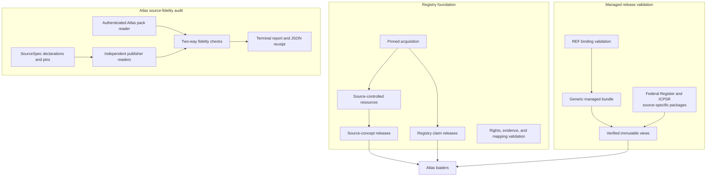

# Source release trust and fidelity assurance

## Purpose

`source_release_trust_and_fidelity_assurance` is a logical module that establishes trust from captured publisher bytes through Atlas construction. It has three responsibilities:

- Preserve exact source bytes, observations, identities, claims, rights, and evidence in reproducible packages.
- Validate selected vocabulary releases and expose immutable views backed by external digest pins.
- Independently compare publisher inputs with the asserted content of a built Atlas distribution.

These checks establish source traceability and capture-to-Atlas fidelity. They do not prove that a publisher capture is complete, authorize product use, admit content to an Atlas, or replace Atlas 3.1 validation and sealing.

## Architecture

The foundation and managed-release paths are alternatives selected by each source family; they do not form one mandatory sequence. The fidelity audit remains separate from production readers and normalization code so a shared parser defect cannot produce false agreement.

All three areas fail closed: unsafe paths, changed bytes, stale digests, incomplete references, unsupported fields, or source-to-Atlas differences prevent a trusted result.

## Core component documentation

| Component | Responsibility | Documentation |
| --- | --- | --- |
| `registry_foundation` | Exact-byte acquisition, source-controlled resources, source-concept and claim releases, rights, evidence, and mappings | [Registry foundation](registry_foundation.md) |
| `managed_release_validation` | REF validation, deterministic managed bundles, externally pinned readers, and source-specific release views | [Managed release validation](managed_release_validation.md) |
| `atlas_source_fidelity_audit` | Independent publisher and Atlas readers, two-way claim comparison, coverage checks, findings, and receipts | [Atlas source fidelity audit](atlas_source_fidelity_audit.md) |

Detailed managed-release components are documented in [REF binding and expression-corpus validation](managed_release_validation_binding.md), [generic managed-release bundles and verified readers](managed_release_validation_bundle.md), and [source-specific package views](managed_release_validation_source_views.md).